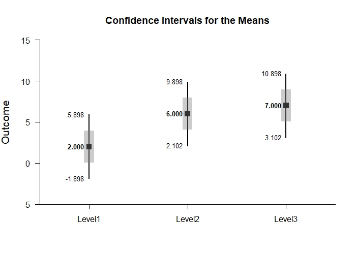
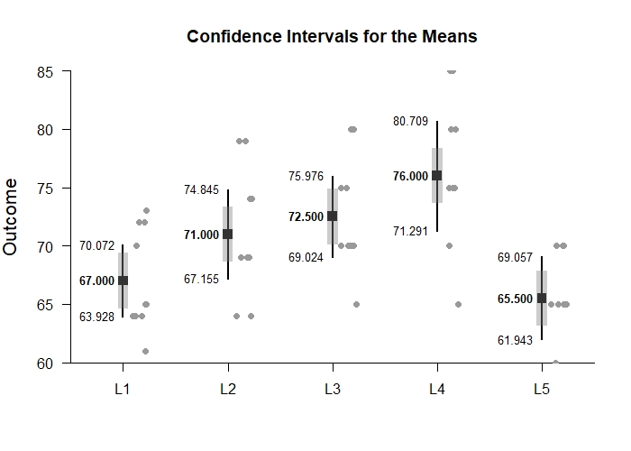
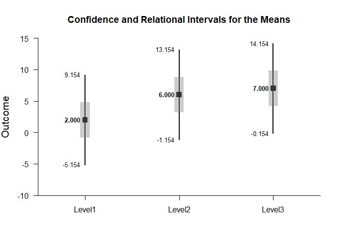

# Estimation Approach to Statistical Inference

[**Functions**](../../Functions) | 
[**Tutorials**](../../Tutorials) | 
[**Examples**](../../Examples) | 
[**Advanced**](../../Advanced)

---

## Relational Intervals - OneWay (Between-Subjects) Tutorial with Data

### Enter Data

```r
Factor <- c(rep(1,4),rep(2,4),rep(3,4))
Outcome <- c(0,0,3,5,4,7,4,9,9,6,4,9)
Factor <- factor(Factor,levels=c(1,2,3),labels=c("Level1","Level2","Level3"))
OneWayData <- data.frame(Factor,Outcome)
OneWayData
```
```
   Factor Outcome
1  Level1       0
2  Level1       0
3  Level1       3
4  Level1       5
5  Level2       4
6  Level2       7
7  Level2       4
8  Level2       9
9  Level3       9
10 Level3       6
11 Level3       4
12 Level3       9
```

### Relational Intervals

```r
estimateRelational(Outcome~Factor)
```
```
CONFIDENCE AND RELATIONAL INTERVALS FOR THE MEANS

             M   CI.LL   CI.UL   RI.LL   RI.UL
Level1   2.000  -1.898   5.898   0.041   3.959
Level2   6.000   2.102   9.898   4.041   7.959
Level3   7.000   3.102  10.898   5.041   8.959
```

```r
plotMeans(Outcome~Factor)
```
<kbd></kbd>
```r
addRelational(Outcome~Factor)
```
<kbd></kbd>

```r
plotRelational(Outcome~Factor)
```
<kbd></kbd>
```r
plotRelational(Outcome~Factor,conf.level=.99,mu=70)
```
<kbd></kbd>

