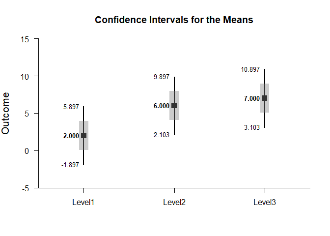
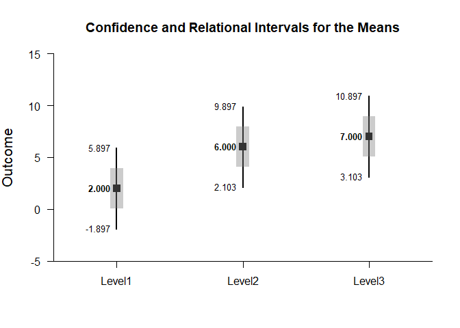
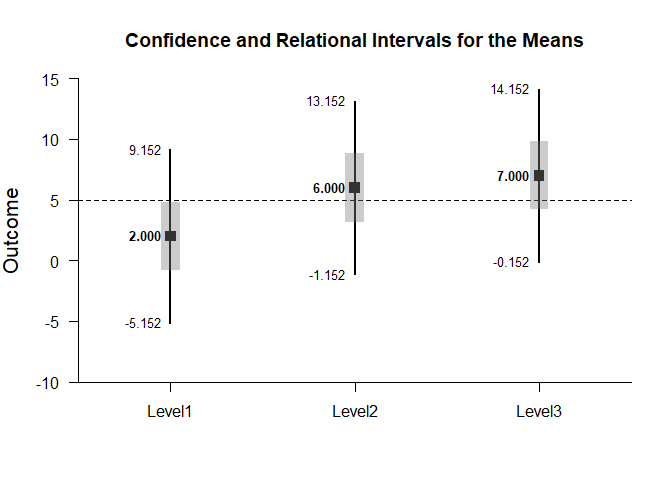

## Relational Intervals - OneWay (Between-Subjects) Tutorial with Data

### Enter Data

This code inputs the variable names and creates a viewable data frame.


```r
Factor <- c(rep(1,4),rep(2,4),rep(3,4))
Outcome <- c(0,0,3,5,4,7,4,9,9,6,4,9)
Factor <- factor(Factor,levels=c(1,2,3),labels=c("Level1","Level2","Level3"))
OneWayData <- data.frame(Factor,Outcome)
```

### Relational Intervals

This code will provide a table of descriptive statistics, the confidence intervals, and the relational intervals for each level of the factor.


```r
estimateRelational(Outcome~Factor)
```

```
## $`Confidence and Relational Intervals for the Means`
##              M   CI.LL   CI.UL   RI.LL   RI.UL
## Level1   2.000  -1.898   5.898   0.041   3.959
## Level2   6.000   2.102   9.898   4.041   7.959
## Level3   7.000   3.102  10.898   5.041   8.959
```

This code will produce a graph of the confidence intervals for each level of the factor. It will then add relational intervals to the existing plot.


```r
plotMeans(Outcome~Factor)
addRelational(Outcome~Factor)
```

<!-- -->

Instead, this code can be used to directly create the graph of confidence intervals and relational intervals for each level of the factor.


```r
plotRelational(Outcome~Factor)
```

<!-- -->

And of course, the confidence levels can be altered and a comparison line to represent a population (or test) value can be added.


```r
plotRelational(Outcome~Factor,conf.level=.99,mu=5)
```

<!-- -->
