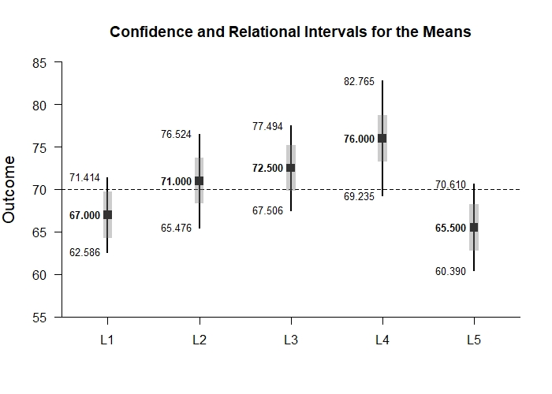
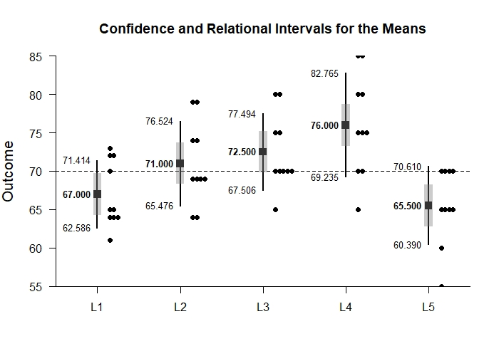

# Estimation Approach to Statistical Inference

[**Functions**](../../Functions) | 
[**Tutorials**](../../Tutorials) | 
[**Examples**](../../Examples) | 
[**Advanced**](../../Advanced)

---

## Relational Intervals - Repeated Measures (Within-Subjects) Example with Wendorf Data

### Enter Data

```r
L1 <- c(61,64,72,64,64,70,73,65,65,72)
L2 <- c(69,74,79,69,64,64,69,69,74,79)
L3 <- c(70,75,80,80,70,65,70,75,70,70)
L4 <- c(70,80,85,75,70,65,75,75,85,80)
L5 <- c(65,55,70,65,65,70,70,60,65,70)
RelationalRepeatedData <- data.frame(L1,L2,L3,L4,L5)
RelationalRepeatedData
```
```
   L1 L2 L3 L4 L5
1  61 69 70 70 65
2  64 74 75 80 55
3  72 79 80 85 70
4  64 69 80 75 65
5  64 64 70 70 65
6  70 64 65 65 70
7  73 69 70 75 70
8  65 69 75 75 60
9  65 74 70 85 65
10 72 79 70 80 70
```

### Relational Intervals

```r
estimateRelational(L1,L2,L3,L4,L5)
```
```
CONFIDENCE AND RELATIONAL INTERVALS FOR THE MEANS

      M  CI.LL  CI.UL  RI.LL  RI.UL
L1 67.0 63.928 70.072 64.969 69.031
L2 71.0 67.155 74.845 68.969 73.031
L3 72.5 69.024 75.976 70.469 74.531
L4 76.0 71.291 80.709 73.969 78.031
L5 65.5 61.943 69.057 63.469 67.531
```

```r
plotMeans(L1,L2,L3,L4,L5)
```
<kbd></kbd>
```r
addRelational(L1,L2,L3,L4,L5)
```
<kbd></kbd>
```r
addData(L1,L2,L3,L4,L5) 
```
<kbd></kbd>
```r
plotRelational(L1,L2,L3,L4,L5)
```
<kbd></kbd>
```r
plotRelational(L1,L2,L3,L4,L5,conf.level=.99,mu=70)
```
<kbd></kbd>
```r
addData(L1,L2,L3,L4,L5,method="stack",col="black")
```
<kbd></kbd>
