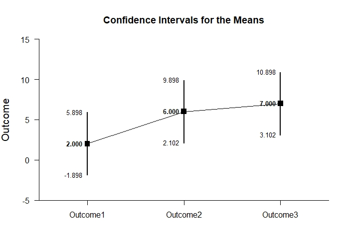

# Estimation Approach to Statistical Inference

[**Functions**](../../Functions) | 
[**Tutorials**](../../Tutorials) | 
[**Examples**](../../Examples) | 
[**Advanced**](../../Advanced)

---

## Relational Intervals - Repeated Measures (Within-Subjects) Tutorial with Data

### Enter Data

```r
Outcome1 <- c(0,0,3,5)
Outcome2 <- c(4,7,4,9)
Outcome3 <- c(9,6,4,9)
RepeatedData <- data.frame(Outcome1,Outcome2,Outcome3)
RepeatedData
```
```
  Outcome1 Outcome2 Outcome3
1        0        4        9
2        0        7        6
3        3        4        4
4        5        9        9
```

### Relational Intervals

```r
estimateRelational(Outcome1,Outcome2,Outcome3)
```
```
CONFIDENCE AND RELATIONAL INTERVALS FOR THE MEANS

               M   CI.LL   CI.UL   RI.LL   RI.UL
Outcome1   2.000  -1.898   5.898   0.246   3.754
Outcome2   6.000   2.102   9.898   4.246   7.754
Outcome3   7.000   3.102  10.898   5.246   8.754
```

```r
plotMeans(Outcome1,Outcome2,Outcome3)
```
<kbd></kbd>
```r
addRelational(Outcome1,Outcome2,Outcome3)
```
<kbd></kbd>

```r
plotRelational(Outcome1,Outcome2,Outcome3)
```
<kbd></kbd>
```r
plotRelational(Outcome1,Outcome2,Outcome3,conf.level=.99,mu=70)
```
<kbd></kbd>
