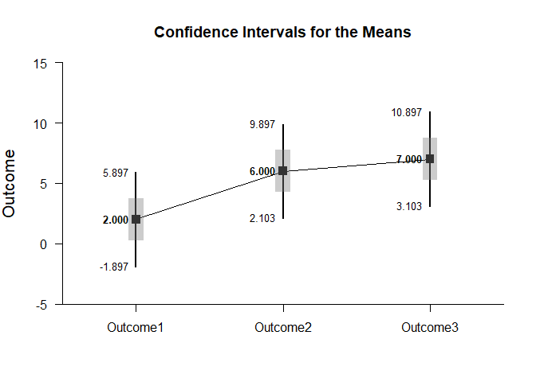
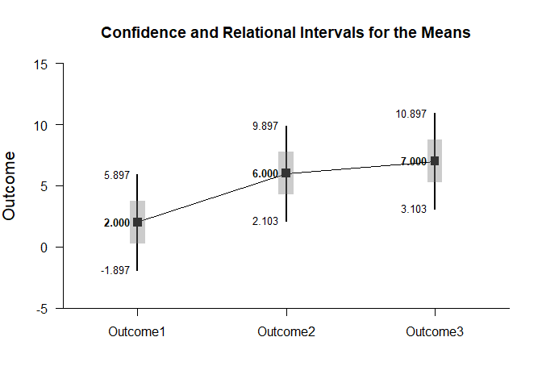
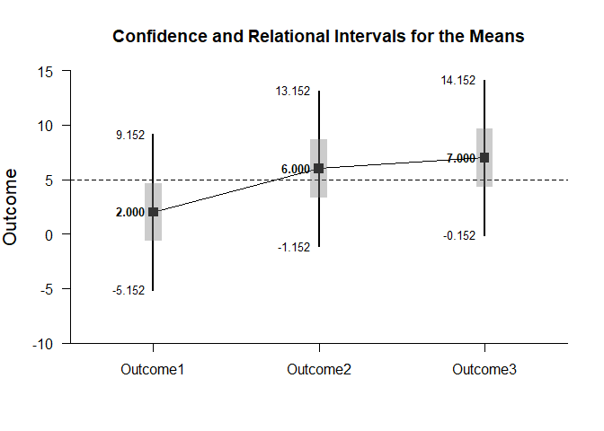

## Relational Intervals - Repeated Measures (Within-Subjects) Tutorial with Data

### Enter Data

This code inputs the variable names and creates a viewable data frame.


```r
Outcome1 <- c(0,0,3,5)
Outcome2 <- c(4,7,4,9)
Outcome3 <- c(9,6,4,9)
RepeatedData <- data.frame(Outcome1,Outcome2,Outcome3)
```

### Relational Intervals

This code will provide a table of descriptive statistics, the confidence intervals, and the relational intervals for each level of the factor.


```r
estimateRelational(Outcome1,Outcome2,Outcome3)
```

```
## $`Confidence and Relational Intervals for the Means`
##                M   CI.LL   CI.UL   RI.LL   RI.UL
## Outcome1   2.000  -1.898   5.898   0.246   3.754
## Outcome2   6.000   2.102   9.898   4.246   7.754
## Outcome3   7.000   3.102  10.898   5.246   8.754
```

This code will produce a graph of the confidence intervals for each level of the factor. It will then add relational intervals to the existing plot.


```r
plotMeans(Outcome1,Outcome2,Outcome3)
addRelational(Outcome1,Outcome2,Outcome3)
```

<!-- -->

Instead, this code can be used to directly create the graph of confidence intervals and relational intervals for each level of the factor.


```r
plotRelational(Outcome1,Outcome2,Outcome3)
```

<!-- -->

And of course, the confidence levels can be altered and a comparison line to represent a population (or test) value can be added.


```r
plotRelational(Outcome1,Outcome2,Outcome3,conf.level=.99,mu=5)
```

<!-- -->
