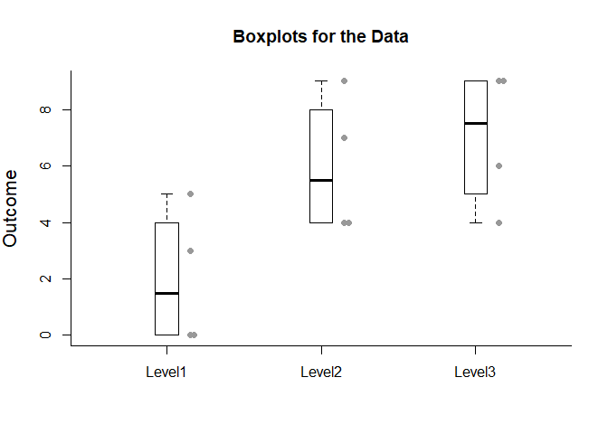

## Summarize - OneWay (Between-Subjects) Tutorial with Data

### Enter Data


```r
Factor <- c(rep(1,4),rep(2,4),rep(3,4))
Outcome <- c(0,0,3,5,4,7,4,9,9,6,4,9)
Factor <- factor(Factor,levels=c(1,2,3),labels=c("Group1","Group2","Group3"))
OneWayData <- data.frame(Factor,Outcome)
```

### Summaries of Multiple Groups


```r
summarizeData(Outcome~Factor)
```

```
## $`Summary Statistics for the Data`
##        Lower Whisker Lower Hinge  Median Upper Hinge Upper Whisker
## Group1         0.000       0.000   1.500       4.000         5.000
## Group2         4.000       4.000   5.500       8.000         9.000
## Group3         4.000       5.000   7.500       9.000         9.000
```

### Boxplots of Multiple Groups


```r
plotBoxes(Outcome~Factor)
addData(Outcome~Factor,method="stack")
```

<!-- -->
