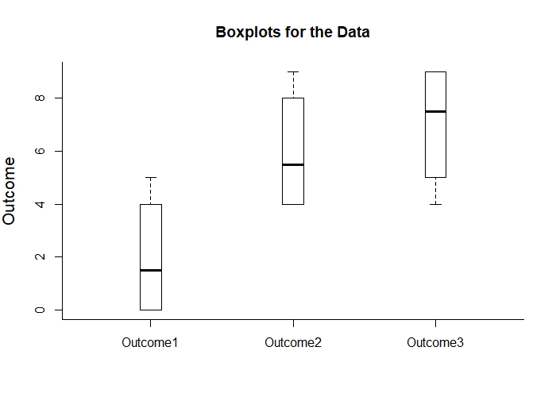

# Estimation Approach to Statistical Inference

[**Functions**](../../A-Functions) | 
[**Tutorials**](../../B-Tutorials) | 
[**Examples**](../../C-Examples) | 
[**Advanced**](../../D-Advanced)

---

## Summarize - Repeated (Within-Subjects) Tutorial with Data

### Enter Data

```r
Outcome1 <- c(0,0,3,5)
Outcome2 <- c(4,7,4,9)
Outcome3 <- c(9,6,4,9)
RepeatedData <- data.frame(Outcome1,Outcome2,Outcome3)
RepeatedData
```
```
  Outcome1 Outcome2 Outcome3
1        0        4        9
2        0        7        6
3        3        4        4
4        5        9        9
```

### Summaries of Multiple Variables

```r
summarizeData(Outcome1,Outcome2,Outcome3)
```
```
SUMMARY STATISTICS FOR THE DATA

         Lower Whisker Lower Hinge  Median Upper Hinge Upper Whisker
Outcome1         0.000       0.000   1.500       4.000         5.000
Outcome2         4.000       4.000   5.500       8.000         9.000
Outcome3         4.000       5.000   7.500       9.000         9.000
```

### Boxplots of Multiple Variables

```r
plotBoxes(Outcome1,Outcome2,Outcome3)
```
<kbd></kbd>
```r
addData(Outcome1,Outcome2,Outcome3,method="stack")
```
<kbd></kbd>
