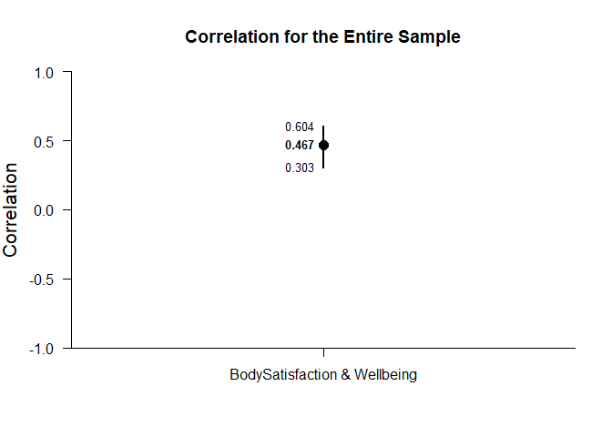

## Correlation Example with BodyWell One Sample Data

### Data Management

#### Data Entry

First, enter the data.

```r
BodySatisfaction <- c(4,2.4,3,3,3.1,2.4,2.9,3.1,3,3.3,2,3.1,2.4,3.1,3.3,3.4,3.3,3.6,2.7,3.3,3.6,2.3,3.7,4,2.7,3.1,3.3,3.4,4.4,3.3,3.3,4,4.1,3.3,3.6,3.9,4,5,3,3,3.3,3.9,3.9,4.7,5,2.6,2.9,3.4,3.4,3.9,4.3,2.6,3.1,3.4,3.7,4,4.1,4,5,4,2.4,3.7,3,3.6,2.9,2.7,3.3,4.3,3.1,4.3,4.4,4,3.3,3.7,2.9,3.4,3.6,4.7,4.1,3,4.1,3.7,4.1,4,3.1,3.7,3.3,4.4,4.3,4,4,4,3.4,4.9,3.7,3.3,3.9,4.6,4,3.9,4.7,4.3,4.4,4.4,4.6,4.3)
Wellbeing <- c(1,2.4,2.3,2.4,2.8,3.2,3.4,3.4,3.6,3.6,3.8,3.8,4,4,4.2,4.2,4.4,4.4,4.6,4.6,4.6,4.8,4.8,4.8,5,5,5,5,5,5.2,5.3,5.2,5.2,5.6,5.6,5.6,5.6,5.6,5.8,5.7,5.8,5.8,5.9,5.8,5.8,6,6,6,6.1,6,6,6.2,6.2,6.2,6.4,6.4,6.4,6.6,7,2.8,3,3.2,3.2,3.4,3.4,3.8,4.2,4.4,4.4,4.6,4.6,4.6,4.8,4.8,4.8,5,5,5.2,5.2,5.4,5.6,5.6,5.5,5.6,5.6,5.7,5.6,5.6,5.6,5.8,5.8,6,6,6,6,6,6,6,6.1,6.2,6.2,6.2,6.2,6.4,6.6,7)
BodyWellOneData <- data.frame(BodySatisfaction,Wellbeing)
```

#### Descriptive Statistics

First, it's useful to get the means and standard deviations for the variables.

```r
describeMeans(BodySatisfaction,Wellbeing)
```

```
## $`Descriptive Statistics for the Data`
##                        N       M      SD
## BodySatisfaction 106.000   3.605   0.659
## Wellbeing        106.000   5.055   1.162
```

Next, we can get the correlation among the variables.

```r
describeCorrelations(BodySatisfaction,Wellbeing)
```

```
## $`Correlation Matrix for the Variables`
##                  BodySatisfaction Wellbeing
## BodySatisfaction            1.000     0.467
## Wellbeing                   0.467     1.000
```

### Analyses of a Correlation

More importantly, we can get the confidence interval for the correlation.

```r
estimateCorrelations(BodySatisfaction,Wellbeing)
```

```
## $`Confidence Interval for the Correlation`
##                                    R      SE      LL      UL
## BodySatisfaction & Wellbeing   0.467   0.099   0.303   0.604
```

This is the plot of correlation and its confidence interval.

```r
plotCorrelations(BodySatisfaction,Wellbeing,main="Correlation for the Entire Sample",ylim=c(-1,1))
```

<!-- -->
