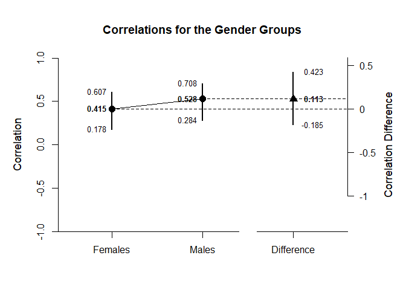

## Correlation Example with BodyWell Two Sample Summary Statistics

### Data Management

This code inputs the variable summaries and creates a summary table for the female participants.

```r
BodySatisfactionL1 <- c(N=59,M=3.434,SD=0.668)
WellbeingL1 <- c(N=59,M=4.934,SD=1.250)
BodyWellTwoSummaryL1 <- rbind(BodySatisfactionL1,WellbeingL1)
class(BodyWellTwoSummaryL1) <- "wss"
```

This code creates a correlation matrix and enters single correlation for the female participants.

```r
BodyWellTwoCorrL1 <- declareCorrelations("BodySatisfactionL1","WellbeingL1")
BodyWellTwoCorrL1["BodySatisfactionL1","WellbeingL1"] <- .415
```

And repeat the process to create the second subset (for the male participants).

```r
BodySatisfactionL2 <- c(N=47,M=3.819,SD=0.587)
WellbeingL2 <- c(N=47,M=5.206,SD=1.033)
BodyWellTwoSummaryL2 <- rbind(BodySatisfactionL2,WellbeingL2)
class(BodyWellTwoSummaryL2) <- "wss"
```

And for the correlation matrix of the second subset (for the male participants).

```r
BodyWellTwoCorrL2 <- declareCorrelations("BodySatisfactionL2","WellbeingL2")
BodyWellTwoCorrL2["BodySatisfactionL2","WellbeingL2"] <- .528
```

### Analyses of a Correlation Comparison

The main question is whether the correlation between Body Satisfaction and Wellbeing is different in the two groups.

First it is necessary to estimate the confidence intervals for each of the correlations.

```r
CorrEstimateL1 <- estimateCorrelations(BodyWellTwoSummaryL1,BodyWellTwoCorrL1)
CorrEstimateL2 <- estimateCorrelations(BodyWellTwoSummaryL2,BodyWellTwoCorrL2)
```

Then we can estimate the correlations and the difference in the correlations.

```r
estimateCorrelationComparison(CorrEstimateL1,CorrEstimateL2,main="Correlations for the Gender Groups",labels=c("Females","Males"))
```

```
## $`Confidence Intervals for the Correlations`
##               R      SE      LL      UL
## Females   0.415   0.134   0.178   0.607
## Males     0.528   0.151   0.284   0.708
## 
## $`Confidence Interval for the Correlation Difference`
##               Diff      LL      UL
## Difference   0.113  -0.185   0.423
```

This code produces a difference plot using the confidence intervals for the correlations and the correlation difference.

```r
plotCorrelationComparison(CorrEstimateL1,CorrEstimateL2,main="Correlations for the Gender Groups",labels=c("Females","Males"),ylim=c(-1,1))
```

<!-- -->
