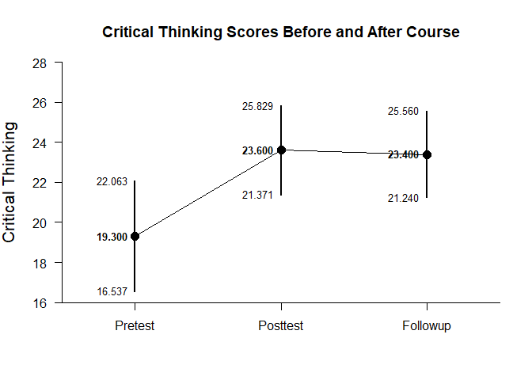
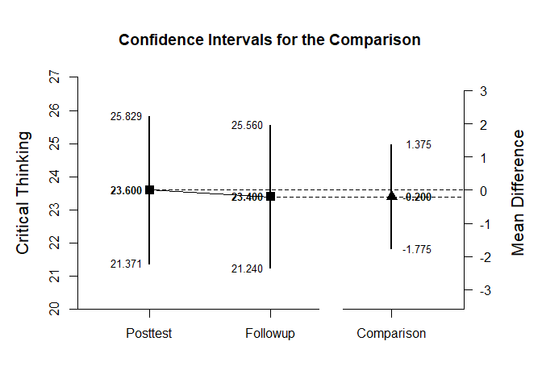
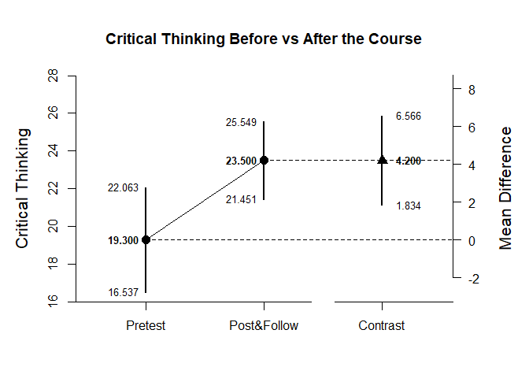

## Repeated Measures (Within-Subjects) Example with Donohue Data

### Enter Data

Prior to analyses, enter the data.


```r
Pretest <- c(7,11,11,13,15,17,18,18,19,19,19,19,21,22,25,25,25,26,27,29)
Posttest <- c(16,20,25,22,28,12,16,26,21,22,26,30,23,27,23,27,28,24,28,28)
Followup <- c(16,18,23,21,27,21,18,21,24,21,27,28,18,27,23,28,31,18,31,27)
DonohueData <- data.frame(Pretest,Posttest,Followup)
```
### Analyses of the Different Variables

With multiple variables, it is useful to get descriptive statistics and confidence intervals for each variable.


```r
estimateMeans(Pretest,Posttest,Followup)
```

```
## $`Confidence Intervals for the Means`
##                N       M      SD      SE      LL      UL
## Pretest   20.000  19.300   5.904   1.320  16.537  22.063
## Posttest  20.000  23.600   4.762   1.065  21.371  25.829
## Followup  20.000  23.400   4.616   1.032  21.240  25.560
```

It is also useful to view the means and confidence intervals of the groups in a plot.


```r
plotMeans(Pretest,Posttest,Followup,ylab="Critical Thinking")
```

<!-- -->
 
### Analysis of a Variable Difference

The first research question is whether there is a difference between the posttest and followup occasions.

First, set the comparison and get an estimate of the difference and its confidence interval.


```r
estimateDifference(Posttest,Followup)
```

```
## $`Confidence Interval for the Comparison`
##               Diff      SE      df      LL      UL
## Comparison  -0.200   0.753  19.000  -1.775   1.375
```

Then, obtain the difference plot for that comparison.


```r
plotDifference(Posttest,Followup,ylab="Critical Thinking")
```

<!-- -->

Finally, obtain the standardized effect size for that comparison.


```r
standardizeDifference(Posttest,Followup)
```

```
## $`Confidence Interval for the Standardized Comparison`
##                Est      SE      LL      UL
## Comparison  -0.043   0.165  -0.366   0.280
```

### Analysis of a Variable Contrast

The second research question is whether the pretest differs from the posttest and followup combined.

First, set the contrast and get an estimate of the contrast and its confidence interval.


```r
PrevsPostFollow <- c(-1,.5,.5)
estimateContrast(Pretest,Posttest,Followup,contrast=PrevsPostFollow)
```

```
## $`Confidence Interval for the Contrast`
##              Est      SE      df      LL      UL
## Contrast   4.200   1.130  19.000   1.835   6.565
```

Then, obtain a difference plot for the contrast.


```r
plotContrast(Pretest,Posttest,Followup,contrast=PrevsPostFollow,labels=c("Pretest","Post&Follow"),ylab="Critical Thinking")
```

<!-- -->

Finally, estimate the standardized contrast.


```r
standardizeContrast(Pretest,Posttest,Followup,contrast=PrevsPostFollow)
```

```
## $`Confidence Interval for the Standardized Contrast`
##              Est      SE      LL      UL
## Contrast   0.819   0.214   0.399   1.239
```
