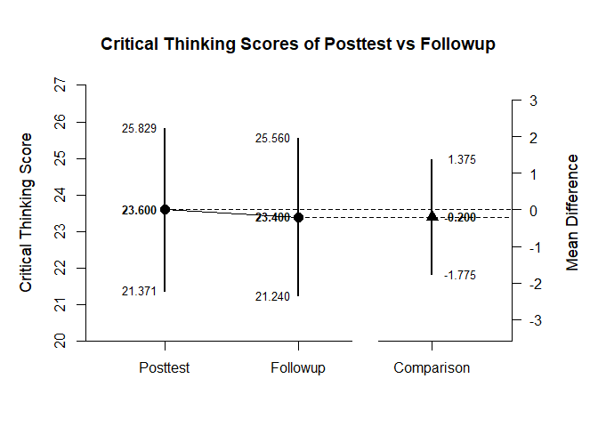

## Repeated Measures (Within-Subjects) Example with Donohue Summary Statistics

### Data Management

Prior to analyses, enter the tables of summary statistics.


```r
Pretest <- c(N=20,M=19.300,SD=5.904)
Posttest <- c(N=20,M=23.600,SD=4.762)
Followup <- c(N=20,M=23.400,SD=4.616)
DonohueSummary <- rbind(Pretest,Posttest,Followup)
class(DonohueSummary) <- "wss"

DonohueCorr <- declareCorrelations("Pretest","Posttest","Followup")
DonohueCorr["Pretest","Posttest"] <- .493
DonohueCorr["Pretest","Followup"] <- .536
DonohueCorr["Posttest","Followup"] <- .743
DonohueCorr <- fillCorrelations(DonohueCorr)
```

### Analyses of the Different Variables

With multiple variables, it is useful to get descriptive statistics and confidence intervals for each variable.


```r
estimateMeans(DonohueSummary)
```

```
## $`Confidence Intervals for the Means`
##                M      SE      df      LL      UL
## Pretest   19.300   1.320  19.000  16.537  22.063
## Posttest  23.600   1.065  19.000  21.371  25.829
## Followup  23.400   1.032  19.000  21.240  25.560
```

It is also useful to view the means and confidence intervals of the groups in a plot.


```r
plotMeans(DonohueSummary,main="Critical Thinking Scores at Pretest, Posttest, and Followup")
```

<!-- -->
 
### Analysis of a Variable Difference

The first research question is whether there is a difference between the posttest and followup occasions.

First, set the comparison and obtain the difference plot for that comparison.


```r
PostvsFollowup <- DonohueSummary[c(2,3),]
class(PostvsFollowup) <- "wss"
plotMeanComparison(PostvsFollowup,DonohueCorr,main="Critical Thinking Scores of Posttest vs Followup")
```

<!-- -->

Then, obtain the standardized effect size for that comparison.


```r
estimateStandardizedMeanDifference(PostvsFollowup,DonohueCorr)
```

```
## $`Confidence Interval for the Standardized Mean Difference`
##                Est      SE      LL      UL
## Comparison  -0.043   0.165  -0.365   0.280
```

### Analysis of a Variable Contrast

The second research question is whether the pretest differs from the posttest and followup combined.

First, set the contrast and obtain a difference plot for the contrast.


```r
PrevsPostFollow <- c(-1,.5,.5)
plotMeanSubsets(DonohueSummary,DonohueCorr,contrast=PrevsPostFollow,labels=c("Pretest","Post&Follow"),main="Critical Thinking Scores of Prestest vs Posttest and Followup Combined",ylab="Critical Thinking")
```

<!-- -->

Then, estimate the standardized contrast.


```r
estimateStandardizedMeanContrast(DonohueSummary,DonohueCorr,contrast=PrevsPostFollow)
```

```
## $`Confidence Interval for the Standardized Mean Contrast`
##              Est      SE      LL      UL
## Contrast   0.819   0.214   0.399   1.239
```
