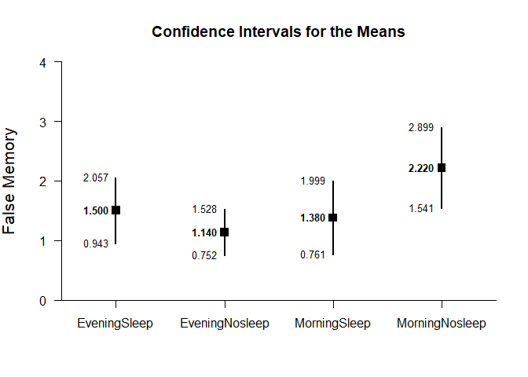
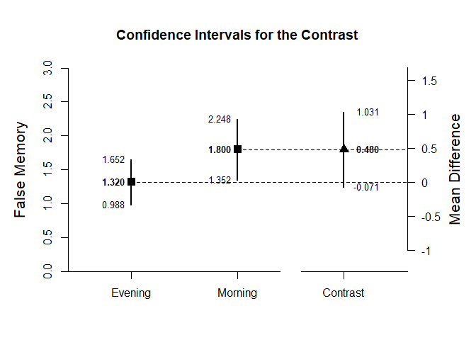
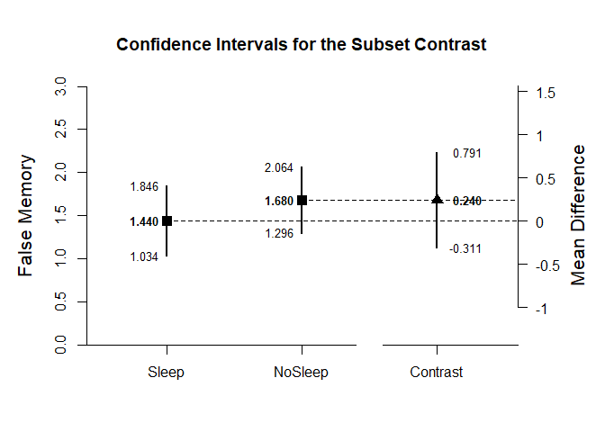
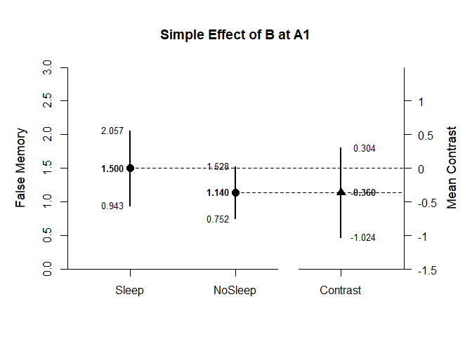

## Factorial Between-Subjects Example with Frenda Summary Statistics

### Enter Summary Statistics


```r
EveningSleep <- c(N=26,M=1.50,SD=1.38)
EveningNosleep <- c(N=26,M=1.14,SD=0.96)
MorningSleep <- c(N=25,M=1.38,SD=1.50)
MorningNosleep <- c(N=26,M=2.22,SD=1.68)
FrendaSummary <- rbind(EveningSleep,EveningNosleep,MorningSleep,MorningNosleep)
class(FrendaSummary) <- "bss"
```

### Analyses of the Different Groups


```r
estimateMeans(FrendaSummary)
```

```
## Confidence Intervals for the Means 
## 
##                      N       M      SD      SE      LL      UL
## EveningSleep    26.000   1.500   1.380   0.271   0.943   2.057
## EveningNosleep  26.000   1.140   0.960   0.188   0.752   1.528
## MorningSleep    25.000   1.380   1.500   0.300   0.761   1.999
## MorningNosleep  26.000   2.220   1.680   0.329   1.541   2.899
```


```r
plotMeans(FrendaSummary,ylab="False Memory")
```

<!-- -->

### Analyses of the Marginal Means


```r
Evening <- c(.5,.5,0,0)
estimateContrast(FrendaSummary,contrast=Evening)
```

```
## Confidence Interval for the Contrast 
## 
##              Est      SE      df      LL      UL
## Contrast   1.320   0.165  44.605   0.988   1.652
```


```r
Morning <- c(0,0,.5,.5)
estimateContrast(FrendaSummary,contrast=Morning)
```

```
## Confidence Interval for the Contrast 
## 
##              Est      SE      df      LL      UL
## Contrast   1.800   0.223  48.740   1.352   2.248
```


```r
Sleep <- c(.5,0,.5,0)
estimateContrast(FrendaSummary,contrast=Sleep)
```

```
## Confidence Interval for the Contrast 
## 
##              Est      SE      df      LL      UL
## Contrast   1.440   0.202  48.269   1.034   1.846
```


```r
Nosleep <- c(0,.5,0,.5)
estimateContrast(FrendaSummary,contrast=Nosleep)
```

```
## Confidence Interval for the Contrast 
## 
##              Est      SE      df      LL      UL
## Contrast   1.680   0.190  39.753   1.296   2.064
```

### Analyses of the Factor A (Evening vs Morning) Main Effect


```r
mainFactorA <- c(-.5,-.5,.5,.5)
estimateContrast(FrendaSummary,contrast=mainFactorA)
```

```
## Confidence Interval for the Contrast 
## 
##              Est      SE      df      LL      UL
## Contrast   0.480   0.277  87.919  -0.071   1.031
```


```r
plotContrast(FrendaSummary,contrast=mainFactorA,labels=c("Evening","Morning"),ylab="False Memory")
```

<!-- -->


```r
testContrast(FrendaSummary,contrast=mainFactorA)
```

```
## Hypothesis Test for the Contrast 
## 
##              Est      SE       t      df       p
## Contrast   0.480   0.277   1.732  87.919   0.087
```


```r
standardizeContrast(FrendaSummary,contrast=mainFactorA)
```

```
## Confidence Interval for the Standardized Contrast 
## 
##              Est      SE      LL      UL
## Contrast   0.342   0.203  -0.056   0.739
```


### Analyses of the Factor B (Sleep vs NoSleep) Main Effect


```r
mainFactorB <- c(-.5,.5,-.5,.5)
estimateContrast(FrendaSummary,contrast=mainFactorB)
```

```
## Confidence Interval for the Contrast 
## 
##              Est      SE      df      LL      UL
## Contrast   0.240   0.277  87.919  -0.311   0.791
```


```r
plotContrast(FrendaSummary,contrast=mainFactorB,labels=c("Sleep","NoSleep"),ylab="False Memory")
```

<!-- -->


```r
testContrast(FrendaSummary,contrast=mainFactorB)
```

```
## Hypothesis Test for the Contrast 
## 
##              Est      SE       t      df       p
## Contrast   0.240   0.277   0.866  87.919   0.389
```


```r
standardizeContrast(FrendaSummary,contrast=mainFactorB)
```

```
## Confidence Interval for the Standardized Contrast 
## 
##              Est      SE      LL      UL
## Contrast   0.171   0.202  -0.224   0.566
```


### Analyses of the Factor A x B Interaction


```r
Interaction <- c(1,-1,-1,1)
estimateContrast(FrendaSummary,contrast=Interaction)
```

```
## Confidence Interval for the Contrast 
## 
##              Est      SE      df      LL      UL
## Contrast   1.200   0.554  87.919   0.098   2.302
```


```r
testContrast(FrendaSummary,contrast=Interaction)
```

```
## Hypothesis Test for the Contrast 
## 
##              Est      SE       t      df       p
## Contrast   1.200   0.554   2.165  87.919   0.033
```

### Analyses of the Factor B (Sleep vs NoSleep) at A1 (Evening) Simple Effect


```r
simpleBatEvening <- c(-1,1,0,0)
estimateContrast(FrendaSummary,contrast=simpleBatEvening)
```

```
## Confidence Interval for the Contrast 
## 
##              Est      SE      df      LL      UL
## Contrast  -0.360   0.330  44.605  -1.024   0.304
```


```r
plotContrast(FrendaSummary,contrast=simpleBatEvening,labels=c("Sleep","NoSleep"),ylab="False Memory")
```

<!-- -->


```r
testContrast(FrendaSummary,contrast=simpleBatEvening)
```

```
## Hypothesis Test for the Contrast 
## 
##              Est      SE       t      df       p
## Contrast  -0.360   0.330  -1.092  44.605   0.281
```


```r
standardizeContrast(FrendaSummary,contrast=simpleBatEvening)
```

```
## Confidence Interval for the Standardized Contrast 
## 
##              Est      SE      LL      UL
## Contrast  -0.256   0.240  -0.727   0.214
```


### Analyses of the Factor B (Sleep vs NoSleep) at A2 (Morning) Simple Effect


```r
simpleBatMorning <- c(0,0,-1,1)
estimateContrast(FrendaSummary,contrast=simpleBatMorning)
```

```
## Confidence Interval for the Contrast 
## 
##              Est      SE      df      LL      UL
## Contrast   0.840   0.446  48.740  -0.056   1.736
```


```r
plotContrast(FrendaSummary,contrast=simpleBatMorning,labels=c("Sleep","NoSleep"),ylab="False Memory")
```

<!-- -->


```r
testContrast(FrendaSummary,contrast=simpleBatMorning)
```

```
## Hypothesis Test for the Contrast 
## 
##              Est      SE       t      df       p
## Contrast   0.840   0.446   1.885  48.740   0.065
```


```r
standardizeContrast(FrendaSummary,contrast=simpleBatMorning)
```

```
## Confidence Interval for the Standardized Contrast 
## 
##              Est      SE      LL      UL
## Contrast   0.598   0.327  -0.042   1.238
```
