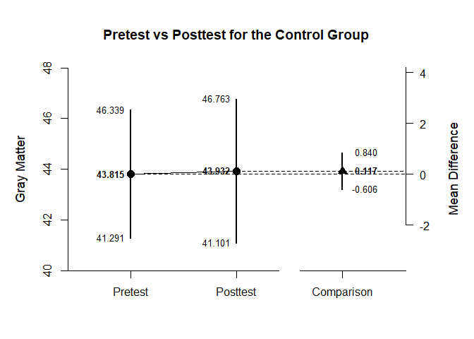
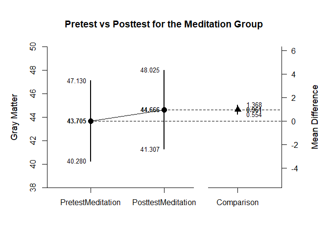

## Mixed Design Example with Holzel Data

### Data Management

First, enter the data.


```r
Group <- c("Control","Control","Control","Control","Control","Control","Control","Control","Control","Control","Control","Control","Control","Control","Control","Control","Control","Meditation","Meditation","Meditation","Meditation","Meditation","Meditation","Meditation","Meditation","Meditation","Meditation","Meditation","Meditation","Meditation","Meditation","Meditation","Meditation")
Pretest <- c(48.261,42.745,46.222,46.889,43.752,36.928,52.026,39.739,45.503,45.386,44.745,31.725,40.562,39.216,46.771,48.314,46.065,43.072,41.922,48.366,49.725,40.013,39.673,38.405,52.51,41.281,42.157,41.281,57.843,41.935,45.281,29.673,46.144)
Posttest <- c(50.026,41.137,45.542,48.261,45.242,33.621,53.634,40.275,43.595,46.235,45.621,32.092,40.588,39.987,47.19,47.137,46.654,42.549,41.974,49.882,50.967,41.059,41.569,40.418,54.078,43.046,43.333,41.333,58,42.471,45.83,31.137,47.007)
HolzelData <- data.frame(Group,Pretest,Posttest)
```

Then subdivide the data into subsets (one for each simple effect of interest).


```r
HolzelSubsetControl <- subset(HolzelData,Group=="Control")
HolzelSubsetMeditation <- subset(HolzelData,Group=="Meditation")
```

### Analyses of the Differences within Conditions

For each subset, obtain a difference plot comparing pretest and posttest.


```r
with(HolzelSubsetControl,plotMeanComparison(Pretest,Posttest,main="Pretest vs Posttest for the Control Group",ylab="Gray Matter"))
```

<!-- -->

```r
with(HolzelSubsetMeditation,plotMeanComparison(Pretest,Posttest,main="Pretest vs Posttest for the Meditation Group",ylab="Gray Matter"))
```

<!-- -->

Then for each subset, obtain the standardized effect size comparing pretest to posttest.


```r
with(HolzelSubsetControl,estimateStandardizedMeanDifference(Pretest,Posttest))
```

```
## $`Confidence Interval for the Standardized Mean Difference`
##                Est      SE      LL      UL
## Comparison   0.022   0.068  -0.110   0.155
```

```r
with(HolzelSubsetMeditation,estimateStandardizedMeanDifference(Pretest,Posttest))
```

```
## $`Confidence Interval for the Standardized Mean Difference`
##                Est      SE      LL      UL
## Comparison   0.151   0.041   0.070   0.232
```
