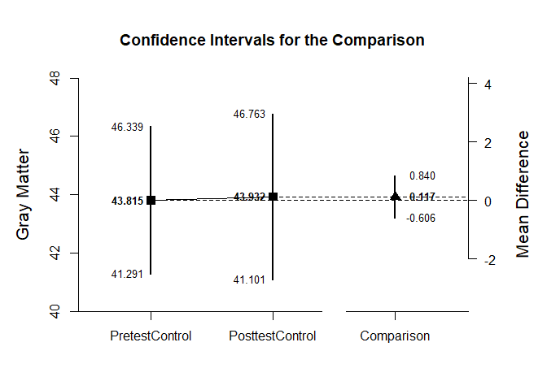
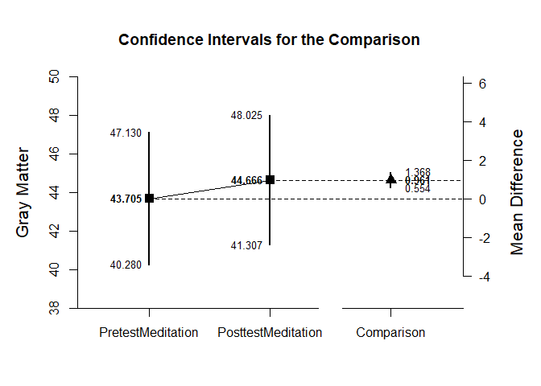

## Mixed Design Example with Holzel Summary Statistics

### Enter Summary Statistics

Create two tables of summary statistics for the first simple effect of interest.


```r
PretestControl <- c(N=17,M=43.815,SD=4.910)
PosttestControl <- c(N=17,M=43.932,SD=5.507)
HolzelSummaryControl <- rbind(PretestControl,PosttestControl)
class(HolzelSummaryControl) <- "wss"

HolzelCorrControl <- declareCorrMatrix("PretestControl","PosttestControl")
HolzelCorrControl["PretestControl","PosttestControl"] <- .970
HolzelCorrControl <- fillCorrMatrix(HolzelCorrControl)
```

Create two tables of summary statistics for the second simple effect of interest.


```r
PretestMeditation <- c(N=16,M=43.705,SD=6.427)
PosttestMeditation <- c(N=16,M=44.666,SD=6.303)
HolzelSummaryMeditation <- rbind(PretestMeditation,PosttestMeditation)
class(HolzelSummaryMeditation) <- "wss"

HolzelCorrMeditation <- declareCorrMatrix("PretestMeditation","PosttestMeditation")
HolzelCorrMeditation["PretestMeditation","PosttestMeditation"] <- .993
HolzelCorrMeditation <- fillCorrMatrix(HolzelCorrMeditation)
```

### Analyses of the Differences within Conditions

For each subset, obtain a difference plot comparing pretest and posttest.


```r
plotDifference(HolzelSummaryControl,HolzelCorrControl,ylab="Gray Matter")
```

<!-- -->

```r
plotDifference(HolzelSummaryMeditation,HolzelCorrMeditation,ylab="Gray Matter")
```

<!-- -->

Then for each subset, obtain the standardized effect size comparing pretest to posttest.


```r
standardizeDifference(HolzelSummaryControl,HolzelCorrControl)
```

```
## $`Confidence Interval for the Standardized Comparison`
##                Est      SE      LL      UL
## Comparison   0.022   0.068  -0.110   0.155
```

```r
standardizeDifference(HolzelSummaryMeditation,HolzelCorrMeditation)
```

```
## $`Confidence Interval for the Standardized Comparison`
##                Est      SE      LL      UL
## Comparison   0.151   0.041   0.070   0.232
```
