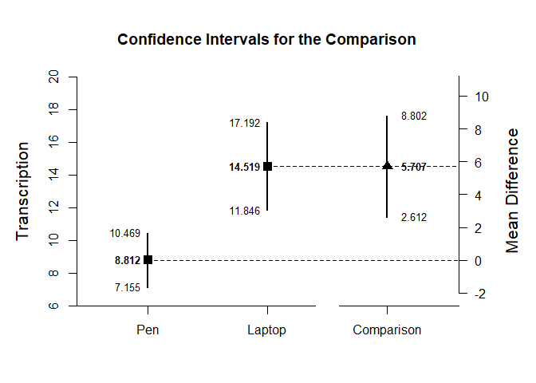
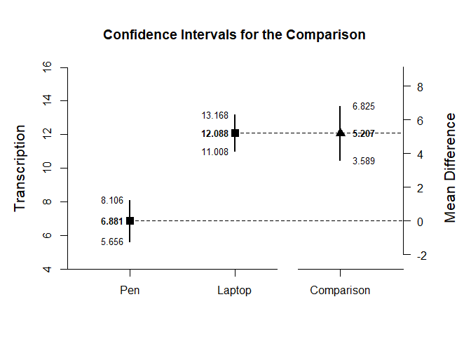
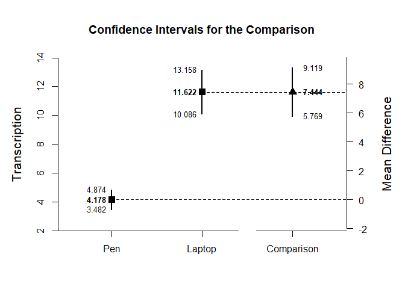

## Indendent Groups Example with PenLaptop Summary Statistics

### PenLaptop1 Example

PenLaptop1 focuses on the difference between two groups in the first sample. First, create a table of summary statistics.


```r
Pen <- c(N=34,M=8.812,SD=4.749)
Laptop <- c(N=31,M=14.519,SD=7.286)
PenLaptop1Summary <- rbind(Pen,Laptop)
class(PenLaptop1Summary) <- "bss"
```

The primary emphasis of the analysis is to estimate and represent the difference between the two conditions.


```r
plotDifference(PenLaptop1Summary,ylab="Transcription")
```

<!-- -->

The secondary emphasis of the analysis is provide a standardized effect size for the difference.


```r
standardizeDifference(PenLaptop1Summary)
```

```
## $`Confidence Interval for the Standardized Comparison`
##                Est      SE      LL      UL
## Comparison   0.928   0.270   0.398   1.458
```

### PenLaptop2 Example

PenLaptop2 focuses on the difference between two groups in the second sample. Thus, create a table of summary statistics.


```r
Pen <- c(N=48,M=6.881,SD=4.219)
Laptop <- c(N=103,M=12.088,SD=5.525)
PenLaptop2Summary <- rbind(Pen,Laptop)
class(PenLaptop2Summary) <- "bss"
```

The primary emphasis of the analysis is to estimate and represent the difference between the two conditions.


```r
plotDifference(PenLaptop2Summary,ylab="Transcription")
```

<!-- -->

The secondary emphasis of the analysis is provide a standardized effect size for the difference.


```r
standardizeDifference(PenLaptop2Summary)
```

```
## $`Confidence Interval for the Standardized Comparison`
##                Est      SE      LL      UL
## Comparison   1.059   0.179   0.709   1.409
```

### PenLaptop3 Example

PenLaptop3 focuses on the difference between two groups in the third sample. Thus, create a table of summary statistics.


```r
Pen <- c(N=54,M=4.178,SD=2.549)
Laptop <- c(N=55,M=11.622,SD=5.681)
PenLaptop3Summary <- rbind(Pen,Laptop)
class(PenLaptop3Summary) <- "bss"
```

The primary emphasis of the analysis is to estimate and represent the difference between the two conditions.


```r
plotDifference(PenLaptop3Summary,ylab="Transcription")
```

<!-- -->

The secondary emphasis of the analysis is provide a standardized effect size for the difference.


```r
standardizeDifference(PenLaptop3Summary)
```

```
## $`Confidence Interval for the Standardized Comparison`
##                Est      SE      LL      UL
## Comparison   1.691   0.237   1.226   2.156
```
