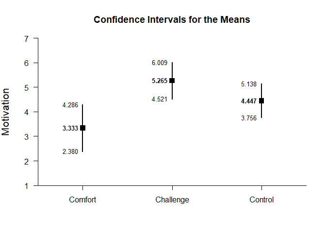
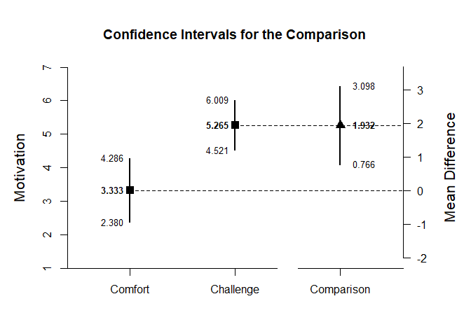

## OneWay (Between-Subjects) Example with Rattan Summary Statistics

### Table of Contents

- [Data Management](#data-management)
- [Analyses of the Different Groups](#analyses-of-the-different-groups)
- [Analysis of a Group Difference](#analysis-of-a-group-difference)
- [Analysis of a Group Contrast](#analysis-of-a-group-contrast)

---

### Data Management

Prior to analyses, enter a table of summary statistics.


```r
Comfort <- c(N=18,M=3.333,SD=1.917)
Challenge <- c(N=17,M=5.265,SD=1.448)
Control <- c(N=19,M=4.447,SD=1.433)
RattanSummary <- rbind(Comfort,Challenge,Control)
class(RattanSummary) <- "bss"
```

### Analyses of the Different Groups

With multiple groups, it is useful to get descriptive statistics and confidence intervals for each group.


```r
estimateMeans(RattanSummary)
```

```
## $`Confidence Intervals for the Means`
##                 M      SE      df      LL      UL
## Comfort     3.333   0.452  17.000   2.380   4.286
## Challenge   5.265   0.351  16.000   4.521   6.009
## Control     4.447   0.329  18.000   3.756   5.138
```

It is also useful to view the means and confidence intervals of the groups in a plot.


```r
plotMeans(RattanSummary,main="Motivation as a Function of Feedback Type",ylab="Motivation")
```

<!-- -->

### Analysis of a Group Difference

The first research question is whether there is a difference between the two non-control groups.

First, set the comparison and get an estimate of the difference and its confidence interval.


```r
ComfortvsChallenge <- rbind(Comfort,Challenge)
class(ComfortvsChallenge) <- "bss"
estimateDifference(ComfortvsChallenge)
```

```
## $`Confidence Interval for the Difference`
##               Diff      SE      df      LL      UL
## Comparison   1.932   0.572  31.521   0.766   3.098
```

Then, obtain the difference plot for that comparison.


```r
plotDifference(ComfortvsChallenge,main="Influence of Comfort vs Challenge Feedback on Motivation",ylab="Motivation")
```

<!-- -->

Finally, obtain the standardized effect size for that comparison.


```r
standardizeDifference(ComfortvsChallenge)
```

```
## $`Confidence Interval for the Standardized Difference`
##                Est      SE      LL      UL
## Comparison   1.137   0.376   0.401   1.873
```

### Analysis of a Group Contrast

The second research question is whether the Comfort group differs from the other two groups.

First, set the contrast and get an estimate of the contrast and its confidence interval.


```r
ComfortvsOthers <- c(-1,.5,.5)
estimateContrast(RattanSummary,contrast=ComfortvsOthers)
```

```
## $`Confidence Interval for the Contrast`
##              Est      SE      df      LL      UL
## Contrast   1.523   0.512  26.903   0.473   2.573
```

Then, obtain a difference plot for the contrast.


```r
plotContrast(RattanSummary,contrast=ComfortvsOthers,labels=c("Comfort","Others"),main="Influence of Comfort Feedback vs Other Types of Feedback on Motivation",ylab="Motivation")
```

<!-- -->

Finally, estimate the standardized contrast.


```r
standardizeContrast(RattanSummary,contrast=ComfortvsOthers)
```

```
## $`Confidence Interval for the Standardized Contrast`
##              Est      SE      LL      UL
## Contrast   0.943   0.340   0.276   1.610
```
