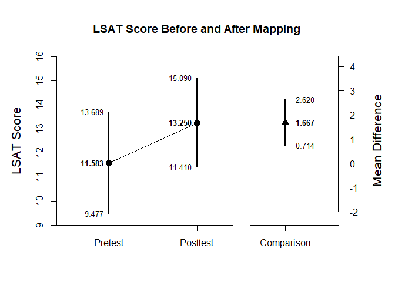
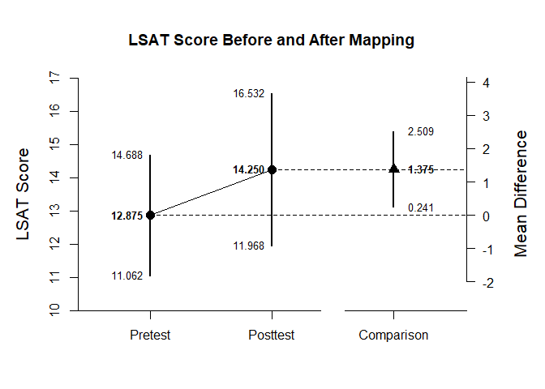
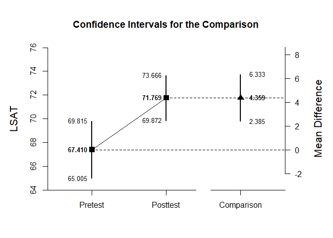

## Paired Samples Example with Thomason Summary Statistics

### Thomason1 Example


```r
Pretest <- c(N=12,M=11.583,SD=3.315)
Posttest <- c(N=12,M=13.250,SD=2.896)
Thomason1Summary <- rbind(Pretest,Posttest)
class(Thomason1Summary) <- "wss"
Thomason1Corr <- data.frame()
Thomason1Corr["Pretest","Posttest"] <- .892
```


```r
plotDifference(Thomason1Summary,Thomason1Corr,ylab="LSAT")
```

<!-- -->


```r
standardizeDifference(Thomason1Summary,Thomason1Corr)
```

```
## $`Confidence Interval for the Standardized Comparison`
##                Est      SE      LL      UL
## Comparison   0.536   0.181   0.180   0.891
```

### Thomason2 Example


```r
Pretest <- c(N=16,M=12.875,SD=3.403)
Posttest <- c(N=16,M=14.250,SD=4.282)
Thomason2Summary <- rbind(Pretest,Posttest)
class(Thomason2Summary) <- "wss"
Thomason2Corr <- data.frame()
Thomason2Corr["Pretest","Posttest"] <- .871
```


```r
plotDifference(Thomason2Summary,Thomason2Corr,ylab="LSAT")
```

<!-- -->


```r
standardizeDifference(Thomason2Summary,Thomason2Corr)
```

```
## $`Confidence Interval for the Standardized Comparison`
##                Est      SE      LL      UL
## Comparison   0.356   0.155   0.052   0.659
```

### Thomason3 Example


```r
Pretest <- c(N=39,M=67.410,SD=7.419)
Posttest <- c(N=39,M=71.769,SD=5.851)
Thomason3Summary <- rbind(Pretest,Posttest)
class(Thomason3Summary) <- "wss"
Thomason3Corr <- data.frame()
Thomason3Corr["Pretest","Posttest"] <- .601
```


```r
plotDifference(Thomason3Summary,Thomason3Corr,ylab="LSAT")
```

<!-- -->


```r
standardizeDifference(Thomason3Summary,Thomason3Corr)
```

```
## $`Confidence Interval for the Standardized Comparison`
##                Est      SE      LL      UL
## Comparison   0.652   0.161   0.338   0.967
```
