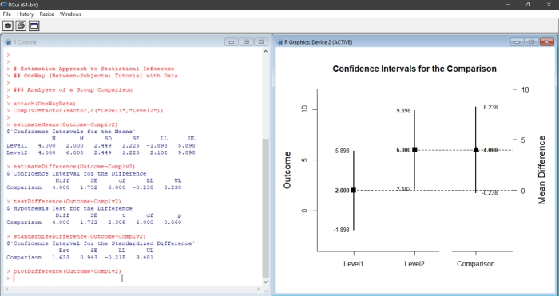

# Estimation Approach to Statistical Inference

[**Functions**](./Functions) | 
[**Tutorials**](./Tutorials) | 
[**Examples**](./Examples) | 
[**Advanced**](./Advanced)

---

### Overview

EASI is an R package that implements features of [estimation statistics](https://en.wikipedia.org/wiki/Estimation_statistics "Estimation Statistics on Wikipedia") (or the ["new statistics"](https://thenewstatistics.com/itns/ "Introduction to the New Statistics")). Included functions calculate, test, and plot confidence intervals for means, mean differences, and mean contrasts for between- and within-subjects single-factor, factorial, and mixed designs and can take either raw data or summary statistics as input. Additional functions calculate the standardized effect sizes and statistical significance tests associated with comparions among the groups and variables. 

<kbd></kbd>

### Materials Available on this Site

This site includes the basic functions and extensions of EASI, along with numerous example showing how to use the functions.

- [**Functions**](./Functions): Contains descriptions of the basic functions and extensions that can be "installed" (sourced) in R in order to run the analyses
- [**Tutorials**](./Tutorials): Contains between-subjects and within-subjects tutorials that highlight the basic functions
- [**Examples**](./Examples): Contains between-subjects and within-subjects examples from the book _Introduction to the New Statistics_
- [**Advanced**](./Advanced): Contains advanced applications and additional examples of the functions and extensions

### How to Cite

Wendorf, C.A. (2019). _EASI: Estimation Approach to Statistical Inference_ [R Package]. [https://cwendorf.github.io/EASI/](https://cwendorf.github.io/EASI/)
