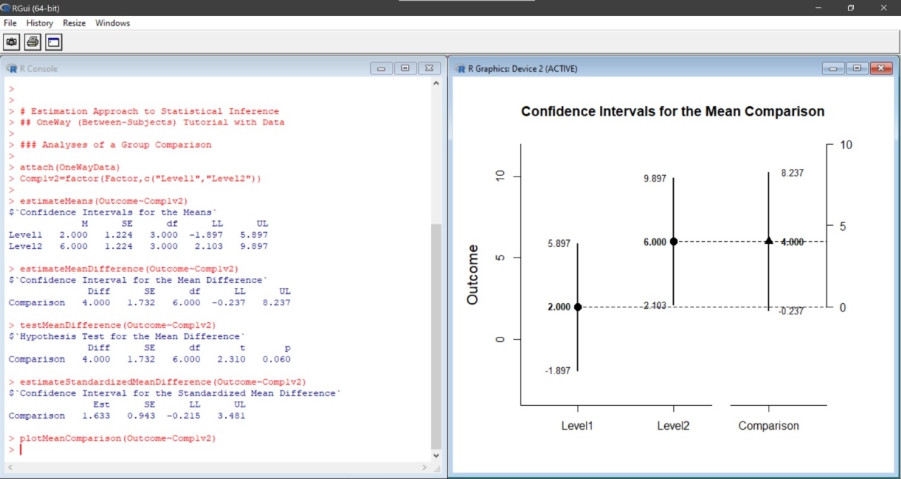

# Estimation Approach to Statistical Inference

### Overview

[**EASI**](https://cwendorf.github.io/EASI) is an R package that implements features of estimation statistics. Its primary functions calculate, test, and plot confidence intervals for between- and within-subjects single-factor, factorial, and mixed designs. Additional functions calculate the standardized effect sizes and statistical significance tests associated with comparisons among the groups and variables. Most functions can take either raw data or summary statistics as input.

<p align="center"><kbd></kbd></p>

### Installation

This package is not currently on CRAN, but the latest stable release can be installed from GitHub:

```r
install.packages("devtools")
devtools::install_github("cwendorf/EASI@*release",build_vignettes=TRUE)
library(EASI)
```

To get the newest features and bug fixes, install the development version from GitHub:

``` r
install.packages("devtools")
devtools::install_github("cwendorf/EASI")
library(EASI)
```

If you do not wish a full install, the latest functions can be sourced directly from GitHub:

```r
source("http://raw.githubusercontent.com/cwendorf/EASI/main/source-EASI.R")
```

### Contact Me

- GitHub Issues: [https://github.com/cwendorf/EASI/issues](https://github.com/cwendorf/EASI/issues) 
- Author Email: [cwendorf@uwsp.edu](mailto:cwendorf@uwsp.edu)
- Author Homepage: [https://cwendorf.github.io](https://cwendorf.github.io)

### Citation

Wendorf, C.A. (2019). *EASI: Estimation Approach to Statistical Inference* [R Package]. [https://cwendorf.github.io/EASI/](https://cwendorf.github.io/EASI/)
