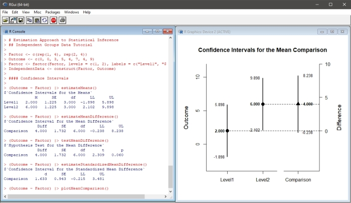
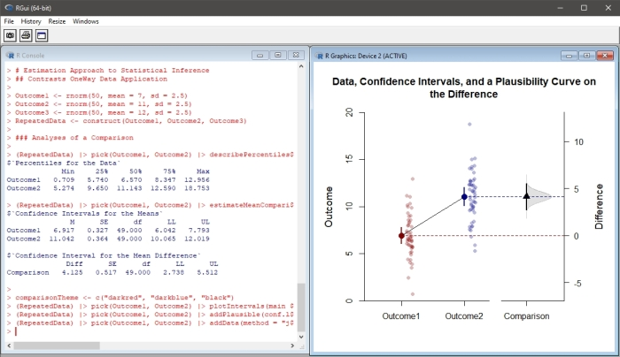

## Overview

This page outlines the general purpose and structure of the EASI project.

- [Purpose of EASI](#purpose-of-easi)
- [Scope of the Project](#scope-of-the-project)
- [Table of Contents](#table-of-contents)

---

### Purpose of EASI

EASI is an R package that implements features of estimation statistics and data visualization in a pipe-oriented framework. Its primary functions describe, estimate, test, and plot confidence intervals for means, mean comparisons, correlations, and standardized effect sizes in between- and within-subjects single-factor, factorial, and mixed designs. Most functions can take either raw data or summary statistics as input.



Additional functions extend the analysis capabilities much further. These offer summaries and plots of data, frequencies, densities, and more. These features can be combined to produce images similar to those from other estimation statistics implementations.



### Scope of the Project

EASI was designed to offer a simple, intuitive, and consistent way to implement estimation statistics in R. The following goals set the scope of the project:

- Functions are generally limited to means (and functions of means), correlations, and regression coefficients
- Analyses can be conducted using either raw data or summary statistics (means, standard deviations, and correlations)
- Calculations run on the same underlying functions regardless of type of input
- Output utilizes consistent layouts and labeling across different types of analyses

### Function Calls

In standard R syntax, the function name is followed in parentheses by the variables to be analyzed and any relevant additional parameters (such as different confidence levels, null values, etc.). In R versions 4.1 and greater, the native pipe operator can be used instead of standard syntax. Here, the variables to be analyzed are included first, followed by the pipe operator, and then the function call (with any relevant additional parameters in parentheses). This format is highlighted throughout EASI.

```
(Outcome ~ Factor) |> estimateMeans()
(Outcome ~ Factor) |> estimateMeans(conf.level = .99, main = "Custom Table Title", digits = 2)
(Outcome ~ Factor) |> plotMeans()
(Outcome ~ Factor) |> plotMeans(values = FALSE, main = "Custom Plot Title", col = "darkblue")
```

When larger or predefined data sets are used, it is necessary to identify the data first and then select the variables from within the data set. In base R, this is accomplished using a `with` command (or built in data identification parameters). In EASI, this is accomplished by using an exposition operator (such as the included `%$>%`).

```
OneWayData %$>% (Outcome ~ Factor) |> estimateMeans()
OneWayData %$>% (Outcome ~ Factor) |> estimateMeans(conf.level = .99, main = "Custom Table Title", digits = 2)
OneWayData %$>% (Outcome ~ Factor) |> plotMeans()
OneWayData %$>% (Outcome ~ Factor) |> plotMeans(values = FALSE, main = "Custom Plot Title", col = "darkblue")
```

### Table of Contents

The package includes a wide variety of materials that demonstrate its use:

- [Manual](./manual) - Manual of the functions and their available options
- [Examples](./examples) - Examples that demonstrate basic analyses of simple datasets
- [Applications](./applications) - Applications that demonstrate advanced features
