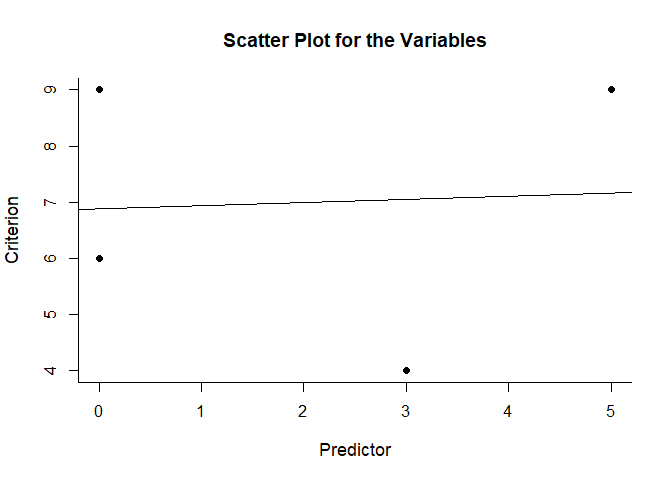
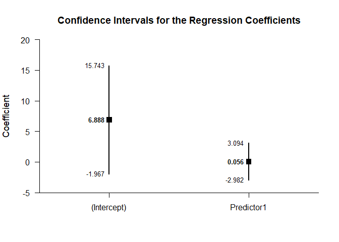
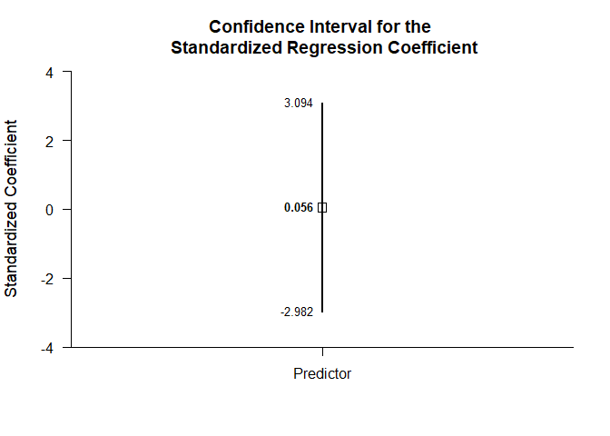
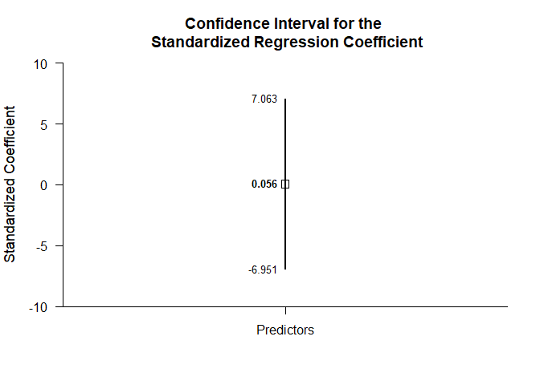

## Bivariate Regression Tutorial with Data

### Data Management

#### Data Entry

This code inputs the variable names and creates a viewable data frame.

```r
Predictor <- c(0,0,3,5)
Criterion <- c(9,6,4,9)
BivariateData <- data.frame(Predictor,Criterion)
```

#### Plot of the Data

This code provides a scatterplot and regression line for the bivariate relationship.

```r
plotScatter(Predictor,Criterion)
```

<!-- -->

#### Descriptive Statistics

This code obtains the descriptive statistics for the data frame.

```r
describeMeans(Predictor,Criterion)
```

```
## $`Descriptive Statistics for the Data`
##                 N       M      SD
## Predictor   4.000   2.000   2.449
## Criterion   4.000   7.000   2.449
```

### Analyses of a Bivariate Regression Model

This section produces analyses of a regression with only one predictor.

#### Confidence Intervals for the Regression Coefficients

This code will provide a table of confidence intervals for each of the regression coefficients.

```r
estimateRegression(Predictor,Criterion)
```

```
## $`Confidence Intervals for the Regression Coefficients`
##                 Est      SE      LL      UL
## (Intercept)   6.888   2.058  -1.967  15.743
## Predictors    0.056   0.706  -2.982   3.094
```

This code will produce a graph of the confidence intervals for each of the regression coefficients.

```r
plotRegression(Predictor,Criterion)
```

<!-- -->

The code defaults to 95% confidence intervals. This can be changed if desired.

```r
estimateRegression(Predictor,Criterion,conf.level=.99)
```

```
## $`Confidence Intervals for the Regression Coefficients`
##                 Est      SE      LL      UL
## (Intercept)   6.888   2.058 -13.538  27.314
## Predictors    0.056   0.706  -6.951   7.063
```

For the graph, it is possible to plot just coefficients for the predictors (minus the intercept) in addition to changing the confidence level. A comparison line and region of practical equivalence can also be added.

```r
plotRegression(Predictor,Criterion,conf.level=.99,mu=0,rope=c(-2,2),intercept=FALSE)
```

<!-- -->

#### Significance Tests for the Regression Coefficients

This code will produce a table of NHST separately for each of the regression coefficients. In this case, all the coefficients are tested against a value of zero.

```r
testRegression(Predictor,Criterion)
```

```
## $`Hypothesis Tests for the Regression Coefficients`
##                 Est      SE       t       p
## (Intercept)   6.888   2.058   3.347   0.079
## Predictors    0.056   0.706   0.079   0.944
```

#### Confidence Intervals for the Standardized Regression Coefficient

This code will provide a table of confidence intervals for the standardized coefficient.

```r
estimateStandardizedRegression(Predictor,Criterion)
```

```
## $`Confidence Intervals for the Standardized Regression Coefficients`
##                Est      SE      LL      UL
## Predictors   0.056   0.706  -2.982   3.094
```

This code will produce a graph of the confidence intervals for the standardized coefficient.

```r
plotStandardizedRegression(Predictor,Criterion)
```

<!-- -->

As in other places, the code defaults to a 95% confidence interval. This can be changed if desired.

```r
estimateStandardizedRegression(Predictor,Criterion,conf.level=.99)
```

```
## $`Confidence Intervals for the Standardized Regression Coefficients`
##                Est      SE      LL      UL
## Predictors   0.056   0.706  -6.951   7.063
```

For the graph, it is possible to change the confidence level.

```r
plotStandardizedRegression(Predictor,Criterion,conf.level=.99)
```

<!-- -->

#### Confidence Interval for the Overall Fit

This code will calculate R Squared and Adjusted R Squared for the regression model.

```r
describeRegressionEffect(Predictor,Criterion)
```

```
## $`Overall Fit of the Model`
##             R     RSq  AdjRSq
## Model   0.056   0.003  -0.495
```

This code will produce the confidence interval for R Squared.

```r
estimateRegressionEffect(Predictor,Criterion)
```

```
## $`Proportion of Variance Accounted For by the Model`
##           Est      LL      UL
## Model   0.003   0.000   0.044
```

The code defaults to 90% confidence intervals. This can be changed if desired.

```r
estimateRegressionEffect(Predictor,Criterion,conf.level=.95)
```

```
## $`Proportion of Variance Accounted For by the Model`
##           Est      LL      UL
## Model   0.003   0.000   0.282
```

#### Significance Test for the Overall Fit

This code will produce a source table associated with the regression model.

```r
describeRegressionOmnibus(Predictor,Criterion)
```

```
## $`Source Table for the Regression Model`
##            SS      df      MS
## Model   0.054   1.000   0.054
## Error  17.939   2.000   8.969
## Total  17.993   3.000   5.998
```

This code will calculate NHST for the regression model.

```r
testRegressionOmnibus(Predictor,Criterion)
```

```
## $`Hypothesis Test for the Regression Model`
##             F     df1     df2       p
## Model   0.006   1.000   2.000   0.945
```
