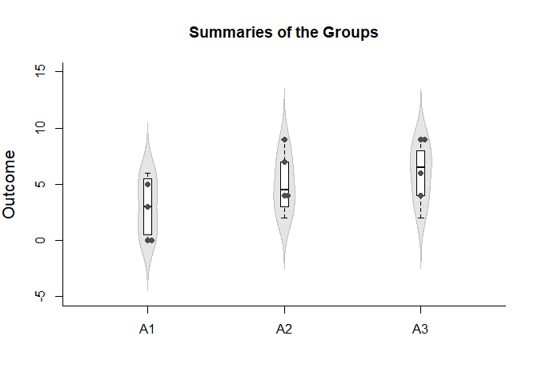
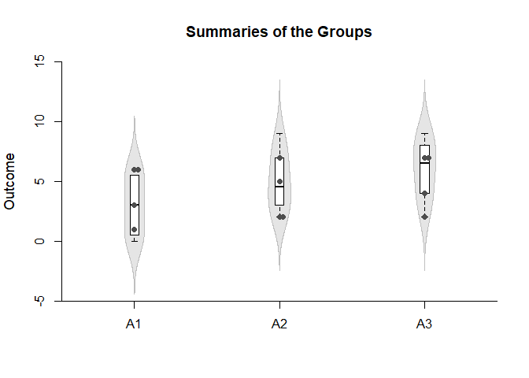
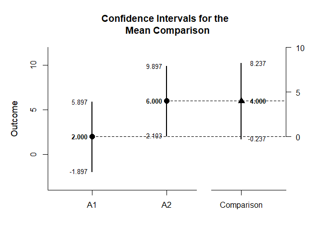
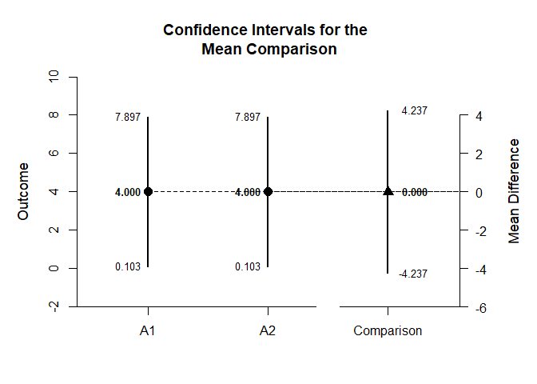
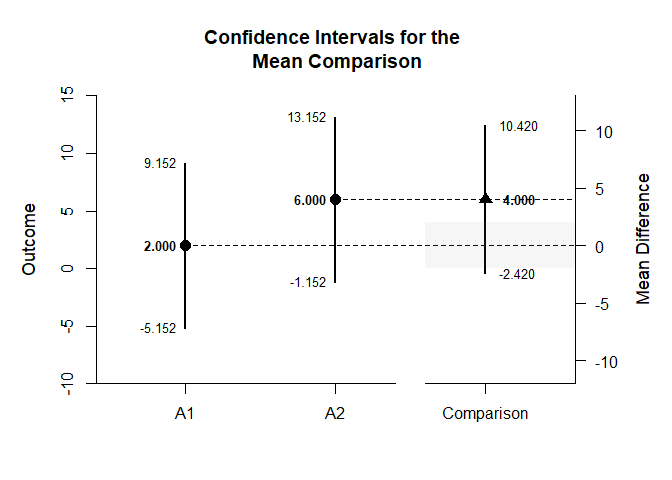
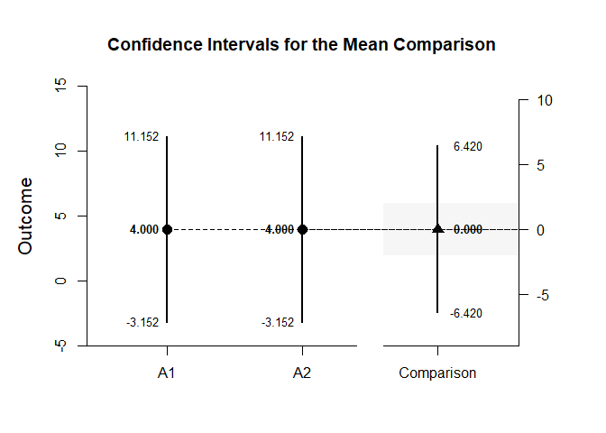
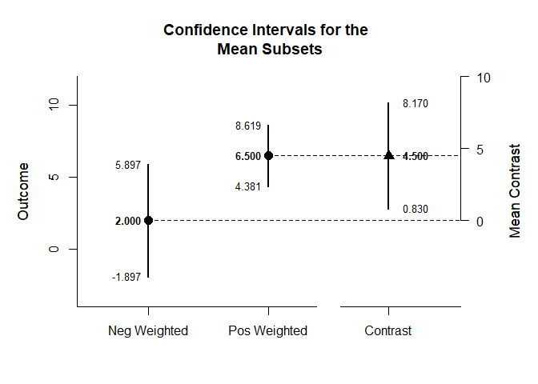
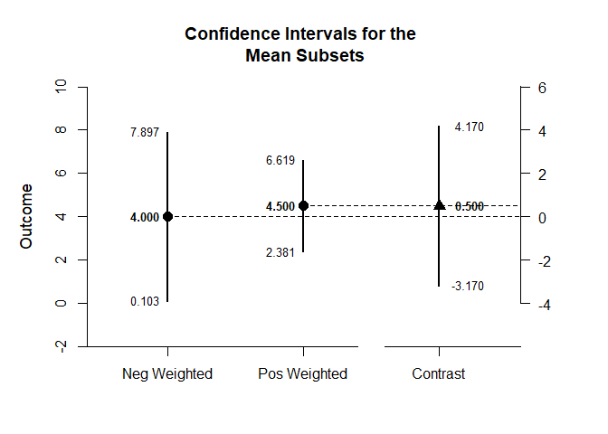
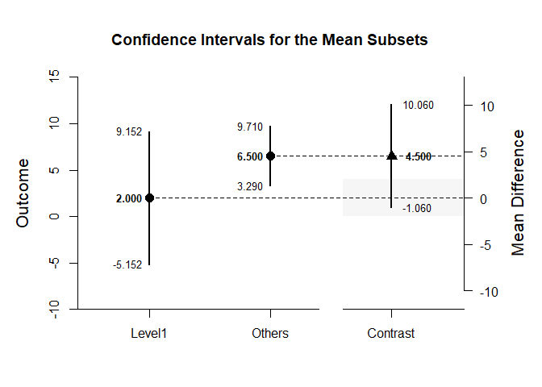
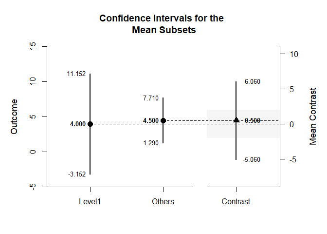

## Factorial (Between-Subjects) Tutorial with Data

### Data Management

#### Data Entry

This code inputs the variable names and creates a viewable data frame.

```r
FactorA <- c(1,1,1,1,2,2,2,2,3,3,3,3,1,1,1,1,2,2,2,2,3,3,3,3)
FactorB <- c(1,1,1,1,1,1,1,1,1,1,1,1,2,2,2,2,2,2,2,2,2,2,2,2)
Outcome <- c(0,0,3,5,4,7,4,9,4,9,6,9,3,1,6,6,2,2,5,7,2,4,7,7)
FactorA <- factor(FactorA,levels=c(1,2,3),labels=c("A1","A2","A3"))
FactorB <- factor(FactorB,levels=c(1,2),labels=c("B1","B2"))
FactorialData <- data.frame(FactorA,FactorB,Outcome)
```

This code subsets the data into two different data frames (for simple effects analysis).

```r
FactorialDataB1 <- subset(FactorialData,FactorB=="B1")
FactorialDataB2 <- subset(FactorialData,FactorB=="B2")
```

#### Plot of the Data


```r
with(FactorialDataB1,plotViolins(Outcome~FactorA,main="Summaries of the Groups"))
with(FactorialDataB1,plotBoxes(Outcome~FactorA,add=TRUE))
with(FactorialDataB1,plotData(Outcome~FactorA,add=TRUE,method="stack",pch=16))
```

<!-- -->

```r
with(FactorialDataB2,plotViolins(Outcome~FactorA,main="Summaries of the Groups"))
with(FactorialDataB2,plotBoxes(Outcome~FactorA,add=TRUE))
with(FactorialDataB2,plotData(Outcome~FactorA,add=TRUE,method="stack",pch=16))
```

<!-- -->

#### Descriptive Statistics

This code obtains the descriptive statistics for the two data frames.

```r
with(FactorialDataB1,describeMeans(Outcome~FactorA))
```

```
## $`Descriptive Statistics for the Data`
##          N       M      SD
## A1   4.000   2.000   2.449
## A2   4.000   6.000   2.449
## A3   4.000   7.000   2.449
```

```r
with(FactorialDataB2,describeMeans(Outcome~FactorA))
```

```
## $`Descriptive Statistics for the Data`
##          N       M      SD
## A1   4.000   4.000   2.449
## A2   4.000   4.000   2.449
## A3   4.000   5.000   2.449
```

### Analyses of the Means

This section produces analyses that are equivalent to one-sample analyses separately for each level of a factor.

#### Confidence Intervals for the Means

This code will provide tables of confidence intervals for each level of the factor.

```r
with(FactorialDataB1,estimateMeans(Outcome~FactorA))
```

```
## $`Confidence Intervals for the Means`
##          M      SE      df      LL      UL
## A1   2.000   1.224   3.000  -1.897   5.897
## A2   6.000   1.224   3.000   2.103   9.897
## A3   7.000   1.224   3.000   3.103  10.897
```

```r
with(FactorialDataB2,estimateMeans(Outcome~FactorA))
```

```
## $`Confidence Intervals for the Means`
##          M      SE      df      LL      UL
## A1   4.000   1.224   3.000   0.103   7.897
## A2   4.000   1.224   3.000   0.103   7.897
## A3   5.000   1.224   3.000   1.103   8.897
```

This code will produce a graph of the confidence intervals for each level of the factor.

```r
with(FactorialDataB1,plotMeans(Outcome~FactorA))
```

<!-- -->

```r
with(FactorialDataB2,plotMeans(Outcome~FactorA))
```

<!-- -->

The code defaults to 95% confidence intervals. This can be changed if desired.

```r
with(FactorialDataB1,estimateMeans(Outcome~FactorA,conf.level=.99))
```

```
## $`Confidence Intervals for the Means`
##          M      SE      df      LL      UL
## A1   2.000   1.224   3.000  -5.152   9.152
## A2   6.000   1.224   3.000  -1.152  13.152
## A3   7.000   1.224   3.000  -0.152  14.152
```

```r
with(FactorialDataB2,estimateMeans(Outcome~FactorA,conf.level=.99))
```

```
## $`Confidence Intervals for the Means`
##          M      SE      df      LL      UL
## A1   4.000   1.224   3.000  -3.152  11.152
## A2   4.000   1.224   3.000  -3.152  11.152
## A3   5.000   1.224   3.000  -2.152  12.152
```

For the graph, it is possible to add a comparison line to represent a population (or test) value and a region of practical equivalence in addition to changing the confidence level.

```r
with(FactorialDataB1,plotMeans(Outcome~FactorA,conf.level=.99,mu=5,rope=c(3,7)))
```

<!-- -->

```r
with(FactorialDataB2,plotMeans(Outcome~FactorA,conf.level=.99,mu=5,rope=c(3,7)))
```

<!-- -->

#### Significance Tests for the Means

This code will produce a table of NHST separately for each level of the factor. In this case, all the means are tested against a value of zero.

```r
with(FactorialDataB1,testMeans(Outcome~FactorA))
```

```
## $`Hypothesis Tests for the Means`
##       Diff      SE      df       t       p
## A1   2.000   1.224   3.000   1.633   0.201
## A2   6.000   1.224   3.000   4.900   0.016
## A3   7.000   1.224   3.000   5.717   0.011
```

```r
with(FactorialDataB2,testMeans(Outcome~FactorA))
```

```
## $`Hypothesis Tests for the Means`
##       Diff      SE      df       t       p
## A1   4.000   1.224   3.000   3.267   0.047
## A2   4.000   1.224   3.000   3.267   0.047
## A3   5.000   1.224   3.000   4.083   0.027
```

Often, the default test value of zero is not meaningful or plausible. This too can be altered (often in conjunction with what is presented in the plot).

```r
with(FactorialDataB1,testMeans(Outcome~FactorA,mu=5))
```

```
## $`Hypothesis Tests for the Means`
##       Diff      SE      df       t       p
## A1  -3.000   1.224   3.000  -2.450   0.092
## A2   1.000   1.224   3.000   0.817   0.474
## A3   2.000   1.224   3.000   1.633   0.201
```

```r
with(FactorialDataB2,testMeans(Outcome~FactorA,mu=5))
```

```
## $`Hypothesis Tests for the Means`
##       Diff      SE      df       t       p
## A1  -1.000   1.224   3.000  -0.817   0.474
## A2  -1.000   1.224   3.000  -0.817   0.474
## A3   0.000   1.224   3.000   0.000   1.000
```

#### Standardized Effect Sizes for the Means

This code will produce a table of standardized mean differences separately for each level of the factor. In this case, the mean is compared to zero to form the effect size.

```r
with(FactorialDataB1,estimateStandardizedMeans(Outcome~FactorA))
```

```
## $`Confidence Intervals for the Standardized Means`
##          d      SE      LL      UL
## A1   0.817   0.616  -0.387   1.934
## A2   2.450   0.955   0.325   4.532
## A3   2.858   1.063   0.464   5.227
```

```r
with(FactorialDataB2,estimateStandardizedMeans(Outcome~FactorA))
```

```
## $`Confidence Intervals for the Standardized Means`
##          d      SE      LL      UL
## A1   1.633   0.761   0.013   3.177
## A2   1.633   0.761   0.013   3.177
## A3   2.042   0.854   0.176   3.847
```

Here too it is possible to alter the width of the confidence intervals and to establish a more plausible comparison value for the mean.

```r
with(FactorialDataB1,estimateStandardizedMeans(Outcome~FactorA,mu=5,conf.level=.99))
```

```
## $`Confidence Intervals for the Standardized Means`
##          d      SE      LL      UL
## A1  -1.225   0.680  -3.011   0.547
## A2   0.408   0.574  -0.968   1.734
## A3   0.817   0.616  -0.732   2.320
```

```r
with(FactorialDataB1,estimateStandardizedMeans(Outcome~FactorA,mu=5,conf.level=.99))
```

```
## $`Confidence Intervals for the Standardized Means`
##          d      SE      LL      UL
## A1  -1.225   0.680  -3.011   0.547
## A2   0.408   0.574  -0.968   1.734
## A3   0.817   0.616  -0.732   2.320
```

### Analyses of a Comparison

This section produces analyses that are equivalent to comparisons of two levels of a factor.

This code creates a new factor that identifies the two levels for comparison.

```r
CompDataB1 <- with(FactorialDataB1,factor(FactorA,c("A1","A2")))
CompDataB2 <- with(FactorialDataB2,factor(FactorA,c("A1","A2")))
```

#### Confidence Interval for a Mean Difference

This code estimates the confidence interval of the difference.

```r
with(FactorialDataB1,estimateMeanDifference(Outcome~CompDataB1))
```

```
## $`Confidence Interval for the Mean Difference`
##               Diff      SE      df      LL      UL
## Comparison   4.000   1.732   6.000  -0.237   8.237
```

```r
with(FactorialDataB2,estimateMeanDifference(Outcome~CompDataB2))
```

```
## $`Confidence Interval for the Mean Difference`
##               Diff      SE      df      LL      UL
## Comparison   0.000   1.732   6.000  -4.237   4.237
```

This code obtains and plots the confidence intervals for the mean difference in the identified comparison.

```r
with(FactorialDataB1,plotMeanDifference(Outcome~CompDataB1))
```

<!-- -->

```r
with(FactorialDataB2,plotMeanDifference(Outcome~CompDataB2))
```

<!-- -->

Of course, you can change the confidence level from the default 95% if desired.

```r
with(FactorialDataB1,estimateMeanDifference(Outcome~CompDataB1,conf.level=.99))
```

```
## $`Confidence Interval for the Mean Difference`
##               Diff      SE      df      LL      UL
## Comparison   4.000   1.732   6.000  -2.420  10.420
```

```r
with(FactorialDataB2,estimateMeanDifference(Outcome~CompDataB2,conf.level=.99))
```

```
## $`Confidence Interval for the Mean Difference`
##               Diff      SE      df      LL      UL
## Comparison   0.000   1.732   6.000  -6.420   6.420
```

Once again, the confidence levels can be changed away from the default and a region of practical equivalence can be added to the graph.

```r
with(FactorialDataB1,plotMeanDifference(Outcome~CompDataB1,conf.level=.99,rope=c(-2,2)))
```

<!-- -->

```r
with(FactorialDataB2,plotMeanDifference(Outcome~CompDataB2,conf.level=.99,rope=c(-2,2)))
```

<!-- -->

#### Confidence Intervals for the Comparison

If you wish, you can get the confidence intervals for the means and the mean difference in one command.

```r
with(FactorialDataB1,estimateMeanComparison(Outcome~CompDataB1))
```

```
## $`Confidence Intervals for the Means`
##          M      SE      df      LL      UL
## A1   2.000   1.224   3.000  -1.897   5.897
## A2   6.000   1.224   3.000   2.103   9.897
## 
## $`Confidence Interval for the Mean Difference`
##               Diff      SE      df      LL      UL
## Comparison   4.000   1.732   6.000  -0.237   8.237
```

```r
with(FactorialDataB2,estimateMeanComparison(Outcome~CompDataB2))
```

```
## $`Confidence Intervals for the Means`
##          M      SE      df      LL      UL
## A1   4.000   1.224   3.000   0.103   7.897
## A2   4.000   1.224   3.000   0.103   7.897
## 
## $`Confidence Interval for the Mean Difference`
##               Diff      SE      df      LL      UL
## Comparison   0.000   1.732   6.000  -4.237   4.237
```

This code produces a difference plot using the confidence intervals for the means and the mean difference.

```r
with(FactorialDataB1,plotMeanComparison(Outcome~CompDataB1))
```

<!-- -->

```r
with(FactorialDataB2,plotMeanComparison(Outcome~CompDataB2))
```

<!-- -->

Of course, you can change the confidence level from the default 95% if desired.

```r
with(FactorialDataB1,estimateMeanComparison(Outcome~CompDataB1,conf.level=.99))
```

```
## $`Confidence Intervals for the Means`
##          M      SE      df      LL      UL
## A1   2.000   1.224   3.000  -5.152   9.152
## A2   6.000   1.224   3.000  -1.152  13.152
## 
## $`Confidence Interval for the Mean Difference`
##               Diff      SE      df      LL      UL
## Comparison   4.000   1.732   6.000  -2.420  10.420
```

```r
with(FactorialDataB2,estimateMeanComparison(Outcome~CompDataB2,conf.level=.99))
```

```
## $`Confidence Intervals for the Means`
##          M      SE      df      LL      UL
## A1   4.000   1.224   3.000  -3.152  11.152
## A2   4.000   1.224   3.000  -3.152  11.152
## 
## $`Confidence Interval for the Mean Difference`
##               Diff      SE      df      LL      UL
## Comparison   0.000   1.732   6.000  -6.420   6.420
```

Once again, the confidence levels can be changed away from the default and a region of practical equivalence can be added to the graph.

```r
with(FactorialDataB1,plotMeanComparison(Outcome~CompDataB1,conf.level=.99,rope=c(-2,2)))
```

<!-- -->

```r
with(FactorialDataB2,plotMeanComparison(Outcome~CompDataB2,conf.level=.99,rope=c(-2,2)))
```

<!-- -->

#### Significance Test for the Mean Difference

This code produces NHST for the identified comparison (using a default test value of zero).

```r
with(FactorialDataB1,testMeanDifference(Outcome~CompDataB1))
```

```
## $`Hypothesis Test for the Mean Difference`
##               Diff      SE      df       t       p
## Comparison   4.000   1.732   6.000   2.310   0.060
```

```r
with(FactorialDataB2,testMeanDifference(Outcome~CompDataB2))
```

```
## $`Hypothesis Test for the Mean Difference`
##               Diff      SE      df       t       p
## Comparison   0.000   1.732   6.000   0.000   1.000
```

If the default value of zero is not plausible, it too can be changed.

```r
with(FactorialDataB1,testMeanDifference(Outcome~CompDataB1,mu=-2))
```

```
## $`Hypothesis Test for the Mean Difference`
##               Diff      SE      df       t       p
## Comparison   6.000   1.732   6.000   3.465   0.013
```

```r
with(FactorialDataB2,testMeanDifference(Outcome~CompDataB2,mu=-2))
```

```
## $`Hypothesis Test for the Mean Difference`
##               Diff      SE      df       t       p
## Comparison   2.000   1.732   6.000   1.155   0.292
```

#### Standardized Effect Size for the Mean Difference

This code calculates a standardized mean difference for the comparison and its confidence interval.

```r
with(FactorialDataB1,estimateStandardizedMeanDifference(Outcome~CompDataB1))
```

```
## $`Confidence Interval for the Standardized Mean Difference`
##                Est      SE      LL      UL
## Comparison   1.633   0.943  -0.215   3.481
```

```r
with(FactorialDataB2,estimateStandardizedMeanDifference(Outcome~CompDataB2))
```

```
## $`Confidence Interval for the Standardized Mean Difference`
##                Est      SE      LL      UL
## Comparison   0.000   0.816  -1.600   1.600
```

The width of the confidence interval for the effect size can be altered if desired.

```r
with(FactorialDataB1,estimateStandardizedMeanDifference(Outcome~CompDataB1,conf.level=.99))
```

```
## $`Confidence Interval for the Standardized Mean Difference`
##                Est      SE      LL      UL
## Comparison   1.633   0.943  -0.795   4.062
```

```r
with(FactorialDataB2,estimateStandardizedMeanDifference(Outcome~CompDataB2,conf.level=.99))
```

```
## $`Confidence Interval for the Standardized Mean Difference`
##                Est      SE      LL      UL
## Comparison   0.000   0.816  -2.103   2.103
```

### Analyses of a Contrast

This section produces analyses that are equivalent to analyses involving multiple levels of a factor.

This code identifies a contrast among the groups.

```r
A1vsOthers <- c(-1,.5,.5)
```

#### Confidence Interval for a Contrast

This code produces a confidence interval for that contrast.

```r
with(FactorialDataB1,estimateMeanContrast(Outcome~FactorA,contrast=A1vsOthers))
```

```
## $`Confidence Interval for the Mean Contrast`
##              Est      SE      df      LL      UL
## Contrast   4.500   1.500   6.000   0.830   8.170
```

```r
with(FactorialDataB2,estimateMeanContrast(Outcome~FactorA,contrast=A1vsOthers))
```

```
## $`Confidence Interval for the Mean Contrast`
##              Est      SE      df      LL      UL
## Contrast   0.500   1.500   6.000  -3.170   4.170
```

This code obtains and plots the confidence intervals for the groups and the mean difference in the identified contrast.

```r
with(FactorialDataB1,plotMeanContrast(Outcome~FactorA,contrast=A1vsOthers))
```

<!-- -->

```r
with(FactorialDataB2,plotMeanContrast(Outcome~FactorA,contrast=A1vsOthers))
```

<!-- -->

As in all other cases, the default value of the confidence interval can be changed.

```r
with(FactorialDataB1,estimateMeanContrast(Outcome~FactorA,contrast=A1vsOthers,conf.level=.99))
```

```
## $`Confidence Interval for the Mean Contrast`
##              Est      SE      df      LL      UL
## Contrast   4.500   1.500   6.000  -1.060  10.060
```

```r
with(FactorialDataB2,estimateMeanContrast(Outcome~FactorA,contrast=A1vsOthers,conf.level=.99))
```

```
## $`Confidence Interval for the Mean Contrast`
##              Est      SE      df      LL      UL
## Contrast   0.500   1.500   6.000  -5.060   6.060
```

The width of the confidence interval for the contrast can be altered and a region of practical equivalence can be added to the graph.

```r
with(FactorialDataB1,plotMeanContrast(Outcome~FactorA,contrast=A1vsOthers,conf.level=.99,rope=c(-2,2)))
```

<!-- -->

```r
with(FactorialDataB2,plotMeanContrast(Outcome~FactorA,contrast=A1vsOthers,conf.level=.99,rope=c(-2,2)))
```

<!-- -->

#### Confidence Intervals for the Subsets

If you wish, you can get the confidence intervals for the mean subsets and the mean contrast in one command.

```r
with(FactorialDataB1,estimateMeanSubsets(Outcome~FactorA,contrast=A1vsOthers))
```

```
## $`Confidence Intervals for the Mean Subsets`
##                  Est      SE      df      LL      UL
## Neg Weighted   2.000   1.224   3.000  -1.897   5.897
## Pos Weighted   6.500   0.866   6.000   4.381   8.619
## 
## $`Confidence Interval for the Mean Contrast`
##              Est      SE      df      LL      UL
## Contrast   4.500   1.500   6.000   0.830   8.170
```

```r
with(FactorialDataB2,estimateMeanSubsets(Outcome~FactorA,contrast=A1vsOthers))
```

```
## $`Confidence Intervals for the Mean Subsets`
##                  Est      SE      df      LL      UL
## Neg Weighted   4.000   1.224   3.000   0.103   7.897
## Pos Weighted   4.500   0.866   6.000   2.381   6.619
## 
## $`Confidence Interval for the Mean Contrast`
##              Est      SE      df      LL      UL
## Contrast   0.500   1.500   6.000  -3.170   4.170
```

This code produces a difference plot using the confidence intervals for the mean subsets and the mean contrast.

```r
with(FactorialDataB1,plotMeanSubsets(Outcome~FactorA,contrast=A1vsOthers))
```

<!-- -->

```r
with(FactorialDataB2,plotMeanSubsets(Outcome~FactorA,contrast=A1vsOthers))
```

<!-- -->

Of course, you can change the confidence level from the default 95% if desired.

```r
with(FactorialDataB1,estimateMeanSubsets(Outcome~FactorA,contrast=A1vsOthers,conf.level=.99))
```

```
## $`Confidence Intervals for the Mean Subsets`
##                  Est      SE      df      LL      UL
## Neg Weighted   2.000   1.224   3.000  -5.152   9.152
## Pos Weighted   6.500   0.866   6.000   3.290   9.710
## 
## $`Confidence Interval for the Mean Contrast`
##              Est      SE      df      LL      UL
## Contrast   4.500   1.500   6.000  -1.060  10.060
```

```r
with(FactorialDataB2,estimateMeanSubsets(Outcome~FactorA,contrast=A1vsOthers,conf.level=.99))
```

```
## $`Confidence Intervals for the Mean Subsets`
##                  Est      SE      df      LL      UL
## Neg Weighted   4.000   1.224   3.000  -3.152  11.152
## Pos Weighted   4.500   0.866   6.000   1.290   7.710
## 
## $`Confidence Interval for the Mean Contrast`
##              Est      SE      df      LL      UL
## Contrast   0.500   1.500   6.000  -5.060   6.060
```

Once again, the confidence levels can be changed away from the default and a region of practical equivalence can be added to the graph.

```r
with(FactorialDataB1,plotMeanSubsets(Outcome~FactorA,contrast=A1vsOthers,labels=c("Level1","Others"),conf.level=.99,rope=c(-2,2)))
```

<!-- -->

```r
with(FactorialDataB2,plotMeanSubsets(Outcome~FactorA,contrast=A1vsOthers,labels=c("Level1","Others"),conf.level=.99,rope=c(-2,2)))
```

<!-- -->

#### Significance Test for a Contrast

This code produces a NHST for the identified contrast. It tests the contrast against a value of zero by default.

```r
with(FactorialDataB1,testMeanContrast(Outcome~FactorA,contrast=A1vsOthers))
```

```
## $`Hypothesis Test for the Mean Contrast`
##              Est      SE      df       t       p
## Contrast   4.500   1.500   6.000   3.001   0.024
```

```r
with(FactorialDataB2,testMeanContrast(Outcome~FactorA,contrast=A1vsOthers))
```

```
## $`Hypothesis Test for the Mean Contrast`
##              Est      SE      df       t       p
## Contrast   0.500   1.500   6.000   0.333   0.750
```

If desired, the contrast can be tested against other values.

```r
with(FactorialDataB1,testMeanContrast(Outcome~FactorA,contrast=A1vsOthers,mu=4))
```

```
## $`Hypothesis Test for the Mean Contrast`
##              Est      SE      df       t       p
## Contrast   0.500   1.500   6.000   0.333   0.750
```

```r
with(FactorialDataB2,testMeanContrast(Outcome~FactorA,contrast=A1vsOthers,mu=4))
```

```
## $`Hypothesis Test for the Mean Contrast`
##              Est      SE      df       t       p
## Contrast  -3.500   1.500   6.000  -2.334   0.058
```

#### Standardized Effect Size for a Contrast

This code calculates a standardized contrast and its confidence interval.

```r
with(FactorialDataB1,estimateStandardizedMeanContrast(Outcome~FactorA,contrast=A1vsOthers))
```

```
## $`Confidence Interval for the Standardized Mean Contrast`
##              Est      SE      LL      UL
## Contrast   1.837   0.829   0.212   3.463
```

```r
with(FactorialDataB2,estimateStandardizedMeanContrast(Outcome~FactorA,contrast=A1vsOthers))
```

```
## $`Confidence Interval for the Standardized Mean Contrast`
##              Est      SE      LL      UL
## Contrast   0.204   0.709  -1.185   1.593
```

The width of the confidence interval for the effect size can be altered if desired.

```r
with(FactorialDataB1,estimateStandardizedMeanContrast(Outcome~FactorA,contrast=A1vsOthers,conf.level=.99))
```

```
## $`Confidence Interval for the Standardized Mean Contrast`
##              Est      SE      LL      UL
## Contrast   1.837   0.829  -0.298   3.973
```

```r
with(FactorialDataB2,estimateStandardizedMeanContrast(Outcome~FactorA,contrast=A1vsOthers,conf.level=.99))
```

```
## $`Confidence Interval for the Standardized Mean Contrast`
##              Est      SE      LL      UL
## Contrast   0.204   0.709  -1.621   2.030
```

### Analyses of the Pairwise Comparisons

This section provides analyses of all possible pairwise comparisons among the levels of the factor.

#### Confidence Intervals for the Pairwise Comparisons

This code will provide a table of descriptive statistics and confidence intervals for each pairwise comparison.

```r
with(FactorialDataB1,estimateMeansPairwise(Outcome~FactorA))
```

```
## $`Confidence Intervals for the Pairwise Mean Comparisons`
##            Diff      SE      df      LL      UL
## A1 v A2   4.000   1.732   6.000  -0.237   8.237
## A1 v A3   5.000   1.732   6.000   0.763   9.237
## A2 v A3   1.000   1.732   6.000  -3.237   5.237
```

```r
with(FactorialDataB2,estimateMeansPairwise(Outcome~FactorA))
```

```
## $`Confidence Intervals for the Pairwise Mean Comparisons`
##            Diff      SE      df      LL      UL
## A1 v A2   0.000   1.732   6.000  -4.237   4.237
## A1 v A3   1.000   1.732   6.000  -3.237   5.237
## A2 v A3   1.000   1.732   6.000  -3.237   5.237
```

This code will produce a graph of the confidence intervals for each of the pairwise comparisons.

```r
with(FactorialDataB1,plotMeansPairwise(Outcome~FactorA))
```

<!-- -->

```r
with(FactorialDataB2,plotMeansPairwise(Outcome~FactorA))
```

<!-- -->

The code defaults to 95% confidence intervals. This can be changed if desired.

```r
with(FactorialDataB1,estimateMeansPairwise(Outcome~FactorA,conf.level=.99))
```

```
## $`Confidence Intervals for the Pairwise Mean Comparisons`
##            Diff      SE      df      LL      UL
## A1 v A2   4.000   1.732   6.000  -2.420  10.420
## A1 v A3   5.000   1.732   6.000  -1.420  11.420
## A2 v A3   1.000   1.732   6.000  -5.420   7.420
```

```r
with(FactorialDataB2,estimateMeansPairwise(Outcome~FactorA,conf.level=.99))
```

```
## $`Confidence Intervals for the Pairwise Mean Comparisons`
##            Diff      SE      df      LL      UL
## A1 v A2   0.000   1.732   6.000  -6.420   6.420
## A1 v A3   1.000   1.732   6.000  -5.420   7.420
## A2 v A3   1.000   1.732   6.000  -5.420   7.420
```

Once again, the confidence levels can be changed away from the default and a region of practical equivalence can be added to the graph.

```r
with(FactorialDataB1,plotMeansPairwise(Outcome~FactorA,mu=-2,conf.level=.99,rope=c(-4,0)))
```

<!-- -->

```r
with(FactorialDataB2,plotMeansPairwise(Outcome~FactorA,mu=-2,conf.level=.99,rope=c(-4,0)))
```

<!-- -->

#### Significance Tests of the Pairwise Comparisons

This code will produce a table of NHST for each of the pairwise comparisons. In this case, all the comparisons are tested against a value of zero.

```r
with(FactorialDataB1,testMeansPairwise(Outcome~FactorA))
```

```
## $`Hypothesis Tests for the Pairwise Mean Comparisons`
##            Diff      SE      df       t       p
## A1 v A2   4.000   1.732   6.000   2.310   0.060
## A1 v A3   5.000   1.732   6.000   2.887   0.028
## A2 v A3   1.000   1.732   6.000   0.577   0.585
```

```r
with(FactorialDataB2,testMeansPairwise(Outcome~FactorA))
```

```
## $`Hypothesis Tests for the Pairwise Mean Comparisons`
##            Diff      SE      df       t       p
## A1 v A2   0.000   1.732   6.000   0.000   1.000
## A1 v A3   1.000   1.732   6.000   0.577   0.585
## A2 v A3   1.000   1.732   6.000   0.577   0.585
```

Often, the default test value of zero is not meaningful or plausible. This too can be altered (often in conjunction with what is presented in the plot).

```r
with(FactorialDataB1,testMeansPairwise(Outcome~FactorA,mu=-2))
```

```
## $`Hypothesis Tests for the Pairwise Mean Comparisons`
##            Diff      SE      df       t       p
## A1 v A2   6.000   1.732   6.000   3.465   0.013
## A1 v A3   7.000   1.732   6.000   4.042   0.007
## A2 v A3   3.000   1.732   6.000   1.732   0.134
```

```r
with(FactorialDataB2,testMeansPairwise(Outcome~FactorA,mu=-2))
```

```
## $`Hypothesis Tests for the Pairwise Mean Comparisons`
##            Diff      SE      df       t       p
## A1 v A2   2.000   1.732   6.000   1.155   0.292
## A1 v A3   3.000   1.732   6.000   1.732   0.134
## A2 v A3   3.000   1.732   6.000   1.732   0.134
```

#### Standardized Effect Sizes for the Pairwise Comparisons

This code will produce a table of standardized mean differences for each pairwise comparison. 

```r
with(FactorialDataB1,estimateStandardizedMeansPairwise(Outcome~FactorA))
```

```
## $`Confidence Intervals for the Standardized Mean Pairwise Comparisons`
##             Est      SE      LL      UL
## A1 v A2   1.633   0.943  -0.215   3.481
## A1 v A3   2.042   1.007   0.068   4.015
## A2 v A3   0.408   0.825  -1.209   2.025
```

```r
with(FactorialDataB2,estimateStandardizedMeansPairwise(Outcome~FactorA))
```

```
## $`Confidence Intervals for the Standardized Mean Pairwise Comparisons`
##             Est      SE      LL      UL
## A1 v A2   0.000   0.816  -1.600   1.600
## A1 v A3   0.408   0.825  -1.209   2.025
## A2 v A3   0.408   0.825  -1.209   2.025
```

Here too it is possible to alter the width of the confidence intervals.

```r
with(FactorialDataB1,estimateStandardizedMeansPairwise(Outcome~FactorA,conf.level=.99))
```

```
## $`Confidence Intervals for the Standardized Mean Pairwise Comparisons`
##             Est      SE      LL      UL
## A1 v A2   1.633   0.943  -0.795   4.062
## A1 v A3   2.042   1.007  -0.552   4.635
## A2 v A3   0.408   0.825  -1.717   2.533
```

```r
with(FactorialDataB2,estimateStandardizedMeansPairwise(Outcome~FactorA,conf.level=.99))
```

```
## $`Confidence Intervals for the Standardized Mean Pairwise Comparisons`
##             Est      SE      LL      UL
## A1 v A2   0.000   0.816  -2.103   2.103
## A1 v A3   0.408   0.825  -1.717   2.533
## A2 v A3   0.408   0.825  -1.717   2.533
```
