## Factorial (Between-Subjects) Tutorial with Data

### Enter Data

This code inputs the variable names and creates a viewable data frame.

```r
FactorA <- c(1,1,1,1,2,2,2,2,3,3,3,3,1,1,1,1,2,2,2,2,3,3,3,3)
FactorB <- c(1,1,1,1,1,1,1,1,1,1,1,1,2,2,2,2,2,2,2,2,2,2,2,2)
Outcome <- c(0,0,3,5,4,7,4,9,4,9,6,9,3,1,6,6,2,2,5,7,2,4,7,7)
FactorA <- factor(FactorA,levels=c(1,2,3),labels=c("A1","A2","A3"))
FactorB <- factor(FactorB,levels=c(1,2),labels=c("B1","B2"))
FactorialData <- data.frame(FactorA,FactorB,Outcome)
```

This code subsets the data into two different data frames (for simple effects analysis).

```r
FactorialDataB1 <- subset(FactorialData,FactorB=="B1")
FactorialDataB2 <- subset(FactorialData,FactorB=="B2")
```

### Descriptive Statistics

This code obtains the descriptive statistics for the two data frames.

```r
with(FactorialDataB1,describeMeans(Outcome~FactorA))
```

```
## $`Descriptive Statistics for the Data`
##          N       M      SD
## A1   4.000   2.000   2.449
## A2   4.000   6.000   2.449
## A3   4.000   7.000   2.449
```

```r
with(FactorialDataB2,describeMeans(Outcome~FactorA))
```

```
## $`Descriptive Statistics for the Data`
##          N       M      SD
## A1   4.000   4.000   2.449
## A2   4.000   4.000   2.449
## A3   4.000   5.000   2.449
```

### Analyses of the Means

This section produces analyses that are equivalent to one-sample analyses separately for each level of a factor.

#### Confidence Intervals for the Means

This code will provide a tables confidence intervals for each level of the factor.

```r
with(FactorialDataB1,estimateMeans(Outcome~FactorA))
```

```
## $`Confidence Intervals for the Means`
##          M      SE      df      LL      UL
## A1   2.000   1.225   3.000  -1.898   5.898
## A2   6.000   1.225   3.000   2.102   9.898
## A3   7.000   1.225   3.000   3.102  10.898
```

```r
with(FactorialDataB2,estimateMeans(Outcome~FactorA))
```

```
## $`Confidence Intervals for the Means`
##          M      SE      df      LL      UL
## A1   4.000   1.225   3.000   0.102   7.898
## A2   4.000   1.225   3.000   0.102   7.898
## A3   5.000   1.225   3.000   1.102   8.898
```

The code defaults to 95% confidence intervals. This can be changed if desired.

```r
with(FactorialDataB1,estimateMeans(Outcome~FactorA,conf.level=.99))
```

```
## $`Confidence Intervals for the Means`
##          M      SE      df      LL      UL
## A1   2.000   1.225   3.000  -5.154   9.154
## A2   6.000   1.225   3.000  -1.154  13.154
## A3   7.000   1.225   3.000  -0.154  14.154
```

```r
with(FactorialDataB2,estimateMeans(Outcome~FactorA,conf.level=.99))
```

```
## $`Confidence Intervals for the Means`
##          M      SE      df      LL      UL
## A1   4.000   1.225   3.000  -3.154  11.154
## A2   4.000   1.225   3.000  -3.154  11.154
## A3   5.000   1.225   3.000  -2.154  12.154
```

#### Plot of the Confidence Intervals for the Means

This code will produce a graph of the confidence intervals for each level of the factor.

```r
with(FactorialDataB1,plotMeans(Outcome~FactorA))
```

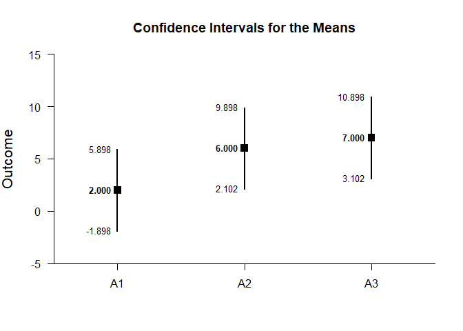<!-- -->

```r
with(FactorialDataB2,plotMeans(Outcome~FactorA))
```

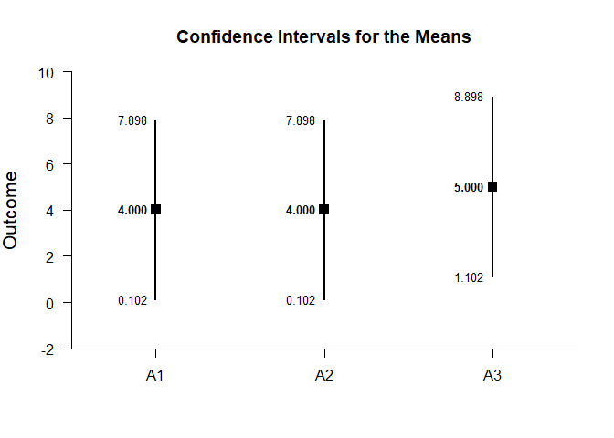<!-- -->

Of course, it is possible to change from the default confidence level. Additionally, it is possible to add a comparison line to represent a population (or test) value and to add a region of practical equivalence.

```r
with(FactorialDataB1,plotMeans(Outcome~FactorA,conf.level=.99,mu=5,rope=c(3,7)))
```

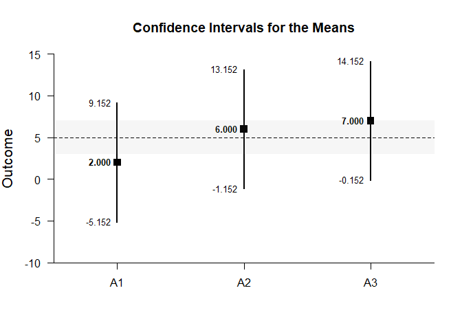<!-- -->

```r
with(FactorialDataB2,plotMeans(Outcome~FactorA,conf.level=.99,mu=5,rope=c(3,7)))
```

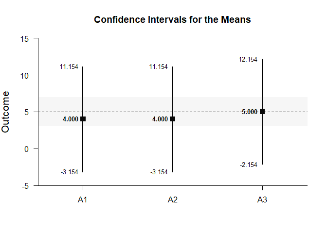<!-- -->

#### Significance Tests for the Means

This code will produce a table of NHST separately for each level of the factor. In this case, all the means are tested against a value of zero.

```r
with(FactorialDataB1,testMeans(Outcome~FactorA))
```

```
## $`Hypothesis Tests for the Means`
##       Diff      SE      df       t       p
## A1   2.000   1.225   3.000   1.633   0.201
## A2   6.000   1.225   3.000   4.899   0.016
## A3   7.000   1.225   3.000   5.715   0.011
```

```r
with(FactorialDataB2,testMeans(Outcome~FactorA))
```

```
## $`Hypothesis Tests for the Means`
##       Diff      SE      df       t       p
## A1   4.000   1.225   3.000   3.266   0.047
## A2   4.000   1.225   3.000   3.266   0.047
## A3   5.000   1.225   3.000   4.082   0.027
```

Often, the default test value of zero is not meaningful or plausible. This too can be altered (often in conjunction with what is presented in the plot).

```r
with(FactorialDataB1,testMeans(Outcome~FactorA,mu=5))
```

```
## $`Hypothesis Tests for the Means`
##       Diff      SE      df       t       p
## A1  -3.000   1.225   3.000  -2.449   0.092
## A2   1.000   1.225   3.000   0.816   0.474
## A3   2.000   1.225   3.000   1.633   0.201
```

```r
with(FactorialDataB2,testMeans(Outcome~FactorA,mu=5))
```

```
## $`Hypothesis Tests for the Means`
##       Diff      SE      df       t       p
## A1  -1.000   1.225   3.000  -0.816   0.474
## A2  -1.000   1.225   3.000  -0.816   0.474
## A3   0.000   1.225   3.000   0.000   1.000
```

#### Effect Size for the Means

This code will produce a table of standardized mean differences separately for each level of the factor. In this case, the mean is compared to zero to form the effect size.

```r
with(FactorialDataB1,standardizeMeans(Outcome~FactorA))
```

```
## $`Confidence Intervals for the Standardized Means`
##          d      SE      LL      UL
## A1   0.816   0.616  -0.387   1.934
## A2   2.449   0.955   0.325   4.531
## A3   2.858   1.063   0.464   5.226
```

```r
with(FactorialDataB2,standardizeMeans(Outcome~FactorA))
```

```
## $`Confidence Intervals for the Standardized Means`
##          d      SE      LL      UL
## A1   1.633   0.761   0.013   3.177
## A2   1.633   0.761   0.013   3.177
## A3   2.041   0.854   0.176   3.846
```

Here too it is possible to alter the width of the confidence intervals and to establish a more plausible comparison value for the effect size.

```r
with(FactorialDataB1,standardizeMeans(Outcome~FactorA,mu=5,conf.level=.99))
```

```
## $`Confidence Intervals for the Standardized Means`
##          d      SE      LL      UL
## A1  -1.225   0.680  -3.010   0.547
## A2   0.408   0.574  -0.969   1.734
## A3   0.816   0.616  -0.732   2.319
```

```r
with(FactorialDataB1,standardizeMeans(Outcome~FactorA,mu=5,conf.level=.99))
```

```
## $`Confidence Intervals for the Standardized Means`
##          d      SE      LL      UL
## A1  -1.225   0.680  -3.010   0.547
## A2   0.408   0.574  -0.969   1.734
## A3   0.816   0.616  -0.732   2.319
```

### Analyses of a Comparison

This section produces analyses that are equivalent to comparisons of two levels of a factor.

This code creates a new factor that identifies the two levels for comparison.

```r
CompDataB1 <- with(FactorialDataB1,factor(FactorA,c("A1","A2")))
CompDataB2 <- with(FactorialDataB2,factor(FactorA,c("A1","A2")))
```

#### Confidence Interval for a Mean Difference

This code estimates the confidence interval of the difference.

```r
with(FactorialDataB1,estimateMeans(Outcome~CompDataB1))
```

```
## $`Confidence Intervals for the Means`
##          M      SE      df      LL      UL
## A1   2.000   1.225   3.000  -1.898   5.898
## A2   6.000   1.225   3.000   2.102   9.898
```

```r
with(FactorialDataB2,estimateMeans(Outcome~CompDataB2))
```

```
## $`Confidence Intervals for the Means`
##          M      SE      df      LL      UL
## A1   4.000   1.225   3.000   0.102   7.898
## A2   4.000   1.225   3.000   0.102   7.898
```

Of course, you can change the confidence level from the default 95% if desired.

```r
with(FactorialDataB1,estimateDifference(Outcome~CompDataB1,conf.level=.99))
```

```
## $`Confidence Interval for the Difference`
##               Diff      SE      df      LL      UL
## Comparison   4.000   1.732   6.000  -2.421  10.421
```

```r
with(FactorialDataB2,estimateDifference(Outcome~CompDataB2,conf.level=.99))
```

```
## $`Confidence Interval for the Difference`
##               Diff      SE      df      LL      UL
## Comparison   0.000   1.732   6.000  -6.421   6.421
```

#### Plot of the Confidence Interval for the Mean Difference

This code obtains and plots the confidence intervals for the groups and the mean difference in the identified comparison.

```r
with(FactorialDataB1,plotDifference(Outcome~CompDataB1))
```

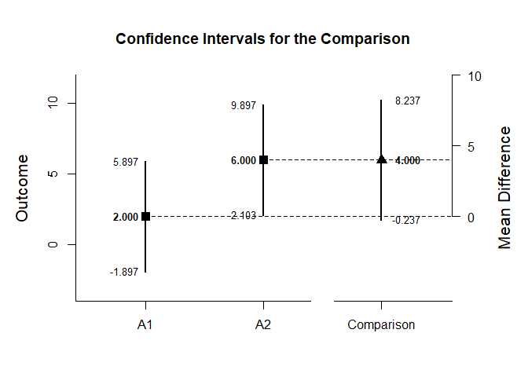<!-- -->

```r
with(FactorialDataB2,plotDifference(Outcome~CompDataB2))
```

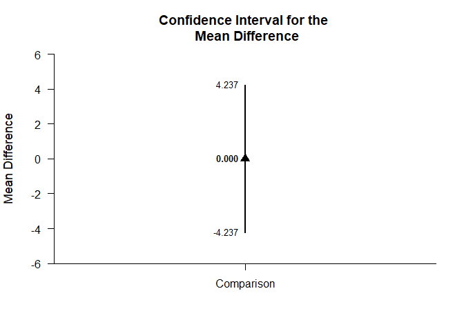<!-- -->

Once again, the confidence levels can be changed away from the default and a region of practical equivalence can be added.

```r
with(FactorialDataB1,plotDifference(Outcome~CompDataB1,conf.level=.99,rope=c(-2,2)))
```

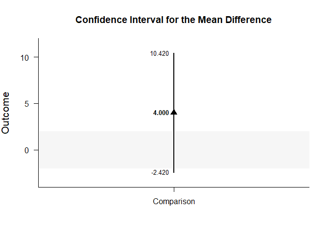<!-- -->

```r
with(FactorialDataB2,plotDifference(Outcome~CompDataB2,conf.level=.99,rope=c(-2,2)))
```

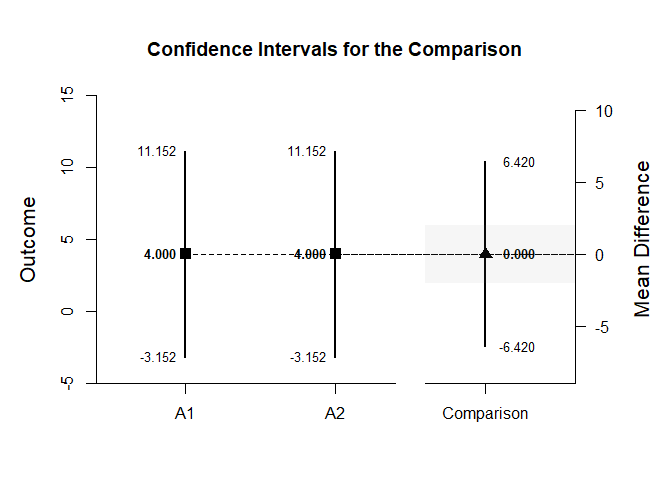<!-- -->

#### Significance Test for the Mean Difference

This code produces NHST for the identified comparison (using a default test value of zero).

```r
with(FactorialDataB1,testDifference(Outcome~CompDataB1))
```

```
## $`Hypothesis Test for the Difference`
##               Diff      SE      df       t       p
## Comparison   4.000   1.732   6.000   2.309   0.060
```

```r
with(FactorialDataB2,testDifference(Outcome~CompDataB2))
```

```
## $`Hypothesis Test for the Difference`
##               Diff      SE      df       t       p
## Comparison   0.000   1.732   6.000   0.000   1.000
```

If the default value of zero is not plausible, it too can be changed.

```r
with(FactorialDataB1,testDifference(Outcome~CompDataB1,mu=-2))
```

```
## $`Hypothesis Test for the Difference`
##               Diff      SE      df       t       p
## Comparison   6.000   1.732   6.000   3.464   0.013
```

```r
with(FactorialDataB2,testDifference(Outcome~CompDataB2,mu=-2))
```

```
## $`Hypothesis Test for the Difference`
##               Diff      SE      df       t       p
## Comparison   2.000   1.732   6.000   1.155   0.292
```

#### Effect Size for the Mean Difference

This code calculates a standardized mean difference for the comparison and its confidence interval.

```r
with(FactorialDataB1,standardizeDifference(Outcome~CompDataB1))
```

```
## $`Confidence Interval for the Standardized Difference`
##                Est      SE      LL      UL
## Comparison   1.633   0.943  -0.215   3.481
```

```r
with(FactorialDataB2,standardizeDifference(Outcome~CompDataB2))
```

```
## $`Confidence Interval for the Standardized Difference`
##                Est      SE      LL      UL
## Comparison   0.000   0.816  -1.600   1.600
```

The width of the confidence interval for the effect size can be altered if desired.

```r
with(FactorialDataB1,standardizeDifference(Outcome~CompDataB1,conf.level=.99))
```

```
## $`Confidence Interval for the Standardized Difference`
##                Est      SE      LL      UL
## Comparison   1.633   0.943  -0.796   4.062
```

```r
with(FactorialDataB2,standardizeDifference(Outcome~CompDataB2,conf.level=.99))
```

```
## $`Confidence Interval for the Standardized Difference`
##                Est      SE      LL      UL
## Comparison   0.000   0.816  -2.103   2.103
```

### Analyses of a Contrast

This section produces analyses that are equivalent to analyses involving multiple levels of a factor.

This code identifies a contrast among the groups.

```r
A1vsOthers <- c(-1,.5,.5)
```

#### Confidence Interval for a Contrast

This code produces a confidence interval for that contrast.

```r
with(FactorialDataB1,estimateContrast(Outcome~FactorA,contrast=A1vsOthers))
```

```
## $`Confidence Interval for the Contrast`
##              Est      SE      df      LL      UL
## Contrast   4.500   1.500   6.000   0.830   8.170
```

```r
with(FactorialDataB2,estimateContrast(Outcome~FactorA,contrast=A1vsOthers))
```

```
## $`Confidence Interval for the Contrast`
##              Est      SE      df      LL      UL
## Contrast   0.500   1.500   6.000  -3.170   4.170
```

As in all other cases, the default value of the confidence interval can be changed.

```r
with(FactorialDataB1,estimateContrast(Outcome~FactorA,contrast=A1vsOthers,conf.level=.99))
```

```
## $`Confidence Interval for the Contrast`
##              Est      SE      df      LL      UL
## Contrast   4.500   1.500   6.000  -1.061  10.061
```

```r
with(FactorialDataB2,estimateContrast(Outcome~FactorA,contrast=A1vsOthers,conf.level=.99))
```

```
## $`Confidence Interval for the Contrast`
##              Est      SE      df      LL      UL
## Contrast   0.500   1.500   6.000  -5.061   6.061
```

#### Plots of Confidence Intervals for a Contrast

This code obtains and plots the confidence intervals for the groups and the mean difference in the identified contrast.

```r
with(FactorialDataB1,plotContrast(Outcome~FactorA,contrast=A1vsOthers))
```

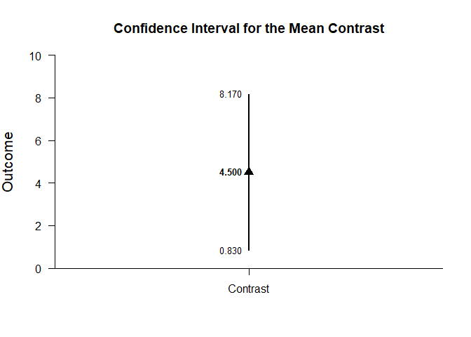<!-- -->

```r
with(FactorialDataB2,plotContrast(Outcome~FactorA,contrast=A1vsOthers))
```

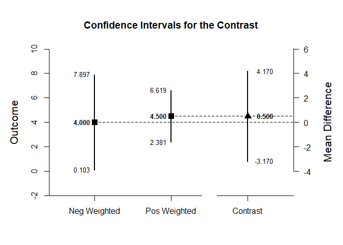<!-- -->

The width of the confidence interval for the contrast can be altered and a region of practical equivalence can be added.

```r
with(FactorialDataB1,plotContrast(Outcome~FactorA,contrast=A1vsOthers,labels=c("A1","Others"),conf.level=.99,rope=c(-2,2)))
```

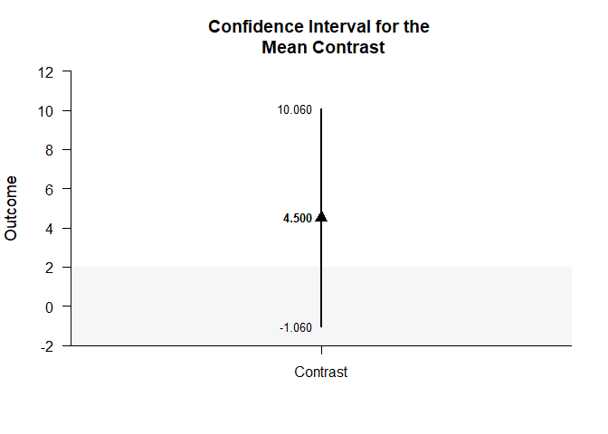<!-- -->

```r
with(FactorialDataB2,plotContrast(Outcome~FactorA,contrast=A1vsOthers,labels=c("A1","Others"),conf.level=.99,rope=c(-2,2)))
```

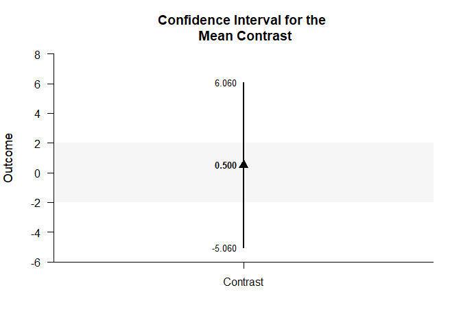<!-- -->

#### Significance Test for a Contrast

This code produces a NHST for the identified contrast. It tests the contrast against a value of zero by default.

```r
with(FactorialDataB1,testContrast(Outcome~FactorA,contrast=A1vsOthers))
```

```
## $`Hypothesis Test for the Contrast`
##              Est      SE      df       t       p
## Contrast   4.500   1.500   6.000   3.000   0.024
```

```r
with(FactorialDataB2,testContrast(Outcome~FactorA,contrast=A1vsOthers))
```

```
## $`Hypothesis Test for the Contrast`
##              Est      SE      df       t       p
## Contrast   0.500   1.500   6.000   0.333   0.750
```

If desired, the contrast can be tested against other values.

```r
with(FactorialDataB1,testContrast(Outcome~FactorA,contrast=A1vsOthers,mu=4))
```

```
## $`Hypothesis Test for the Contrast`
##              Est      SE      df       t       p
## Contrast   0.500   1.500   6.000   0.333   0.750
```

```r
with(FactorialDataB2,testContrast(Outcome~FactorA,contrast=A1vsOthers,mu=4))
```

```
## $`Hypothesis Test for the Contrast`
##              Est      SE      df       t       p
## Contrast  -3.500   1.500   6.000  -2.333   0.058
```

#### Effect Size for a Contrast

This code calculates a standardized contrast and its confidence interval.

```r
with(FactorialDataB1,standardizeContrast(Outcome~FactorA,contrast=A1vsOthers))
```

```
## $`Confidence Interval for the Standardized Contrast`
##              Est      SE      LL      UL
## Contrast   1.837   0.829   0.212   3.462
```

```r
with(FactorialDataB2,standardizeContrast(Outcome~FactorA,contrast=A1vsOthers))
```

```
## $`Confidence Interval for the Standardized Contrast`
##              Est      SE      LL      UL
## Contrast   0.204   0.709  -1.185   1.593
```

The width of the confidence interval for the effect size can be altered if desired.

```r
with(FactorialDataB1,standardizeContrast(Outcome~FactorA,contrast=A1vsOthers,conf.level=.99))
```

```
## $`Confidence Interval for the Standardized Contrast`
##              Est      SE      LL      UL
## Contrast   1.837   0.829  -0.299   3.973
```

```r
with(FactorialDataB2,standardizeContrast(Outcome~FactorA,contrast=A1vsOthers,conf.level=.99))
```

```
## $`Confidence Interval for the Standardized Contrast`
##              Est      SE      LL      UL
## Contrast   0.204   0.709  -1.621   2.030
```

### Analyses of the Pairwise Comparisons

This section provides analyses of all possible pairwise comparisons among the levels of the factor.

#### Confidence Intervals for the Pairwise Comparisons

This code will provide a table of descriptive statistics and confidence intervals for each pairwise comparison.


```r
with(FactorialDataB1,estimatePairwise(Outcome~FactorA))
```

```
## $`Confidence Intervals for the Pairwise Comparisons`
##            Diff      SE      df      LL      UL
## A1 v A2   4.000   1.732   6.000  -0.238   8.238
## A1 v A3   5.000   1.732   6.000   0.762   9.238
## A2 v A3   1.000   1.732   6.000  -3.238   5.238
```

```r
with(FactorialDataB2,estimatePairwise(Outcome~FactorA))
```

```
## $`Confidence Intervals for the Pairwise Comparisons`
##            Diff      SE      df      LL      UL
## A1 v A2   0.000   1.732   6.000  -4.238   4.238
## A1 v A3   1.000   1.732   6.000  -3.238   5.238
## A2 v A3   1.000   1.732   6.000  -3.238   5.238
```

The code defaults to 95% confidence intervals. This can be changed if desired.


```r
with(FactorialDataB1,estimatePairwise(Outcome~FactorA,conf.level=.99))
```

```
## $`Confidence Intervals for the Pairwise Comparisons`
##            Diff      SE      df      LL      UL
## A1 v A2   4.000   1.732   6.000  -2.421  10.421
## A1 v A3   5.000   1.732   6.000  -1.421  11.421
## A2 v A3   1.000   1.732   6.000  -5.421   7.421
```

```r
with(FactorialDataB2,estimatePairwise(Outcome~FactorA,conf.level=.99))
```

```
## $`Confidence Intervals for the Pairwise Comparisons`
##            Diff      SE      df      LL      UL
## A1 v A2   0.000   1.732   6.000  -6.421   6.421
## A1 v A3   1.000   1.732   6.000  -5.421   7.421
## A2 v A3   1.000   1.732   6.000  -5.421   7.421
```

#### Plots of the Confidence Intervals for the Pairwise Comparisons

This code will produce a graph of the confidence intervals for each of the pairwise comparisons.


```r
with(FactorialDataB1,plotPairwise(Outcome~FactorA))
```

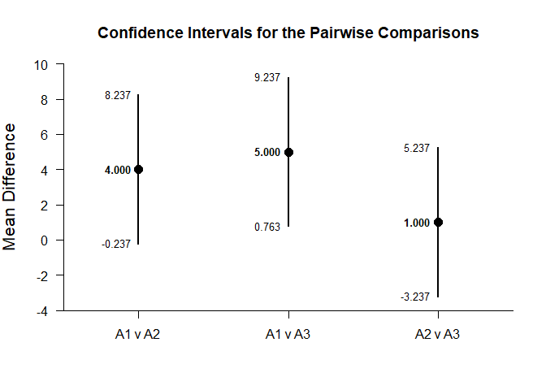<!-- -->

```r
with(FactorialDataB2,plotPairwise(Outcome~FactorA))
```

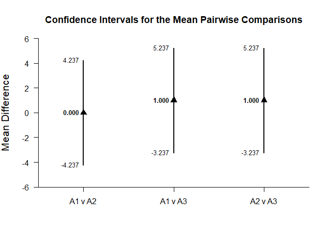<!-- -->

Of course, it is possible to change from the default confidence level. Additionally, it is possible to add a comparison line to represent a population (or test) value and a region of practical equivalence.


```r
with(FactorialDataB1,plotPairwise(Outcome~FactorA,mu=-2,conf.level=.99,rope=c(-4,0)))
```

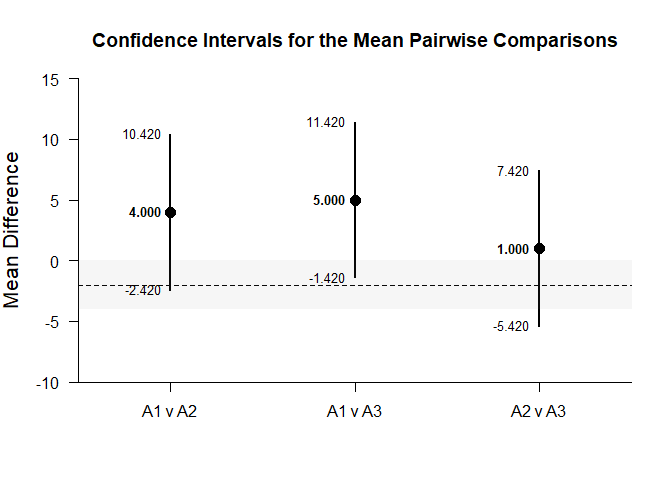<!-- -->

```r
with(FactorialDataB2,plotPairwise(Outcome~FactorA,mu=-2,conf.level=.99,rope=c(-4,0)))
```

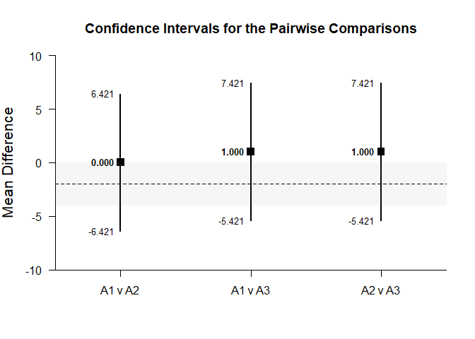<!-- -->

#### Significance Tests of the Pairwise Comparisons

This code will produce a table of NHST for each of the pairwise comparisons. In this case, all the comparisons are tested against a value of zero.


```r
with(FactorialDataB1,testPairwise(Outcome~FactorA))
```

```
## $`Hypothesis Tests for the Pairwise Comparisons`
##            Diff      SE      df       t       p
## A1 v A2   4.000   1.732   6.000   2.309   0.060
## A1 v A3   5.000   1.732   6.000   2.887   0.028
## A2 v A3   1.000   1.732   6.000   0.577   0.585
```

```r
with(FactorialDataB2,testPairwise(Outcome~FactorA))
```

```
## $`Hypothesis Tests for the Pairwise Comparisons`
##            Diff      SE      df       t       p
## A1 v A2   0.000   1.732   6.000   0.000   1.000
## A1 v A3   1.000   1.732   6.000   0.577   0.585
## A2 v A3   1.000   1.732   6.000   0.577   0.585
```

Often, the default test value of zero is not meaningful or plausible. This too can be altered (often in conjunction with what is presented in the plot).


```r
with(FactorialDataB1,testPairwise(Outcome~FactorA,mu=-2))
```

```
## $`Hypothesis Tests for the Pairwise Comparisons`
##            Diff      SE      df       t       p
## A1 v A2   6.000   1.732   6.000   3.464   0.013
## A1 v A3   7.000   1.732   6.000   4.041   0.007
## A2 v A3   3.000   1.732   6.000   1.732   0.134
```

```r
with(FactorialDataB2,testPairwise(Outcome~FactorA,mu=-2))
```

```
## $`Hypothesis Tests for the Pairwise Comparisons`
##            Diff      SE      df       t       p
## A1 v A2   2.000   1.732   6.000   1.155   0.292
## A1 v A3   3.000   1.732   6.000   1.732   0.134
## A2 v A3   3.000   1.732   6.000   1.732   0.134
```

#### Effect Sizes for the Pairwise Comparisons

This code will produce a table of standardized mean differences for each pairwise comparison. 


```r
with(FactorialDataB1,standardizePairwise(Outcome~FactorA))
```

```
## $`Confidence Intervals for the Standardized Pairwise Comparisons`
##             Est      SE      LL      UL
## A1 v A2   1.633   0.943  -0.215   3.481
## A1 v A3   2.041   1.007   0.068   4.015
## A2 v A3   0.408   0.825  -1.209   2.025
```

```r
with(FactorialDataB2,standardizePairwise(Outcome~FactorA))
```

```
## $`Confidence Intervals for the Standardized Pairwise Comparisons`
##             Est      SE      LL      UL
## A1 v A2   0.000   0.816  -1.600   1.600
## A1 v A3   0.408   0.825  -1.209   2.025
## A2 v A3   0.408   0.825  -1.209   2.025
```

Here too it is possible to alter the width of the confidence intervals.


```r
with(FactorialDataB1,standardizePairwise(Outcome~FactorA,conf.level=.99))
```

```
## $`Confidence Intervals for the Standardized Pairwise Comparisons`
##             Est      SE      LL      UL
## A1 v A2   1.633   0.943  -0.796   4.062
## A1 v A3   2.041   1.007  -0.552   4.635
## A2 v A3   0.408   0.825  -1.717   2.533
```

```r
with(FactorialDataB2,standardizePairwise(Outcome~FactorA,conf.level=.99))
```

```
## $`Confidence Intervals for the Standardized Pairwise Comparisons`
##             Est      SE      LL      UL
## A1 v A2   0.000   0.816  -2.103   2.103
## A1 v A3   0.408   0.825  -1.717   2.533
## A2 v A3   0.408   0.825  -1.717   2.533
```
