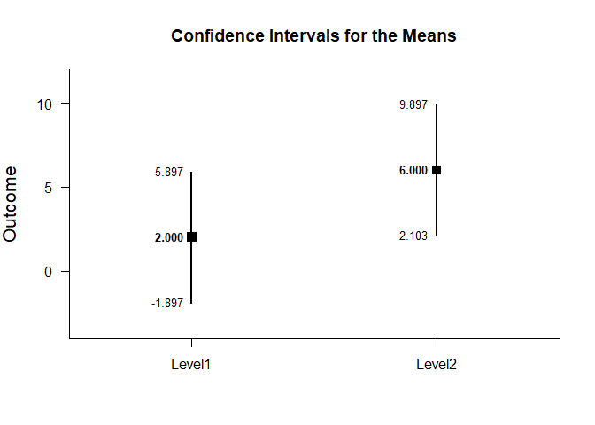
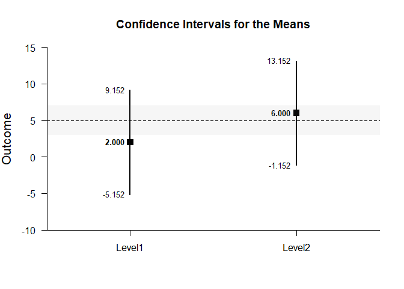
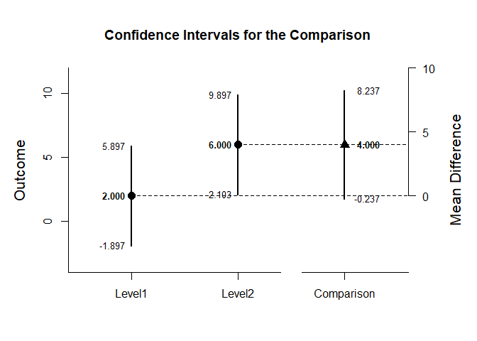
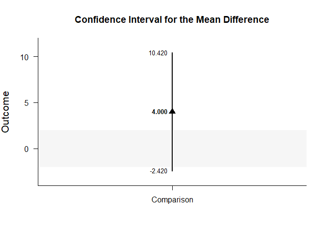
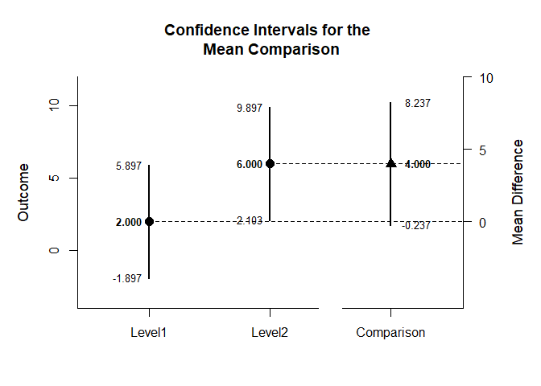
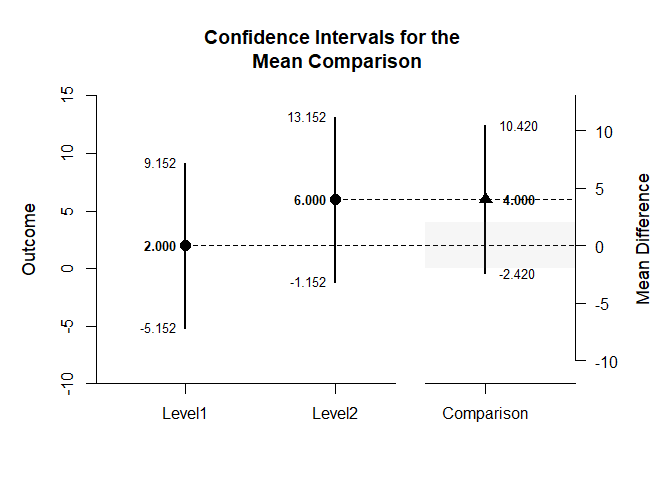

## Independent Groups Tutorial with Summary Statistics

### Data Management

This code inputs the group summaries and creates a single summary table.

```r
Level1 <- c(N=4,M=2.000,SD=2.449)
Level2 <- c(N=4,M=6.000,SD=2.449)
IndependentSummary <- rbind(Level1,Level2)
class(IndependentSummary) <- "bss"
IndependentSummary
```

```
##        N M    SD
## Level1 4 2 2.449
## Level2 4 6 2.449
## attr(,"class")
## [1] "bss"
```

### Analyses of the Means

This section produces analyses that are equivalent to one-sample analyses separately for each level of a factor.

#### Confidence Intervals

This code will provide a table of confidence intervals for each level of the factor.

```r
estimateMeans(IndependentSummary)
```

```
## $`Confidence Intervals for the Means`
##              M      SE      df      LL      UL
## Level1   2.000   1.224   3.000  -1.897   5.897
## Level2   6.000   1.224   3.000   2.103   9.897
```

This code will produce a graph of the confidence intervals for each level of the factor.

```r
plotMeans(IndependentSummary)
```

<!-- -->

The code defaults to 95% confidence intervals. This can be changed if desired.

```r
estimateMeans(IndependentSummary,conf.level=.99)
```

```
## $`Confidence Intervals for the Means`
##              M      SE      df      LL      UL
## Level1   2.000   1.224   3.000  -5.152   9.152
## Level2   6.000   1.224   3.000  -1.152  13.152
```

For the graph, it is possible to add a comparison line to represent a population (or test) value and a region of practical equivalence in addition to changing the confidence level.

```r
plotMeans(IndependentSummary,conf.level=.99,mu=5,rope=c(3,7))
```

<!-- -->

#### Significance Tests

This code will produce a table of NHST separately for each level of the factor. In this case, all the means are tested against a value of zero.

```r
testMeans(IndependentSummary)
```

```
## $`Hypothesis Tests for the Means`
##           Diff      SE      df       t       p
## Level1   2.000   1.224   3.000   1.633   0.201
## Level2   6.000   1.224   3.000   4.900   0.016
```

Often, the default test value of zero is not meaningful or plausible. This too can be altered (often in conjunction with what is presented in the plot).

```r
testMeans(IndependentSummary,mu=5)
```

```
## $`Hypothesis Tests for the Means`
##           Diff      SE      df       t       p
## Level1  -3.000   1.224   3.000  -2.450   0.092
## Level2   1.000   1.224   3.000   0.817   0.474
```

#### Standardized Effect Sizes

This code will produce a table of standardized mean differences separately for each level of the factor. In this case, the mean is compared to zero to form the effect size.

```r
estimateStandardizedMeans(IndependentSummary)
```

```
## $`Confidence Intervals for the Standardized Means`
##              d      SE      LL      UL
## Level1   0.817   0.616  -0.387   1.934
## Level2   2.450   0.955   0.325   4.532
```

Here too it is possible to alter the width of the confidence intervals and to establish a more plausible comparison value for the mean.

```r
estimateStandardizedMeans(IndependentSummary,mu=5,conf.level=.99)
```

```
## $`Confidence Intervals for the Standardized Means`
##              d      SE      LL      UL
## Level1  -1.225   0.680  -3.011   0.547
## Level2   0.408   0.574  -0.968   1.734
```
 
### Analyses of the Comparison

This section produces analyses that examine the difference among the two levels of the factor.

#### Confidence Intervals

This code estimates the confidence interval of the difference.

```r
estimateMeanDifference(IndependentSummary)
```

```
## $`Confidence Interval for the Mean Difference`
##               Diff      SE      df      LL      UL
## Comparison   4.000   1.732   6.000  -0.237   8.237
```

This code obtains and plots the confidence intervals for the groups and the mean difference .

```r
plotMeanDifference(IndependentSummary)
```

<!-- -->

Of course, you can change the confidence level from the default 95% if desired.

```r
estimateMeanDifference(IndependentSummary,conf.level=.99)
```

```
## $`Confidence Interval for the Mean Difference`
##               Diff      SE      df      LL      UL
## Comparison   4.000   1.732   6.000  -2.420  10.420
```

Once again, the confidence levels can be changed away from the default and a region of practical equivalence can be added to the graph.

```r
plotMeanDifference(IndependentSummary,conf.level=.99,rope=c(-2,2))
```

<!-- -->

If you wish, you can get the confidence intervals for the means and the mean difference in one command.


```r
estimateMeanComparison(IndependentSummary)
```

```
## $`Confidence Intervals for the Means`
##              M      SE      df      LL      UL
## Level1   2.000   1.224   3.000  -1.897   5.897
## Level2   6.000   1.224   3.000   2.103   9.897
## 
## $`Confidence Interval for the Mean Difference`
##               Diff      SE      df      LL      UL
## Comparison   4.000   1.732   6.000  -0.237   8.237
```

This code produces a difference plot using the confidence intervals for the means and the mean difference.


```r
plotMeanComparison(IndependentSummary)
```

<!-- -->

Of course, you can change the confidence level from the default 95% if desired.

```r
estimateMeanComparison(IndependentSummary,conf.level=.99)
```

```
## $`Confidence Intervals for the Means`
##              M      SE      df      LL      UL
## Level1   2.000   1.224   3.000  -5.152   9.152
## Level2   6.000   1.224   3.000  -1.152  13.152
## 
## $`Confidence Interval for the Mean Difference`
##               Diff      SE      df      LL      UL
## Comparison   4.000   1.732   6.000  -2.420  10.420
```

Once again, the confidence levels can be changed away from the default and a region of practical equivalence can be added to the graph.

```r
plotMeanComparison(IndependentSummary,conf.level=.99,rope=c(-2,2))
```

<!-- -->

#### Significance Test

This code produces NHST for the mean difference (using a default test value of zero).

```r
testMeanDifference(IndependentSummary)
```

```
## $`Hypothesis Test for the Mean Difference`
##               Diff      SE      df       t       p
## Comparison   4.000   1.732   6.000   2.310   0.060
```

If the default value of zero is not plausible, it too can be changed.

```r
testMeanDifference(IndependentSummary,mu=2)
```

```
## $`Hypothesis Test for the Mean Difference`
##               Diff      SE      df       t       p
## Comparison   2.000   1.732   6.000   1.155   0.292
```

#### Standardized Effect Size

This code calculates a standardized mean difference and its confidence interval.

```r
estimateStandardizedMeanDifference(IndependentSummary)
```

```
## $`Confidence Interval for the Standardized Mean Difference`
##                  d      SE      LL      UL
## Comparison   1.633   0.943  -0.215   3.481
```

The width of the confidence interval for the effect size can be altered if desired.

```r
estimateStandardizedMeanDifference(IndependentSummary,conf.level=.99)
```

```
## $`Confidence Interval for the Standardized Mean Difference`
##                  d      SE      LL      UL
## Comparison   1.633   0.943  -0.795   4.062
```
