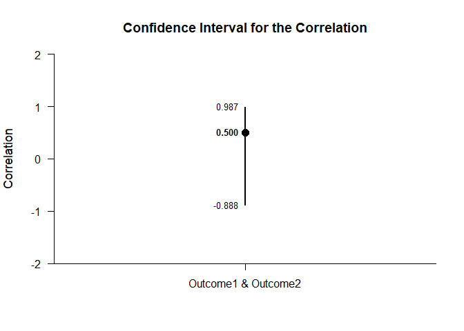
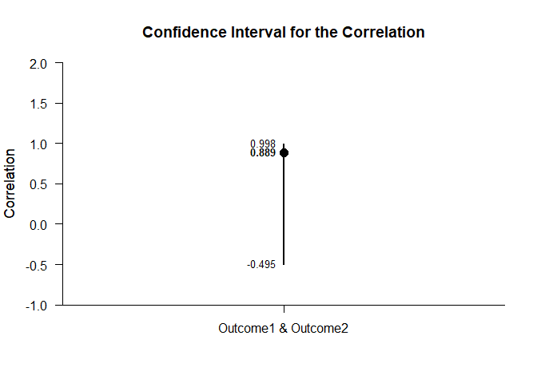
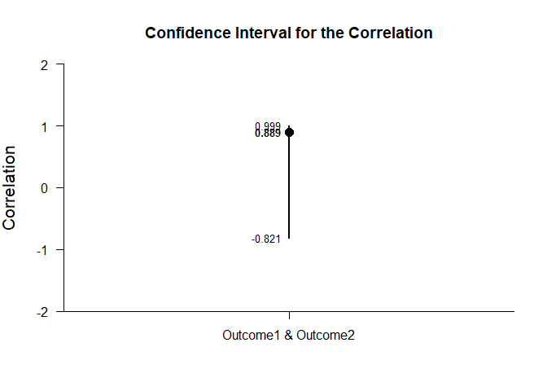
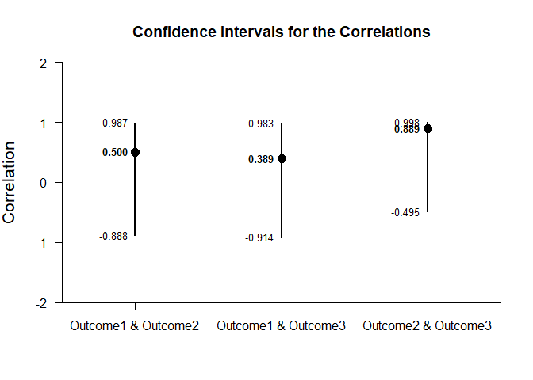
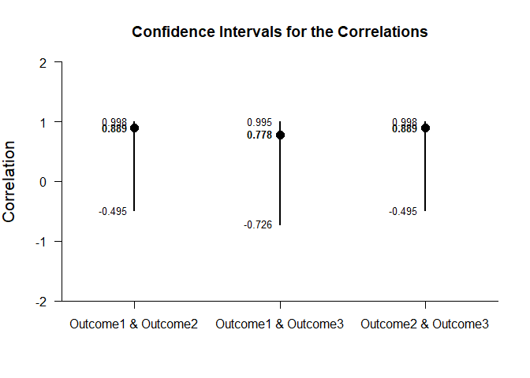
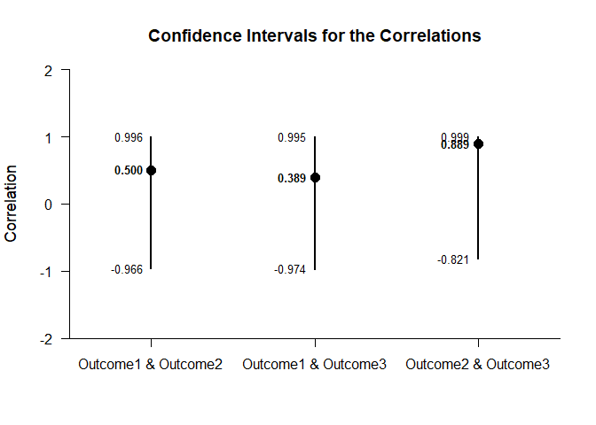
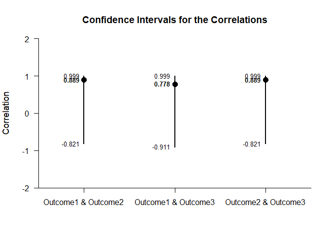
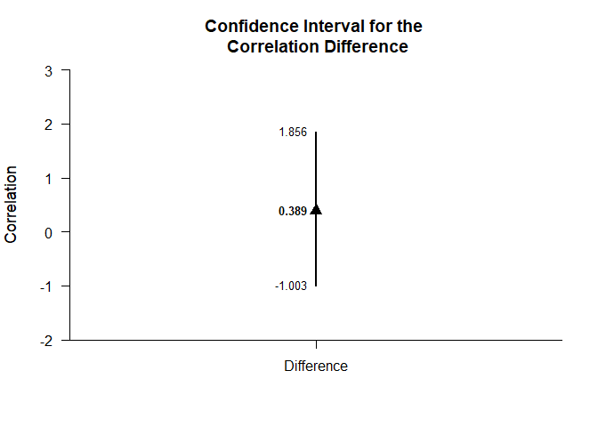
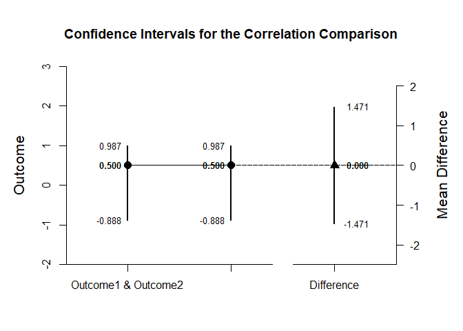
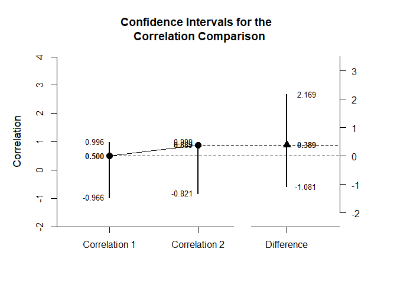

## Mixed Design Correlations Tutorial with Summary Statistics

### Data Management

This code inputs the variable summaries and creates a summary table.

```r
Outcome1 <- c(N=4,M=2.000,SD=2.449)
Outcome2 <- c(N=4,M=6.000,SD=2.449)
Outcome3 <- c(N=4,M=7.000,SD=2.449)
MixedSummaryL1 <- rbind(Outcome1,Outcome2,Outcome3)
class(MixedSummaryL1) <- "wss"
```

This code creates a correlation matrix, enters just the top triangle, and then uses a function to fill in the whole matrix.

```r
MixedCorrL1 <- declareCorrelations("Outcome1","Outcome2","Outcome3")
MixedCorrL1["Outcome1",] <- c(1.000,.500,.389)
MixedCorrL1["Outcome2",] <- c(.500,1.000,.889)
MixedCorrL1["Outcome3",] <- c(.389,.889,1.000)
```

And repeat the process to create the second subset.

```r
Outcome1 <- c(N=4,M=2.000,SD=2.449)
Outcome2 <- c(N=4,M=6.000,SD=2.449)
Outcome3 <- c(N=4,M=7.000,SD=2.449)
MixedSummaryL2 <- rbind(Outcome1,Outcome2,Outcome3)
class(MixedSummaryL2) <- "wss"
```

And for the correlation matrix of the second subset.

```r
MixedCorrL2 <- declareCorrelations("Outcome1","Outcome2","Outcome3")
MixedCorrL2["Outcome1",] <- c(1.000,.889,.778)
MixedCorrL2["Outcome2",] <- c(.889,1.000,.889)
MixedCorrL2["Outcome3",] <- c(.778,.889,1.000)
```

### Analyses of a Correlation

This section produces analyses of a single correlation in each of the subsets.

This code creates a new table that identifies the two levels for comparison and repeats for the second subset.

```r
CompSummaryL1 <- MixedSummaryL1[c("Outcome1","Outcome2"),]
class(CompSummaryL1) <- "wss"
CompSummaryL2 <- MixedSummaryL2[c("Outcome1","Outcome2"),]
class(CompSummaryL2) <- "wss"
```

This creates a separate correlation matrix for each of the two subsets of data.

```r
CompCorrL1 <- MixedCorrL1[c("Outcome1","Outcome2"),c("Outcome1","Outcome2")]
CompCorrL2 <- MixedCorrL2[c("Outcome1","Outcome2"),c("Outcome1","Outcome2")]
```

#### Confidence Intervals

This code will provide the confidence interval for the correlation.

```r
estimateCorrelations(CompSummaryL1,CompCorrL1)
```

```
## $`Confidence Interval for the Correlation`
##                           R      SE      LL      UL
## Outcome1 & Outcome2   0.500   1.000  -0.888   0.987
```

```r
estimateCorrelations(CompSummaryL2,CompCorrL2)
```

```
## $`Confidence Interval for the Correlation`
##                           R      SE      LL      UL
## Outcome1 & Outcome2   0.889   1.000  -0.495   0.998
```

This code will produce a graph of the confidence interval for the correlation.

```r
plotCorrelations(CompSummaryL1,CompCorrL1)
```

<!-- -->

```r
plotCorrelations(CompSummaryL2,CompCorrL2)
```

<!-- -->

The code defaults to 95% confidence intervals. This can be changed if desired.

```r
estimateCorrelations(CompSummaryL1,CompCorrL1,conf.level=.99)
```

```
## $`Confidence Interval for the Correlation`
##                           R      SE      LL      UL
## Outcome1 & Outcome2   0.500   1.000  -0.966   0.996
```

```r
estimateCorrelations(CompSummaryL2,CompCorrL2,conf.level=.99)
```

```
## $`Confidence Interval for the Correlation`
##                           R      SE      LL      UL
## Outcome1 & Outcome2   0.889   1.000  -0.821   0.999
```

Of course, it is possible to change from the default confidence level in the graph.

```r
plotCorrelations(CompSummaryL1,CompCorrL1,conf.level=.99)
```

<!-- -->

```r
plotCorrelations(CompSummaryL2,CompCorrL2,conf.level=.99)
```

<!-- -->

#### Significance Tests

This code will produce a table of NHST for the correlation (against a value of zero).

```r
testCorrelations(CompSummaryL1,CompCorrL1)
```

```
## $`Hypothesis for the Correlation`
##                           R      SE      df       t       p
## Outcome1 & Outcome2   0.500   0.612   2.000   0.816   0.500
```

```r
testCorrelations(CompSummaryL2,CompCorrL2)
```

```
## $`Hypothesis for the Correlation`
##                           R      SE      df       t       p
## Outcome1 & Outcome2   0.889   0.324   2.000   2.746   0.111
```

### Analyses of Several Correlations

This section analyzes the correlations among multiple variables in each of the subsets.

#### Confidence Intervals

This code will provide the confidence intervals for the correlations.

```r
estimateCorrelations(MixedSummaryL1,MixedCorrL1)
```

```
## $`Confidence Intervals for the Correlations`
##                           R      SE      LL      UL
## Outcome1 & Outcome2   0.500   1.000  -0.888   0.987
## Outcome1 & Outcome3   0.389   1.000  -0.914   0.983
## Outcome2 & Outcome3   0.889   1.000  -0.495   0.998
```

```r
estimateCorrelations(MixedSummaryL2,MixedCorrL2)
```

```
## $`Confidence Intervals for the Correlations`
##                           R      SE      LL      UL
## Outcome1 & Outcome2   0.889   1.000  -0.495   0.998
## Outcome1 & Outcome3   0.778   1.000  -0.726   0.995
## Outcome2 & Outcome3   0.889   1.000  -0.495   0.998
```

This code will produce a graph of the confidence intervals for the correlations.

```r
plotCorrelations(MixedSummaryL1,MixedCorrL1)
```

<!-- -->

```r
plotCorrelations(MixedSummaryL2,MixedCorrL2)
```

<!-- -->

The code defaults to 95% confidence intervals. This can be changed if desired.

```r
estimateCorrelations(MixedSummaryL1,MixedCorrL1,conf.level=.99)
```

```
## $`Confidence Intervals for the Correlations`
##                           R      SE      LL      UL
## Outcome1 & Outcome2   0.500   1.000  -0.966   0.996
## Outcome1 & Outcome3   0.389   1.000  -0.974   0.995
## Outcome2 & Outcome3   0.889   1.000  -0.821   0.999
```

```r
estimateCorrelations(MixedSummaryL2,MixedCorrL2,conf.level=.99)
```

```
## $`Confidence Intervals for the Correlations`
##                           R      SE      LL      UL
## Outcome1 & Outcome2   0.889   1.000  -0.821   0.999
## Outcome1 & Outcome3   0.778   1.000  -0.911   0.999
## Outcome2 & Outcome3   0.889   1.000  -0.821   0.999
```

Of course, it is possible to change from the default confidence level in the graph.

```r
plotCorrelations(MixedSummaryL1,MixedCorrL1,conf.level=.99)
```

<!-- -->

```r
plotCorrelations(MixedSummaryL2,MixedCorrL2,conf.level=.99)
```

<!-- -->

#### Significance Tests

This code will produce a table of NHST for the correlations (against a value of zero).

```r
testCorrelations(MixedSummaryL1,MixedCorrL1)
```

```
## $`Hypothesis Tests for the Correlations`
##                           R      SE      df       t       p
## Outcome1 & Outcome2   0.500   0.612   2.000   0.816   0.500
## Outcome1 & Outcome3   0.389   0.651   2.000   0.597   0.611
## Outcome2 & Outcome3   0.889   0.324   2.000   2.746   0.111
```

```r
testCorrelations(MixedSummaryL2,MixedCorrL2)
```

```
## $`Hypothesis Tests for the Correlations`
##                           R      SE      df       t       p
## Outcome1 & Outcome2   0.889   0.324   2.000   2.746   0.111
## Outcome1 & Outcome3   0.778   0.444   2.000   1.751   0.222
## Outcome2 & Outcome3   0.889   0.324   2.000   2.746   0.111
```

### Analyses of a Correlation Difference

This section analyzes the difference in the correlations from the two subsets.

#### Confidence Intervals

First it is necessary to estimate the confidence intervals for each of the correlations.

```r
CorrEstimateL1 <- estimateCorrelations(CompSummaryL1,CompCorrL1)
CorrEstimateL2 <- estimateCorrelations(CompSummaryL2,CompCorrL2)
```

Then we can estimate the difference in the correlations and get its confidence interval.

```r
estimateCorrelationDifference(CorrEstimateL1,CorrEstimateL2)
```

```
## $`Confidence Interval for the Correlation Difference`
##               Diff      LL      UL
## Difference   0.389  -1.003   1.856
```

Of course, it is also possile to the plot this estimate.

```r
plotCorrelationDifference(CorrEstimateL1,CorrEstimateL2)
```

<!-- -->

The code defaults to 95% confidence intervals. This can be changed if desired by first re-estimating the confidence intervals for each correlation.

```r
CorrEstimateL1 <- estimateCorrelations(CompSummaryL1,CompCorrL1,conf.level=.99)
CorrEstimateL2 <- estimateCorrelations(CompSummaryL2,CompCorrL2,conf.level=.99)
```

Then we can estimate the difference in the correlations and get its confidence interval.

```r
estimateCorrelationDifference(CorrEstimateL1,CorrEstimateL2)
```

```
## $`Confidence Interval for the Correlation Difference`
##               Diff      LL      UL
## Difference   0.389  -1.081   2.169
```

Finally, we can re-plot the estimate.

```r
plotCorrelationDifference(CorrEstimateL1,CorrEstimateL2)
```

<!-- -->

If you wish, you can get the confidence intervals for the correlations and the correlation difference combined.

First it is necessary to estimate the confidence intervals for each of the correlations.

```r
CorrEstimateL1 <- estimateCorrelations(CompSummaryL1,CompCorrL1)
CorrEstimateL2 <- estimateCorrelations(CompSummaryL2,CompCorrL2)
```

Then we can estimate the correlations and the difference in the correlations.

```r
estimateCorrelationComparison(CorrEstimateL1,CorrEstimateL2)
```

```
## $`Confidence Intervals for the Correlations`
##                     R      SE      LL      UL
## Correlation 1   0.500   1.000  -0.888   0.987
## Correlation 2   0.889   1.000  -0.495   0.998
## 
## $`Confidence Interval for the Correlation Difference`
##               Diff      LL      UL
## Difference   0.389  -1.003   1.856
```

This code produces a difference plot using the confidence intervals for the correlations and the correlation difference.

```r
plotCorrelationComparison(CorrEstimateL1,CorrEstimateL2)
```

<!-- -->

The code defaults to 95% confidence intervals. This can be changed if desired by first re-estimating the confidence intervals for each correlation.

```r
CorrEstimateL1 <- estimateCorrelations(CompSummaryL1,CompCorrL1,conf.level=.99)
CorrEstimateL2 <- estimateCorrelations(CompSummaryL2,CompCorrL2,conf.level=.99)
```

Then we can estimate the correlations and the difference in the correlations.

```r
estimateCorrelationComparison(CorrEstimateL1,CorrEstimateL2)
```

```
## $`Confidence Intervals for the Correlations`
##                     R      SE      LL      UL
## Correlation 1   0.500   1.000  -0.966   0.996
## Correlation 2   0.889   1.000  -0.821   0.999
## 
## $`Confidence Interval for the Correlation Difference`
##               Diff      LL      UL
## Difference   0.389  -1.081   2.169
```

Finally, we can re-plot the comparison.

```r
plotCorrelationComparison(CorrEstimateL1,CorrEstimateL2)
```

<!-- -->
