## Mixed Design Tutorial with Data

### Data Management

#### Data Entry

This code inputs the variable names and creates a viewable data frame.

```r
Factor <- c(1,1,1,1,2,2,2,2)
Outcome1 <- c(0,0,3,5,3,1,6,6)
Outcome2 <- c(4,7,4,9,2,2,5,7)
Outcome3 <- c(4,9,6,9,2,4,7,7)
Factor <- factor(Factor,levels=c(1,2),labels=c("Level1","Level2"))
MixedData <- data.frame(Factor,Outcome1,Outcome2,Outcome3)
```

This code subsets the data into two different data frames (for simple effects analysis).

```r
MixedDataL1 <- subset(MixedData,Factor=="Level1")
MixedDataL2 <- subset(MixedData,Factor=="Level2")
```

#### Plot of the Data


```r
with(MixedDataL1,plotViolins(Outcome1,Outcome2,Outcome3,main="Summaries of the Variables"))
with(MixedDataL1,plotBoxes(Outcome1,Outcome2,Outcome3,add=TRUE))
with(MixedDataL1,plotData(Outcome1,Outcome2,Outcome3,add=TRUE,method="stack",pch=16))
```

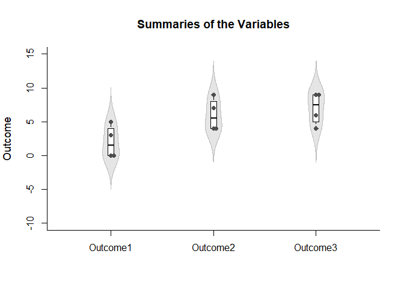<!-- -->

```r
with(MixedDataL2,plotViolins(Outcome1,Outcome2,Outcome3,main="Summaries of the Variables"))
with(MixedDataL2,plotBoxes(Outcome1,Outcome2,Outcome3,add=TRUE))
with(MixedDataL2,plotData(Outcome1,Outcome2,Outcome3,add=TRUE,method="stack",pch=16))
```

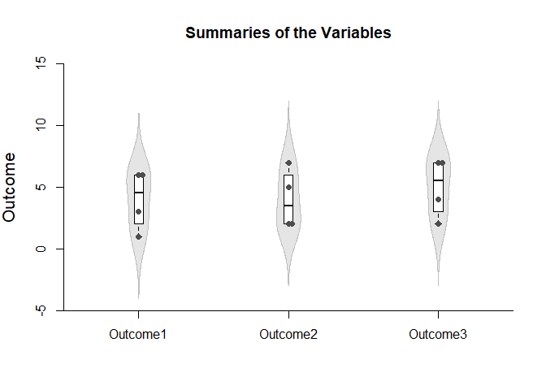<!-- -->

#### Descriptive Statistics

This code obtains the descriptive statistics for the two data frames.

```r
with(MixedDataL1,describeMeans(Outcome1,Outcome2,Outcome3))
```

```
## $`Descriptive Statistics for the Data`
##                N       M      SD
## Outcome1   4.000   2.000   2.449
## Outcome2   4.000   6.000   2.449
## Outcome3   4.000   7.000   2.449
```

```r
with(MixedDataL2,describeMeans(Outcome1,Outcome2,Outcome3))
```

```
## $`Descriptive Statistics for the Data`
##                N       M      SD
## Outcome1   4.000   4.000   2.449
## Outcome2   4.000   4.000   2.449
## Outcome3   4.000   5.000   2.449
```

### Analyses of the Means

This section produces analyses that are equivalent to one-sample analyses separately for each level of a factor.

#### Confidence Intervals

This code will provide tables of confidence intervals for each level of the factor.

```r
with(MixedDataL1,estimateMeans(Outcome1,Outcome2,Outcome3))
```

```
## $`Confidence Intervals for the Means`
##                M      SE      df      LL      UL
## Outcome1   2.000   1.224   3.000  -1.897   5.897
## Outcome2   6.000   1.224   3.000   2.103   9.897
## Outcome3   7.000   1.224   3.000   3.103  10.897
```

```r
with(MixedDataL2,estimateMeans(Outcome1,Outcome2,Outcome3))
```

```
## $`Confidence Intervals for the Means`
##                M      SE      df      LL      UL
## Outcome1   4.000   1.224   3.000   0.103   7.897
## Outcome2   4.000   1.224   3.000   0.103   7.897
## Outcome3   5.000   1.224   3.000   1.103   8.897
```

This code will produce a graph of the confidence intervals for each level of the factor.

```r
with(MixedDataL1,plotMeans(Outcome1,Outcome2,Outcome3))
```

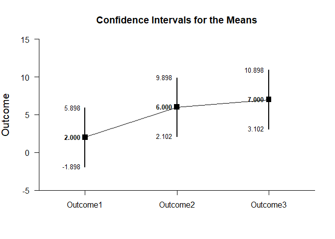<!-- -->

```r
with(MixedDataL2,plotMeans(Outcome1,Outcome2,Outcome3))
```

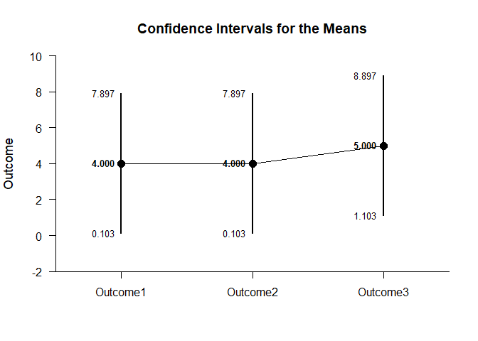<!-- -->

The code defaults to 95% confidence intervals. This can be changed if desired.

```r
with(MixedDataL1,estimateMeans(Outcome1,Outcome2,Outcome3,conf.level=.99))
```

```
## $`Confidence Intervals for the Means`
##                M      SE      df      LL      UL
## Outcome1   2.000   1.224   3.000  -5.152   9.152
## Outcome2   6.000   1.224   3.000  -1.152  13.152
## Outcome3   7.000   1.224   3.000  -0.152  14.152
```

```r
with(MixedDataL2,estimateMeans(Outcome1,Outcome2,Outcome3,conf.level=.99))
```

```
## $`Confidence Intervals for the Means`
##                M      SE      df      LL      UL
## Outcome1   4.000   1.224   3.000  -3.152  11.152
## Outcome2   4.000   1.224   3.000  -3.152  11.152
## Outcome3   5.000   1.224   3.000  -2.152  12.152
```

For the graph, it is possible to add a comparison line to represent a population (or test) value and a region of practical equivalence in addition to changing the confidence level.

```r
with(MixedDataL1,plotMeans(Outcome1,Outcome2,Outcome3,conf.level=.99,mu=5,rope=c(3,7)))
```

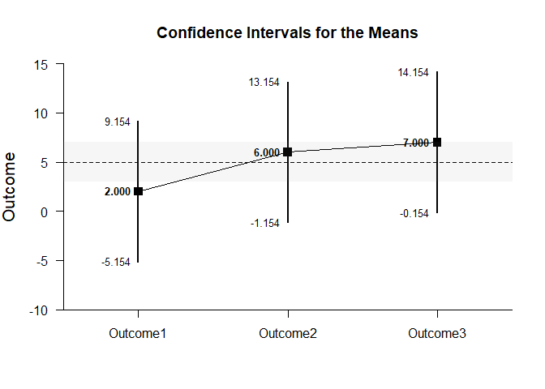<!-- -->

```r
with(MixedDataL2,plotMeans(Outcome1,Outcome2,Outcome3,conf.level=.99,mu=5,rope=c(3,7)))
```

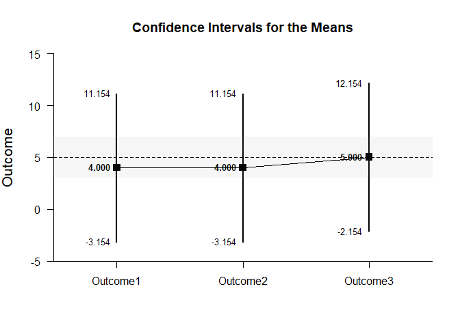<!-- -->

#### Significance Tests

This code will produce a table of NHST separately for each level of the factor. In this case, all the means are tested against a value of zero.

```r
with(MixedDataL1,testMeans(Outcome1,Outcome2,Outcome3))
```

```
## $`Hypothesis Tests for the Means`
##             Diff      SE      df       t       p
## Outcome1   2.000   1.224   3.000   1.633   0.201
## Outcome2   6.000   1.224   3.000   4.900   0.016
## Outcome3   7.000   1.224   3.000   5.717   0.011
```

```r
with(MixedDataL2,testMeans(Outcome1,Outcome2,Outcome3))
```

```
## $`Hypothesis Tests for the Means`
##             Diff      SE      df       t       p
## Outcome1   4.000   1.224   3.000   3.267   0.047
## Outcome2   4.000   1.224   3.000   3.267   0.047
## Outcome3   5.000   1.224   3.000   4.083   0.027
```

Often, the default test value of zero is not meaningful or plausible. This too can be altered (often in conjunction with what is presented in the plot).

```r
with(MixedDataL1,testMeans(Outcome1,Outcome2,Outcome3,mu=5))
```

```
## $`Hypothesis Tests for the Means`
##             Diff      SE      df       t       p
## Outcome1  -3.000   1.224   3.000  -2.450   0.092
## Outcome2   1.000   1.224   3.000   0.817   0.474
## Outcome3   2.000   1.224   3.000   1.633   0.201
```

```r
with(MixedDataL2,testMeans(Outcome1,Outcome2,Outcome3,mu=5))
```

```
## $`Hypothesis Tests for the Means`
##             Diff      SE      df       t       p
## Outcome1  -1.000   1.224   3.000  -0.817   0.474
## Outcome2  -1.000   1.224   3.000  -0.817   0.474
## Outcome3   0.000   1.224   3.000   0.000   1.000
```

#### Standardized Effect Sizes

This code will produce a table of standardized mean differences separately for each level of the factor. In this case, the mean is compared to zero to form the effect size.

```r
with(MixedDataL1,estimateStandardizedMeans(Outcome1,Outcome2,Outcome3))
```

```
## $`Confidence Intervals for the Standardized Means`
##                d      SE      LL      UL
## Outcome1   0.817   0.616  -0.387   1.934
## Outcome2   2.450   0.955   0.325   4.532
## Outcome3   2.858   1.063   0.464   5.227
```

```r
with(MixedDataL2,estimateStandardizedMeans(Outcome1,Outcome2,Outcome3))
```

```
## $`Confidence Intervals for the Standardized Means`
##                d      SE      LL      UL
## Outcome1   1.633   0.761   0.013   3.177
## Outcome2   1.633   0.761   0.013   3.177
## Outcome3   2.042   0.854   0.176   3.847
```

Here too it is possible to alter the width of the confidence intervals and to establish a more plausible comparison value for the mean.

```r
with(MixedDataL1,estimateStandardizedMeans(Outcome1,Outcome2,Outcome3,mu=5,conf.level=.99))
```

```
## $`Confidence Intervals for the Standardized Means`
##                d      SE      LL      UL
## Outcome1  -1.225   0.680  -3.011   0.547
## Outcome2   0.408   0.574  -0.968   1.734
## Outcome3   0.817   0.616  -0.732   2.320
```

```r
with(MixedDataL2,estimateStandardizedMeans(Outcome1,Outcome2,Outcome3,mu=5,conf.level=.99))
```

```
## $`Confidence Intervals for the Standardized Means`
##                d      SE      LL      UL
## Outcome1  -0.408   0.574  -1.734   0.968
## Outcome2  -0.408   0.574  -1.734   0.968
## Outcome3   0.000   0.559  -1.288   1.288
```

### Analyses of a Comparison

This section produces analyses that are equivalent to comparisons of two levels of a factor.

#### Confidence Intervals

This code identifies the two levels for comparison and estimates the confidence interval of the difference.

```r
with(MixedDataL1,estimateMeanDifference(Outcome1,Outcome2))
```

```
## $`Confidence Interval for the Mean Difference`
##               Diff      SE      df      LL      UL
## Comparison   4.000   1.224   3.000   0.103   7.897
```

```r
with(MixedDataL2,estimateMeanDifference(Outcome1,Outcome2))
```

```
## $`Confidence Interval for the Mean Difference`
##               Diff      SE      df      LL      UL
## Comparison   0.000   0.577   3.000  -1.836   1.836
```

This code obtains and plots the confidence intervals for the mean difference in the identified comparison.

```r
with(MixedDataL1,plotMeanDifference(Outcome1,Outcome2))
```

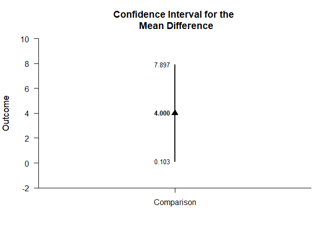<!-- -->

```r
with(MixedDataL2,plotMeanDifference(Outcome1,Outcome2))
```

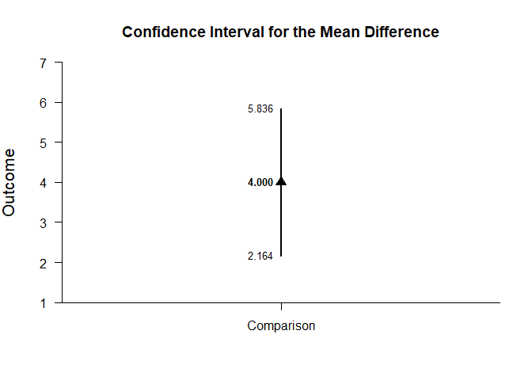<!-- -->

Of course, you can change the confidence level from the default 95% if desired.

```r
with(MixedDataL1,estimateMeanDifference(Outcome1,Outcome2,conf.level=.99))
```

```
## $`Confidence Interval for the Mean Difference`
##               Diff      SE      df      LL      UL
## Comparison   4.000   1.224   3.000  -3.152  11.152
```

```r
with(MixedDataL2,estimateMeanDifference(Outcome1,Outcome2,conf.level=.99))
```

```
## $`Confidence Interval for the Mean Difference`
##               Diff      SE      df      LL      UL
## Comparison   0.000   0.577   3.000  -3.370   3.370
```

Once again, the confidence levels can be changed away from the default and a region of practical equivalence can be added to the graph.

```r
with(MixedDataL1,plotMeanDifference(Outcome1,Outcome2,conf.level=.99,rope=c(-2,2)))
```

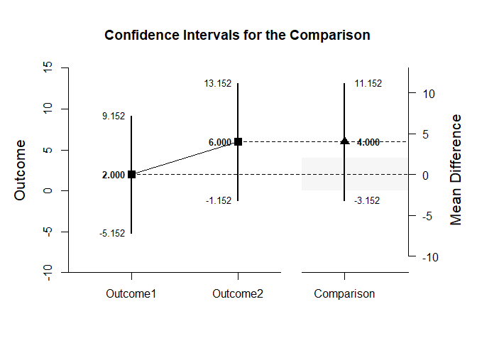<!-- -->

```r
with(MixedDataL2,plotMeanDifference(Outcome1,Outcome2,conf.level=.99,rope=c(-2,2)))
```

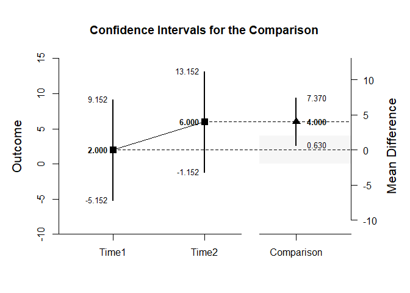<!-- -->

If you wish, you can get the confidence intervals for the means and the mean difference in one command.

```r
with(MixedDataL1,estimateMeanComparison(Outcome1,Outcome2))
```

```
## $`Confidence Intervals for the Means`
##                M      SE      df      LL      UL
## Outcome1   2.000   1.224   3.000  -1.897   5.897
## Outcome2   6.000   1.224   3.000   2.103   9.897
## 
## $`Confidence Interval for the Mean Difference`
##               Diff      SE      df      LL      UL
## Comparison   4.000   1.224   3.000   0.103   7.897
```

```r
with(MixedDataL2,estimateMeanComparison(Outcome1,Outcome2))
```

```
## $`Confidence Intervals for the Means`
##                M      SE      df      LL      UL
## Outcome1   4.000   1.224   3.000   0.103   7.897
## Outcome2   4.000   1.224   3.000   0.103   7.897
## 
## $`Confidence Interval for the Mean Difference`
##               Diff      SE      df      LL      UL
## Comparison   0.000   0.577   3.000  -1.836   1.836
```

This code produces a difference plot using the confidence intervals for the means and the mean difference.

```r
with(MixedDataL1,plotMeanComparison(Outcome1,Outcome2))
```

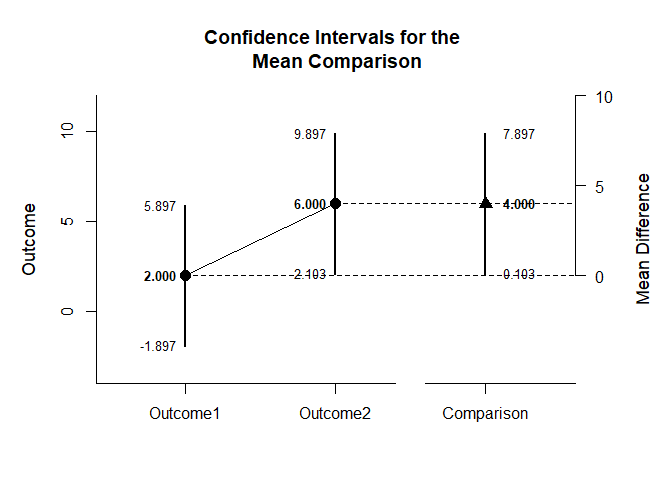<!-- -->

```r
with(MixedDataL2,plotMeanComparison(Outcome1,Outcome2))
```

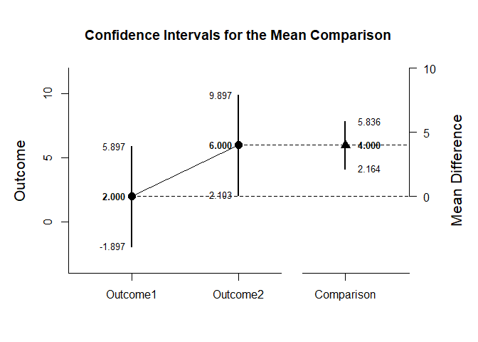<!-- -->

Of course, you can change the confidence level from the default 95% if desired.

```r
with(MixedDataL1,estimateMeanComparison(Outcome1,Outcome2,conf.level=.99))
```

```
## $`Confidence Intervals for the Means`
##                M      SE      df      LL      UL
## Outcome1   2.000   1.224   3.000  -5.152   9.152
## Outcome2   6.000   1.224   3.000  -1.152  13.152
## 
## $`Confidence Interval for the Mean Difference`
##               Diff      SE      df      LL      UL
## Comparison   4.000   1.224   3.000  -3.152  11.152
```

```r
with(MixedDataL2,estimateMeanComparison(Outcome1,Outcome2,conf.level=.99))
```

```
## $`Confidence Intervals for the Means`
##                M      SE      df      LL      UL
## Outcome1   4.000   1.224   3.000  -3.152  11.152
## Outcome2   4.000   1.224   3.000  -3.152  11.152
## 
## $`Confidence Interval for the Mean Difference`
##               Diff      SE      df      LL      UL
## Comparison   0.000   0.577   3.000  -3.370   3.370
```

Once again, the confidence levels can be changed away from the default and a region of practical equivalence can be added to the graph.

```r
with(MixedDataL1,plotMeanComparison(Outcome1,Outcome2,conf.level=.99,rope=c(-2,2)))
```

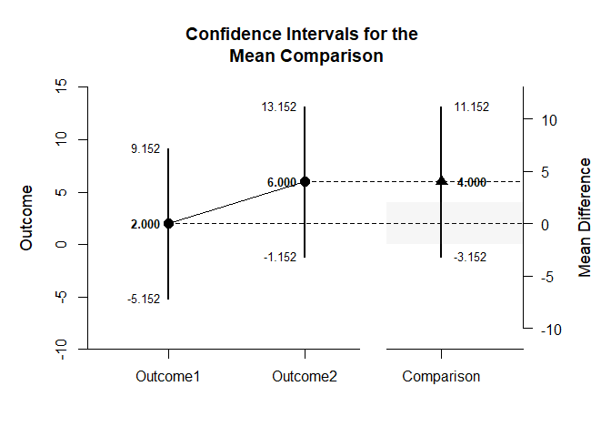<!-- -->

```r
with(MixedDataL2,plotMeanComparison(Outcome1,Outcome2,conf.level=.99,rope=c(-2,2)))
```

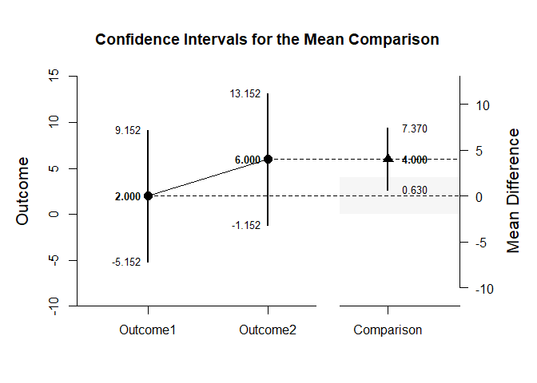<!-- -->

#### Significance Tests

This code produces NHST for the identified comparison (using a default test value of zero).

```r
with(MixedDataL1,testMeanDifference(Outcome1,Outcome2))
```

```
## $`Hypothesis Test for the Mean Difference`
##               Diff      SE      df       t       p
## Comparison   4.000   1.224   3.000   3.267   0.047
```

```r
with(MixedDataL2,testMeanDifference(Outcome1,Outcome2))
```

```
## $`Hypothesis Test for the Mean Difference`
##               Diff      SE      df       t       p
## Comparison   0.000   0.577   3.000   0.000   1.000
```

If the default value of zero is not plausible, it too can be changed.

```r
with(MixedDataL1,testMeanDifference(Outcome1,Outcome2,mu=-2))
```

```
## $`Hypothesis Test for the Mean Difference`
##               Diff      SE      df       t       p
## Comparison   6.000   1.224   3.000   4.900   0.016
```

```r
with(MixedDataL2,testMeanDifference(Outcome1,Outcome2,mu=-2))
```

```
## $`Hypothesis Test for the Mean Difference`
##               Diff      SE      df       t       p
## Comparison   2.000   0.577   3.000   3.467   0.040
```

#### Standardized Effect Sizes

This code calculates a standardized mean difference for the comparison and its confidence interval.

```r
with(MixedDataL1,estimateStandardizedMeanDifference(Outcome1,Outcome2))
```

```
## $`Confidence Interval for the Standardized Mean Difference`
##                  d      SE      LL      UL
## Comparison   1.633   0.782   0.101   3.166
```

```r
with(MixedDataL2,estimateStandardizedMeanDifference(Outcome1,Outcome2))
```

```
## $`Confidence Interval for the Standardized Mean Difference`
##                  d      SE      LL      UL
## Comparison   0.000   0.272  -0.533   0.533
```

The width of the confidence interval for the effect size can be altered if desired.

```r
with(MixedDataL1,estimateStandardizedMeanDifference(Outcome1,Outcome2,conf.level=.99))
```

```
## $`Confidence Interval for the Standardized Mean Difference`
##                  d      SE      LL      UL
## Comparison   1.633   0.782  -0.380   3.647
```

```r
with(MixedDataL2,estimateStandardizedMeanDifference(Outcome1,Outcome2,conf.level=.99))
```

```
## $`Confidence Interval for the Standardized Mean Difference`
##                  d      SE      LL      UL
## Comparison   0.000   0.272  -0.701   0.701
```

### Analyses of a Contrast

This section produces analyses that are equivalent to analyses involving multiple levels of a factor.

This code identifies a contrast among the levels.

```r
O1vsOthers <- c(-1,.5,.5)
```

#### Confidence Intervals

This code produces a confidence interval for that contrast.

```r
with(MixedDataL1,estimateMeanContrast(Outcome1,Outcome2,Outcome3,contrast=O1vsOthers))
```

```
## $`Confidence Interval for the Mean Contrast`
##              Est      SE      df      LL      UL
## Contrast   4.500   1.258   3.000   0.496   8.504
```

```r
with(MixedDataL2,estimateMeanContrast(Outcome1,Outcome2,Outcome3,contrast=O1vsOthers))
```

```
## $`Confidence Interval for the Mean Contrast`
##              Est      SE      df      LL      UL
## Contrast   0.500   0.645   3.000  -1.553   2.553
```

This code obtains and plots the confidence intervals for the mean difference in the identified contrast.

```r
with(MixedDataL1,plotMeanContrast(Outcome1,Outcome2,Outcome3,contrast=O1vsOthers))
```

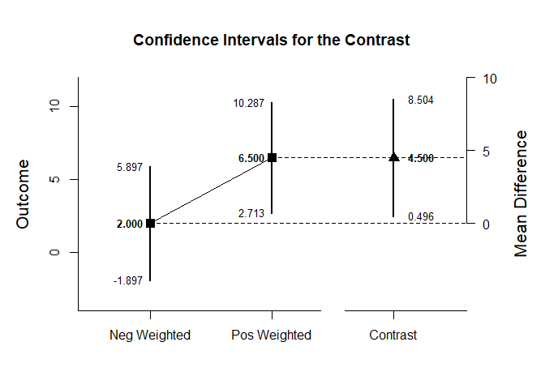<!-- -->

```r
with(MixedDataL2,plotMeanContrast(Outcome1,Outcome2,Outcome3,contrast=O1vsOthers))
```

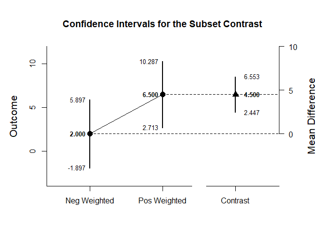<!-- -->

As in all other cases, the default value of the confidence interval can be changed.

```r
with(MixedDataL1,estimateMeanContrast(Outcome1,Outcome2,Outcome3,contrast=O1vsOthers,conf.level=.99))
```

```
## $`Confidence Interval for the Mean Contrast`
##              Est      SE      df      LL      UL
## Contrast   4.500   1.258   3.000  -2.848  11.848
```

```r
with(MixedDataL2,estimateMeanContrast(Outcome1,Outcome2,Outcome3,contrast=O1vsOthers,conf.level=.99))
```

```
## $`Confidence Interval for the Mean Contrast`
##              Est      SE      df      LL      UL
## Contrast   0.500   0.645   3.000  -3.268   4.268
```

The width of the confidence interval for the contrast can be altered and a region of practical equivalence can be added to the graph.

```r
with(MixedDataL1,plotMeanContrast(Outcome1,Outcome2,Outcome3,contrast=O1vsOthers,conf.level=.99,rope=c(-2,2)))
```

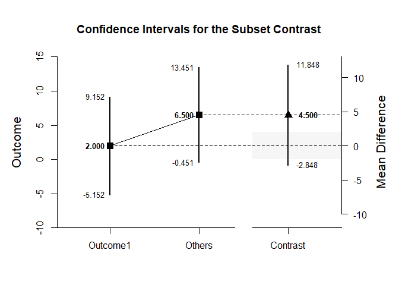<!-- -->

```r
with(MixedDataL2,plotMeanContrast(Outcome1,Outcome2,Outcome3,contrast=O1vsOthers,conf.level=.99,rope=c(-2,2)))
```

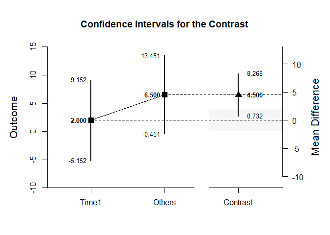<!-- -->

If you wish, you can get the confidence intervals for the mean subsets and the mean contrast in one command.

```r
with(MixedDataL1,estimateMeanSubsets(Outcome1,Outcome2,Outcome3,contrast=O1vsOthers))
```

```
## $`Confidence Intervals for the Mean Subsets`
##                  Est      SE      df      LL      UL
## Neg Weighted   2.000   1.224   3.000  -1.897   5.897
## Pos Weighted   6.500   1.190   3.000   2.713  10.287
## 
## $`Confidence Interval for the Mean Contrast`
##              Est      SE      df      LL      UL
## Contrast   4.500   1.258   3.000   0.496   8.504
```

```r
with(MixedDataL2,estimateMeanSubsets(Outcome1,Outcome2,Outcome3,contrast=O1vsOthers))
```

```
## $`Confidence Intervals for the Mean Subsets`
##                  Est      SE      df      LL      UL
## Neg Weighted   4.000   1.224   3.000   0.103   7.897
## Pos Weighted   4.500   1.190   3.000   0.713   8.287
## 
## $`Confidence Interval for the Mean Contrast`
##              Est      SE      df      LL      UL
## Contrast   0.500   0.645   3.000  -1.553   2.553
```

This code produces a difference plot using the confidence intervals for the mean subsets and the mean contrast.

```r
with(MixedDataL1,plotMeanSubsets(Outcome1,Outcome2,Outcome3,contrast=O1vsOthers))
```

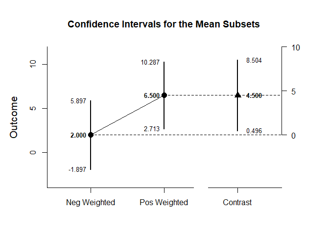<!-- -->

```r
with(MixedDataL2,plotMeanSubsets(Outcome1,Outcome2,Outcome3,contrast=O1vsOthers))
```

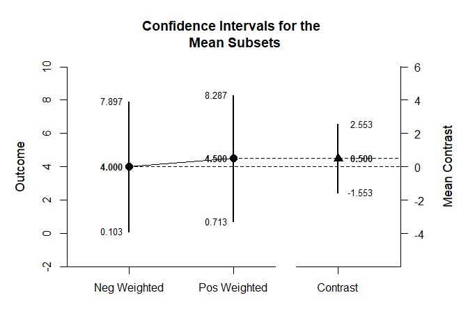<!-- -->

Of course, you can change the confidence level from the default 95% if desired.

```r
with(MixedDataL1,estimateMeanSubsets(Outcome1,Outcome2,Outcome3,contrast=O1vsOthers,conf.level=.99))
```

```
## $`Confidence Intervals for the Mean Subsets`
##                  Est      SE      df      LL      UL
## Neg Weighted   2.000   1.224   3.000  -5.152   9.152
## Pos Weighted   6.500   1.190   3.000  -0.451  13.451
## 
## $`Confidence Interval for the Mean Contrast`
##              Est      SE      df      LL      UL
## Contrast   4.500   1.258   3.000  -2.848  11.848
```

```r
with(MixedDataL2,estimateMeanSubsets(Outcome1,Outcome2,Outcome3,contrast=O1vsOthers,conf.level=.99))
```

```
## $`Confidence Intervals for the Mean Subsets`
##                  Est      SE      df      LL      UL
## Neg Weighted   4.000   1.224   3.000  -3.152  11.152
## Pos Weighted   4.500   1.190   3.000  -2.451  11.451
## 
## $`Confidence Interval for the Mean Contrast`
##              Est      SE      df      LL      UL
## Contrast   0.500   0.645   3.000  -3.268   4.268
```

Once again, the confidence levels can be changed away from the default and a region of practical equivalence can be added to the graph.

```r
with(MixedDataL1,plotMeanSubsets(Outcome1,Outcome2,Outcome3,contrast=O1vsOthers,labels=c("Outcome1","Others"),conf.level=.99,rope=c(-2,2)))
```

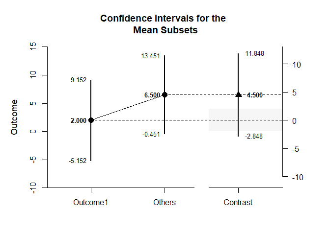<!-- -->

```r
with(MixedDataL2,plotMeanSubsets(Outcome1,Outcome2,Outcome3,contrast=O1vsOthers,labels=c("Outcome1","Others"),conf.level=.99,rope=c(-2,2)))
```

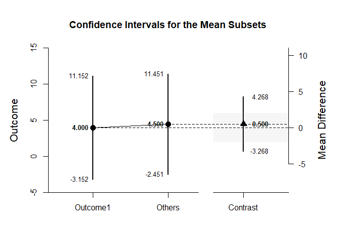<!-- -->

#### Significance Tests

This code produces a NHST for the identified contrast. It tests the contrast against a value of zero by default.

```r
with(MixedDataL1,testMeanContrast(Outcome1,Outcome2,Outcome3,contrast=O1vsOthers))
```

```
## $`Hypothesis Test for the Mean Contrast`
##              Est      SE      df       t       p
## Contrast   4.500   1.258   3.000   3.577   0.037
```

```r
with(MixedDataL2,testMeanContrast(Outcome1,Outcome2,Outcome3,contrast=O1vsOthers))
```

```
## $`Hypothesis Test for the Mean Contrast`
##              Est      SE      df       t       p
## Contrast   0.500   0.645   3.000   0.775   0.495
```

If desired, the contrast can be tested against other values.

```r
with(MixedDataL1,testMeanContrast(Outcome1,Outcome2,Outcome3,contrast=O1vsOthers,mu=4))
```

```
## $`Hypothesis Test for the Mean Contrast`
##              Est      SE      df       t       p
## Contrast   0.500   1.258   3.000   0.397   0.718
```

```r
with(MixedDataL2,testMeanContrast(Outcome1,Outcome2,Outcome3,contrast=O1vsOthers,mu=4))
```

```
## $`Hypothesis Test for the Mean Contrast`
##              Est      SE      df       t       p
## Contrast  -3.500   0.645   3.000  -5.426   0.012
```

#### Standardized Effect Sizes

This code calculates a standardized contrast and its confidence interval.

```r
with(MixedDataL1,estimateStandardizedMeanContrast(Outcome1,Outcome2,Outcome3,contrast=O1vsOthers))
```

```
## $`Confidence Interval for the Standardized Mean Contrast`
##              Est      SE      LL      UL
## Contrast   1.837   0.676   0.512   3.163
```

```r
with(MixedDataL2,estimateStandardizedMeanContrast(Outcome1,Outcome2,Outcome3,contrast=O1vsOthers))
```

```
## $`Confidence Interval for the Standardized Mean Contrast`
##              Est      SE      LL      UL
## Contrast   0.204   0.279  -0.343   0.752
```

The width of the confidence interval for the effect size can be altered if desired.

```r
with(MixedDataL1,estimateStandardizedMeanContrast(Outcome1,Outcome2,Outcome3,contrast=O1vsOthers,conf.level=.99))
```

```
## $`Confidence Interval for the Standardized Mean Contrast`
##              Est      SE      LL      UL
## Contrast   1.837   0.676   0.096   3.579
```

```r
with(MixedDataL2,estimateStandardizedMeanContrast(Outcome1,Outcome2,Outcome3,contrast=O1vsOthers,conf.level=.99))
```

```
## $`Confidence Interval for the Standardized Mean Contrast`
##              Est      SE      LL      UL
## Contrast   0.204   0.279  -0.515   0.924
```

### Analyses of the Pairwise Comparisons

This section provides analyses of all possible pairwise comparisons among the levels of the factor.

#### Confidence Intervals

This code will provide a table of descriptive statistics and confidence intervals for each pairwise comparison.

```r
with(MixedDataL1,estimateMeansPairwise(Outcome1,Outcome2,Outcome3))
```

```
## $`Confidence Intervals for the Pairwise Mean Comparisons`
##                        Diff      SE      df      LL      UL
## Outcome1 v Outcome2   4.000   1.224   3.000   0.103   7.897
## Outcome1 v Outcome3   5.000   1.354   3.000   0.692   9.308
## Outcome2 v Outcome3   1.000   0.577   3.000  -0.836   2.836
```

```r
with(MixedDataL2,estimateMeansPairwise(Outcome1,Outcome2,Outcome3))
```

```
## $`Confidence Intervals for the Pairwise Mean Comparisons`
##                        Diff      SE      df      LL      UL
## Outcome1 v Outcome2   0.000   0.577   3.000  -1.836   1.836
## Outcome1 v Outcome3   1.000   0.816   3.000  -1.597   3.597
## Outcome2 v Outcome3   1.000   0.577   3.000  -0.836   2.836
```

This code will produce a graph of the confidence intervals for each of the pairwise comparisons.

```r
with(MixedDataL1,plotMeansPairwise(Outcome1,Outcome2,Outcome3))
```

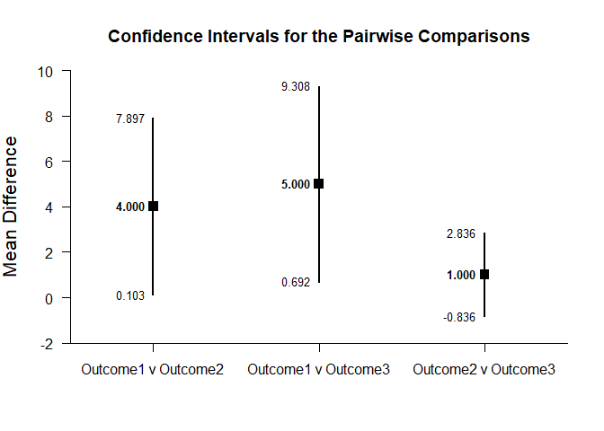<!-- -->

```r
with(MixedDataL2,plotMeansPairwise(Outcome1,Outcome2,Outcome3))
```

<!-- -->

The code defaults to 95% confidence intervals. This can be changed if desired.

```r
with(MixedDataL1,estimateMeansPairwise(Outcome1,Outcome2,Outcome3,conf.level=.99))
```

```
## $`Confidence Intervals for the Pairwise Mean Comparisons`
##                        Diff      SE      df      LL      UL
## Outcome1 v Outcome2   4.000   1.224   3.000  -3.152  11.152
## Outcome1 v Outcome3   5.000   1.354   3.000  -2.906  12.906
## Outcome2 v Outcome3   1.000   0.577   3.000  -2.370   4.370
```

```r
with(MixedDataL2,estimateMeansPairwise(Outcome1,Outcome2,Outcome3,conf.level=.99))
```

```
## $`Confidence Intervals for the Pairwise Mean Comparisons`
##                        Diff      SE      df      LL      UL
## Outcome1 v Outcome2   0.000   0.577   3.000  -3.370   3.370
## Outcome1 v Outcome3   1.000   0.816   3.000  -3.766   5.766
## Outcome2 v Outcome3   1.000   0.577   3.000  -2.370   4.370
```

Once again, the confidence levels can be changed away from the default and a region of practical equivalence can be added to the graph.

```r
with(MixedDataL1,plotMeansPairwise(Outcome1,Outcome2,Outcome3,mu=-2,conf.level=.99,rope=c(-4,0)))
```

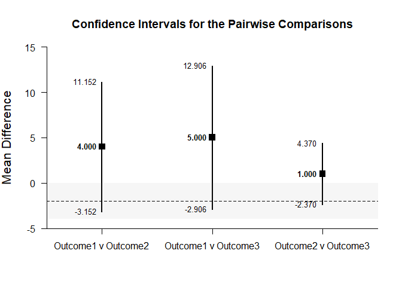<!-- -->

```r
with(MixedDataL2,plotMeansPairwise(Outcome1,Outcome2,Outcome3,mu=-2,conf.level=.99,rope=c(-4,0)))
```

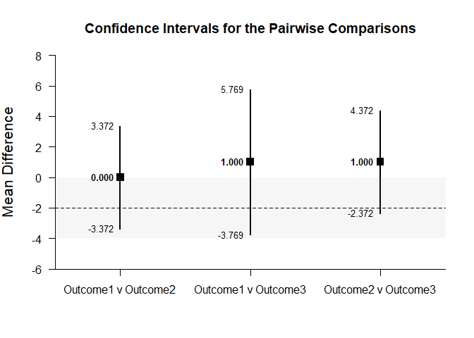<!-- -->

#### Significance Tests

This code will produce a table of NHST for each of the pairwise comparisons. In this case, all the comparisons are tested against a value of zero.

```r
with(MixedDataL1,testMeansPairwise(Outcome1,Outcome2,Outcome3))
```

```
## $`Hypothesis Tests for the Pairwise Mean Comparisons`
##                        Diff      SE      df       t       p
## Outcome1 v Outcome2   4.000   1.224   3.000   3.267   0.047
## Outcome1 v Outcome3   5.000   1.354   3.000   3.694   0.034
## Outcome2 v Outcome3   1.000   0.577   3.000   1.733   0.181
```

```r
with(MixedDataL2,testMeansPairwise(Outcome1,Outcome2,Outcome3))
```

```
## $`Hypothesis Tests for the Pairwise Mean Comparisons`
##                        Diff      SE      df       t       p
## Outcome1 v Outcome2   0.000   0.577   3.000   0.000   1.000
## Outcome1 v Outcome3   1.000   0.816   3.000   1.226   0.308
## Outcome2 v Outcome3   1.000   0.577   3.000   1.733   0.181
```

Often, the default test value of zero is not meaningful or plausible. This too can be altered (often in conjunction with what is presented in the plot).

```r
with(MixedDataL1,testMeansPairwise(Outcome1,Outcome2,Outcome3,mu=-2))
```

```
## $`Hypothesis Tests for the Pairwise Mean Comparisons`
##                        Diff      SE      df       t       p
## Outcome1 v Outcome2   6.000   1.224   3.000   4.900   0.016
## Outcome1 v Outcome3   7.000   1.354   3.000   5.171   0.014
## Outcome2 v Outcome3   3.000   0.577   3.000   5.200   0.014
```

```r
with(MixedDataL2,testMeansPairwise(Outcome1,Outcome2,Outcome3,mu=-2))
```

```
## $`Hypothesis Tests for the Pairwise Mean Comparisons`
##                        Diff      SE      df       t       p
## Outcome1 v Outcome2   2.000   0.577   3.000   3.467   0.040
## Outcome1 v Outcome3   3.000   0.816   3.000   3.677   0.035
## Outcome2 v Outcome3   3.000   0.577   3.000   5.200   0.014
```

#### Standardized Effect Sizes

This code will produce a table of standardized mean differences for each pairwise comparison. 

```r
with(MixedDataL1,estimateStandardizedMeansPairwise(Outcome1,Outcome2,Outcome3))
```

```
## $`Confidence Intervals for the Standardized Mean Pairwise Comparisons`
##                         Est      SE      LL      UL
## Outcome1 v Outcome2   1.633   0.782   0.101   3.166
## Outcome1 v Outcome3   2.042   0.876   0.325   3.759
## Outcome2 v Outcome3   0.408   0.592  -0.752   1.569
```

```r
with(MixedDataL2,estimateStandardizedMeansPairwise(Outcome1,Outcome2,Outcome3))
```

```
## $`Confidence Intervals for the Standardized Mean Pairwise Comparisons`
##                         Est      SE      LL      UL
## Outcome1 v Outcome2   0.000   0.272  -0.533   0.533
## Outcome1 v Outcome3   0.408   0.314  -0.208   1.025
## Outcome2 v Outcome3   0.408   0.314  -0.208   1.025
```

Here too it is possible to alter the width of the confidence intervals.

```r
with(MixedDataL1,estimateStandardizedMeansPairwise(Outcome1,Outcome2,Outcome3,conf.level=.99))
```

```
## $`Confidence Intervals for the Standardized Mean Pairwise Comparisons`
##                         Est      SE      LL      UL
## Outcome1 v Outcome2   1.633   0.782  -0.380   3.647
## Outcome1 v Outcome3   2.042   0.876  -0.215   4.298
## Outcome2 v Outcome3   0.408   0.592  -1.117   1.934
```

```r
with(MixedDataL2,estimateStandardizedMeansPairwise(Outcome1,Outcome2,Outcome3,conf.level=.99))
```

```
## $`Confidence Intervals for the Standardized Mean Pairwise Comparisons`
##                         Est      SE      LL      UL
## Outcome1 v Outcome2   0.000   0.272  -0.701   0.701
## Outcome1 v Outcome3   0.408   0.314  -0.402   1.218
## Outcome2 v Outcome3   0.408   0.314  -0.402   1.218
```
