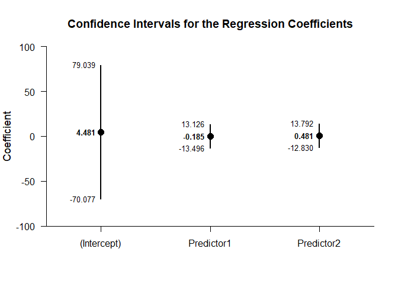
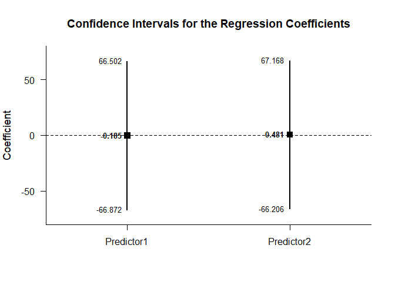
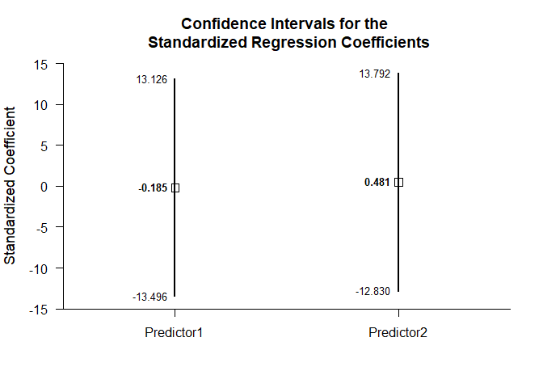

## Multiple Regression Tutorial with Summary Statistics

### Data Management

This code inputs the variable summaries and creates a summary table.

```r
Predictor1 <- c(N=4,M=2.000,SD=2.449)
Predictor2 <- c(N=4,M=6.000,SD=2.449)
Criterion <- c(N=4,M=7.000,SD=2.449)
RegressionSummary <- rbind(Predictor1,Predictor2,Criterion)
class(RegressionSummary) <- "wss"
```

This code creates a correlation matrix, enters just the top triangle, and then uses a function to fill in the whole matrix.

```r
RegressionCorr <- declareCorrelations("Predictor1","Predictor2","Criterion")
RegressionCorr["Predictor1","Predictor2"] <- .500
RegressionCorr["Predictor1","Criterion"] <- .056
RegressionCorr["Predictor2","Criterion"] <- .389
RegressionCorr <- fillCorrelations(RegressionCorr)
```

### Analyses of a Multiple Regression Model

This section produces analyses of a regression model with multiple predictors.

This code creates new tables that identify the specific variables used in the regression model.

```r
PredictorSummary <- rbind(Predictor1,Predictor2)
class(PredictorSummary) <- "wss"
CriterionSummary <- rbind(Criterion)
```

#### Confidence Intervals for the Regression Coefficients

This code will provide a table of confidence intervals for each of the regression coefficients.

```r
estimateRegression(PredictorSummary,CriterionSummary,RegressionCorr)
```

```
## $`Confidence Intervals for the Regression Coefficients`
##                 Est      SE      LL      UL
## (Intercept)   4.481   5.868 -70.077  79.039
## Predictor1   -0.185   1.048 -13.496  13.126
## Predictor2    0.481   1.048 -12.830  13.792
```

This code will produce a graph of the confidence intervals for each of the regression coefficients.

```r
plotRegression(PredictorSummary,CriterionSummary,RegressionCorr)
```

<!-- -->

The code defaults to 95% confidence intervals. This can be changed if desired.

```r
estimateRegression(PredictorSummary,CriterionSummary,RegressionCorr,conf.level=.99)
```

```
## $`Confidence Intervals for the Regression Coefficients`
##                 Est      SE       LL      UL
## (Intercept)   4.481   5.868 -369.047 378.009
## Predictor1   -0.185   1.048  -66.872  66.502
## Predictor2    0.481   1.048  -66.206  67.168
```

For the graph, it is possible to plot just coefficients for the predictors (minus the intercept) in addition to changing the confidence level.

```r
plotRegression(PredictorSummary,CriterionSummary,RegressionCorr,conf.level=.99,mu=0,intercept=FALSE)
```

<!-- -->

#### Significance Tests for the Regression Coefficients

This code will produce a table of NHST separately for each of the regression coefficients. In this case, all the coefficients are tested against a value of zero.

```r
testRegression(PredictorSummary,CriterionSummary,RegressionCorr)
```

```
## $`Hypothesis Tests for the Regression Coefficients`
##                 Est      SE       t       p
## (Intercept)   4.481   5.868   0.764   0.585
## Predictor1   -0.185   1.048  -0.176   0.889
## Predictor2    0.481   1.048   0.459   0.726
```

#### Confidence Intervals for the Standardized Regression Coefficient

This code will provide a table of confidence intervals for each of the standardized coefficients.

```r
estimateStandardizedRegression(PredictorSummary,CriterionSummary,RegressionCorr)
```

```
## $`Confidence Intervals for the Standardized Regression Coefficients`
##                Est      SE      LL      UL
## Predictor1  -0.185   1.048 -13.496  13.126
## Predictor2   0.481   1.048 -12.830  13.792
```

This code will produce a graph of the confidence intervals for each of the standardized coefficients.

```r
plotStandardizedRegression(PredictorSummary,CriterionSummary,RegressionCorr)
```

<!-- -->

As in other places, the code defaults to 95% confidence intervals. This can be changed if desired.

```r
estimateStandardizedRegression(PredictorSummary,CriterionSummary,RegressionCorr,conf.level=.99)
```

```
## $`Confidence Intervals for the Standardized Regression Coefficients`
##                Est      SE      LL      UL
## Predictor1  -0.185   1.048 -66.872  66.502
## Predictor2   0.481   1.048 -66.206  67.168
```

For the graph, it is possible to change the confidence level.

```r
plotStandardizedRegression(PredictorSummary,CriterionSummary,RegressionCorr,conf.level=.99)
```

<!-- -->

#### Confidence Interval for the Overall Fit

This code will calculate R Squared and Adjusted R Squared for the regression model.

```r
describeRegressionEffect(PredictorSummary,CriterionSummary,RegressionCorr)
```

```
## $`Overall Fit of the Model`
##             R     RSq  AdjRSq
## Model   0.421   0.177  -1.469
```

This code will produce the confidence interval for R Squared.

```r
estimateRegressionEffect(PredictorSummary,CriterionSummary,RegressionCorr)
```

```
## $`Proportion of Variance Accounted For by the Model`
##           Est      LL      UL
## Model   0.177   0.000   0.263
```

The code defaults to 90% confidence intervals. This can be changed if desired.

```r
estimateRegressionEffect(PredictorSummary,CriterionSummary,RegressionCorr,conf.level=.95)
```

```
## $`Proportion of Variance Accounted For by the Model`
##           Est      LL      UL
## Model   0.177   0.000   0.432
```

#### Significance Test for the Overall Fit

This code will produce a source table associated with the regression model.

```r
describeRegressionOmnibus(PredictorSummary,CriterionSummary,RegressionCorr)
```

```
## $`Source Table for the Regression Model`
##            SS      df      MS
## Model   3.185   2.000   1.592
## Error  14.808   1.000  14.808
## Total  17.993   3.000   5.998
```

This code will calculate NHST for the regression model.

```r
testRegressionOmnibus(PredictorSummary,CriterionSummary,RegressionCorr)
```

```
## $`Hypothesis Test for the Regression Model`
##             F     df1     df2       p
## Model   0.108   2.000   1.000   0.907
```
