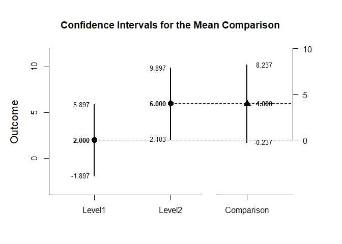
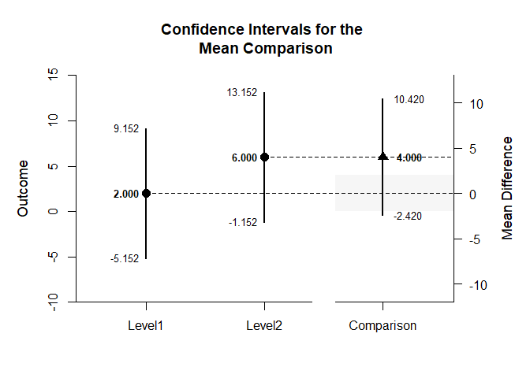
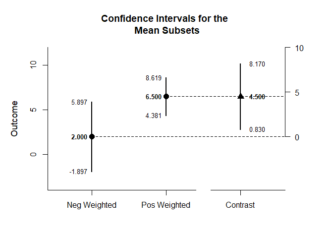
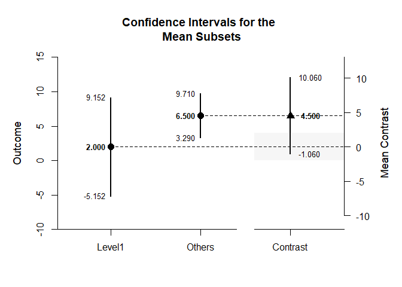
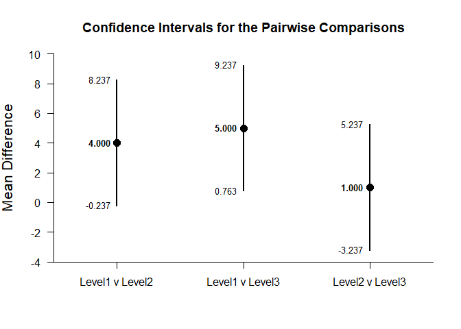
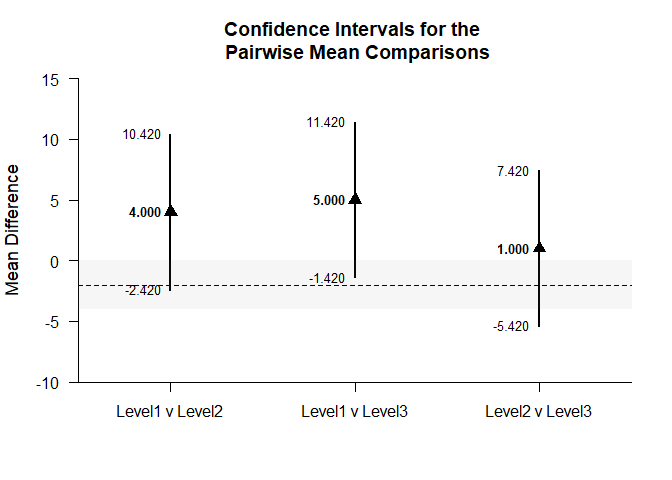

## OneWay (Between-Subjects) Tutorial with Summary Statistics

### Data Management

This code inputs the group summaries and creates a single summary table.

```r
Level1 <- c(N=4,M=2.000,SD=2.449)
Level2 <- c(N=4,M=6.000,SD=2.449)
Level3 <- c(N=4,M=7.000,SD=2.449)
OneWaySummary <- rbind(Level1,Level2,Level3)
class(OneWaySummary) <- "bss"
```

### Analyses of the Means

This section produces analyses that are equivalent to one-sample analyses separately for each level of a factor.

#### Confidence Intervals

This code will provide a table of confidence intervals for each level of the factor.

```r
estimateMeans(OneWaySummary)
```

```
## $`Confidence Intervals for the Means`
##              M      SE      df      LL      UL
## Level1   2.000   1.224   3.000  -1.897   5.897
## Level2   6.000   1.224   3.000   2.103   9.897
## Level3   7.000   1.224   3.000   3.103  10.897
```

This code will produce a graph of the confidence intervals for each level of the factor.

```r
plotMeans(OneWaySummary)
```

<!-- -->

The code defaults to 95% confidence intervals. This can be changed if desired.

```r
estimateMeans(OneWaySummary,conf.level=.99)
```

```
## $`Confidence Intervals for the Means`
##              M      SE      df      LL      UL
## Level1   2.000   1.224   3.000  -5.152   9.152
## Level2   6.000   1.224   3.000  -1.152  13.152
## Level3   7.000   1.224   3.000  -0.152  14.152
```

For the graph, it is possible to add a comparison line to represent a population (or test) value and a region of practical equivalence in addition to changing the confidence level.

```r
plotMeans(OneWaySummary,conf.level=.99,mu=5,rope=c(3,7))
```

<!-- -->

#### Significance Tests

This code will produce a table of NHST separately for each level of the factor. In this case, all the means are tested against a value of zero.

```r
testMeans(OneWaySummary)
```

```
## $`Hypothesis Tests for the Means`
##           Diff      SE      df       t       p
## Level1   2.000   1.224   3.000   1.633   0.201
## Level2   6.000   1.224   3.000   4.900   0.016
## Level3   7.000   1.224   3.000   5.717   0.011
```

Often, the default test value of zero is not meaningful or plausible. This too can be altered (often in conjunction with what is presented in the plot).

```r
testMeans(OneWaySummary,mu=5)
```

```
## $`Hypothesis Tests for the Means`
##           Diff      SE      df       t       p
## Level1  -3.000   1.224   3.000  -2.450   0.092
## Level2   1.000   1.224   3.000   0.817   0.474
## Level3   2.000   1.224   3.000   1.633   0.201
```

#### Standardized Effect Sizes

This code will produce a table of standardized mean differences separately for each level of the factor. In this case, the mean is compared to zero to form the effect size.

```r
estimateStandardizedMeans(OneWaySummary)
```

```
## $`Confidence Intervals for the Standardized Means`
##              d      SE      LL      UL
## Level1   0.817   0.616  -0.387   1.934
## Level2   2.450   0.955   0.325   4.532
## Level3   2.858   1.063   0.464   5.227
```

Here too it is possible to alter the width of the confidence intervals and to establish a more plausible comparison value for the mean.

```r
estimateStandardizedMeans(OneWaySummary,mu=5,conf.level=.99)
```

```
## $`Confidence Intervals for the Standardized Means`
##              d      SE      LL      UL
## Level1  -1.225   0.680  -3.011   0.547
## Level2   0.408   0.574  -0.968   1.734
## Level3   0.817   0.616  -0.732   2.320
```
 
### Analyses of a Comparison

This section produces analyses that are equivalent to comparisons of two levels of a factor.

This code creates a new table that identifies the two levels for comparison.

```r
CompSummary <- OneWaySummary[c("Level1","Level2"),]
class(CompSummary) <- "bss"
```

#### Confidence Intervals

This code estimates the confidence interval of the difference.

```r
estimateMeanDifference(CompSummary)
```

```
## $`Confidence Interval for the Mean Difference`
##               Diff      SE      df      LL      UL
## Comparison   4.000   1.732   6.000  -0.237   8.237
```

This code obtains and plots the confidence intervals for the mean difference in the identified comparison.

```r
plotMeanDifference(CompSummary)
```

<!-- -->

Of course, you can change the confidence level from the default 95% if desired.

```r
estimateMeanDifference(CompSummary,conf.level=.99)
```

```
## $`Confidence Interval for the Mean Difference`
##               Diff      SE      df      LL      UL
## Comparison   4.000   1.732   6.000  -2.420  10.420
```

Once again, the confidence levels can be changed away from the default and a comparison line to represent a population (or test) value and a region of practical equivalence can be added to the graph.

```r
plotMeanDifference(CompSummary,conf.level=.99,mu=0,rope=c(-2,2))
```

<!-- -->

If you wish, you can get the confidence intervals for the means and the mean difference in one command.

```r
estimateMeanComparison(CompSummary)
```

```
## $`Confidence Intervals for the Means`
##              M      SE      df      LL      UL
## Level1   2.000   1.224   3.000  -1.897   5.897
## Level2   6.000   1.224   3.000   2.103   9.897
## 
## $`Confidence Interval for the Mean Difference`
##               Diff      SE      df      LL      UL
## Comparison   4.000   1.732   6.000  -0.237   8.237
```

This code produces a difference plot using the confidence intervals for the means and the mean difference.

```r
plotMeanComparison(CompSummary)
```

<!-- -->

Of course, you can change the confidence level from the default 95% if desired.

```r
estimateMeanComparison(CompSummary,conf.level=.99)
```

```
## $`Confidence Intervals for the Means`
##              M      SE      df      LL      UL
## Level1   2.000   1.224   3.000  -5.152   9.152
## Level2   6.000   1.224   3.000  -1.152  13.152
## 
## $`Confidence Interval for the Mean Difference`
##               Diff      SE      df      LL      UL
## Comparison   4.000   1.732   6.000  -2.420  10.420
```

Once again, the confidence levels can be changed away from the default and a region of practical equivalence can be added to the graph.

```r
plotMeanComparison(CompSummary,conf.level=.99,rope=c(-2,2))
```

<!-- -->

#### Significance Test

This code produces NHST for the identified comparison (using a default test value of zero).

```r
testMeanDifference(CompSummary)
```

```
## $`Hypothesis Test for the Mean Difference`
##               Diff      SE      df       t       p
## Comparison   4.000   1.732   6.000   2.310   0.060
```

If the default value of zero is not plausible, it too can be changed.

```r
testMeanDifference(CompSummary,mu=-2)
```

```
## $`Hypothesis Test for the Mean Difference`
##               Diff      SE      df       t       p
## Comparison   6.000   1.732   6.000   3.465   0.013
```

#### Standardized Effect Size

This code calculates a standardized mean difference for the comparison and its confidence interval.

```r
estimateStandardizedMeanDifference(CompSummary)
```

```
## $`Confidence Interval for the Standardized Mean Difference`
##                  d      SE      LL      UL
## Comparison   1.633   0.943  -0.215   3.481
```

The width of the confidence interval for the effect size can be altered if desired.

```r
estimateStandardizedMeanDifference(CompSummary,conf.level=.99)
```

```
## $`Confidence Interval for the Standardized Mean Difference`
##                  d      SE      LL      UL
## Comparison   1.633   0.943  -0.795   4.062
```

### Analyses of a Contrast

This section produces analyses that are equivalent to analyses involving multiple levels of a factor.

This code identifies a contrast among the groups

```r
L1vsOthers <- c(-1,.5,.5)
```

#### Confidence Intervals

This code produces a confidence interval for that contrast.

```r
estimateMeanContrast(OneWaySummary,contrast=L1vsOthers)
```

```
## $`Confidence Interval for the Mean Contrast`
##              Est      SE      df      LL      UL
## Contrast   4.500   1.500   6.000   0.830   8.170
```

This code obtains and plots the confidence intervals for the groups and the mean difference in the identified contrast.

```r
plotMeanContrast(OneWaySummary,contrast=L1vsOthers)
```

<!-- -->

As in all other cases, the default value of the confidence interval can be changed.

```r
estimateMeanContrast(OneWaySummary,contrast=L1vsOthers,conf.level=.99)
```

```
## $`Confidence Interval for the Mean Contrast`
##              Est      SE      df      LL      UL
## Contrast   4.500   1.500   6.000  -1.060  10.060
```

The width of the confidence interval for the contrast can be altered and a comparison line to represent a population (or test) value and a region of practical equivalence can be added to the graph.

```r
plotMeanContrast(OneWaySummary,contrast=L1vsOthers,conf.level=.99,mu=0,rope=c(-2,2))
```

<!-- -->

If you wish, you can get the confidence intervals for the mean subsets and the mean contrast in one command.

```r
estimateMeanSubsets(OneWaySummary,contrast=L1vsOthers)
```

```
## $`Confidence Intervals for the Mean Subsets`
##                  Est      SE      df      LL      UL
## Neg Weighted   2.000   1.224   3.000  -1.897   5.897
## Pos Weighted   6.500   0.866   6.000   4.381   8.619
## 
## $`Confidence Interval for the Mean Contrast`
##              Est      SE      df      LL      UL
## Contrast   4.500   1.500   6.000   0.830   8.170
```

This code produces a difference plot using the confidence intervals for the mean subsets and the mean contrast.

```r
plotMeanSubsets(OneWaySummary,contrast=L1vsOthers)
```

<!-- -->

Of course, you can change the confidence level from the default 95% if desired.

```r
estimateMeanSubsets(OneWaySummary,contrast=L1vsOthers,conf.level=.99)
```

```
## $`Confidence Intervals for the Mean Subsets`
##                  Est      SE      df      LL      UL
## Neg Weighted   2.000   1.224   3.000  -5.152   9.152
## Pos Weighted   6.500   0.866   6.000   3.290   9.710
## 
## $`Confidence Interval for the Mean Contrast`
##              Est      SE      df      LL      UL
## Contrast   4.500   1.500   6.000  -1.060  10.060
```

Once again, the confidence levels can be changed away from the default and a region of practical equivalence can be added to the graph.

```r
plotMeanSubsets(OneWaySummary,contrast=L1vsOthers,labels=c("Level1","Others"),conf.level=.99,rope=c(-2,2))
```

<!-- -->

#### Significance Test

This code produces a NHST for the identified contrast. It tests the contrast against a value of zero by default.

```r
testMeanContrast(OneWaySummary,contrast=L1vsOthers)
```

```
## $`Hypothesis Test for the Mean Contrast`
##              Est      SE      df       t       p
## Contrast   4.500   1.500   6.000   3.001   0.024
```

If desired, the contrast can be tested against other values.

```r
testMeanContrast(OneWaySummary,contrast=L1vsOthers,mu=4)
```

```
## $`Hypothesis Test for the Mean Contrast`
##              Est      SE      df       t       p
## Contrast   0.500   1.500   6.000   0.333   0.750
```

#### Standardized Effect Size

This code calculates a standardized contrast and its confidence interval.

```r
estimateStandardizedMeanContrast(OneWaySummary,contrast=L1vsOthers)
```

```
## $`Confidence Interval for the Standardized Mean Contrast`
##              Est      SE      LL      UL
## Contrast   1.837   0.829   0.212   3.463
```

The width of the confidence interval for the effect size can be altered if desired.

```r
estimateStandardizedMeanContrast(OneWaySummary,contrast=L1vsOthers,conf.level=.99)
```

```
## $`Confidence Interval for the Standardized Mean Contrast`
##              Est      SE      LL      UL
## Contrast   1.837   0.829  -0.298   3.973
```

### Analyses of the Pairwise Comparisons

This section provides analyses of all possible pairwise comparisons among the levels of the factor.

#### Confidence Intervals

This code will provide a table of descriptive statistics and confidence intervals for each pairwise comparison.

```r
estimateMeansPairwise(OneWaySummary)
```

```
## $`Confidence Intervals for the Pairwise Mean Comparisons`
##                    Diff      SE      df      LL      UL
## Level1 v Level2   4.000   1.732   6.000  -0.237   8.237
## Level1 v Level3   5.000   1.732   6.000   0.763   9.237
## Level2 v Level3   1.000   1.732   6.000  -3.237   5.237
```

This code will produce a graph of the confidence intervals for each of the pairwise comparisons.

```r
plotMeansPairwise(OneWaySummary)
```

<!-- -->

The code defaults to 95% confidence intervals. This can be changed if desired.

```r
estimateMeansPairwise(OneWaySummary,conf.level=.99)
```

```
## $`Confidence Intervals for the Pairwise Mean Comparisons`
##                    Diff      SE      df      LL      UL
## Level1 v Level2   4.000   1.732   6.000  -2.420  10.420
## Level1 v Level3   5.000   1.732   6.000  -1.420  11.420
## Level2 v Level3   1.000   1.732   6.000  -5.420   7.420
```

Once again, the confidence levels can be changed away from the default and a region of practical equivalence can be added to the graph.

```r
plotMeansPairwise(OneWaySummary,mu=-2,conf.level=.99,rope=c(-4,0))
```

<!-- -->

#### Significance Tests

This code will produce a table of NHST for each of the pairwise comparisons. In this case, all the comparisons are tested against a value of zero.

```r
testMeansPairwise(OneWaySummary)
```

```
## $`Hypothesis Tests for the Pairwise Mean Comparisons`
##                    Diff      SE      df       t       p
## Level1 v Level2   4.000   1.732   6.000   2.310   0.060
## Level1 v Level3   5.000   1.732   6.000   2.887   0.028
## Level2 v Level3   1.000   1.732   6.000   0.577   0.585
```

Often, the default test value of zero is not meaningful or plausible. This too can be altered (often in conjunction with what is presented in the plot).

```r
testMeansPairwise(OneWaySummary,mu=-2)
```

```
## $`Hypothesis Tests for the Pairwise Mean Comparisons`
##                    Diff      SE      df       t       p
## Level1 v Level2   6.000   1.732   6.000   3.465   0.013
## Level1 v Level3   7.000   1.732   6.000   4.042   0.007
## Level2 v Level3   3.000   1.732   6.000   1.732   0.134
```

#### Standardized Effect Sizes

This code will produce a table of standardized mean differences for each pairwise comparison. 

```r
estimateStandardizedMeansPairwise(OneWaySummary)
```

```
## $`Confidence Intervals for the Standardized Mean Pairwise Comparisons`
##                     Est      SE      LL      UL
## Level1 v Level2   1.633   0.943  -0.215   3.481
## Level1 v Level3   2.042   1.007   0.068   4.015
## Level2 v Level3   0.408   0.825  -1.209   2.025
```

Here too it is possible to alter the width of the confidence intervals.

```r
estimateStandardizedMeansPairwise(OneWaySummary,conf.level=.99)
```

```
## $`Confidence Intervals for the Standardized Mean Pairwise Comparisons`
##                     Est      SE      LL      UL
## Level1 v Level2   1.633   0.943  -0.795   4.062
## Level1 v Level3   2.042   1.007  -0.552   4.635
## Level2 v Level3   0.408   0.825  -1.717   2.533
```
