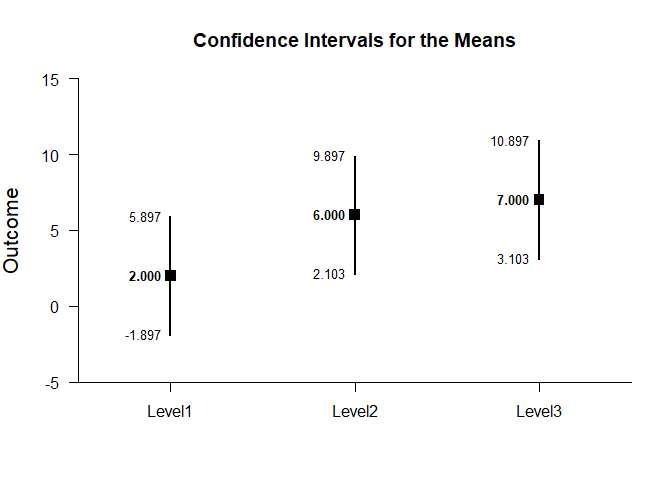
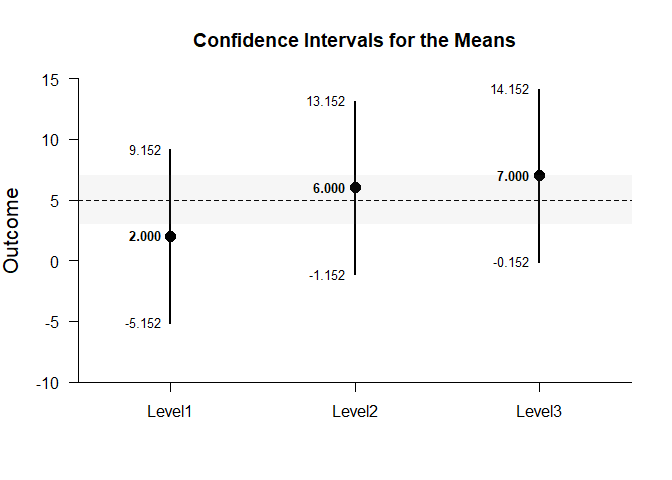
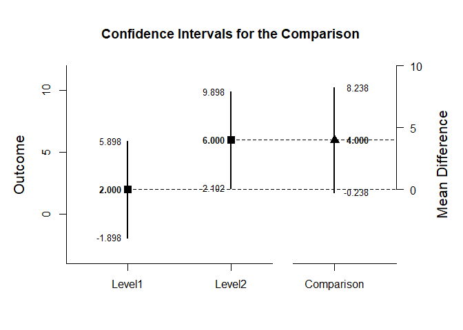
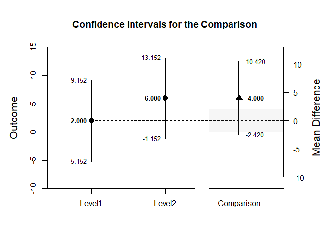
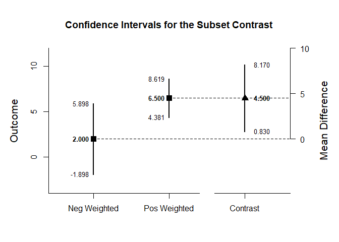

## OneWay (Between-Subjects) Tutorial with Summary Statistics

### Enter Summary Statistics

This code inputs the variable summaries and creates a single summary table.

```r
Level1 <- c(N=4,M=2.000,SD=2.449)
Level2 <- c(N=4,M=6.000,SD=2.449)
Level3 <- c(N=4,M=7.000,SD=2.449)
OneWaySummary <- rbind(Level1,Level2,Level3)
class(OneWaySummary) <- "bss"
OneWaySummary
```

```
##        N M    SD
## Level1 4 2 2.449
## Level2 4 6 2.449
## Level3 4 7 2.449
## attr(,"class")
## [1] "bss"
```

### Analyses of Multiple Groups

This section produces analyses that are equivalent to one-sample analyses separately for each level of a factor.

#### Confidence Intervals for the Means

This code will provide a table of descriptive statistics and confidence intervals for each level of the factor.

```r
estimateMeans(OneWaySummary)
```

```
## $`Confidence Intervals for the Means`
##              N       M      SD      SE      LL      UL
## Level1   4.000   2.000   2.449   1.224  -1.897   5.897
## Level2   4.000   6.000   2.449   1.224   2.103   9.897
## Level3   4.000   7.000   2.449   1.224   3.103  10.897
```

The code defaults to 95% confidence intervals. This can be changed if desired.

```r
estimateMeans(OneWaySummary,conf.level=.99)
```

```
## $`Confidence Intervals for the Means`
##              N       M      SD      SE      LL      UL
## Level1   4.000   2.000   2.449   1.224  -5.152   9.152
## Level2   4.000   6.000   2.449   1.224  -1.152  13.152
## Level3   4.000   7.000   2.449   1.224  -0.152  14.152
```

#### Plots of the Confidence Intervals for the Means

This code will produce a graph of the confidence intervals for each level of the factor.

```r
plotMeans(OneWaySummary)
```

<!-- -->

Of course, it is possible to change from the default confidence level. Additionally, it is possible to add a comparison line to represent a population (or test) value and a region of practical equivalence.

```r
plotMeans(OneWaySummary,conf.level=.99,mu=5,rope=c(3,7))
```

<!-- -->

#### Significance Tests for the Means

This code will produce a table of NHST separately for each level of the factor. In this case, all the means are tested against a value of zero.

```r
testMeans(OneWaySummary)
```

```
## $`Hypothesis Test for the Means`
##           Diff      SE       t      df       p
## Level1   2.000   1.224   1.633   3.000   0.201
## Level2   6.000   1.224   4.900   3.000   0.016
## Level3   7.000   1.224   5.717   3.000   0.011
```

Often, the default test value of zero is not meaningful or plausible. This too can be altered (often in conjunction with what is presented in the plot).

```r
testMeans(OneWaySummary,mu=5)
```

```
## $`Hypothesis Test for the Means`
##           Diff      SE       t      df       p
## Level1  -3.000   1.224  -2.450   3.000   0.092
## Level2   1.000   1.224   0.817   3.000   0.474
## Level3   2.000   1.224   1.633   3.000   0.201
```

#### Effect Sizes for the Means

This code will produce a table of standardized mean differences separately for each level of the factor. In this case, the mean is compared to zero to form the effect size.

```r
standardizeMeans(OneWaySummary)
```

```
## $`Confidence Intervals for the Standardized Means`
##              d  d.unb.      SE      LL      UL
## Level1   0.817   0.594   0.616  -0.387   1.934
## Level2   2.450   1.782   0.955   0.325   4.532
## Level3   2.858   2.079   1.063   0.464   5.227
```

Here too it is possible to alter the width of the confidence intervals and to establish a more plausible comparison value for the effect size.

```r
standardizeMeans(OneWaySummary,mu=5,conf.level=.99)
```

```
## $`Confidence Intervals for the Standardized Means`
##              d  d.unb.      SE      LL      UL
## Level1  -1.225  -0.891   0.680  -3.011   0.547
## Level2   0.408   0.297   0.574  -0.968   1.734
## Level3   0.817   0.594   0.616  -0.732   2.320
```
 
### Analyses of a Group Comparison

This section produces analyses that are equivalent to comparisons of two levels of a factor.

This code creates a new table that identifies the two levels for comparison.

```r
CompSummary <- OneWaySummary[c("Level1","Level2"),]
class(CompSummary) <- "bss"
```

#### Confidence Interval for a Mean Difference

This code estimates the confidence interval of the difference.

```r
estimateDifference(CompSummary)
```

```
## $`Confidence Interval for the Comparison`
##               Diff      SE      df      LL      UL
## Comparison   4.000   1.732   6.000  -0.237   8.237
```

Of course, you can change the confidence level from the default 95% if desired.

```r
estimateDifference(CompSummary,conf.level=.99)
```

```
## $`Confidence Interval for the Comparison`
##               Diff      SE      df      LL      UL
## Comparison   4.000   1.732   6.000  -2.420  10.420
```

#### Plot of the Confidence Interval for a Mean Difference

This code obtains and plots the confidence intervals for the groups and the mean difference in the identified comparison.

```r
plotDifference(CompSummary)
```

<!-- -->

Once again, the confidence levels can be changed away from the default and a region of practical equivalence can be added.

```r
plotDifference(CompSummary,conf.level=.99,rope=c(-2,2))
```

<!-- -->

#### Significance Test for a Mean Difference

This code produces NHST for the identified comparison (using a default test value of zero).

```r
testDifference(CompSummary)
```

```
## $`Hypothesis Test for the Comparison`
##               Diff      SE       t      df       p
## Comparison   4.000   1.732   2.310   6.000   0.060
```

If the default value of zero is not plausible, it too can be changed.

```r
testDifference(CompSummary,mu=-2)
```

```
## $`Hypothesis Test for the Comparison`
##               Diff      SE       t      df       p
## Comparison   6.000   1.732   3.465   6.000   0.013
```

#### Effect Size for the Mean Difference

This code calculates a standardized mean difference for the comparison and its confidence interval.

```r
standardizeDifference(CompSummary)
```

```
## $`Confidence Interval for the Standardized Comparison`
##                Est      SE      LL      UL
## Comparison   1.633   0.943  -0.215   3.481
```

The width of the confidence interval for the effect size can be altered if desired.

```r
standardizeDifference(CompSummary,conf.level=.99)
```

```
## $`Confidence Interval for the Standardized Comparison`
##                Est      SE      LL      UL
## Comparison   1.633   0.943  -0.795   4.062
```

### Analyses of a Group Contrast

This section produces analyses that are equivalent to analyses involving multiple levels of a factor.

This code identifies a contrast among the groups

```r
L1vsOthers <- c(-1,.5,.5)
```

#### Confidence Interval for a Contrast

This code produces a confidence interval for that contrast.

```r
estimateContrast(OneWaySummary,contrast=L1vsOthers)
```

```
## $`Confidence Interval for the Contrast`
##              Est      SE      df      LL      UL
## Contrast   4.500   1.500   6.000   0.830   8.170
```

As in all other cases, the default value of the confidence interval can be changed.

```r
estimateContrast(OneWaySummary,contrast=L1vsOthers,conf.level=.99)
```

```
## $`Confidence Interval for the Contrast`
##              Est      SE      df      LL      UL
## Contrast   4.500   1.500   6.000  -1.060  10.060
```

#### Plots of Confidence Intervals for a Contrast

This code obtains and plots the confidence intervals for the groups and the mean difference in the identified contrast.

```r
plotContrast(OneWaySummary,contrast=L1vsOthers)
```

<!-- -->

The width of the confidence interval for the contrast can be altered and a region of practical equivalence can be added.

```r
plotContrast(OneWaySummary,contrast=L1vsOthers,labels=c("Level1","Others"),conf.level=.99,rope=c(-2,2))
```

<!-- -->

#### Significance Test for a Contrast

This code produces a NHST for the identified contrast. It tests the contrast against a value of zero by default.

```r
testContrast(OneWaySummary,contrast=L1vsOthers)
```

```
## $`Hypothesis Test for the Contrast`
##              Est      SE       t      df       p
## Contrast   4.500   1.500   3.001   6.000   0.024
```

If desired, the contrast can be tested against other values.

```r
testContrast(OneWaySummary,contrast=L1vsOthers,mu=4)
```

```
## $`Hypothesis Test for the Contrast`
##              Est      SE       t      df       p
## Contrast   0.500   1.500   0.333   6.000   0.750
```

#### Effect Size for a Contrast

This code calculates a standardized contrast and its confidence interval.

```r
standardizeContrast(OneWaySummary,contrast=L1vsOthers)
```

```
## $`Confidence Interval for the Standardized Contrast`
##              Est      SE      LL      UL
## Contrast   1.837   0.829   0.212   3.463
```

The width of the confidence interval for the effect size can be altered if desired.

```r
standardizeContrast(OneWaySummary,contrast=L1vsOthers,conf.level=.99)
```

```
## $`Confidence Interval for the Standardized Contrast`
##              Est      SE      LL      UL
## Contrast   1.837   0.829  -0.298   3.973
```
