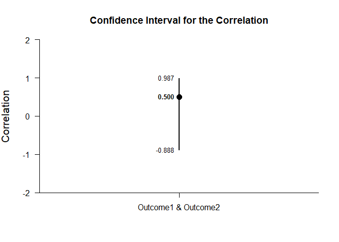

## Paired Samples Correlation Tutorial with Data

### Data Management

#### Data Entry

This code inputs the variable names and creates a viewable data frame.

```r
Outcome1 <- c(0,0,3,5)
Outcome2 <- c(4,7,4,9)
PairedData <- data.frame(Outcome1,Outcome2)
```

#### Descriptive Statistics

This code obtains the descriptive statistics for the data frame.

```r
describeMeans(Outcome1,Outcome2)
```

```
## $`Descriptive Statistics for the Data`
##                N       M      SD
## Outcome1   4.000   2.000   2.449
## Outcome2   4.000   6.000   2.449
```

This code obtains a table of correlations for the entire data frame.

```r
describeCorrelations(Outcome1,Outcome2)
```

```
## $`Correlation Matrix for the Variables`
##          Outcome1 Outcome2
## Outcome1    1.000    0.500
## Outcome2    0.500    1.000
```

### Analyses of a Correlation

This section produces analyses of the correlation.

#### Confidence Interval

This code will provide the confidence interval for the correlation.

```r
estimateCorrelations(Outcome1,Outcome2)
```

```
## $`Confidence Interval for the Correlation`
##                           R      SE      LL      UL
## Outcome1 & Outcome2   0.500   1.000  -0.888   0.987
```

This code will produce a graph of the confidence interval for the correlation.

```r
plotCorrelations(Outcome1,Outcome2)
```

<!-- -->

The code defaults to 95% confidence intervals. This can be changed if desired.

```r
estimateCorrelations(Outcome1,Outcome2,conf.level=.99)
```

```
## $`Confidence Interval for the Correlation`
##                           R      SE      LL      UL
## Outcome1 & Outcome2   0.500   1.000  -0.966   0.996
```

Of course, it is possible to change from the default confidence level and to add a comparison line and a region of practical equivalence to the graph.

```r
plotCorrelations(Outcome1,Outcome2,conf.level=.99,mu=0,rope=c(-.2,.2))
```

<!-- -->

#### Significance Test

This code will produce a table of NHST for the correlation (against a value of zero).

```r
testCorrelations(Outcome1,Outcome2)
```

```
## $`Hypothesis for the Correlation`
##                           R      SE      df       t       p
## Outcome1 & Outcome2   0.500   0.612   2.000   0.816   0.500
```
