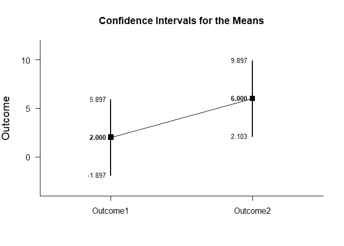
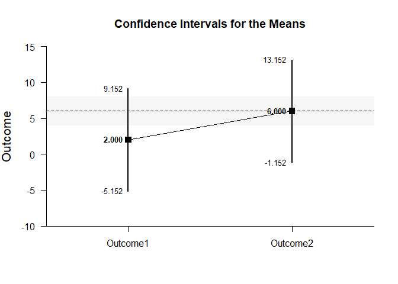
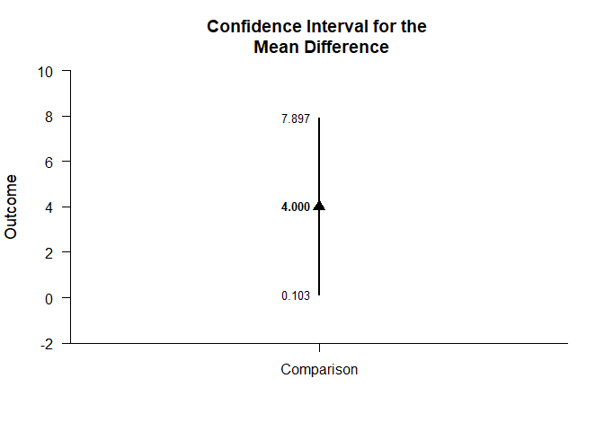
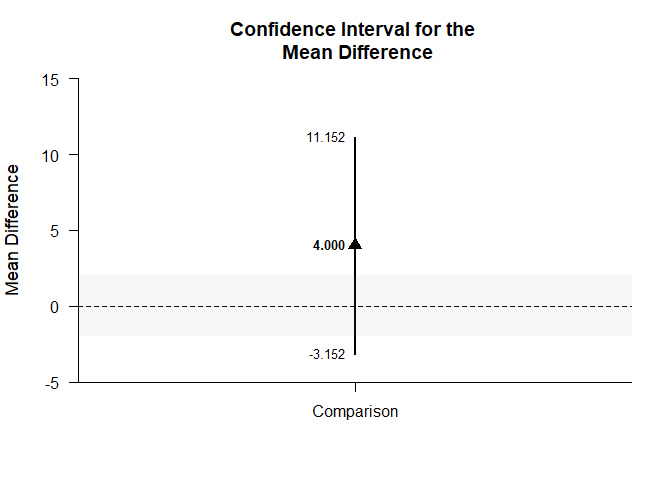

## Paired Samples Tutorial with Summary Statistics

### Enter Summary Statistics

This code inputs the variable summaries and creates a summary table.

```r
Time1 <- c(N=4,M=2.000,SD=2.449)
Time2 <- c(N=4,M=6.000,SD=2.449)
PairedSummary <- rbind(Time1,Time2)
class(PairedSummary) <- "wss"
```

This code creates a correlation matrix and enters single correlation.

```r
PairedCorr <- declareCorrMatrix("Time1","Time2")
PairedCorr["Time1","Time2"] <- .500
```
 
### Analyses of Multiple Variables

This section produces analyses that are equivalent to one-sample analyses separately for each level of a factor.

#### Confidence Intervals for the Means

This code will provide a table of descriptive statistics and confidence intervals for each level of the factor.

```r
estimateMeans(PairedSummary)
```

```
## $`Confidence Intervals for the Means`
##             N       M      SD      SE      LL      UL
## Time1   4.000   2.000   2.449   1.224  -1.897   5.897
## Time2   4.000   6.000   2.449   1.224   2.103   9.897
```

The code defaults to 95% confidence intervals. This can be changed if desired.

```r
estimateMeans(PairedSummary,conf.level=.99)
```

```
## $`Confidence Intervals for the Means`
##             N       M      SD      SE      LL      UL
## Time1   4.000   2.000   2.449   1.224  -5.152   9.152
## Time2   4.000   6.000   2.449   1.224  -1.152  13.152
```

#### Plots of Confidence Intervals for the Means

This code will produce a graph of the confidence intervals for each level of the factor.

```r
plotMeans(PairedSummary)
```

<!-- -->

Of course, it is possible to change from the default confidence level. Additionally, it is possible to add a comparison line to represent a population (or test) value and a region of practical equivalence.

```r
plotMeans(PairedSummary,conf.level=.99,mu=6,rope=c(4,8))
```

<!-- -->

#### Significance Tests for the Means

This code will produce a table of NHST separately for each level of the factor. In this case, all the means are tested against a value of zero.

```r
testMeans(PairedSummary)
```

```
## $`Hypothesis Tests for the Means`
##          Diff      SE       t      df       p
## Time1   2.000   1.224   1.633   3.000   0.201
## Time2   6.000   1.224   4.900   3.000   0.016
```

Often, the default test value of zero is not meaningful or plausible. This too can be altered (often in conjunction with what is presented in the plot).

```r
testMeans(PairedSummary,mu=6)
```

```
## $`Hypothesis Tests for the Means`
##          Diff      SE       t      df       p
## Time1  -4.000   1.224  -3.267   3.000   0.047
## Time2   0.000   1.224   0.000   3.000   1.000
```

#### Effect Sizes for the Means

This code will produce a table of standardized mean differences separately for each level of the factor. In this case, the mean is compared to zero to form the effect size.

```r
standardizeMeans(PairedSummary)
```

```
## $`Confidence Intervals for the Standardized Means`
##             d   d.unb      SE      LL      UL
## Time1   0.817   0.594   0.616  -0.387   1.934
## Time2   2.450   1.782   0.955   0.325   4.532
```

Here too it is possible to alter the width of the confidence intervals and to establish a more plausible comparison value for the effect size.

```r
standardizeMeans(PairedSummary,mu=6,conf.level=.99)
```

```
## $`Confidence Intervals for the Standardized Means`
##             d   d.unb      SE      LL      UL
## Time1  -1.633  -1.188   0.761  -3.765   0.398
## Time2   0.000   0.000   0.559  -1.288   1.288
```

### Analyses of a Variable Comparison

This section produces analyses that are equivalent to comparisons of two levels of a factor.

#### Confidence Interval for the Mean Difference

This code estimates the confidence interval of the difference.

```r
estimateDifference(PairedSummary,PairedCorr)
```

```
## $`Confidence Interval for the Comparison`
##               Diff      SE      df      LL      UL
## Comparison   4.000   1.224   3.000   0.103   7.897
```

Of course, you can change the confidence level from the default 95% if desired.

```r
estimateDifference(PairedSummary,PairedCorr,conf.level=.99)
```

```
## $`Confidence Interval for the Comparison`
##               Diff      SE      df      LL      UL
## Comparison   4.000   1.224   3.000  -3.152  11.152
```

#### Plots of Confidence Intervals for the Mean Difference

This code obtains and plots the confidence intervals for the levels and the mean difference.

```r
plotDifference(PairedSummary,PairedCorr)
```

<!-- -->

Once again, the confidence levels can be changed away from the default and a region of practical equivalence can be added.

```r
plotDifference(PairedSummary,PairedCorr,conf.level=.99,rope=c(-2,2))
```

<!-- -->

#### Significance Test for the Mean Difference

This code produces NHST for the mean difference (using a default test value of zero).

```r
testDifference(PairedSummary,PairedCorr)
```

```
## $`Hypothesis Test for the Comparison`
##               Diff      SE       t      df       p
## Comparison   4.000   1.224   3.267   3.000   0.047
```

If the default value of zero is not plausible, it too can be changed.

```r
testDifference(PairedSummary,PairedCorr,mu=-2)
```

```
## $`Hypothesis Test for the Comparison`
##               Diff      SE       t      df       p
## Comparison   6.000   1.224   4.900   3.000   0.016
```

#### Effect Size for the Mean Difference

This code calculates a standardized mean difference and its confidence interval.

```r
standardizeDifference(PairedSummary,PairedCorr)
```

```
## $`Confidence Interval for the Standardized Comparison`
##                Est      SE      LL      UL
## Comparison   1.633   0.782   0.101   3.166
```

The width of the confidence interval for the effect size can be altered if desired.

```r
standardizeDifference(PairedSummary,PairedCorr,conf.level=.99)
```

```
## $`Confidence Interval for the Standardized Comparison`
##                Est      SE      LL      UL
## Comparison   1.633   0.782  -0.380   3.647
```
