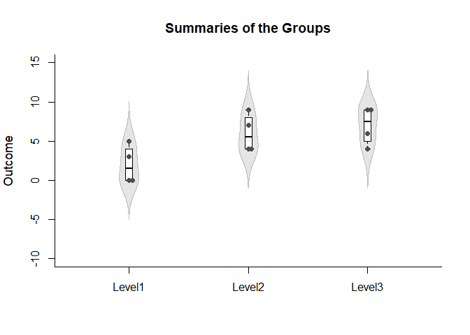
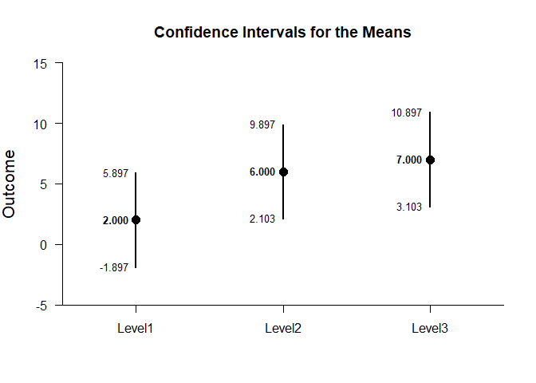
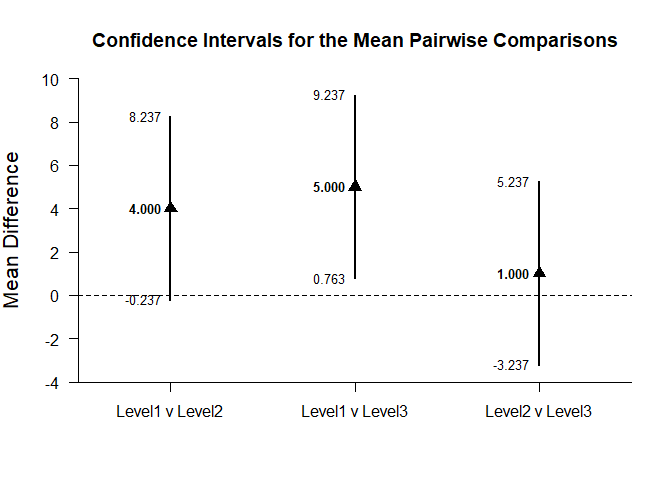
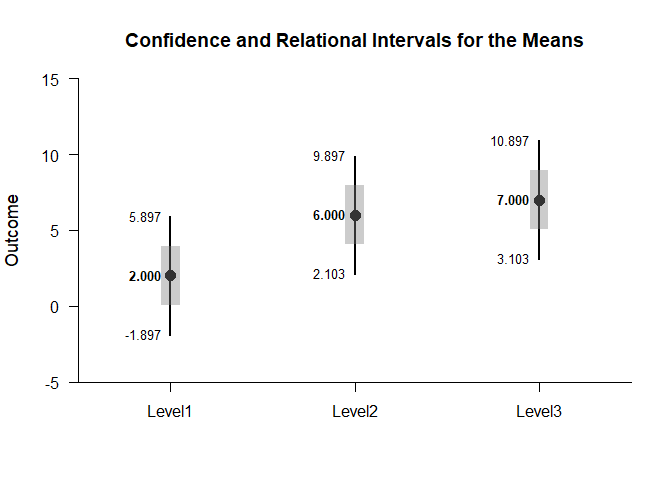
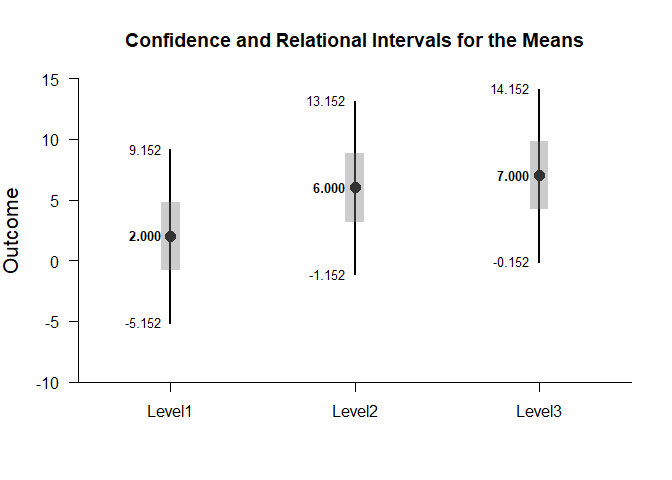

## Relational OneWay (Between-Subjects) Tutorial with Data

- [Data Management](#data-management)
- [Analyses of the Omnibus Effect](#analyses-of-the-omnibus-effect)
- [Analyses of the Pairwise Comparisons](#analyses-of-the-pairwise-comparisons)
- [Analyses of the Pairwise Comparisons Using Relational Intervals](#analyses-of-the-pairwise-comparisons-using-relational-intervals)

---

### Data Management

#### Data Entry

This code inputs the variable names and creates a viewable data frame.

```r
Factor <- c(rep(1,4),rep(2,4),rep(3,4))
Outcome <- c(0,0,3,5,4,7,4,9,9,6,4,9)
Factor <- factor(Factor,levels=c(1,2,3),labels=c("Level1","Level2","Level3"))
OneWayData <- data.frame(Factor,Outcome)
```

#### Plot of the Data


```r
plotViolins(Outcome~Factor,main="Summaries of the Groups")
plotBoxes(Outcome~Factor,add=TRUE)
plotData(Outcome~Factor,add=TRUE,method="stack",pch=16)
```

<!-- -->

#### Descriptive Statistics

This code obtains the descriptive statistics for the data frame.

```r
describeMeans(Outcome~Factor)
```

```
## $`Descriptive Statistics for the Data`
##              N       M      SD
## Level1   4.000   2.000   2.449
## Level2   4.000   6.000   2.449
## Level3   4.000   7.000   2.449
```

### Analyses of the Omnibus Effect

This section produces analyses that are the traditional way to represent and test overall group differences.

#### Confidence Intervals for the Means

This code will provide a table of confidence intervals for each level of the factor.

```r
estimateMeans(Outcome~Factor)
```

```
## $`Confidence Intervals for the Means`
##              M      SE      df      LL      UL
## Level1   2.000   1.224   3.000  -1.897   5.897
## Level2   6.000   1.224   3.000   2.103   9.897
## Level3   7.000   1.224   3.000   3.103  10.897
```

This code will produce a graph of the confidence intervals for each level of the factor.

```r
plotMeans(Outcome~Factor)
```

<!-- -->

#### Significance Tests for the Omnibus Effect

This code provides an ANOVA source table for the omnibus effect.

```r
describeMeansOmnibus(Outcome~Factor)
```

```
## $`Analysis of Variance Source Table`
##              SS      df      MS
## Between  56.000   2.000  28.000
## Within   53.978   9.000   5.998
```

```r
testMeansOmnibus(Outcome~Factor)
```

```
## $`Hypothesis Test for the Omnibus Effect`
##               F     dfb     dfw       p
## Omnibus   4.668   2.000   9.000   0.041
```

### Analyses of the Pairwise Comparisons

This section provides analyses of all possible pairwise comparisons among the levels of the factor.

#### Confidence Intervals for the Pairwise Comparisons

This code will provide a table of descriptive statistics and confidence intervals for each pairwise comparison.


```r
estimateMeansPairwise(Outcome~Factor)
```

```
## $`Confidence Intervals for the Pairwise Mean Comparisons`
##                    Diff      SE      df      LL      UL
## Level1 v Level2   4.000   1.732   6.000  -0.237   8.237
## Level1 v Level3   5.000   1.732   6.000   0.763   9.237
## Level2 v Level3   1.000   1.732   6.000  -3.237   5.237
```

This code will produce a graph of the confidence intervals for each of the pairwise comparisons.

```r
plotMeansPairwise(Outcome~Factor,mu=0)
```

<!-- -->

#### Significance Tests of the Pairwise Comparisons

This code will produce a table of NHST for each of the pairwise comparisons. In this case, all the comparisons are tested against a value of zero.

```r
testMeansPairwise(Outcome~Factor)
```

```
## $`Hypothesis Tests for the Pairwise Mean Comparisons`
##                    Diff      SE      df       t       p
## Level1 v Level2   4.000   1.732   6.000   2.310   0.060
## Level1 v Level3   5.000   1.732   6.000   2.887   0.028
## Level2 v Level3   1.000   1.732   6.000   0.577   0.585
```

### Analyses of the Pairwise Comparisons Using Relational Intervals

This section provides analyses of all possible pairwise comparisons among the levels of the factor using relational intervals.

#### Confidence and Relational Intervals for the Pairwise Comparisons

This code will provide a table of confidence and relational intervals for each pairwise comparison.

```r
estimateMeansRelational(Outcome~Factor)
```

```
## $`Confidence and Relational Intervals for the Means`
##              M   CI.LL   CI.UL   RI.LL   RI.UL
## Level1   2.000  -1.897   5.897   0.041   3.959
## Level2   6.000   2.103   9.897   4.041   7.959
## Level3   7.000   3.103  10.897   5.041   8.959
```

This code will produce a graph of the confidence and relational intervals for each of the pairwise comparisons.

```r
plotMeansRelational(Outcome~Factor)
```

<!-- -->

The code defaults to 95% confidence and relational intervals. This can be changed if desired.

```r
estimateMeansRelational(Outcome~Factor,conf.level=.99)
```

```
## $`Confidence and Relational Intervals for the Means`
##              M   CI.LL   CI.UL   RI.LL   RI.UL
## Level1   2.000  -5.152   9.152  -0.814   4.814
## Level2   6.000  -1.152  13.152   3.186   8.814
## Level3   7.000  -0.152  14.152   4.186   9.814
```

For the graph, it is possible to change the confidence level.

```r
plotMeansRelational(Outcome~Factor,conf.level=.99)
```

<!-- -->
