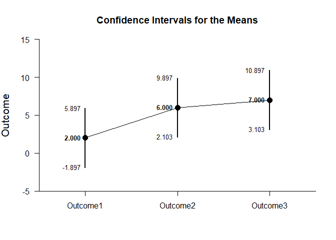
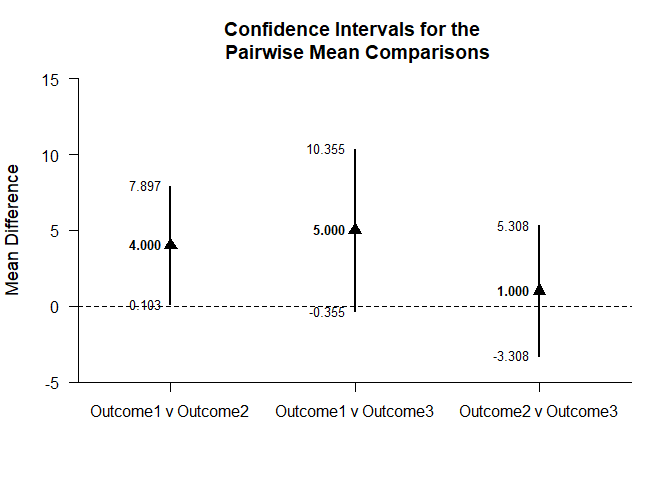
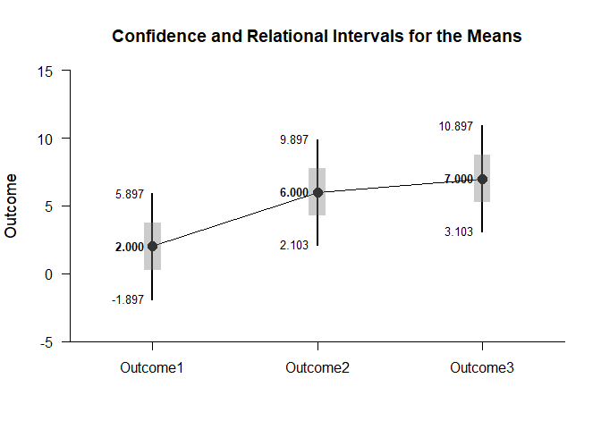
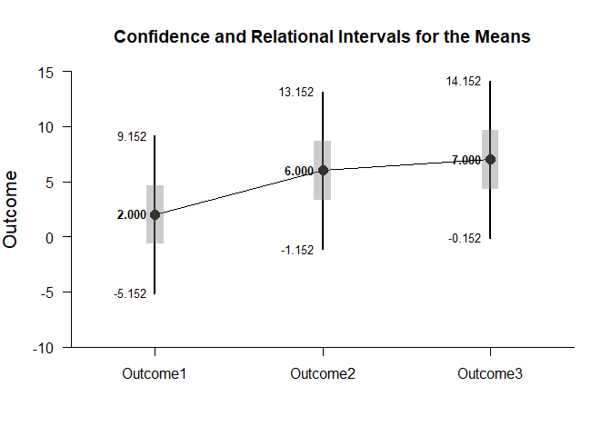

## Relational Repeated Measures (Within-Subjects) Tutorial with Summary Statistics

- [Data Management](#data-management)
- [Analyses of the Omnibus Effect](#analyses-of-the-omnibus-effect)
- [Analyses of the Pairwise Comparisons](#analyses-of-the-pairwise-comparisons)
- [Analyses of the Pairwise Comparisons Using Relational Intervals](#analyses-of-the-pairwise-comparisons-using-relational-intervals)

---

### Data Management

This code inputs the variable summaries and creates a summary table.

```r
Outcome1 <- c(N=4,M=2.000,SD=2.449)
Outcome2 <- c(N=4,M=6.000,SD=2.449)
Outcome3 <- c(N=4,M=7.000,SD=2.449)
RepeatedSummary <- rbind(Outcome1,Outcome2,Outcome3)
class(RepeatedSummary) <- "wss"
```

This code creates a correlation matrix, enters just the top triangle, and then uses a function to fill in the whole matrix.

```r
RepeatedCorr <- declareCorrelations("Outcome1","Outcome2","Outcome3")
RepeatedCorr["Outcome1","Outcome2"] <- .500
RepeatedCorr["Outcome1","Outcome3"] <- .056
RepeatedCorr["Outcome2","Outcome3"] <- .389
RepeatedCorr <- fillCorrelations(RepeatedCorr)
```

### Analyses of the Omnibus Effect

This section produces analyses that are the traditional way to represent and test overall variable differences.

#### Confidence Intervals for the Means

This code will provide a table of confidence intervals for each of the variables.

```r
estimateMeans(RepeatedSummary)
```

```
## $`Confidence Intervals for the Means`
##                M      SE      df      LL      UL
## Outcome1   2.000   1.224   3.000  -1.897   5.897
## Outcome2   6.000   1.224   3.000   2.103   9.897
## Outcome3   7.000   1.224   3.000   3.103  10.897
```

This code will produce a graph of the confidence intervals for each of the variables.

```r
plotMeans(RepeatedSummary)
```

<!-- -->

#### Significance Tests for the Omnibus Effect

This code provides an ANOVA source table for the omnibus effect.

```r
describeMeansOmnibus(RepeatedSummary,RepeatedCorr)
```

```
## $`Analysis of Variance Source Table`
##              SS      df      MS
## Subject  29.328   3.000   9.776
## Factor   56.000   2.000  28.000
## Error    24.650   6.000   4.108
```

```r
testMeansOmnibus(RepeatedSummary,RepeatedCorr)
```

```
## $`Hypothesis Test for the Omnibus Effect`
##               F     dff     dfe       p
## Omnibus   6.816   2.000   6.000   0.029
```

### Analyses of the Pairwise Comparisons

This section provides analyses of all possible pairwise comparisons among the variables.

#### Confidence Intervals for the Pairwise Comparisons

This code will provide a table of descriptive statistics and confidence intervals for each pairwise comparison.


```r
estimateMeansPairwise(RepeatedSummary,RepeatedCorr)
```

```
## $`Confidence Intervals for the Pairwise Mean Comparisons`
##                        Diff      SE      df      LL      UL
## Outcome1 v Outcome2   4.000   1.224   3.000   0.103   7.897
## Outcome1 v Outcome3   5.000   1.683   3.000  -0.355  10.355
## Outcome2 v Outcome3   1.000   1.354   3.000  -3.308   5.308
```

This code will produce a graph of the confidence intervals for each of the pairwise comparisons.

```r
plotMeansPairwise(RepeatedSummary,RepeatedCorr,mu=0)
```

<!-- -->

#### Significance Tests of the Pairwise Comparisons

This code will produce a table of NHST for each of the pairwise comparisons. In this case, all the comparisons are tested against a value of zero.

```r
testMeansPairwise(RepeatedSummary,RepeatedCorr)
```

```
## $`Hypothesis Tests for the Pairwise Mean Comparisons`
##                        Diff      SE      df       t       p
## Outcome1 v Outcome2   4.000   1.224   3.000   3.267   0.047
## Outcome1 v Outcome3   5.000   1.683   3.000   2.972   0.059
## Outcome2 v Outcome3   1.000   1.354   3.000   0.739   0.514
```

### Analyses of the Pairwise Comparisons Using Relational Intervals

This section provides analyses of all possible pairwise comparisons among the variables using relational intervals.

#### Confidence and Relational Intervals for the Pairwise Comparisons

This code will provide a table of confidence and relational intervals for each pairwise comparison.

```r
estimateMeansRelational(RepeatedSummary,RepeatedCorr)
```

```
## $`Confidence and Relational Intervals for the Means`
##                M   CI.LL   CI.UL   RI.LL   RI.UL
## Outcome1   2.000  -1.897   5.897   0.247   3.753
## Outcome2   6.000   2.103   9.897   4.247   7.753
## Outcome3   7.000   3.103  10.897   5.247   8.753
```

This code will produce a graph of the confidence and relational intervals for each of the pairwise comparisons.

```r
plotMeansRelational(RepeatedSummary,RepeatedCorr)
```

<!-- -->

The code defaults to 95% confidence and relational intervals. This can be changed if desired.

```r
estimateMeansRelational(RepeatedSummary,RepeatedCorr,conf.level=.99)
```

```
## $`Confidence and Relational Intervals for the Means`
##                M   CI.LL   CI.UL   RI.LL   RI.UL
## Outcome1   2.000  -5.152   9.152  -0.657   4.657
## Outcome2   6.000  -1.152  13.152   3.343   8.657
## Outcome3   7.000  -0.152  14.152   4.343   9.657
```

For the graph, it is possible to change the confidence level.

```r
plotMeansRelational(RepeatedSummary,RepeatedCorr,conf.level=.99)
```

<!-- -->
