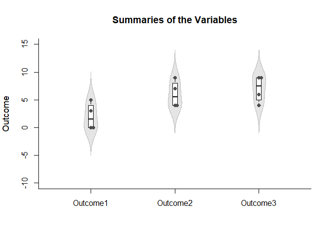
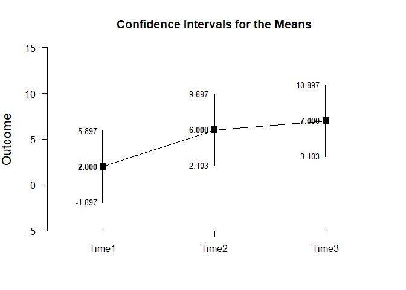
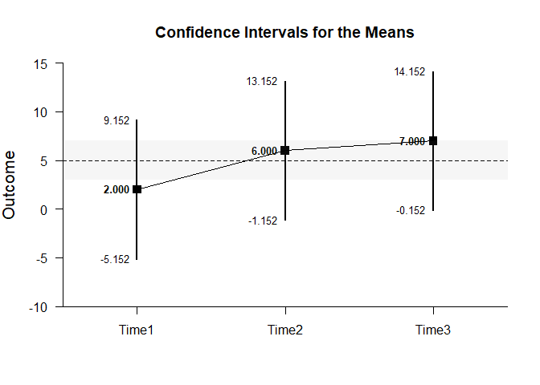
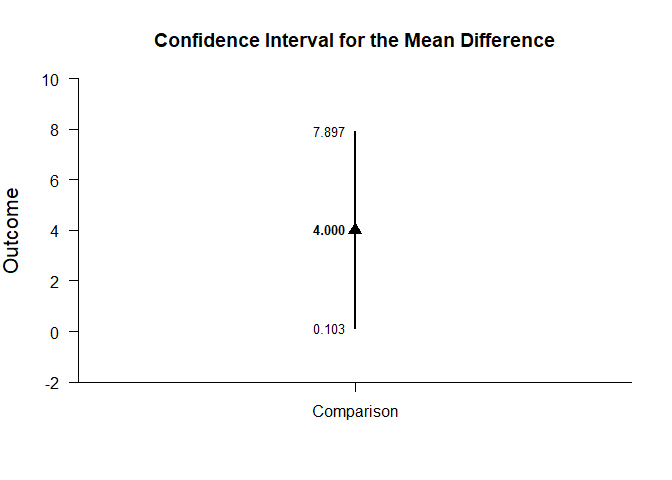
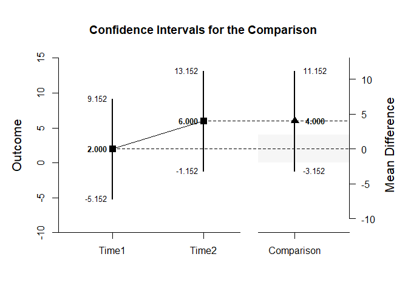
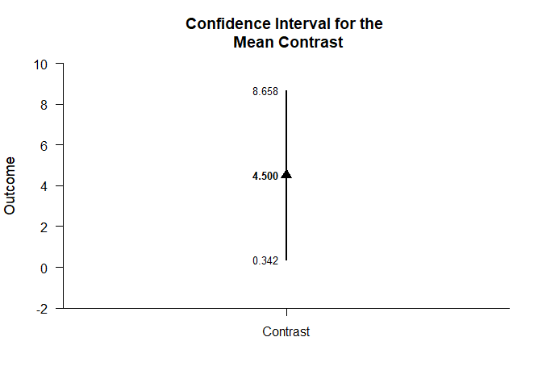
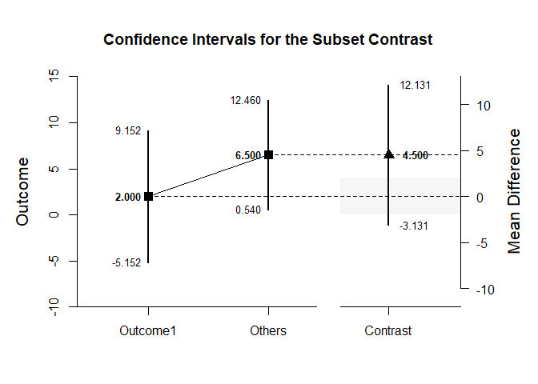
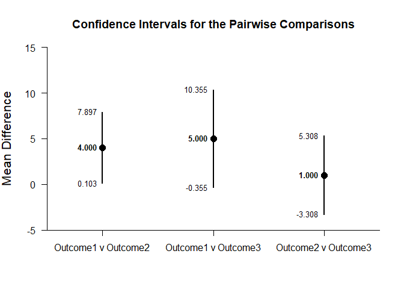
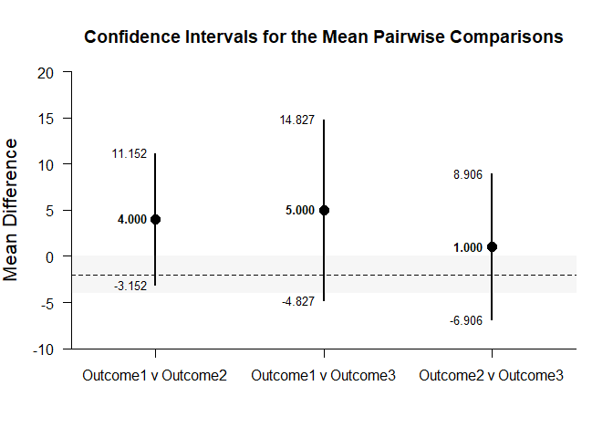

## Repeated Measures (Within-Subjects) Tutorial with Data

### Table of Contents

- [Data Management](#data-management)
    - [Data Entry](#data-entry)
    - [Plot of the Data](#plot-of-the-data)
    - [Descriptive Statistics](#descriptive-statistics)
- [Analyses of the Means](#analyses-of-the-means)
    - [Confidence Intervals for the Means](#confidence-intervals-for-the-means)
    - [Plots of Confidence Intervals for the Means](#plots-of-confidence-intervals-for-the-means)
    - [Significance Tests for the Means](#significance-tests-for-the-means)
    - [Effect Sizes for the Means](#effect-sizes-for-the-means)
- [Analyses of a Comparison](#analyses-of-a-comparison)
    - [Confidence Interval for the Mean Difference](#confidence-interval-for-the-mean-difference)
    - [Plots of Confidence Intervals for the Mean Difference](#plots-of-confidence-intervals-for-the-mean-difference)
    - [Significance Test for the Mean Difference](#significance-test-for-the-mean-difference)
    - [Effect Size for the Mean Difference](#effect-size-for-the-mean-difference)
- [Analyses of a Contrast](#analyses-of-a-contrast)
    - [Confidence Interval for the Contrast](#confidence-interval-for-the-contrast)
    - [Plots of Confidence Intervals for a Contrast](#plots-of-confidence-intervals-for-a-contrast)
    - [Significance Test for the Contrast](#significance-test-for-the-contrast)
    - [Effect Size for a Contrast](#effect-size-for-a-contrast)
- [Analyses of the Pairwise Comparisons](#analyses-of-the-pairwise-comparisons)
    - [Confidence Intervals for the Pairwise Comparisons](#confidence-intervals-for-the-pairwise-comparisons)
    - [Plots of the Confidence Intervals for the Pairwise Comparisons](#plots-of-the-confidence-intervals-for-the-pairwise-comparisons)
    - [Significance Tests of the Pairwise Comparisons](#significance-tests-of-the-pairwise-comparisons)
    - [Effect Sizes for the Pairwise Comparisons](#effect-sizes-for-the-pairwise-comparisons)

---

### Data Management

#### Data Entry

This code inputs the variable names and creates a viewable data frame.

```r
Outcome1 <- c(0,0,3,5)
Outcome2 <- c(4,7,4,9)
Outcome3 <- c(9,6,4,9)
RepeatedData <- data.frame(Outcome1,Outcome2,Outcome3)
```

#### Plot of the Data


```r
plotViolins(Outcome1,Outcome2,Outcome3,main="Summaries of the Variables")
plotBoxes(Outcome1,Outcome2,Outcome3,add=TRUE)
plotData(Outcome1,Outcome2,Outcome3,add=TRUE,method="stack",pch=16)
```

<!-- -->

#### Descriptive Statistics

This code obtains the descriptive statistics for the data frame.

```r
describeMeans(Outcome1,Outcome2,Outcome3)
```

```
## $`Descriptive Statistics for the Data`
##                N       M      SD
## Outcome1   4.000   2.000   2.449
## Outcome2   4.000   6.000   2.449
## Outcome3   4.000   7.000   2.449
```

### Analyses of the Means

This section produces analyses that are equivalent to one-sample analyses separately for each level of a factor.

#### Confidence Intervals for the Means

This code will provide a table of confidence intervals for each level of the factor.

```r
estimateMeans(Outcome1,Outcome2,Outcome3)
```

```
## $`Confidence Intervals for the Means`
##                M      SE      df      LL      UL
## Outcome1   2.000   1.224   3.000  -1.897   5.897
## Outcome2   6.000   1.224   3.000   2.103   9.897
## Outcome3   7.000   1.224   3.000   3.103  10.897
```

The code defaults to 95% confidence intervals. This can be changed if desired.

```r
estimateMeans(Outcome1,Outcome2,Outcome3,conf.level=.99)
```

```
## $`Confidence Intervals for the Means`
##                M      SE      df      LL      UL
## Outcome1   2.000   1.224   3.000  -5.152   9.152
## Outcome2   6.000   1.224   3.000  -1.152  13.152
## Outcome3   7.000   1.224   3.000  -0.152  14.152
```

#### Plots of Confidence Intervals for the Means

This code will produce a graph of the confidence intervals for each level of the factor.

```r
plotMeans(Outcome1,Outcome2,Outcome3)
```

<!-- -->

Of course, it is possible to change from the default confidence level. Additionally, it is possible to add a comparison line to represent a population (or test) value and a region of practical equivalence.

```r
plotMeans(Outcome1,Outcome2,Outcome3,conf.level=.99,mu=5,rope=c(3,7))
```

<!-- -->

#### Significance Tests for the Means

This code will produce a table of NHST separately for each level of the factor. In this case, all the means are tested against a value of zero.

```r
testMeans(Outcome1,Outcome2,Outcome3)
```

```
## $`Hypothesis Tests for the Means`
##             Diff      SE      df       t       p
## Outcome1   2.000   1.224   3.000   1.633   0.201
## Outcome2   6.000   1.224   3.000   4.900   0.016
## Outcome3   7.000   1.224   3.000   5.717   0.011
```

Often, the default test value of zero is not meaningful or plausible. This too can be altered (often in conjunction with what is presented in the plot).

```r
testMeans(Outcome1,Outcome2,Outcome3,mu=5)
```

```
## $`Hypothesis Tests for the Means`
##             Diff      SE      df       t       p
## Outcome1  -3.000   1.224   3.000  -2.450   0.092
## Outcome2   1.000   1.224   3.000   0.817   0.474
## Outcome3   2.000   1.224   3.000   1.633   0.201
```

#### Effect Sizes for the Means

This code will produce a table of standardized mean differences separately for each level of the factor. In this case, the mean is compared to zero to form the effect size.

```r
standardizeMeans(Outcome1,Outcome2,Outcome3)
```

```
## $`Confidence Intervals for the Standardized Means`
##                d      SE      LL      UL
## Outcome1   0.817   0.616  -0.387   1.934
## Outcome2   2.450   0.955   0.325   4.532
## Outcome3   2.858   1.063   0.464   5.227
```

Here too it is possible to alter the width of the confidence intervals and to establish a more plausible comparison value for the effect size.

```r
standardizeMeans(Outcome1,Outcome2,Outcome3,mu=5,conf.level=.99)
```

```
## $`Confidence Intervals for the Standardized Means`
##                d      SE      LL      UL
## Outcome1  -1.225   0.680  -3.011   0.547
## Outcome2   0.408   0.574  -0.968   1.734
## Outcome3   0.817   0.616  -0.732   2.320
```

### Analyses of a Comparison

This section produces analyses that are equivalent to comparisons of two levels of a factor.

#### Confidence Interval for the Mean Difference

This code identifies the two levels for comparison and estimates the confidence interval of the difference.

```r
estimateDifference(Outcome1,Outcome2)
```

```
## $`Confidence Interval for the Difference`
##               Diff      SE      df      LL      UL
## Comparison   4.000   1.224   3.000   0.103   7.897
```

Of course, you can change the confidence level from the default 95% if desired.

```r
estimateDifference(Outcome1,Outcome2,conf.level=.99)
```

```
## $`Confidence Interval for the Difference`
##               Diff      SE      df      LL      UL
## Comparison   4.000   1.224   3.000  -3.152  11.152
```

#### Plots of Confidence Intervals for the Mean Difference

This code obtains and plots the confidence intervals for the levels and the mean difference in the identified comparison.

```r
plotDifference(Outcome1,Outcome2)
```

<!-- -->

Once again, the confidence levels can be changed away from the default and a region of practical equivalence can be added.

```r
plotDifference(Outcome1,Outcome2,conf.level=.99,rope=c(-2,2))
```

<!-- -->

#### Significance Test for the Mean Difference

This code produces NHST for the identified comparison (using a default test value of zero).

```r
testDifference(Outcome1,Outcome2)
```

```
## $`Hypothesis Test for the Difference`
##               Diff      SE      df       t       p
## Comparison   4.000   1.224   3.000   3.267   0.047
```

If the default value of zero is not plausible, it too can be changed.

```r
testDifference(Outcome1,Outcome2,mu=-2)
```

```
## $`Hypothesis Test for the Difference`
##               Diff      SE      df       t       p
## Comparison   6.000   1.224   3.000   4.900   0.016
```

#### Effect Size for the Mean Difference

This code calculates a standardized mean difference for the comparison and its confidence interval.

```r
standardizeDifference(Outcome1,Outcome2)
```

```
## $`Confidence Interval for the Standardized Difference`
##                Est      SE      LL      UL
## Comparison   1.633   0.782   0.101   3.166
```

The width of the confidence interval for the effect size can be altered if desired.

```r
standardizeDifference(Outcome1,Outcome2,conf.level=.99)
```

```
## $`Confidence Interval for the Standardized Difference`
##                Est      SE      LL      UL
## Comparison   1.633   0.782  -0.380   3.647
```

### Analyses of a Contrast

This section produces analyses that are equivalent to analyses involving multiple levels of a factor.

This code identifies a contrast among the levels.

```r
O1vsOthers <- c(-1,.5,.5)
```

#### Confidence Interval for the Contrast

This code produces a confidence interval for that contrast.

```r
estimateContrast(Outcome1,Outcome2,Outcome3,contrast=O1vsOthers)
```

```
## $`Confidence Interval for the Contrast`
##              Est      SE      df      LL      UL
## Contrast   4.500   1.307   3.000   0.342   8.658
```

As in all other cases, the default value of the confidence interval can be changed.

```r
estimateContrast(Outcome1,Outcome2,Outcome3,contrast=O1vsOthers,conf.level=.99)
```

```
## $`Confidence Interval for the Contrast`
##              Est      SE      df      LL      UL
## Contrast   4.500   1.307   3.000  -3.131  12.131
```

#### Plots of Confidence Intervals for a Contrast

This code obtains and plots the confidence intervals for the groups and the mean difference in the identified contrast.

```r
plotContrast(Outcome1,Outcome2,Outcome3,contrast=O1vsOthers)
```

<!-- -->

The width of the confidence interval for the contrast can be altered and a region of practice equivalence can be added.

```r
plotContrast(Outcome1,Outcome2,Outcome3,contrast=O1vsOthers,labels=c("Outcome1","Others"),conf.level=.99,rope=c(-2,2))
```

<!-- -->

#### Significance Test for the Contrast

This code produces a NHST for the identified contrast. It tests the contrast against a value of zero by default.

```r
testContrast(Outcome1,Outcome2,Outcome3,contrast=O1vsOthers)
```

```
## $`Hypothesis Test for the Contrast`
##              Est      SE      df       t       p
## Contrast   4.500   1.307   3.000   3.444   0.041
```

If desired, the contrast can be tested against other values.

```r
testContrast(Outcome1,Outcome2,Outcome3,contrast=O1vsOthers,mu=4)
```

```
## $`Hypothesis Test for the Contrast`
##              Est      SE      df       t       p
## Contrast   0.500   1.307   3.000   0.383   0.727
```

#### Effect Size for a Contrast

This code calculates a standardized contrast and its confidence interval.

```r
standardizeContrast(Outcome1,Outcome2,Outcome3,contrast=O1vsOthers)
```

```
## $`Confidence Interval for the Standardized Contrast`
##              Est      SE      LL      UL
## Contrast   1.837   0.741   0.386   3.289
```

The width of the confidence interval for the effect size can be altered if desired.

```r
standardizeContrast(Outcome1,Outcome2,Outcome3,contrast=O1vsOthers,conf.level=.99)
```

```
## $`Confidence Interval for the Standardized Contrast`
##              Est      SE      LL      UL
## Contrast   1.837   0.741  -0.071   3.745
```

### Analyses of the Pairwise Comparisons

This section provides analyses of all possible pairwise comparisons among the levels of the factor.

#### Confidence Intervals for the Pairwise Comparisons

This code will provide a table of descriptive statistics and confidence intervals for each pairwise comparison.


```r
estimatePairwise(Outcome1,Outcome2,Outcome3)
```

```
## $`Confidence Intervals for the Pairwise Comparisons`
##                        Diff      SE      df      LL      UL
## Outcome1 v Outcome2   4.000   1.224   3.000   0.103   7.897
## Outcome1 v Outcome3   5.000   1.683   3.000  -0.355  10.355
## Outcome2 v Outcome3   1.000   1.354   3.000  -3.308   5.308
```

The code defaults to 95% confidence intervals. This can be changed if desired.


```r
estimatePairwise(Outcome1,Outcome2,Outcome3,conf.level=.99)
```

```
## $`Confidence Intervals for the Pairwise Comparisons`
##                        Diff      SE      df      LL      UL
## Outcome1 v Outcome2   4.000   1.224   3.000  -3.152  11.152
## Outcome1 v Outcome3   5.000   1.683   3.000  -4.827  14.827
## Outcome2 v Outcome3   1.000   1.354   3.000  -6.906   8.906
```

#### Plots of the Confidence Intervals for the Pairwise Comparisons

This code will produce a graph of the confidence intervals for each of the pairwise comparisons.


```r
plotPairwise(Outcome1,Outcome2,Outcome3)
```

<!-- -->

Of course, it is possible to change from the default confidence level. Additionally, it is possible to add a comparison line to represent a population (or test) value and a region of practical equivalence.


```r
plotPairwise(Outcome1,Outcome2,Outcome3,mu=-2,conf.level=.99,rope=c(-4,0))
```

<!-- -->

#### Significance Tests of the Pairwise Comparisons

This code will produce a table of NHST for each of the pairwise comparisons. In this case, all the comparisons are tested against a value of zero.


```r
testPairwise(Outcome1,Outcome2,Outcome3)
```

```
## $`Hypothesis Tests for the Pairwise Comparisons`
##                        Diff      SE      df       t       p
## Outcome1 v Outcome2   4.000   1.224   3.000   3.267   0.047
## Outcome1 v Outcome3   5.000   1.683   3.000   2.972   0.059
## Outcome2 v Outcome3   1.000   1.354   3.000   0.739   0.514
```

Often, the default test value of zero is not meaningful or plausible. This too can be altered (often in conjunction with what is presented in the plot).


```r
testPairwise(Outcome1,Outcome2,Outcome3,mu=-2)
```

```
## $`Hypothesis Tests for the Pairwise Comparisons`
##                        Diff      SE      df       t       p
## Outcome1 v Outcome2   6.000   1.224   3.000   4.900   0.016
## Outcome1 v Outcome3   7.000   1.683   3.000   4.160   0.025
## Outcome2 v Outcome3   3.000   1.354   3.000   2.216   0.113
```

#### Effect Sizes for the Pairwise Comparisons

This code will produce a table of standardized mean differences for each pairwise comparison. 


```r
standardizePairwise(Outcome1,Outcome2,Outcome3)
```

```
## $`Confidence Intervals for the Standardized Pairwise Comparisons`
##                         Est      SE      LL      UL
## Outcome1 v Outcome2   1.633   0.782   0.101   3.166
## Outcome1 v Outcome3   2.042   0.876   0.325   3.759
## Outcome2 v Outcome3   0.408   0.592  -0.752   1.569
```

Here too it is possible to alter the width of the confidence intervals.


```r
standardizePairwise(Outcome1,Outcome2,Outcome3,conf.level=.99)
```

```
## $`Confidence Intervals for the Standardized Pairwise Comparisons`
##                         Est      SE      LL      UL
## Outcome1 v Outcome2   1.633   0.782  -0.380   3.647
## Outcome1 v Outcome3   2.042   0.876  -0.215   4.298
## Outcome2 v Outcome3   0.408   0.592  -1.117   1.934
```
