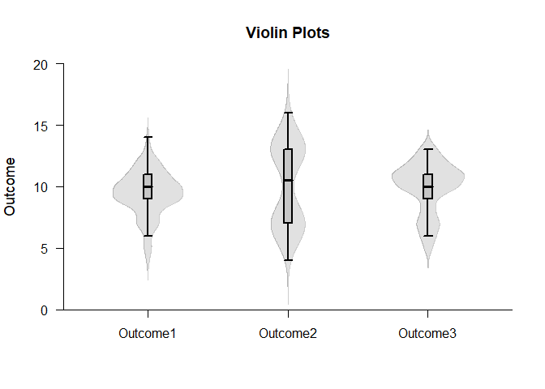
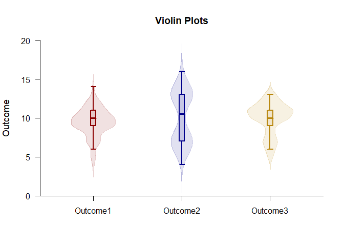
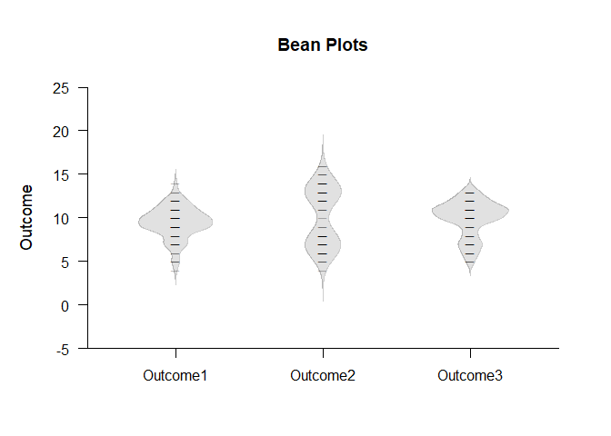
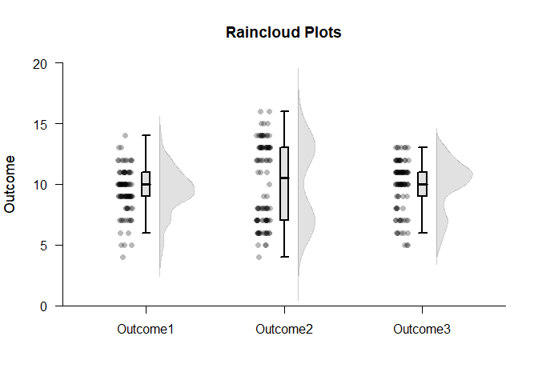
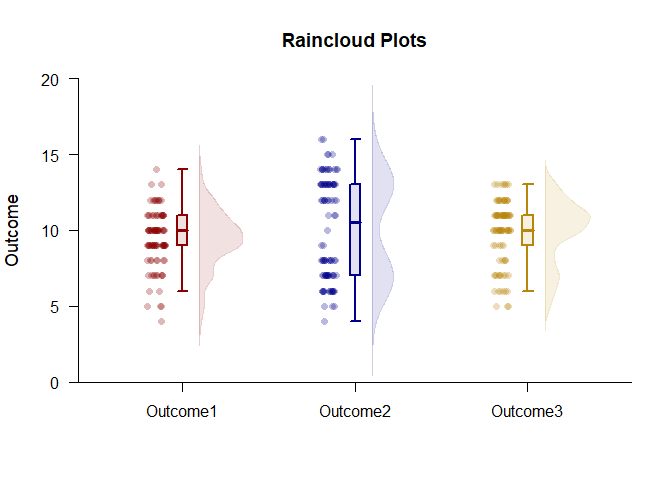

## Exploratory Analyses Repeated Measures Data Application

This page provides violin plots, beanplots, and raincloud plots using repeated-measures (within-subjects) data.

### Data Management

Simulate some data with various distributional shapes.

```r
Outcome1 <- round(rnorm(100,10,2),0)
Outcome2 <- c(round(rnorm(50,7,1),0),round(rnorm(50,13,1),0))
Outcome3 <- c(round(rnorm(25,7,1),0),round(rnorm(75,11,1),0))
RepeatedData <- data.frame(Outcome1,Outcome2,Outcome3)
```

### Violin Plots

Build violin plots using multiple basic plot calls.

```r
(RepeatedData) |> plotBoxes(values=FALSE,main="Violin Plots")
(RepeatedData) |> plotDensity(add=TRUE,offset=0,type="full")
```

<!-- -->

Obtain violin plots using one call (and enhance the plot).

```r
(RepeatedData) |> plotViolins(col=c("darkred","darkblue","darkgoldenrod"))
```

<!-- -->

### Bean Plots

Build bean plots using multiple basic plot calls.

```r
(RepeatedData) |> plotDensity(type="full",offset=0,main="Bean Plots")
(RepeatedData) |> plotData(add=TRUE,offset=0,pch=95,method="overplot")
```

<!-- -->

Obtain bean plots using one call (and enhance the plot).

```r
(RepeatedData) |> plotBeans(col=c("darkred","darkblue","darkgoldenrod"))
```

<!-- -->

### Raincloud Plots

Build raincloud plots using multiple basic plot calls.

```r
(RepeatedData) |> plotBoxes(values=FALSE,main="Raincloud Plots")
(RepeatedData) |> plotDensity(add=TRUE,offset=.1)
(RepeatedData) |> plotData(add=TRUE,method="jitter",offset=-.15)
```

<!-- -->

Obtain raincloud plots using one call (and enhance the plot).

```r
(RepeatedData) |> plotRainclouds(col=c("darkred","darkblue","darkgoldenrod"))
```

<!-- -->
