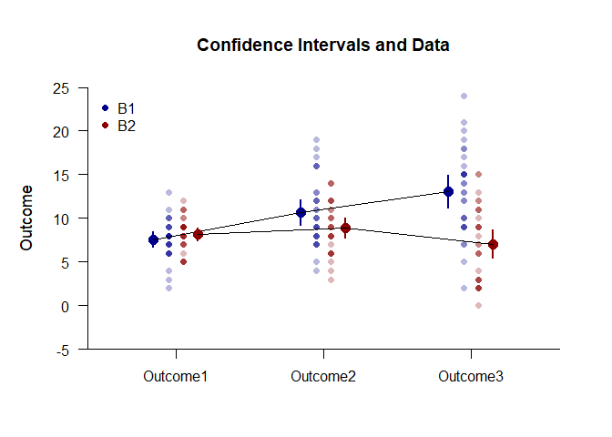

## Exposition Mixed Data Application

This page analyzes simple effects with an exposition pipe operator using mixed design (between-subjects and within-subjects) data.

### Data Management

Simulate some data.

```r
Factor <- c(rep(1,30),rep(2,30))
Outcome1 <- c(round(rnorm(30,mean=8,sd=2),0),round(rnorm(30,mean=8,sd=2),0))
Outcome2 <- c(round(rnorm(30,mean=11,sd=4),0),round(rnorm(30,mean=8,sd=3),0))
Outcome3 <- c(round(rnorm(30,mean=12,sd=4),0),round(rnorm(30,mean=7,sd=4),0))
Factor <- factor(Factor,levels=c(1,2),labels=c("Level1","Level2"))
MixedData <- data.frame(Factor,Outcome1,Outcome2,Outcome3)
```
Subset the data for each simple effect.

```r
MixedB1 <- subset(MixedData,Factor=="Level1")
MixedB2 <- subset(MixedData,Factor=="Level2")
```

### Analyses of the Means

Use the exposition pipe (%$>%) to identify the subset of interest, select the variables to analyzed, and use the native pipe to plot the means and the data.

```r
(MixedB1) %$>% cbind(Outcome1,Outcome2,Outcome3) |> plotData(main="Confidence Intervals and Data",ylim=c(-5,25),offset=-.05,method="overplot",col="darkblue")
(MixedB2) %$>% cbind(Outcome1,Outcome2,Outcome3) |> plotData(add=TRUE,offset=.05,method="overplot",col="darkred")
(MixedB1) %$>% cbind(Outcome1,Outcome2,Outcome3) |> plotMeans(add=TRUE,offset=-.15,col="darkblue",values=FALSE)
(MixedB2) %$>% cbind(Outcome1,Outcome2,Outcome3) |> plotMeans(add=TRUE,offset=.15,col="darkred",values=FALSE)
legend("topleft",inset=.01,box.lty=0,pch=16,legend=c("B1","B2"),col=c("darkblue","darkred"))
```

<!-- -->

Use a similar process to obtain the tables of confidence interval estimates.

```r
(MixedB1) %$>% cbind(Outcome1,Outcome2,Outcome3) |> estimateMeans()
```

```
## $`Confidence Intervals for the Means`
##                M      SE      df      LL      UL
## Outcome1   7.600   0.411  29.000   6.759   8.441
## Outcome2  10.700   0.708  29.000   9.252  12.148
## Outcome3  13.100   0.908  29.000  11.244  14.956
```

```r
(MixedB2) %$>% cbind(Outcome1,Outcome2,Outcome3) |> estimateMeans()
```

```
## $`Confidence Intervals for the Means`
##                M      SE      df      LL      UL
## Outcome1   8.133   0.358  29.000   7.401   8.865
## Outcome2   8.900   0.539  29.000   7.798  10.002
## Outcome3   7.067   0.786  29.000   5.459   8.675
```

### Analyses of the Simple Effects

Using the pipe operators, get the source table for each simple effect.

```r
(MixedB1) %$>% cbind(Outcome1,Outcome2,Outcome3) |> describeMeansOmnibus()
```

```
## $`Source Table for the Model`
##               SS      df      MS
## Subjects 480.400  29.000  16.566
## Measures 456.200   2.000 228.100
## Error    819.800  58.000  14.134
```

```r
(MixedB2) %$>% cbind(Outcome1,Outcome2,Outcome3) |> describeMeansOmnibus()
```

```
## $`Source Table for the Model`
##               SS      df      MS
## Subjects 258.900  29.000   8.928
## Measures  50.867   2.000  25.433
## Error    643.133  58.000  11.089
```
Test each simple effect for statistical significance.

```r
(MixedB1) %$>% cbind(Outcome1,Outcome2,Outcome3) |> testMeansOmnibus()
```

```
## $`Hypothesis Test for the Model`
##                F     df1     df2       p
## Measures  16.138   2.000  58.000   0.000
```

```r
(MixedB2) %$>% cbind(Outcome1,Outcome2,Outcome3) |> testMeansOmnibus()
```

```
## $`Hypothesis Test for the Model`
##                F     df1     df2       p
## Measures   2.294   2.000  58.000   0.110
```
Obtain the proportion of variance accounted for by each simple effect.

```r
(MixedB1) %$>% cbind(Outcome1,Outcome2,Outcome3) |> estimateMeansOmnibus()
```

```
## $`Proportion of Variance Accounted For by the Model`
##              Est      LL      UL
## Measures   0.358   0.182   0.476
```

```r
(MixedB2) %$>% cbind(Outcome1,Outcome2,Outcome3) |> estimateMeansOmnibus()
```

```
## $`Proportion of Variance Accounted For by the Model`
##              Est      LL      UL
## Measures   0.073   0.000   0.178
```
