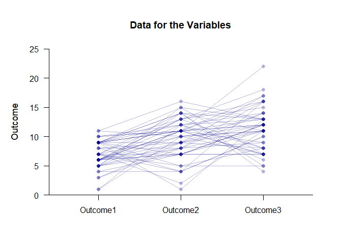
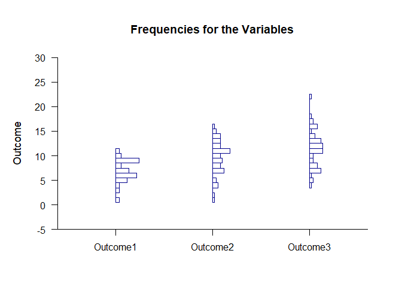

## Frequencies Repeated Measures Data Application

This page provides basic data plots and frequency distributions using repeated-measures (within-subjects) data.

### Data Management

Simulate some data.

```r
Outcome1 <- round(rnorm(50,mean=7,sd=2),0)
Outcome2 <- round(rnorm(50,mean=11,sd=4),0)
Outcome3 <- round(rnorm(50,mean=12,sd=4),0)
RepeatedData <- data.frame(Outcome1,Outcome2,Outcome3)
```

### Data Plots

Plot the data and enhance with color.

```r
(RepeatedData) |> plotData(offset=0,method="overplot",connect=TRUE,col="darkblue")
```

<!-- -->

### Frequency Distributions

Describe the frequency distributions.

```r
(RepeatedData) |> describeFrequencies()
```

```
## $`Frequency Distribution for the Data: Outcome1`
##       Freq    Perc CumFreq CumPerc
## 1    2.000   4.000   2.000   4.000
## 3    2.000   4.000   4.000   8.000
## 4    2.000   4.000   6.000  12.000
## 5    6.000  12.000  12.000  24.000
## 6   11.000  22.000  23.000  46.000
## 7    7.000  14.000  30.000  60.000
## 8    3.000   6.000  33.000  66.000
## 9   12.000  24.000  45.000  90.000
## 10   3.000   6.000  48.000  96.000
## 11   2.000   4.000  50.000 100.000
## 
## $`Frequency Distribution for the Data: Outcome2`
##       Freq    Perc CumFreq CumPerc
## 1    1.000   2.000   1.000   2.000
## 2    1.000   2.000   2.000   4.000
## 4    3.000   6.000   5.000  10.000
## 5    2.000   4.000   7.000  14.000
## 7    6.000  12.000  13.000  26.000
## 8    4.000   8.000  17.000  34.000
## 9    5.000  10.000  22.000  44.000
## 10   4.000   8.000  26.000  52.000
## 11   9.000  18.000  35.000  70.000
## 12   4.000   8.000  39.000  78.000
## 13   4.000   8.000  43.000  86.000
## 14   4.000   8.000  47.000  94.000
## 15   2.000   4.000  49.000  98.000
## 16   1.000   2.000  50.000 100.000
## 
## $`Frequency Distribution for the Data: Outcome3`
##       Freq    Perc CumFreq CumPerc
## 4    1.000   2.000   1.000   2.000
## 5    2.000   4.000   3.000   6.000
## 6    1.000   2.000   4.000   8.000
## 7    6.000  12.000  10.000  20.000
## 8    4.000   8.000  14.000  28.000
## 9    2.000   4.000  16.000  32.000
## 10   2.000   4.000  18.000  36.000
## 11   7.000  14.000  25.000  50.000
## 12   7.000  14.000  32.000  64.000
## 13   6.000  12.000  38.000  76.000
## 14   3.000   6.000  41.000  82.000
## 15   1.000   2.000  42.000  84.000
## 16   4.000   8.000  46.000  92.000
## 17   2.000   4.000  48.000  96.000
## 18   1.000   2.000  49.000  98.000
## 22   1.000   2.000  50.000 100.000
```

Plot the frequency distributions and enhance with color.

```r
(RepeatedData) |> plotFrequencies(offset=0,col="darkblue")
```

<!-- -->
