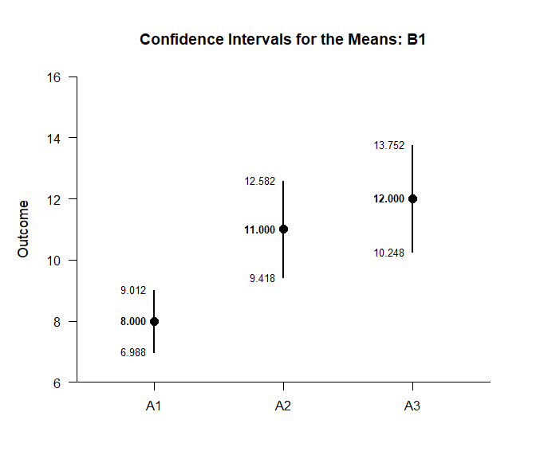
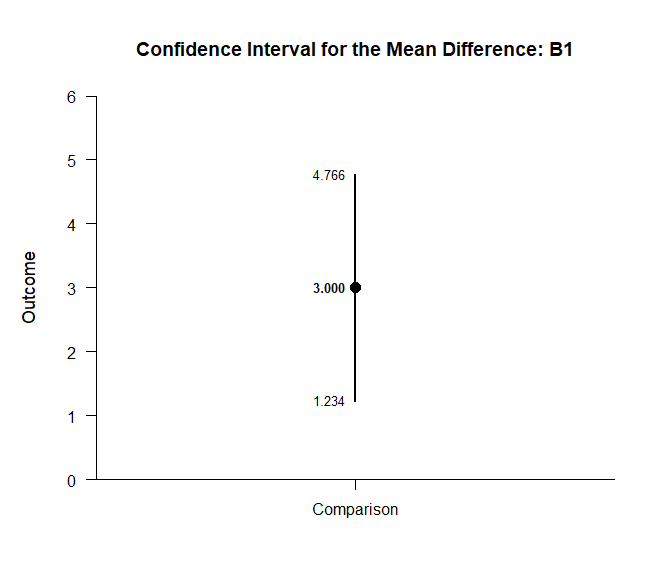

## By Factorial Data Application

This page analyzes simple effects using factorial (between-subjects) data.

### Data Management

Simulate some data.

```r
FactorA <- c(rep(1,30),rep(2,30),rep(3,30),rep(1,30),rep(2,30),rep(3,30))
FactorB <- c(rep(1,90),rep(2,90))
FactorA <- factor(FactorA,levels=c(1,2,3),labels=c("A1","A2","A3"))
FactorB <- factor(FactorB,levels=c(1,2),labels=c("B1","B2"))
Outcome <- c(rnorm(30,mean=8,sd=2),rnorm(30,mean=11,sd=4),rnorm(30,mean=12,sd=4),rnorm(30,mean=8,sd=2),rnorm(30,mean=8,sd=3),rnorm(30,mean=7,sd=4))
FactorialData <- data.frame(FactorA,FactorB,Outcome)
```

### Descriptive Statistics

Get descriptive statistics separately for each simple effect.

```r
(Outcome~FactorA) |> describeMeansBy(by=FactorB)
```

```
## $`Descriptive Statistics for the Data: B1`
##          N       M      SD    Skew    Kurt
## A1  30.000   7.254   1.819   0.091  -0.676
## A2  30.000  10.680   4.902  -0.555   0.532
## A3  30.000  12.149   4.628  -0.557   0.756
## 
## $`Descriptive Statistics for the Data: B2`
##          N       M      SD    Skew    Kurt
## A1  30.000   7.388   2.259   0.616   0.814
## A2  30.000   7.521   3.360   0.396  -0.783
## A3  30.000   6.723   3.952   0.166   0.782
```

### Analyses of the Means

Estimate, plot, test, and standardize the means separately for each simple effect.

```r
(Outcome~FactorA) |> estimateMeansBy(by=FactorB)
```

```
## $`Confidence Intervals for the Means: B1`
##          M      SE      df      LL      UL
## A1   7.254   0.332  29.000   6.575   7.934
## A2  10.680   0.895  29.000   8.849  12.510
## A3  12.149   0.845  29.000  10.421  13.877
## 
## $`Confidence Intervals for the Means: B2`
##          M      SE      df      LL      UL
## A1   7.388   0.412  29.000   6.545   8.231
## A2   7.521   0.613  29.000   6.266   8.776
## A3   6.723   0.721  29.000   5.247   8.199
```

```r
(Outcome~FactorA) |> plotMeansBy(by=FactorB)
```

<!-- --><!-- -->

```r
(Outcome~FactorA) |> testMeansBy(by=FactorB)
```

```
## $`Hypothesis Tests for the Means: B1`
##       Diff      SE      df       t       p
## A1   7.254   0.332  29.000  21.838   0.000
## A2  10.680   0.895  29.000  11.932   0.000
## A3  12.149   0.845  29.000  14.380   0.000
## 
## $`Hypothesis Tests for the Means: B2`
##       Diff      SE      df       t       p
## A1   7.388   0.412  29.000  17.917   0.000
## A2   7.521   0.613  29.000  12.259   0.000
## A3   6.723   0.721  29.000   9.318   0.000
```

```r
(Outcome~FactorA) |> estimateStandardizedMeansBy(by=FactorB)
```

```
## $`Confidence Intervals for the Standardized Means: B1`
##          d      SE      LL      UL
## A1   3.987   0.539   2.900   5.065
## A2   2.178   0.333   1.510   2.835
## A3   2.625   0.382   1.858   3.382
## 
## $`Confidence Intervals for the Standardized Means: B2`
##          d      SE      LL      UL
## A1   3.271   0.455   2.355   4.177
## A2   2.238   0.339   1.556   2.908
## A3   1.701   0.285   1.131   2.259
```

### Analyses of a Comparison

Specify a comparison separately for each simple effect.

```r
Comparison=factor(FactorB,c("A1","A2"))
```

Analyze the specified comparison separately for each simple effect.

```r
(Outcome~FactorA) |> estimateMeanDifferenceBy(by=FactorB)
```

```
## $`Confidence Interval for the Mean Difference: B1`
##               Diff      SE      df      LL      UL
## Comparison   3.425   0.955  36.840   1.491   5.360
## 
## $`Confidence Interval for the Mean Difference: B2`
##               Diff      SE      df      LL      UL
## Comparison   0.133   0.739  50.762  -1.351   1.617
```

```r
(Outcome~FactorA) |> plotMeanDifferenceBy(by=FactorB)
```

<!-- --><!-- -->

```r
(Outcome~FactorA) |> testMeanDifferenceBy(by=FactorB)
```

```
## $`Hypothesis Test for the Mean Difference: B1`
##               Diff      SE      df       t       p
## Comparison   3.425   0.955  36.840   3.588   0.001
## 
## $`Hypothesis Test for the Mean Difference: B2`
##               Diff      SE      df       t       p
## Comparison   0.133   0.739  50.762   0.180   0.858
```

```r
(Outcome~FactorA) |> estimateStandardizedMeanDifferenceBy(by=FactorB)
```

```
## $`Confidence Interval for the Standardized Mean Difference: B1`
##                  d      SE      LL      UL
## Comparison   0.926   0.284   0.370   1.483
## 
## $`Confidence Interval for the Standardized Mean Difference: B2`
##                  d      SE      LL      UL
## Comparison   0.046   0.263  -0.468   0.561
```

### Analyses of a Contrast

Specify a contrast for a factor.

```r
A1vsOthers <- c(-1,.5,.5)
```

Analyze the specified contrast separately for each simple effect.

```r
(Outcome~FactorA) |> estimateMeanContrastBy(by=FactorB,contrast=A1vsOthers)
```

```
## $`Confidence Interval for the Mean Contrast: B1`
##              Est      SE      df      LL      UL
## Contrast   4.160   0.699  82.449   2.769   5.551
## 
## $`Confidence Interval for the Mean Contrast: B2`
##              Est      SE      df      LL      UL
## Contrast  -0.266   0.628  82.410  -1.515   0.983
```

```r
(Outcome~FactorA) |> plotMeanContrastBy(by=FactorB,contrast=A1vsOthers)
```

<!-- --><!-- -->

```r
(Outcome~FactorA) |> testMeanContrastBy(by=FactorB,contrast=A1vsOthers)
```

```
## $`Hypothesis Test for the Mean Contrast: B1`
##              Est      SE      df       t       p
## Contrast   4.160   0.699  82.449   5.948   0.000
## 
## $`Hypothesis Test for the Mean Contrast: B2`
##              Est      SE      df       t       p
## Contrast  -0.266   0.628  82.410  -0.424   0.673
```

```r
(Outcome~FactorA) |> estimateStandardizedMeanContrastBy(by=FactorB,contrast=A1vsOthers)
```

```
## $`Confidence Interval for the Standardized Mean Contrast: B1`
##              Est      SE      LL      UL
## Contrast   1.032   0.198   0.644   1.420
## 
## $`Confidence Interval for the Standardized Mean Contrast: B2`
##              Est      SE      LL      UL
## Contrast  -0.081   0.196  -0.465   0.302
```
