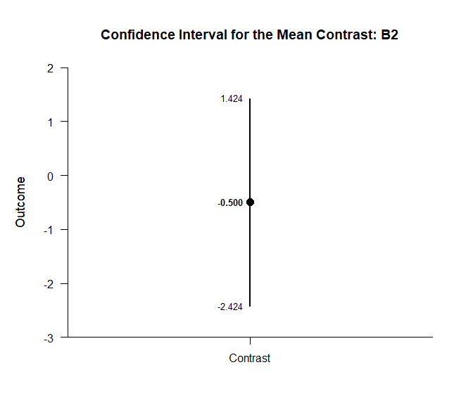

## By Factorial Data Application

This page analyzes simple effects using factorial (between-subjects)
data.

- [Data Management](#data-management)
- [Descriptive Statistics](#descriptive-statistics)
- [Analyses of the Means](#analyses-of-the-means)
- [Analyses of a Comparison](#analyses-of-a-comparison)
- [Analyses of a Contrast](#analyses-of-a-contrast)

------------------------------------------------------------------------

### Data Management

Simulate some data.

``` r
FactorA <- c(rep(1,30),rep(2,30),rep(3,30),rep(1,30),rep(2,30),rep(3,30))
FactorB <- c(rep(1,90),rep(2,90))
FactorA <- factor(FactorA,levels=c(1,2,3),labels=c("A1","A2","A3"))
FactorB <- factor(FactorB,levels=c(1,2),labels=c("B1","B2"))
Outcome <- c(rnorm(30,mean=8,sd=2),rnorm(30,mean=11,sd=4),rnorm(30,mean=12,sd=4),rnorm(30,mean=8,sd=2),rnorm(30,mean=8,sd=3),rnorm(30,mean=7,sd=4))
FactorialData <- data.frame(FactorA,FactorB,Outcome)
```

### Descriptive Statistics

Get descriptive statistics separately for each simple effect.

``` r
(Outcome~FactorA) |> describeMeansBy(by=FactorB)
```

    ## $`Descriptive Statistics for the Data: B1`
    ##          N       M      SD    Skew    Kurt
    ## A1  30.000   7.660   1.785   0.191  -0.387
    ## A2  30.000  11.056   4.953   0.103   0.261
    ## A3  30.000  11.675   2.719  -0.073   0.353
    ## 
    ## $`Descriptive Statistics for the Data: B2`
    ##          N       M      SD    Skew    Kurt
    ## A1  30.000   7.800   2.109   0.091  -0.237
    ## A2  30.000   7.829   3.205   0.222   0.286
    ## A3  30.000   7.048   4.090  -0.171  -0.337

### Analyses of the Means

Estimate, plot, test, and standardize the means separately for each
simple effect.

``` r
(Outcome~FactorA) |> estimateMeansBy(by=FactorB)
```

    ## $`Confidence Intervals for the Means: B1`
    ##          M      SE      df      LL      UL
    ## A1   7.660   0.326  29.000   6.993   8.326
    ## A2  11.056   0.904  29.000   9.207  12.906
    ## A3  11.675   0.496  29.000  10.659  12.690
    ## 
    ## $`Confidence Intervals for the Means: B2`
    ##          M      SE      df      LL      UL
    ## A1   7.800   0.385  29.000   7.012   8.587
    ## A2   7.829   0.585  29.000   6.632   9.026
    ## A3   7.048   0.747  29.000   5.521   8.575

``` r
(Outcome~FactorA) |> plotMeansBy(by=FactorB)
```

<!-- --><!-- -->

``` r
(Outcome~FactorA) |> testMeansBy(by=FactorB)
```

    ## $`Hypothesis Tests for the Means: B1`
    ##       Diff      SE      df       t       p
    ## A1   7.660   0.326  29.000  23.510   0.000
    ## A2  11.056   0.904  29.000  12.226   0.000
    ## A3  11.675   0.496  29.000  23.515   0.000
    ## 
    ## $`Hypothesis Tests for the Means: B2`
    ##       Diff      SE      df       t       p
    ## A1   7.800   0.385  29.000  20.254   0.000
    ## A2   7.829   0.585  29.000  13.378   0.000
    ## A3   7.048   0.747  29.000   9.438   0.000

``` r
(Outcome~FactorA) |> estimateStandardizedMeansBy(by=FactorB)
```

    ## $`Confidence Intervals for the Standardized Means: B1`
    ##          d      SE      LL      UL
    ## A1   4.292   0.576   3.131   5.444
    ## A2   2.232   0.339   1.552   2.901
    ## A3   4.293   0.576   3.132   5.445
    ## 
    ## $`Confidence Intervals for the Standardized Means: B2`
    ##          d      SE      LL      UL
    ## A1   3.698   0.505   2.680   4.705
    ## A2   2.443   0.361   1.716   3.158
    ## A3   1.723   0.287   1.149   2.285

### Analyses of a Comparison

Specify a comparison separately for each simple effect.

``` r
Comparison=factor(FactorB,c("A1","A2"))
```

Analyze the specified comparison separately for each simple effect.

``` r
(Outcome~FactorA) |> estimateMeanDifferenceBy(by=FactorB)
```

    ## $`Confidence Interval for the Mean Difference: B1`
    ##               Diff      SE      df      LL      UL
    ## Comparison   3.397   0.961  36.404   1.448   5.345
    ## 
    ## $`Confidence Interval for the Mean Difference: B2`
    ##               Diff      SE      df      LL      UL
    ## Comparison   0.030   0.701  50.150  -1.377   1.437

``` r
(Outcome~FactorA) |> plotMeanDifferenceBy(by=FactorB)
```

<!-- --><!-- -->

``` r
(Outcome~FactorA) |> testMeanDifferenceBy(by=FactorB)
```

    ## $`Hypothesis Test for the Mean Difference: B1`
    ##               Diff      SE      df       t       p
    ## Comparison   3.397   0.961  36.404   3.534   0.001
    ## 
    ## $`Hypothesis Test for the Mean Difference: B2`
    ##               Diff      SE      df       t       p
    ## Comparison   0.030   0.701  50.150   0.042   0.967

``` r
(Outcome~FactorA) |> estimateStandardizedMeanDifferenceBy(by=FactorB)
```

    ## $`Confidence Interval for the Standardized Mean Difference: B1`
    ##                  d      SE      LL      UL
    ## Comparison   0.912   0.284   0.357   1.468
    ## 
    ## $`Confidence Interval for the Standardized Mean Difference: B2`
    ##                  d      SE      LL      UL
    ## Comparison   0.011   0.263  -0.504   0.526

### Analyses of a Contrast

Specify a contrast for a factor.

``` r
A1vsOthers <- c(-1,.5,.5)
```

Analyze the specified contrast separately for each simple effect.

``` r
(Outcome~FactorA) |> estimateMeanContrastBy(by=FactorB,contrast=A1vsOthers)
```

    ## $`Confidence Interval for the Mean Contrast: B1`
    ##              Est      SE      df      LL      UL
    ## Contrast   3.706   0.610  70.657   2.489   4.922
    ## 
    ## $`Confidence Interval for the Mean Contrast: B2`
    ##              Est      SE      df      LL      UL
    ## Contrast  -0.361   0.611  82.896  -1.576   0.854

``` r
(Outcome~FactorA) |> plotMeanContrastBy(by=FactorB,contrast=A1vsOthers)
```

<!-- --><!-- -->

``` r
(Outcome~FactorA) |> testMeanContrastBy(by=FactorB,contrast=A1vsOthers)
```

    ## $`Hypothesis Test for the Mean Contrast: B1`
    ##              Est      SE      df       t       p
    ## Contrast   3.706   0.610  70.657   6.074   0.000
    ## 
    ## $`Hypothesis Test for the Mean Contrast: B2`
    ##              Est      SE      df       t       p
    ## Contrast  -0.361   0.611  82.896  -0.591   0.556

``` r
(Outcome~FactorA) |> estimateStandardizedMeanContrastBy(by=FactorB,contrast=A1vsOthers)
```

    ## $`Confidence Interval for the Standardized Mean Contrast: B1`
    ##              Est      SE      LL      UL
    ## Contrast   1.083   0.209   0.673   1.494
    ## 
    ## $`Confidence Interval for the Standardized Mean Contrast: B2`
    ##              Est      SE      LL      UL
    ## Contrast  -0.112   0.192  -0.488   0.265
