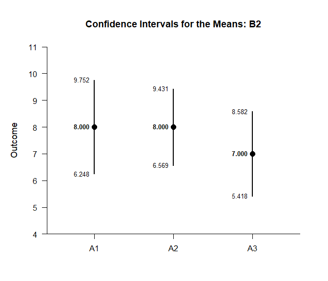
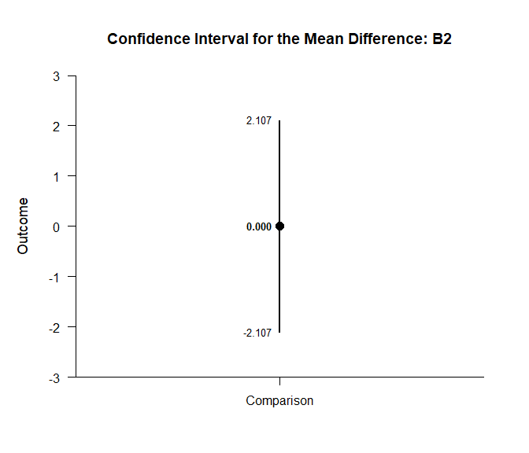
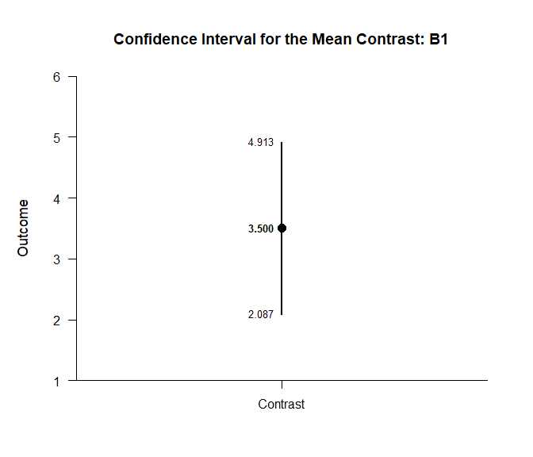

## By Factorial Data Application

This page analyzes simple effects using factorial (between-subjects)
data.

- [Data Management](#data-management)
- [Summary Statistics](#summary-statistics)
- [Analyses of the Means](#analyses-of-the-means)
- [Analyses of a Comparison](#analyses-of-a-comparison)
- [Analyses of a Contrast](#analyses-of-a-contrast)

------------------------------------------------------------------------

### Data Management

This code inputs the variable names and creates a viewable data frame.

``` r
FactorA <- c(rep(1, 20), rep(2, 20), rep(3, 20))
FactorA <- factor(FactorA, levels = c(1, 2, 3), labels = c("A1", "A2", "A3"))
FactorB <- c(rep(1, 10), rep(2, 10), rep(1, 10), rep(2, 10), rep(1, 10), rep(2, 10))
FactorB <- factor(FactorB, levels = c(1, 2), labels = c("B1", "B2"))
Outcome <- c(6, 8, 6, 8, 10, 8, 10, 9, 8, 7, 5, 9, 10, 9, 11, 4, 11, 7, 6, 8, 7, 13, 11, 10, 13, 8, 11, 14, 12, 11, 7, 8, 7, 11, 10, 7, 8, 4, 8, 10, 9, 16, 11, 12, 15, 13, 9, 14, 11, 10, 8, 6, 8, 11, 5, 7, 9, 3, 6, 7)
FactorialData <- construct(FactorA, FactorB, Outcome)
```

### Summary Statistics

Get descriptive statistics separately for each simple effect.

``` r
(Outcome ~ FactorA) |> describeSummaryBy(by = FactorB)
```

    ## $`Summary Statistics for the Data: B1`
    ##          N       M      SD    Skew    Kurt
    ## A1  10.000   8.000   1.414   0.000  -0.738
    ## A2  10.000  11.000   2.211  -0.617  -0.212
    ## A3  10.000  12.000   2.449   0.340  -1.102
    ## 
    ## $`Summary Statistics for the Data: B2`
    ##          N       M      SD    Skew    Kurt
    ## A1  10.000   8.000   2.449  -0.340  -1.102
    ## A2  10.000   8.000   2.000  -0.417   0.735
    ## A3  10.000   7.000   2.211   0.000   0.665

### Analyses of the Means

Estimate, plot, test, and standardize the means separately for each
simple effect.

``` r
(Outcome ~ FactorA) |> estimateMeansBy(by = FactorB)
```

    ## $`Confidence Intervals for the Means: B1`
    ##          M      SE      df      LL      UL
    ## A1   8.000   0.447   9.000   6.988   9.012
    ## A2  11.000   0.699   9.000   9.418  12.582
    ## A3  12.000   0.775   9.000  10.248  13.752
    ## 
    ## $`Confidence Intervals for the Means: B2`
    ##          M      SE      df      LL      UL
    ## A1   8.000   0.775   9.000   6.248   9.752
    ## A2   8.000   0.632   9.000   6.569   9.431
    ## A3   7.000   0.699   9.000   5.418   8.582

``` r
(Outcome ~ FactorA) |> plotMeansBy(by = FactorB)
```

<!-- --><!-- -->

``` r
(Outcome ~ FactorA) |> testMeansBy(by = FactorB)
```

    ## $`Hypothesis Tests for the Means: B1`
    ##       Diff      SE      df       t       p
    ## A1   8.000   0.447   9.000  17.889   0.000
    ## A2  11.000   0.699   9.000  15.732   0.000
    ## A3  12.000   0.775   9.000  15.492   0.000
    ## 
    ## $`Hypothesis Tests for the Means: B2`
    ##       Diff      SE      df       t       p
    ## A1   8.000   0.775   9.000  10.328   0.000
    ## A2   8.000   0.632   9.000  12.649   0.000
    ## A3   7.000   0.699   9.000  10.011   0.000

``` r
(Outcome ~ FactorA) |> estimateStandardizedMeansBy(by = FactorB)
```

    ## $`Confidence Intervals for the Standardized Means: B1`
    ##          d      SE      LL      UL
    ## A1   5.657   1.251   3.005   8.295
    ## A2   4.975   1.111   2.622   7.312
    ## A3   4.899   1.096   2.579   7.203
    ## 
    ## $`Confidence Intervals for the Standardized Means: B2`
    ##          d      SE      LL      UL
    ## A1   3.266   0.771   1.644   4.863
    ## A2   4.000   0.915   2.068   5.911
    ## A3   3.166   0.752   1.586   4.721

### Analyses of a Comparison

Analyze the specified comparison separately for each simple effect.

``` r
(Outcome ~ FactorA) |> pick(A1, A2) |> estimateMeanDifferenceBy(by = FactorB)
```

    ## $`Confidence Interval for the Mean Difference: B1`
    ##               Diff      SE      df      LL      UL
    ## Comparison   3.000   0.830  15.308   1.234   4.766
    ## 
    ## $`Confidence Interval for the Mean Difference: B2`
    ##               Diff      SE      df      LL      UL
    ## Comparison   0.000   1.000  17.308  -2.107   2.107

``` r
(Outcome ~ FactorA) |> pick(A1, A2) |> plotMeanDifferenceBy(by = FactorB)
```

<!-- --><!-- -->

``` r
(Outcome ~ FactorA) |> pick(A1, A2) |> testMeanDifferenceBy(by = FactorB)
```

    ## $`Hypothesis Test for the Mean Difference: B1`
    ##               Diff      SE      df       t       p
    ## Comparison   3.000   0.830  15.308   3.614   0.002
    ## 
    ## $`Hypothesis Test for the Mean Difference: B2`
    ##               Diff      SE      df       t       p
    ## Comparison   0.000   1.000  17.308   0.000   1.000

``` r
(Outcome ~ FactorA) |> pick(A1, A2) |> estimateStandardizedMeanDifferenceBy(by = FactorB)
```

    ## $`Confidence Interval for the Standardized Mean Difference: B1`
    ##                  d      SE      LL      UL
    ## Comparison   1.616   0.555   0.529   2.703
    ## 
    ## $`Confidence Interval for the Standardized Mean Difference: B2`
    ##                  d      SE      LL      UL
    ## Comparison   0.000   0.471  -0.924   0.924

### Analyses of a Contrast

Analyze the specified contrast separately for each simple effect.

``` r
(Outcome ~ FactorA) |> estimateMeanContrastBy(by = FactorB, contrast = c(-1, .5, .5))
```

    ## $`Confidence Interval for the Mean Contrast: B1`
    ##              Est      SE      df      LL      UL
    ## Contrast   3.500   0.687  25.917   2.087   4.913
    ## 
    ## $`Confidence Interval for the Mean Contrast: B2`
    ##              Est      SE      df      LL      UL
    ## Contrast  -0.500   0.907  15.806  -2.424   1.424

``` r
(Outcome ~ FactorA) |> plotMeanContrastBy(by = FactorB, contrast = c(-1, .5, .5))
```

<!-- --><!-- -->

``` r
(Outcome ~ FactorA) |> testMeanContrastBy(by = FactorB, contrast = c(-1, .5, .5))
```

    ## $`Hypothesis Test for the Mean Contrast: B1`
    ##              Est      SE      df       t       p
    ## Contrast   3.500   0.687  25.917   5.093   0.000
    ## 
    ## $`Hypothesis Test for the Mean Contrast: B2`
    ##              Est      SE      df       t       p
    ## Contrast  -0.500   0.907  15.806  -0.551   0.589

``` r
(Outcome ~ FactorA) |> estimateStandardizedMeanContrastBy(by = FactorB, contrast = c(-1, .5, .5))
```

    ## $`Confidence Interval for the Standardized Mean Contrast: B1`
    ##              Est      SE      LL      UL
    ## Contrast   1.689   0.428   0.850   2.527
    ## 
    ## $`Confidence Interval for the Standardized Mean Contrast: B2`
    ##              Est      SE      LL      UL
    ## Contrast  -0.224   0.430  -1.068   0.619
