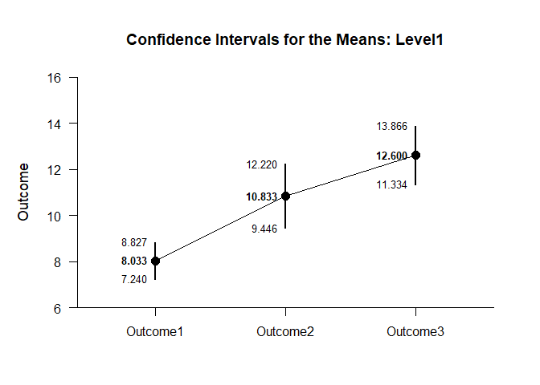
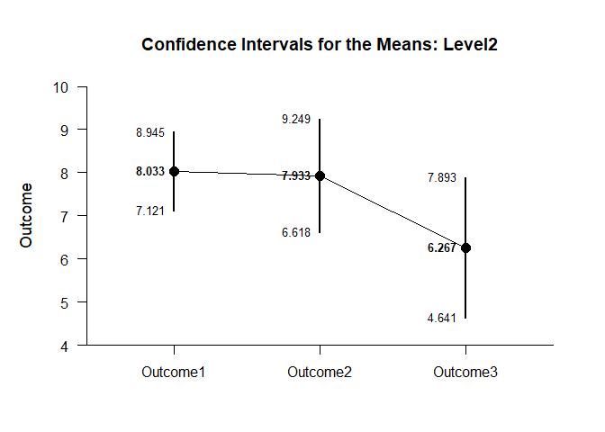
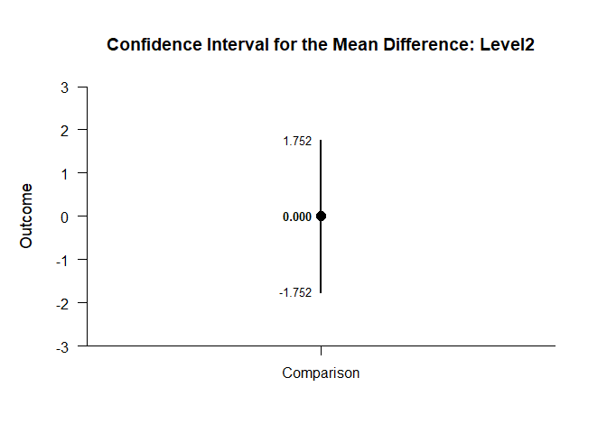
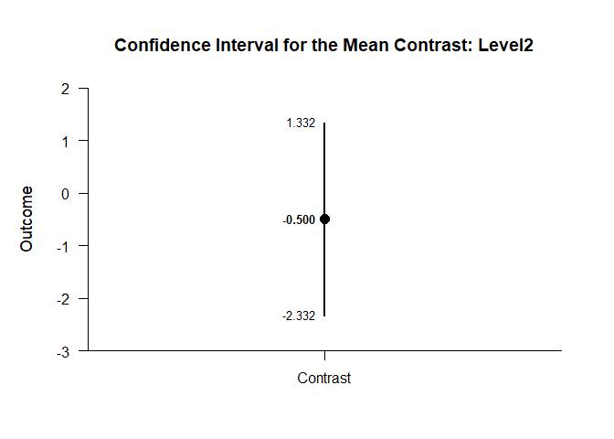

## By Mixed Data Application

This page analyzes simple effects using mixed design (between-subjects
and within-subjects) data.

- [Data Management](#data-management)
- [Descriptive Statistics](#descriptive-statistics)
- [Analyses of the Means](#analyses-of-the-means)
- [Analyses of a Comparison](#analyses-of-a-comparison)
- [Analyses of a Contrast](#analyses-of-a-contrast)

------------------------------------------------------------------------

### Data Management

Simulate some data.

``` r
Factor <- c(rep(1,30),rep(2,30))
Outcome1 <- c(round(rnorm(30,mean=8,sd=2),0),round(rnorm(30,mean=8,sd=2),0))
Outcome2 <- c(round(rnorm(30,mean=11,sd=4),0),round(rnorm(30,mean=8,sd=3),0))
Outcome3 <- c(round(rnorm(30,mean=12,sd=4),0),round(rnorm(30,mean=7,sd=4),0))
Factor <- factor(Factor,levels=c(1,2),labels=c("Level1","Level2"))
MixedData <- data.frame(Factor,Outcome1,Outcome2,Outcome3)
```

### Descriptive Statistics

Get the descriptive statistics separately for each simple effect.

``` r
cbind(Outcome1,Outcome2,Outcome3) |> describeMeansBy(by=Factor)
```

    ## $`Descriptive Statistics for the Data: Level1`
    ##                N       M      SD    Skew    Kurt
    ## Outcome1  30.000   8.033   2.125  -0.578  -0.604
    ## Outcome2  30.000  10.833   3.715   0.076  -0.240
    ## Outcome3  30.000  12.600   3.390   0.074  -0.500
    ## 
    ## $`Descriptive Statistics for the Data: Level2`
    ##                N       M      SD    Skew    Kurt
    ## Outcome1  30.000   8.033   2.442   0.293  -0.060
    ## Outcome2  30.000   7.933   3.523  -0.909   2.706
    ## Outcome3  30.000   6.267   4.354  -0.081  -0.414

### Analyses of the Means

Estimate, plot, test, and standardize the means separately for each
simple effect.

``` r
cbind(Outcome1,Outcome2,Outcome3) |> estimateMeansBy(by=Factor)
```

    ## $`Confidence Intervals for the Means: Level1`
    ##                M      SE      df      LL      UL
    ## Outcome1   8.033   0.388  29.000   7.240   8.827
    ## Outcome2  10.833   0.678  29.000   9.446  12.220
    ## Outcome3  12.600   0.619  29.000  11.334  13.866
    ## 
    ## $`Confidence Intervals for the Means: Level2`
    ##                M      SE      df      LL      UL
    ## Outcome1   8.033   0.446  29.000   7.121   8.945
    ## Outcome2   7.933   0.643  29.000   6.618   9.249
    ## Outcome3   6.267   0.795  29.000   4.641   7.893

``` r
cbind(Outcome1,Outcome2,Outcome3) |> plotMeansBy(by=Factor)
```

<!-- --><!-- -->

``` r
cbind(Outcome1,Outcome2,Outcome3) |> testMeansBy(by=Factor)
```

    ## $`Hypothesis Tests for the Means: Level1`
    ##             Diff      SE      df       t       p
    ## Outcome1   8.033   0.388  29.000  20.705   0.000
    ## Outcome2  10.833   0.678  29.000  15.974   0.000
    ## Outcome3  12.600   0.619  29.000  20.360   0.000
    ## 
    ## $`Hypothesis Tests for the Means: Level2`
    ##             Diff      SE      df       t       p
    ## Outcome1   8.033   0.446  29.000  18.017   0.000
    ## Outcome2   7.933   0.643  29.000  12.335   0.000
    ## Outcome3   6.267   0.795  29.000   7.883   0.000

``` r
cbind(Outcome1,Outcome2,Outcome3) |> estimateStandardizedMeansBy(by=Factor)
```

    ## $`Confidence Intervals for the Standardized Means: Level1`
    ##                d      SE      LL      UL
    ## Outcome1   3.780   0.515   2.743   4.808
    ## Outcome2   2.916   0.414   2.083   3.739
    ## Outcome3   3.717   0.507   2.695   4.730
    ## 
    ## $`Confidence Intervals for the Standardized Means: Level2`
    ##                d      SE      LL      UL
    ## Outcome1   3.289   0.457   2.369   4.200
    ## Outcome2   2.252   0.341   1.567   2.925
    ## Outcome3   1.439   0.260   0.919   1.947

### Analyses of a Comparison

Analyze the specified comparison separately for each simple effect.

``` r
cbind(Outcome1,Outcome2) |> estimateMeanDifferenceBy(by=Factor)
```

    ## $`Confidence Interval for the Mean Difference: Level1`
    ##               Diff      SE      df      LL      UL
    ## Comparison   2.800   0.731  29.000   1.305   4.295
    ## 
    ## $`Confidence Interval for the Mean Difference: Level2`
    ##               Diff      SE      df      LL      UL
    ## Comparison  -0.100   0.841  29.000  -1.819   1.619

``` r
cbind(Outcome1,Outcome2) |> plotMeanDifferenceBy(by=Factor)
```

<!-- --><!-- -->

``` r
cbind(Outcome1,Outcome2) |> testMeanDifferenceBy(by=Factor)
```

    ## $`Hypothesis Test for the Mean Difference: Level1`
    ##               Diff      SE      df       t       p
    ## Comparison   2.800   0.731  29.000   3.831   0.001
    ## 
    ## $`Hypothesis Test for the Mean Difference: Level2`
    ##               Diff      SE      df       t       p
    ## Comparison  -0.100   0.841  29.000  -0.119   0.906

``` r
cbind(Outcome1,Outcome2) |> estimateStandardizedMeanDifferenceBy(by=Factor)
```

    ## $`Confidence Interval for the Standardized Mean Difference: Level1`
    ##                  d      SE      LL      UL
    ## Comparison   0.925   0.264   0.408   1.443
    ## 
    ## $`Confidence Interval for the Standardized Mean Difference: Level2`
    ##                  d      SE      LL      UL
    ## Comparison  -0.033   0.282  -0.586   0.520

### Analyses of a Contrast

Specify a contrast for a factor.

``` r
O1vsOthers <- c(-1,.5,.5)
```

Analyze the specified contrast separately for each simple effect.

``` r
cbind(Outcome1,Outcome2,Outcome3) |> estimateMeanContrastBy(by=Factor,contrast=O1vsOthers)
```

    ## $`Confidence Interval for the Mean Contrast: Level1`
    ##              Est      SE      df      LL      UL
    ## Contrast   3.683   0.487  29.000   2.686   4.680
    ## 
    ## $`Confidence Interval for the Mean Contrast: Level2`
    ##              Est      SE      df      LL      UL
    ## Contrast  -0.933   0.690  29.000  -2.345   0.478

``` r
cbind(Outcome1,Outcome2,Outcome3) |> plotMeanContrastBy(by=Factor,contrast=O1vsOthers)
```

<!-- --><!-- -->

``` r
cbind(Outcome1,Outcome2,Outcome3) |> testMeanContrastBy(by=Factor,contrast=O1vsOthers)
```

    ## $`Hypothesis Test for the Mean Contrast: Level1`
    ##              Est      SE      df       t       p
    ## Contrast   3.683   0.487  29.000   7.556   0.000
    ## 
    ## $`Hypothesis Test for the Mean Contrast: Level2`
    ##              Est      SE      df       t       p
    ## Contrast  -0.933   0.690  29.000  -1.352   0.187

``` r
cbind(Outcome1,Outcome2,Outcome3) |> estimateStandardizedMeanContrastBy(by=Factor,contrast=O1vsOthers)
```

    ## $`Confidence Interval for the Standardized Mean Contrast: Level1`
    ##              Est      SE      LL      UL
    ## Contrast   1.169   0.205   0.766   1.571
    ## 
    ## $`Confidence Interval for the Standardized Mean Contrast: Level2`
    ##              Est      SE      LL      UL
    ## Contrast  -0.265   0.208  -0.671   0.142
