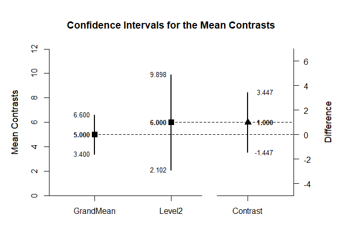
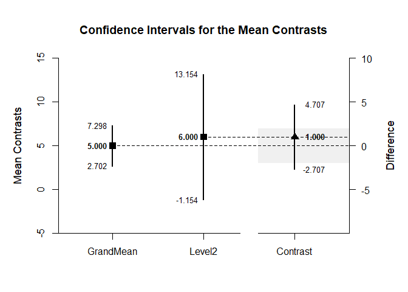

## Complex Contrasts OneWay Data Applications

### Data Management

Set up for analyses of the raw data

```r
Factor <- c(rep(1,4),rep(2,4),rep(3,4))
Outcome <- c(0,0,3,5,4,7,4,9,9,6,4,9)
Factor <- factor(Factor,levels=c(1,2,3),labels=c("Level1","Level2","Level3"))
OneWayData <- data.frame(Factor,Outcome)
```

### Analyses of a Complex Mean Contrast

Set two contrasts - One for the Grand Mean and One for Group 2

```r
c1=c(1/3,1/3,1/3)
c2=c(0,1,0)
```

Estimate and plot the confidence intervals for each contrast and the difference between contrasts

```r
(Outcome~Factor) |> estimateMeanComplex(contrast1=c1,contrast2=c2,labels=c("GrandMean","Level2"))
```

```
## $`Confidence Intervals for the Mean Contrasts`
##               Est      SE      df      LL      UL
## GrandMean   5.000   0.707   9.000   3.400   6.600
## Level2      6.000   1.225   3.000   2.102   9.898
## 
## $`Confidence Interval for the Mean Contrast`
##              Est      SE      df      LL      UL
## Contrast   1.000   1.000   6.000  -1.447   3.447
```

```r
(Outcome~Factor) |> plotMeanComplex(contrast1=c1,contrast2=c2,labels=c("GrandMean","Level2"))
```

<!-- -->

Change confidence Level for the intervals and re-estimate

```r
(Outcome~Factor) |> estimateMeanComplex(contrast1=c1,contrast2=c2,labels=c("GrandMean","Level2"),conf.level=.99)
```

```
## $`Confidence Intervals for the Mean Contrasts`
##               Est      SE      df      LL      UL
## GrandMean   5.000   0.707   9.000   2.702   7.298
## Level2      6.000   1.225   3.000  -1.154  13.154
## 
## $`Confidence Interval for the Mean Contrast`
##              Est      SE      df      LL      UL
## Contrast   1.000   1.000   6.000  -2.707   4.707
```

```r
(Outcome~Factor) |> plotMeanComplex(contrast1=c1,contrast2=c2,labels=c("GrandMean","Level2"),conf.level=.99,rope=c(-2,2))
```

<!-- -->
