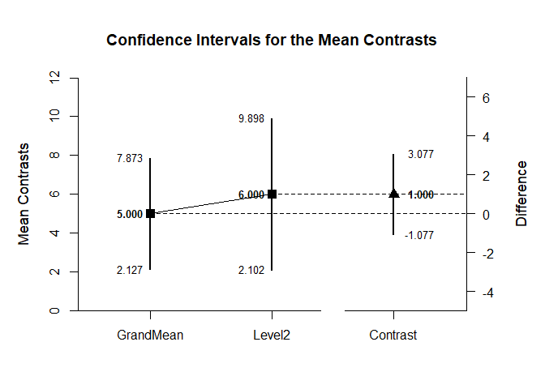
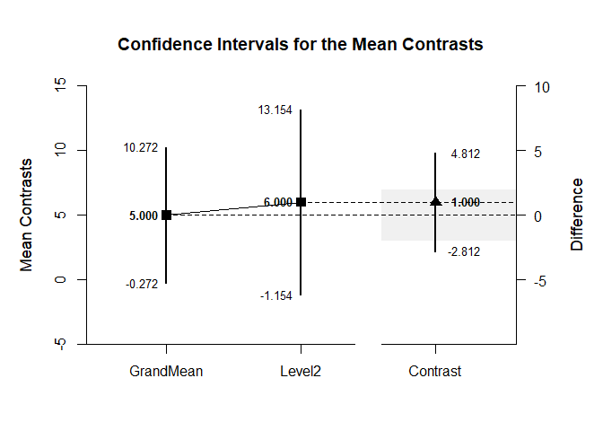

## Complex Contrasts Repeated Measures Data Applications

### Data Management

Set up for analyses of the raw data

```r
Outcome1 <- c(0,0,3,5)
Outcome2 <- c(4,7,4,9)
Outcome3 <- c(9,6,4,9)
RepeatedData <- data.frame(Outcome1,Outcome2,Outcome3)
```

### Analyses of a Complex Mean Contrast

Set two contrasts - One for the Grand Mean and One for Outcome 2

```r
c1=c(1/3,1/3,1/3)
c2=c(0,1,0)
```

Estimate and plot the confidence intervals for each contrast and the difference between contrasts

```r
estimateMeanComplex(RepeatedData,contrast1=c1,contrast2=c2,labels=c("GrandMean","Level2"))
```

```
## $`Confidence Intervals for the Mean Contrasts`
##               Est      SE      df      LL      UL
## GrandMean   5.000   0.903   3.000   2.127   7.873
## Level2      6.000   1.225   3.000   2.102   9.898
## 
## $`Confidence Interval for the Mean Contrast`
##              Est      SE      df      LL      UL
## Contrast   1.000   0.653   3.000  -1.077   3.077
```

```r
plotMeanComplex(RepeatedData,contrast1=c1,contrast2=c2,labels=c("GrandMean","Level2"))
```

<!-- -->

Change confidence Level for the intervals and re-estimate

```r
estimateMeanComplex(RepeatedData,contrast1=c1,contrast2=c2,labels=c("GrandMean","Level2"),conf.level=.99)
```

```
## $`Confidence Intervals for the Mean Contrasts`
##               Est      SE      df      LL      UL
## GrandMean   5.000   0.903   3.000  -0.272  10.272
## Level2      6.000   1.225   3.000  -1.154  13.154
## 
## $`Confidence Interval for the Mean Contrast`
##              Est      SE      df      LL      UL
## Contrast   1.000   0.653   3.000  -2.812   4.812
```

```r
plotMeanComplex(RepeatedData,contrast1=c1,contrast2=c2,labels=c("GrandMean","Level2"),conf.level=.99,rope=c(-2,2))
```

<!-- -->
