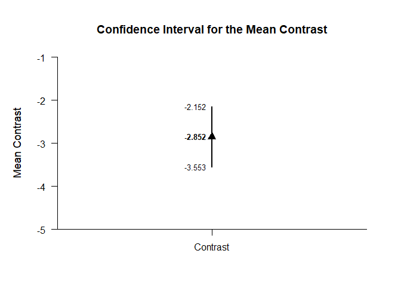
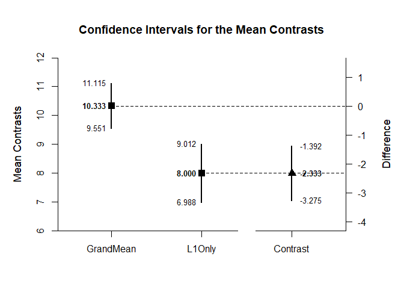
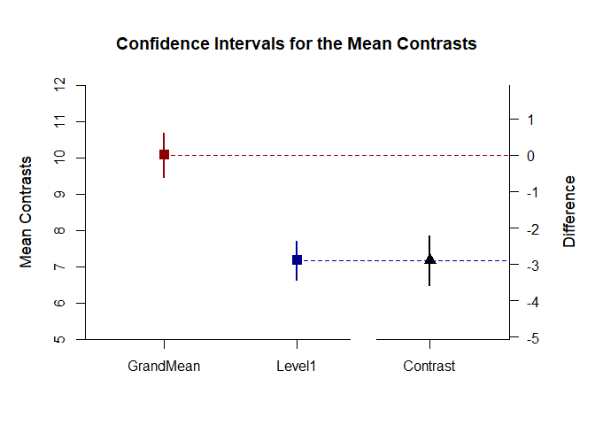

## Complex OneWay Data Application

This page analyzes differences between two contrasts using one-way
(between-subjects) data.

- [Data Management](#data-management)
- [Analyses of a Complex Contrast of
  Means](#analyses-of-a-complex-contrast-of-means)
- [Analysis of a Difference Between Two
  Contrasts](#analysis-of-a-difference-between-two-contrasts)

------------------------------------------------------------------------

### Data Management

This code inputs the variable names and creates a viewable data frame.

``` r
Factor <- c(rep(1, 10), rep(2, 10), rep(3, 10))
Factor <- factor(Factor, levels = c(1, 2, 3), labels = c("Level1", "Level2", "Level3"))
Outcome <- c(6, 8, 6, 8, 10, 8, 10, 9, 8, 7, 7, 13, 11, 10, 13, 8, 11, 14, 12, 11, 9, 16, 11, 12, 15, 13, 9, 14, 11, 10)
OneWayData <- construct(Factor, Outcome)
```

### Analyses of a Complex Contrast of Means

Estimate and plot the means for examination.

``` r
(Outcome ~ Factor) |> estimateMeans()
```

    ## $`Confidence Intervals for the Means`
    ##              M      SE      df      LL      UL
    ## Level1   8.000   0.447   9.000   6.988   9.012
    ## Level2  11.000   0.699   9.000   9.418  12.582
    ## Level3  12.000   0.775   9.000  10.248  13.752

``` r
(Outcome ~ Factor) |> plotMeans()
```

<!-- -->

Create a single contrast to compare the first group to the grand mean
(which requires some arithmetic). Then esimate and plot the contrast.

``` r
(Outcome ~ Factor) |> estimateContrast(contrast = c(2/3, -1/3, -1/3))
```

    ## $`Confidence Interval for the Contrast of Means`
    ##              Est      SE      df      LL      UL
    ## Contrast  -2.333   0.458  25.917  -3.275  -1.392

``` r
(Outcome ~ Factor) |> plotContrast(contrast = c(2/3, -1/3, -1/3))
```

<!-- -->

### Analysis of a Difference Between Two Contrasts

Rather than setting just one contrast, set two contrasts: one for the
Grand Mean and one for Level 1. Estimate and plot the confidence
intervals for each contrast and the difference between contrasts.

``` r
(Outcome ~ Factor) |> estimateComplex(contrast1 = c(1/3, 1/3, 1/3), contrast2 = c(1, 0, 0), labels = c("GrandMean", "L1Only"))
```

    ## $`Confidence Intervals for the Contrasts of Means`
    ##               Est      SE      df      LL      UL
    ## GrandMean  10.333   0.378  23.397   9.551  11.115
    ## L1Only      8.000   0.447   9.000   6.988   9.012
    ## 
    ## $`Confidence Interval for the Contrast of Contrasts`
    ##              Est      SE      df      LL      UL
    ## Contrast  -2.333   0.458  25.917  -3.275  -1.392

``` r
(Outcome ~ Factor) |> plotComplex(contrast1 = c(1/3, 1/3, 1/3), contrast2 = c(1, 0, 0), labels = c("GrandMean", "L1Only"))
```

<!-- -->

Enhance the plot by adding colors and removing value labels.

``` r
(Outcome ~ Factor) |> plotComplex(contrast1 = c(1/3, 1/3, 1/3), contrast2 = c(1, 0, 0), labels = c("GrandMean", "L1Only"), values = FALSE, col = c("darkred", "darkblue", "black"))
```

<!-- -->
