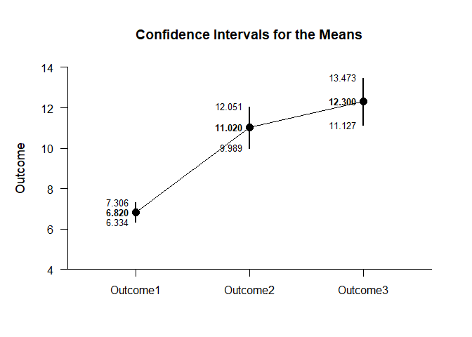
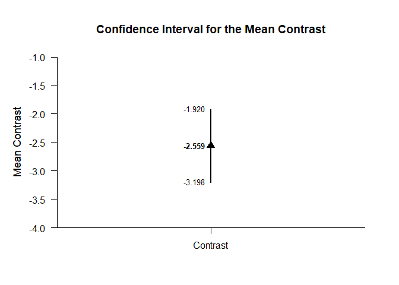
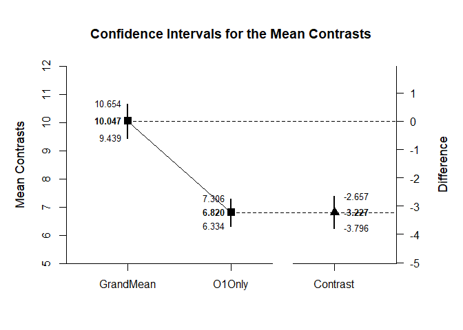
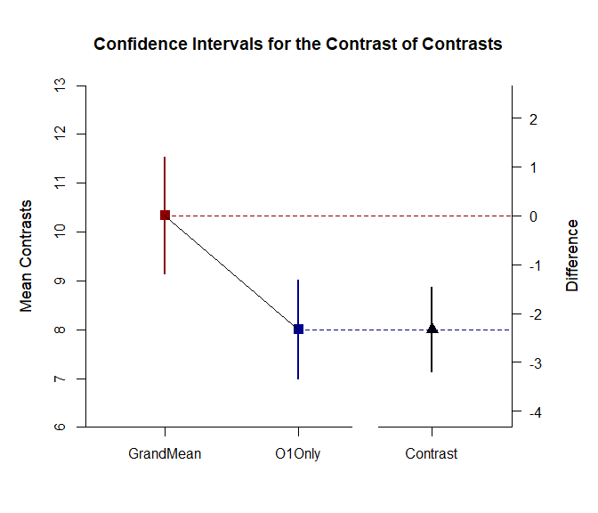

## Complex Repeated Measures Data Application

### Data Management

Simulate some data.

```r
Outcome1 <- round(rnorm(50,mean=7,sd=2),0)
Outcome2 <- round(rnorm(50,mean=11,sd=4),0)
Outcome3 <- round(rnorm(50,mean=12,sd=4),0)
RepeatedData <- data.frame(Outcome1,Outcome2,Outcome3)
```

### Analyses of a Complex Mean Contrast

Estimate and plot the means for examination.

```r
(RepeatedData) |> estimateMeans()
```

```
## $`Confidence Intervals for the Means`
##                M      SE      df      LL      UL
## Outcome1   7.640   0.282  49.000   7.072   8.208
## Outcome2  10.760   0.622  49.000   9.511  12.009
## Outcome3  12.200   0.566  49.000  11.062  13.338
```

```r
(RepeatedData) |> plotMeans()
```

<!-- -->

Create a single contrast to compare the first variable to the grand mean (which requires some arithmetic). Then esimate and plot the contrast.

```r
L1vsGrand <- c(.6667,-.3333,-.3333)
(RepeatedData) |> estimateMeanContrast(contrast=L1vsGrand)
```

```
## $`Confidence Interval for the Mean Contrast`
##              Est      SE      df      LL      UL
## Contrast  -2.559   0.318  49.000  -3.198  -1.920
```

```r
(RepeatedData) |> plotMeanContrast(contrast=L1vsGrand)
```

<!-- -->

### Analysis of a Difference Between Two Contrasts

Rather than setting just one contrast, set two contrasts: one for the Grand Mean and one for Level 1.

```r
GrandMean <- c(1/3,1/3,1/3)
Level1 <- c(1,0,0)
```

Estimate and plot the confidence intervals for each contrast and the difference between contrasts.

```r
(RepeatedData) |> estimateMeanComplex(contrast1=GrandMean,contrast2=Level1,labels=c("GrandMean","Level1"))
```

```
## $`Confidence Intervals for the Mean Contrasts`
##               Est      SE      df      LL      UL
## GrandMean  10.200   0.303  49.000   9.591  10.809
## Level1      7.640   0.282  49.000   7.072   8.208
## 
## $`Confidence Interval for the Mean Contrast`
##              Est      SE      df      LL      UL
## Contrast  -2.560   0.318  49.000  -3.199  -1.921
```

```r
(RepeatedData) |> plotMeanComplex(contrast1=GrandMean,contrast2=Level1,labels=c("GrandMean","Level1"))
```

<!-- -->

Enhance the plot by adding colors and removing value labels.

```r
comparisonTheme <- c("darkred","darkblue","black")
(RepeatedData) |> estimateMeanComplex(contrast1=GrandMean,contrast2=Level1,labels=c("GrandMean","Level1"))
```

```
## $`Confidence Intervals for the Mean Contrasts`
##               Est      SE      df      LL      UL
## GrandMean  10.200   0.303  49.000   9.591  10.809
## Level1      7.640   0.282  49.000   7.072   8.208
## 
## $`Confidence Interval for the Mean Contrast`
##              Est      SE      df      LL      UL
## Contrast  -2.560   0.318  49.000  -3.199  -1.921
```

```r
(RepeatedData) |> plotMeanComplex(contrast1=GrandMean,contrast2=Level1,labels=c("GrandMean","Level1"),values=FALSE,col=comparisonTheme)
```

<!-- -->
