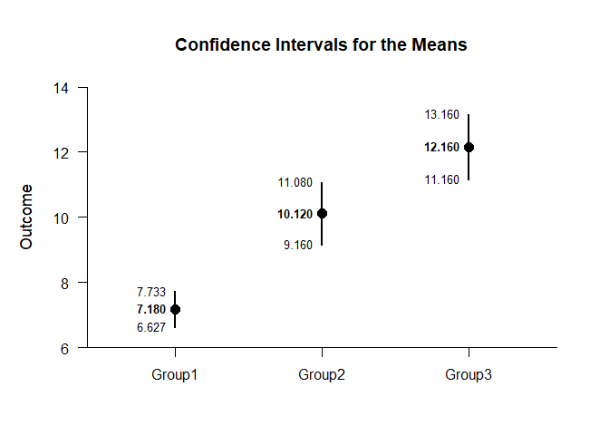
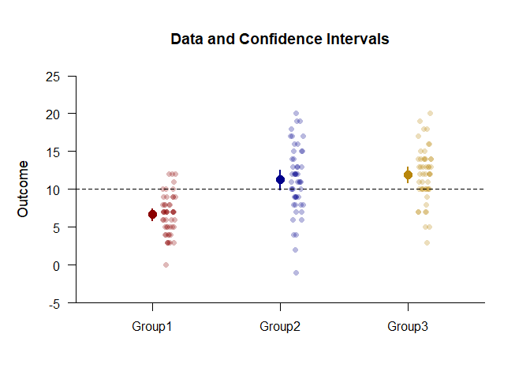
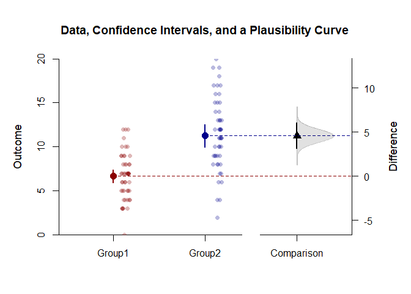
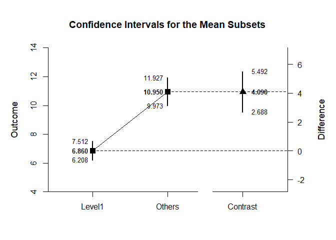

## Contrasts OneWay Data Application

### Data Management

Simulate some data.

```r
Factor <- c(rep(1,50),rep(2,50),rep(3,50))
Factor <- factor(Factor,levels=c(1,2,3),labels=c("Group1","Group2","Group3"))
Group1 <- round(rnorm(50,mean=7,sd=2),0)
Group2 <- round(rnorm(50,mean=11,sd=4),0)
Group3 <- round(rnorm(50,mean=12,sd=4),0)
Outcome <- c(Group1,Group2,Group3)
```

### Analyses of the Means

Estimate and get a simple plot of the confidence intervals.

```r
(Outcome~Factor) |> estimateMeans()
```

```
## $`Confidence Intervals for the Means`
##              M      SE      df      LL      UL
## Group1   7.080   0.277  49.000   6.524   7.636
## Group2  11.140   0.549  49.000  10.037  12.243
## Group3  11.700   0.549  49.000  10.597  12.803
```

```r
(Outcome~Factor) |> plotMeans()
```

<!-- -->

Get an enhanced plot of data and confidence intervals.

```r
colorTheme <- c("darkred","darkblue","darkgoldenrod")
(Outcome~Factor) |> plotData(main="Data and Confidence Intervals",method="jitter",col=colorTheme)
(Outcome~Factor) |> plotMeans(add=TRUE,values=FALSE,line=10,col=colorTheme)
```

<!-- -->

### Analyses of a Comparison

Create a comparison and get a simple plot of the confidence intervals.

```r
Comparison <- factor(Factor,c("Group1","Group2"))
(Outcome~Comparison) |> estimateMeanComparison()
```

```
## $`Confidence Intervals for the Means`
##              M      SE      df      LL      UL
## Group1   7.080   0.277  49.000   6.524   7.636
## Group2  11.140   0.549  49.000  10.037  12.243
## 
## $`Confidence Interval for the Mean Difference`
##               Diff      SE      df      LL      UL
## Comparison   4.060   0.615  72.408   2.835   5.285
```

```r
(Outcome~Comparison) |> plotMeanComparison()
```

<!-- -->

Get an enhanced plot of data and confidence intervals with a plausibility curve.

```r
comparisonTheme <- c("darkred","darkblue","black")
(Outcome~Comparison) |> plotMeanComparison(main="Data, Confidence Intervals, and a Plausibility Curve",ylim=c(0,20),values=FALSE,col=comparisonTheme)
(Outcome~Comparison) |> plotPlausible(add=TRUE,type=c("none","none","right"),col=comparisonTheme)
(Outcome~Comparison) |> plotData(add=TRUE,method="jitter",col=comparisonTheme)
```

<!-- -->

### Analyses of a Mean Contrast

Create a contrast and get a plot of the mean subsets and the contrast.

```r
L1vsOthers <- c(-1,.5,.5)
(Outcome~Factor) |> estimateMeanSubsets(contrast=L1vsOthers,labels=c("Level1","Others"))
```

```
## $`Confidence Intervals for the Mean Subsets`
##            Est      SE      df      LL      UL
## Level1   7.080   0.277  49.000   6.524   7.636
## Others  11.420   0.388  98.000  10.650  12.190
## 
## $`Confidence Interval for the Mean Contrast`
##              Est      SE      df      LL      UL
## Contrast   4.340   0.477 146.991   3.398   5.282
```

```r
(Outcome~Factor) |> plotMeanSubsets(contrast=L1vsOthers,labels=c("Level1","Others"))
```

<!-- -->

Create side-by-side plots of the means and the mean subsets and enhance the plots by adding colors.

```r
contrastTheme <- c("darkred","darkblue","darkblue")
par(mfrow=c(1,2))
(Outcome~Factor) |> plotMeans(col=contrastTheme,ylim=c(0,20),values=FALSE,main="")
(Outcome~Factor) |> plotData(add=TRUE,col=contrastTheme)
(Outcome~Factor) |> plotMeanSubsets(contrast=L1vsOthers,labels=c("Level1","Others"),col=comparisonTheme,ylim=c(0,20),ylab="",values=FALSE,main="")
(Outcome~Factor) |> plotPlausible(contrast=L1vsOthers,add=TRUE,type=c("none","none","right"),col=comparisonTheme)
```

<!-- -->

```r
par(mfrow=c(1,1))
```
