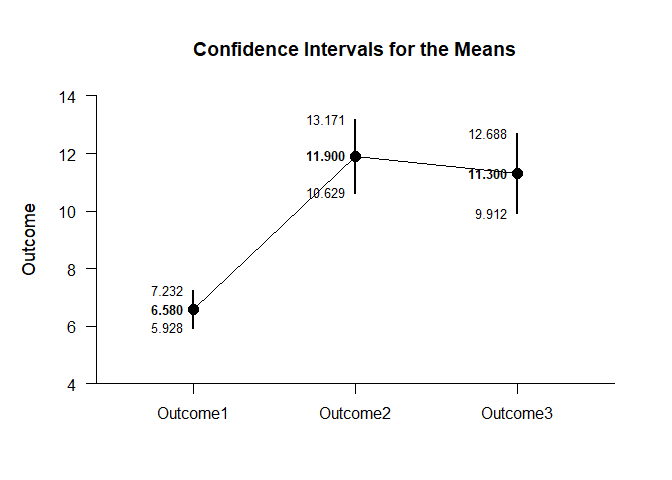
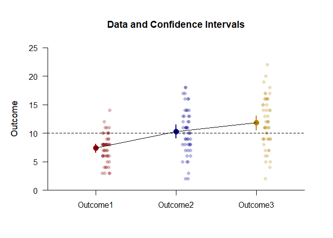
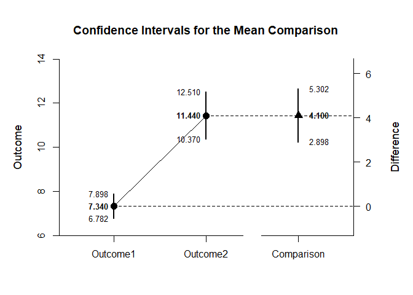
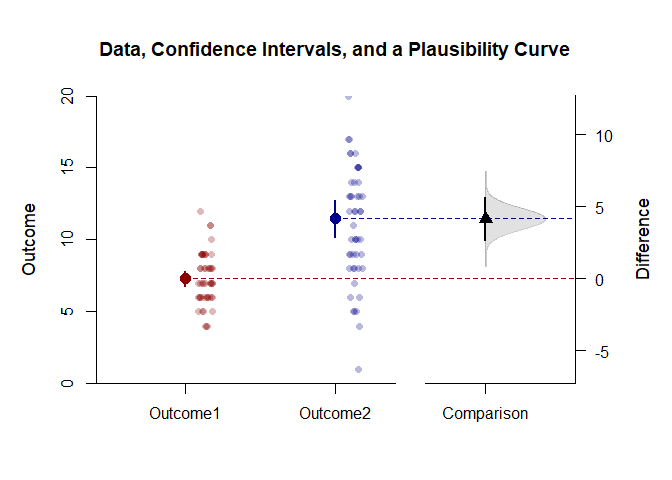
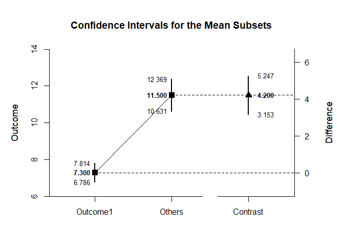
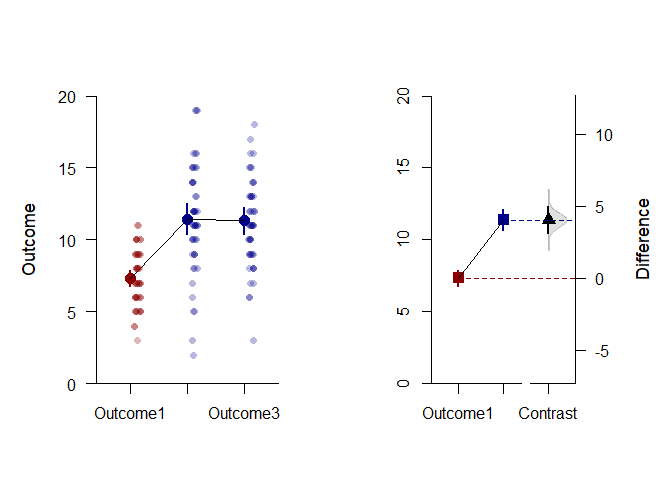

## Contrasts Repeated Measures Data Application

### Data Management

Simulate some data.

```r
Outcome1 <- round(rnorm(50,mean=7,sd=2),0)
Outcome2 <- round(rnorm(50,mean=11,sd=4),0)
Outcome3 <- round(rnorm(50,mean=12,sd=4),0)
RepeatedData <- data.frame(Outcome1,Outcome2,Outcome3)
```

### Analyses of the Means

Get a simple plot of the confidence intervals.

```r
(RepeatedData) |> estimateMeans()
```

```
## $`Confidence Intervals for the Means`
##                M      SE      df      LL      UL
## Outcome1   7.380   0.351  49.000   6.675   8.085
## Outcome2  10.320   0.567  49.000   9.181  11.459
## Outcome3  11.820   0.622  49.000  10.569  13.071
```

```r
(RepeatedData) |> plotMeans()
```

<!-- -->

Get an enhanced plot of data and confidence intervals.

```r
colorTheme <- c("darkred","darkblue","darkgoldenrod")
(RepeatedData) |> plotData(main="Data and Confidence Intervals",method="jitter",col=colorTheme)
(RepeatedData) |> plotMeans(add=TRUE,values=FALSE,line=10,col=colorTheme)
```

<!-- -->

### Analyses of a Comparison

Create a comparison and get a simple plot of the confidence intervals.

```r
ComparisonData <- data.frame(Outcome1,Outcome2)
(ComparisonData) |> estimateMeanComparison()
```

```
## $`Confidence Intervals for the Means`
##                M      SE      df      LL      UL
## Outcome1   7.380   0.351  49.000   6.675   8.085
## Outcome2  10.320   0.567  49.000   9.181  11.459
## 
## $`Confidence Interval for the Mean Difference`
##               Diff      SE      df      LL      UL
## Comparison   2.940   0.629  49.000   1.676   4.204
```

```r
(ComparisonData) |> plotMeanComparison()
```

<!-- -->

Get an enhanced plot of data and confidence intervals with a plausibility curve.

```r
comparisonTheme <- c("darkred","darkblue","black")
(ComparisonData) |> plotMeanComparison(main="Data, Confidence Intervals, and a Plausibility Curve",ylim=c(0,20),values=FALSE,col=comparisonTheme)
(ComparisonData) |> plotPlausible(add=TRUE,type=c("none","none","right"),col=comparisonTheme)
(ComparisonData) |> plotData(add=TRUE,method="jitter",col=comparisonTheme)
```

<!-- -->

### Analyses of a Mean Contrast

Create a contrast and get a plot of the mean subsets and the contrast.

```r
O1vsOthers <- c(-1,.5,.5)
(RepeatedData) |> estimateMeanSubsets(contrast=O1vsOthers,labels=c("Outcome1","Others"))
```

```
## $`Confidence Intervals for the Mean Subsets`
##              Est      SE      df      LL      UL
## Outcome1   7.380   0.351  49.000   6.675   8.085
## Others    11.070   0.435  49.000  10.195  11.945
## 
## $`Confidence Interval for the Mean Contrast`
##              Est      SE      df      LL      UL
## Contrast   3.690   0.539  49.000   2.606   4.774
```

```r
(RepeatedData) |> plotMeanSubsets(contrast=O1vsOthers,labels=c("Outcome1","Others"))
```

<!-- -->

Create side-by-side plots of the means and the mean subsets and enhance the plots by adding colors.

```r
contrastTheme <- c("darkred","darkblue","darkblue")
par(mfrow=c(1,2))
(RepeatedData) |> plotMeans(col=contrastTheme,ylim=c(0,20),values=FALSE,main="")
(RepeatedData) |> plotData(add=TRUE,method="jitter",col=contrastTheme)
(RepeatedData) |> plotMeanSubsets(contrast=O1vsOthers,labels=c("Outcome1","Others"),col=comparisonTheme,ylim=c(0,20),ylab="",values=FALSE,main="")
(RepeatedData) |> plotPlausible(contrast=O1vsOthers,add=TRUE,type=c("none","none","right"),col=comparisonTheme)
```

<!-- -->
