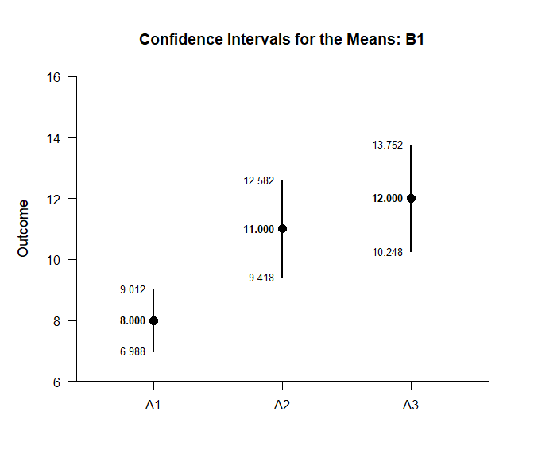
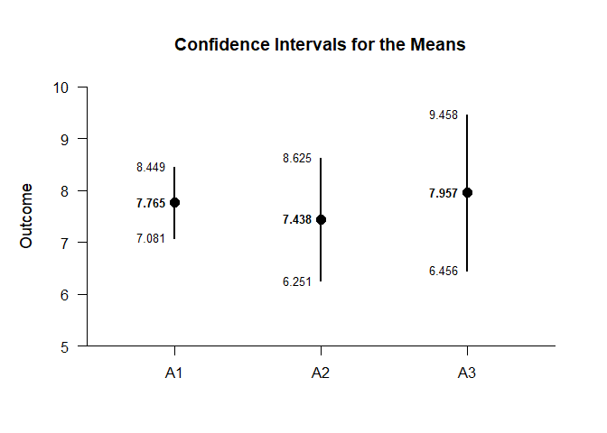
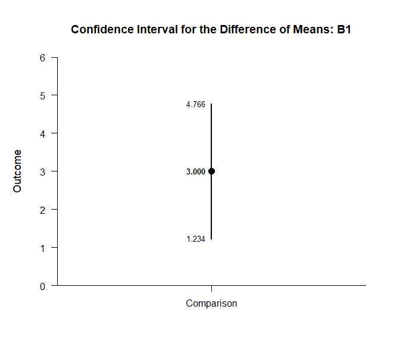
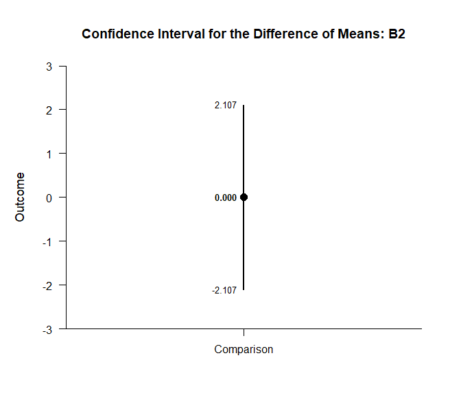
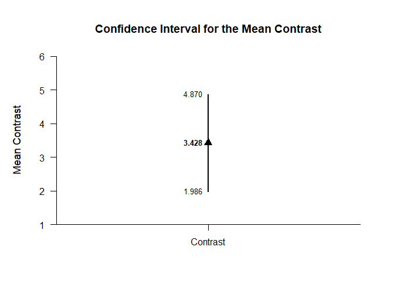
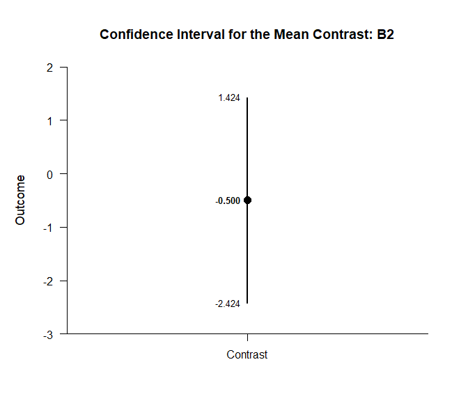

## Effects Factorial Data Application

This page implements a exposition pipe operator to analyze simple
effects using factorial (between-subjects) data.

- [Data Management](#data-management)
- [Descriptive Statistics](#descriptive-statistics)
- [Analyses of the Means](#analyses-of-the-means)
- [Analyses of a Comparison](#analyses-of-a-comparison)
- [Analyses of a Contrast](#analyses-of-a-contrast)

------------------------------------------------------------------------

### Data Management

Simulate some data.

``` r
FactorA <- c(rep(1,30),rep(2,30),rep(3,30),rep(1,30),rep(2,30),rep(3,30))
FactorB <- c(rep(1,90),rep(2,90))
FactorA <- factor(FactorA,levels=c(1,2,3),labels=c("A1","A2","A3"))
FactorB <- factor(FactorB,levels=c(1,2),labels=c("B1","B2"))
Outcome <- c(rnorm(30,mean=8,sd=2),rnorm(30,mean=11,sd=4),rnorm(30,mean=12,sd=4),rnorm(30,mean=8,sd=2),rnorm(30,mean=8,sd=3),rnorm(30,mean=7,sd=4))
FactorialData <- data.frame(FactorA,FactorB,Outcome)
```

Subset the data for each simple effect.

``` r
FactorialB1 <- subset(FactorialData,FactorB=="B1")
FactorialB2 <- subset(FactorialData,FactorB=="B2")
```

### Descriptive Statistics

Get descriptive statistics separately for each simple effect.

``` r
(FactorialB1) %$>% (Outcome~FactorA) |> describeMeans()
```

    ## $`Descriptive Statistics for the Data`
    ##          N       M      SD    Skew    Kurt
    ## A1  30.000   7.819   2.582   0.196  -0.720
    ## A2  30.000  10.188   5.052   0.675  -0.133
    ## A3  30.000  12.306   3.278   0.486   0.844

``` r
(FactorialB2) %$>% (Outcome~FactorA) |> describeMeans()
```

    ## $`Descriptive Statistics for the Data`
    ##          N       M      SD    Skew    Kurt
    ## A1  30.000   7.765   1.831  -0.230  -0.319
    ## A2  30.000   7.438   3.179   0.180   0.700
    ## A3  30.000   7.957   4.020  -0.477   2.070

### Analyses of the Means

Estimate, plot, test, and standardize the means separately for each
simple effect.

``` r
(FactorialB1) %$>% (Outcome~FactorA) |> estimateMeans()
```

    ## $`Confidence Intervals for the Means`
    ##          M      SE      df      LL      UL
    ## A1   7.819   0.471  29.000   6.855   8.784
    ## A2  10.188   0.922  29.000   8.302  12.075
    ## A3  12.306   0.598  29.000  11.082  13.531

``` r
(FactorialB2) %$>% (Outcome~FactorA) |> estimateMeans()
```

    ## $`Confidence Intervals for the Means`
    ##          M      SE      df      LL      UL
    ## A1   7.765   0.334  29.000   7.081   8.449
    ## A2   7.438   0.580  29.000   6.251   8.625
    ## A3   7.957   0.734  29.000   6.456   9.458

``` r
(FactorialB1) %$>% (Outcome~FactorA) |> plotMeans()
```

<!-- -->

``` r
(FactorialB2) %$>% (Outcome~FactorA) |> plotMeans()
```

<!-- -->

``` r
(FactorialB1) %$>% (Outcome~FactorA) |> testMeansOmnibus()
```

    ## $`Hypothesis Test for the Model`
    ##              F     df1     df2       p
    ## Factor  10.562   2.000  87.000   0.000

``` r
(FactorialB2) %$>% (Outcome~FactorA) |> testMeansOmnibus()
```

    ## $`Hypothesis Test for the Model`
    ##              F     df1     df2       p
    ## Factor   0.209   2.000  87.000   0.812

``` r
(FactorialB1) %$>% (Outcome~FactorA) |> estimateStandardizedMeans()
```

    ## $`Confidence Intervals for the Standardized Means`
    ##          d      SE      LL      UL
    ## A1   3.029   0.427   2.169   3.878
    ## A2   2.017   0.316   1.382   2.639
    ## A3   3.754   0.512   2.723   4.775

``` r
(FactorialB2) %$>% (Outcome~FactorA) |> estimateStandardizedMeans()
```

    ## $`Confidence Intervals for the Standardized Means`
    ##          d      SE      LL      UL
    ## A1   4.241   0.570   3.093   5.380
    ## A2   2.339   0.350   1.636   3.032
    ## A3   1.980   0.312   1.353   2.594

### Analyses of a Comparison

Specify a comparison separately for each simple effect.

``` r
ComparisonB1 <- (FactorialB1) %$>% factor(FactorA,c("A1","A2"))
ComparisonB2 <- (FactorialB2) %$>% factor(FactorA,c("A1","A2"))
```

Estimate, plot, test, and standardize the comparison separately for each
simple effect.

``` r
(FactorialB1) %$>% (Outcome~ComparisonB1) |> estimateMeanDifference()
```

    ## $`Confidence Interval for the Mean Difference`
    ##               Diff      SE      df      LL      UL
    ## Comparison   2.369   1.036  43.183   0.280   4.458

``` r
(FactorialB2) %$>% (Outcome~ComparisonB2) |> estimateMeanDifference()
```

    ## $`Confidence Interval for the Mean Difference`
    ##               Diff      SE      df      LL      UL
    ## Comparison  -0.327   0.670  46.328  -1.675   1.021

``` r
(FactorialB1) %$>% (Outcome~ComparisonB1) |> plotMeanDifference()
```

<!-- -->

``` r
(FactorialB2) %$>% (Outcome~ComparisonB2) |> plotMeanDifference()
```

<!-- -->

``` r
(FactorialB1) %$>% (Outcome~ComparisonB1) |> testMeanDifference()
```

    ## $`Hypothesis Test for the Mean Difference`
    ##               Diff      SE      df       t       p
    ## Comparison   2.369   1.036  43.183   2.287   0.027

``` r
(FactorialB2) %$>% (Outcome~ComparisonB2) |> testMeanDifference()
```

    ## $`Hypothesis Test for the Mean Difference`
    ##               Diff      SE      df       t       p
    ## Comparison  -0.327   0.670  46.328  -0.488   0.628

``` r
(FactorialB1) %$>% (Outcome~ComparisonB1) |> estimateStandardizedMeanDifference()
```

    ## $`Confidence Interval for the Standardized Mean Difference`
    ##                  d      SE      LL      UL
    ## Comparison   0.591   0.270   0.061   1.120

``` r
(FactorialB2) %$>% (Outcome~ComparisonB2) |> estimateStandardizedMeanDifference()
```

    ## $`Confidence Interval for the Standardized Mean Difference`
    ##                  d      SE      LL      UL
    ## Comparison  -0.126   0.263  -0.641   0.389

### Analyses of a Contrast

Specify a contrast for a factor.

``` r
A1vsOthers <- c(-1,.5,.5)
```

Estimate, plot, test, and standardize the contrast separately for each
simple effect.

``` r
(FactorialB1) %$>% (Outcome~FactorA) |> estimateMeanContrast(contrast=A1vsOthers)
```

    ## $`Confidence Interval for the Mean Contrast`
    ##              Est      SE      df      LL      UL
    ## Contrast   3.428   0.724  77.717   1.986   4.870

``` r
(FactorialB2) %$>% (Outcome~FactorA) |> estimateMeanContrast(contrast=A1vsOthers)
```

    ## $`Confidence Interval for the Mean Contrast`
    ##              Est      SE      df      LL      UL
    ## Contrast  -0.067   0.575  84.061  -1.211   1.076

``` r
(FactorialB1) %$>% (Outcome~FactorA) |> plotMeanContrast(contrast=A1vsOthers)
```

<!-- -->

``` r
(FactorialB2) %$>% (Outcome~FactorA) |> plotMeanContrast(contrast=A1vsOthers)
```

<!-- -->

``` r
(FactorialB1) %$>% (Outcome~FactorA) |> testMeanContrast(contrast=A1vsOthers)
```

    ## $`Hypothesis Test for the Mean Contrast`
    ##              Est      SE      df       t       p
    ## Contrast   3.428   0.724  77.717   4.734   0.000

``` r
(FactorialB2) %$>% (Outcome~FactorA) |> testMeanContrast(contrast=A1vsOthers)
```

    ## $`Hypothesis Test for the Mean Contrast`
    ##              Est      SE      df       t       p
    ## Contrast  -0.067   0.575  84.061  -0.117   0.907

``` r
(FactorialB1) %$>% (Outcome~FactorA) |> estimateStandardizedMeanContrast(contrast=A1vsOthers)
```

    ## $`Confidence Interval for the Standardized Mean Contrast`
    ##              Est      SE      LL      UL
    ## Contrast   0.906   0.210   0.494   1.318

``` r
(FactorialB2) %$>% (Outcome~FactorA) |> estimateStandardizedMeanContrast(contrast=A1vsOthers)
```

    ## $`Confidence Interval for the Standardized Mean Contrast`
    ##              Est      SE      LL      UL
    ## Contrast  -0.021   0.186  -0.386   0.343
