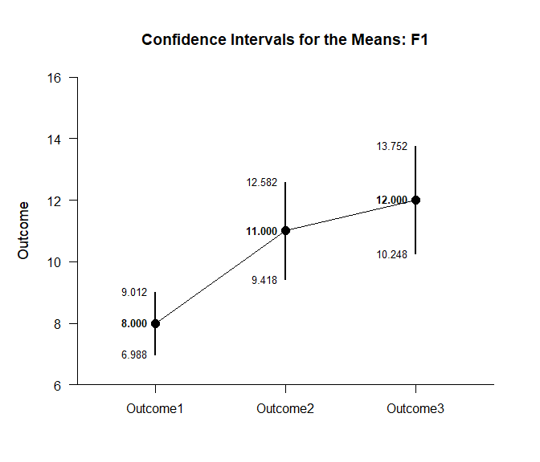
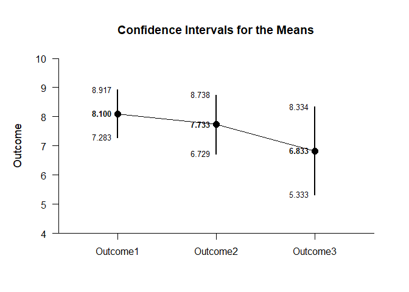
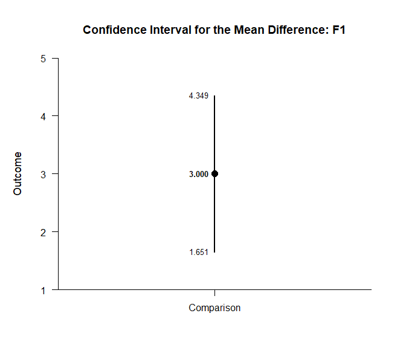
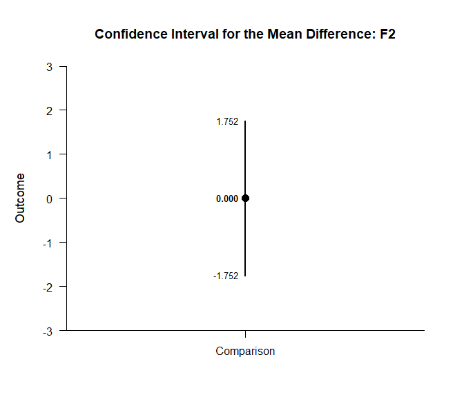
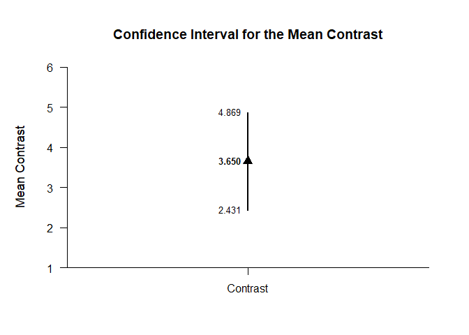

## Effects Mixed Data Application

This page implements a exposition pipe operator to analyze simple
effects using mixed design (between-subjects and within-subjects) data.

- [Data Management](#data-management)
- [Descriptive Statistics](#descriptive-statistics)
- [Analyses of the Means](#analyses-of-the-means)
- [Analyses of a Comparison](#analyses-of-a-comparison)
- [Analyses of a Contrast](#analyses-of-a-contrast)

------------------------------------------------------------------------

### Data Management

Simulate some data.

``` r
Factor <- c(rep(1,30),rep(2,30))
Outcome1 <- c(round(rnorm(30,mean=8,sd=2),0),round(rnorm(30,mean=8,sd=2),0))
Outcome2 <- c(round(rnorm(30,mean=11,sd=4),0),round(rnorm(30,mean=8,sd=3),0))
Outcome3 <- c(round(rnorm(30,mean=12,sd=4),0),round(rnorm(30,mean=7,sd=4),0))
Factor <- factor(Factor,levels=c(1,2),labels=c("Level1","Level2"))
MixedData <- data.frame(Factor,Outcome1,Outcome2,Outcome3)
```

Subset the data for each simple effect.

``` r
MixedB1 <- subset(MixedData,Factor=="Level1")
MixedB2 <- subset(MixedData,Factor=="Level2")
```

### Descriptive Statistics

Get the descriptive statistics separately for each simple effect.

``` r
(MixedB1) %$>% cbind(Outcome1,Outcome2,Outcome3) |> describeMeans()
```

    ## $`Descriptive Statistics for the Data`
    ##                N       M      SD    Skew    Kurt
    ## Outcome1  30.000   7.433   1.832  -0.372   0.154
    ## Outcome2  30.000  10.733   3.331  -0.739   1.187
    ## Outcome3  30.000  11.433   3.875   0.367  -0.195

``` r
(MixedB2) %$>% cbind(Outcome1,Outcome2,Outcome3) |> describeMeans()
```

    ## $`Descriptive Statistics for the Data`
    ##                N       M      SD    Skew    Kurt
    ## Outcome1  30.000   8.100   2.187  -0.242   0.761
    ## Outcome2  30.000   7.733   2.690   0.077  -0.074
    ## Outcome3  30.000   6.833   4.018   0.356   0.329

### Analyses of the Means

Use a similar process to obtain the tables of confidence interval
estimates.

``` r
(MixedB1) %$>% cbind(Outcome1,Outcome2,Outcome3) |> estimateMeans()
```

    ## $`Confidence Intervals for the Means`
    ##                M      SE      df      LL      UL
    ## Outcome1   7.433   0.335  29.000   6.749   8.118
    ## Outcome2  10.733   0.608  29.000   9.489  11.977
    ## Outcome3  11.433   0.707  29.000   9.987  12.880

``` r
(MixedB2) %$>% cbind(Outcome1,Outcome2,Outcome3) |> estimateMeans()
```

    ## $`Confidence Intervals for the Means`
    ##                M      SE      df      LL      UL
    ## Outcome1   8.100   0.399  29.000   7.283   8.917
    ## Outcome2   7.733   0.491  29.000   6.729   8.738
    ## Outcome3   6.833   0.734  29.000   5.333   8.334

``` r
(MixedB1) %$>% cbind(Outcome1,Outcome2,Outcome3) |> plotMeans()
```

<!-- -->

``` r
(MixedB2) %$>% cbind(Outcome1,Outcome2,Outcome3) |> plotMeans()
```

<!-- -->

``` r
(MixedB1) %$>% cbind(Outcome1,Outcome2,Outcome3) |> testMeansOmnibus()
```

    ## $`Hypothesis Test for the Model`
    ##                F     df1     df2       p
    ## Measures  15.147   2.000  58.000   0.000

``` r
(MixedB2) %$>% cbind(Outcome1,Outcome2,Outcome3) |> testMeansOmnibus()
```

    ## $`Hypothesis Test for the Model`
    ##                F     df1     df2       p
    ## Measures   1.351   2.000  58.000   0.267

``` r
(MixedB1) %$>% cbind(Outcome1,Outcome2,Outcome3) |> estimateStandardizedMeans()
```

    ## $`Confidence Intervals for the Standardized Means`
    ##                d      SE      LL      UL
    ## Outcome1   4.057   0.548   2.953   5.151
    ## Outcome2   3.222   0.449   2.317   4.116
    ## Outcome3   2.951   0.418   2.109   3.782

``` r
(MixedB2) %$>% cbind(Outcome1,Outcome2,Outcome3) |> estimateStandardizedMeans()
```

    ## $`Confidence Intervals for the Standardized Means`
    ##                d      SE      LL      UL
    ## Outcome1   3.704   0.506   2.685   4.713
    ## Outcome2   2.875   0.410   2.051   3.688
    ## Outcome3   1.701   0.285   1.131   2.258

### Analyses of a Comparison

Analyze the specified comparison separately for each simple effect.

``` r
(MixedB1) %$>% cbind(Outcome1,Outcome2) |> estimateMeanDifference()
```

    ## $`Confidence Interval for the Mean Difference`
    ##               Diff      SE      df      LL      UL
    ## Comparison   3.300   0.713  29.000   1.842   4.758

``` r
(MixedB2) %$>% cbind(Outcome1,Outcome2) |> estimateMeanDifference()
```

    ## $`Confidence Interval for the Mean Difference`
    ##               Diff      SE      df      LL      UL
    ## Comparison  -0.367   0.574  29.000  -1.541   0.808

``` r
(MixedB1) %$>% cbind(Outcome1,Outcome2) |> plotMeanDifference()
```

<!-- -->

``` r
(MixedB2) %$>% cbind(Outcome1,Outcome2) |> plotMeanDifference()
```

<!-- -->

``` r
(MixedB1) %$>% cbind(Outcome1,Outcome2) |> testMeanDifference()
```

    ## $`Hypothesis Test for the Mean Difference`
    ##               Diff      SE      df       t       p
    ## Comparison   3.300   0.713  29.000   4.628   0.000

``` r
(MixedB2) %$>% cbind(Outcome1,Outcome2) |> testMeanDifference()
```

    ## $`Hypothesis Test for the Mean Difference`
    ##               Diff      SE      df       t       p
    ## Comparison  -0.367   0.574  29.000  -0.638   0.528

``` r
(MixedB1) %$>% cbind(Outcome1,Outcome2) |> estimateStandardizedMeanDifference()
```

    ## $`Confidence Interval for the Standardized Mean Difference`
    ##                  d      SE      LL      UL
    ## Comparison   1.227   0.299   0.641   1.814

``` r
(MixedB2) %$>% cbind(Outcome1,Outcome2) |> estimateStandardizedMeanDifference()
```

    ## $`Confidence Interval for the Standardized Mean Difference`
    ##                  d      SE      LL      UL
    ## Comparison  -0.150   0.239  -0.617   0.318

### Analyses of a Contrast

Specify a contrast for a factor.

``` r
O1vsOthers <- c(-1,.5,.5)
```

Analyze the specified contrast separately for each simple effect.

``` r
(MixedB1) %$>% cbind(Outcome1,Outcome2,Outcome3) |> estimateMeanContrast(contrast=O1vsOthers)
```

    ## $`Confidence Interval for the Mean Contrast`
    ##              Est      SE      df      LL      UL
    ## Contrast   3.650   0.596  29.000   2.431   4.869

``` r
(MixedB2) %$>% cbind(Outcome1,Outcome2,Outcome3) |> estimateMeanContrast(contrast=O1vsOthers)
```

    ## $`Confidence Interval for the Mean Contrast`
    ##              Est      SE      df      LL      UL
    ## Contrast  -0.817   0.590  29.000  -2.023   0.390

``` r
(MixedB1) %$>% cbind(Outcome1,Outcome2,Outcome3) |> plotMeanContrast(contrast=O1vsOthers)
```

<!-- -->

``` r
(MixedB2) %$>% cbind(Outcome1,Outcome2,Outcome3) |> plotMeanContrast(contrast=O1vsOthers)
```

<!-- -->

``` r
(MixedB1) %$>% cbind(Outcome1,Outcome2,Outcome3) |> testMeanContrast(contrast=O1vsOthers)
```

    ## $`Hypothesis Test for the Mean Contrast`
    ##              Est      SE      df       t       p
    ## Contrast   3.650   0.596  29.000   6.124   0.000

``` r
(MixedB2) %$>% cbind(Outcome1,Outcome2,Outcome3) |> testMeanContrast(contrast=O1vsOthers)
```

    ## $`Hypothesis Test for the Mean Contrast`
    ##              Est      SE      df       t       p
    ## Contrast  -0.817   0.590  29.000  -1.384   0.177

``` r
(MixedB1) %$>% cbind(Outcome1,Outcome2,Outcome3) |> estimateStandardizedMeanContrast(contrast=O1vsOthers)
```

    ## $`Confidence Interval for the Standardized Mean Contrast`
    ##              Est      SE      LL      UL
    ## Contrast   1.165   0.205   0.762   1.567

``` r
(MixedB2) %$>% cbind(Outcome1,Outcome2,Outcome3) |> estimateStandardizedMeanContrast(contrast=O1vsOthers)
```

    ## $`Confidence Interval for the Standardized Mean Contrast`
    ##              Est      SE      LL      UL
    ## Contrast  -0.267   0.197  -0.653   0.120
