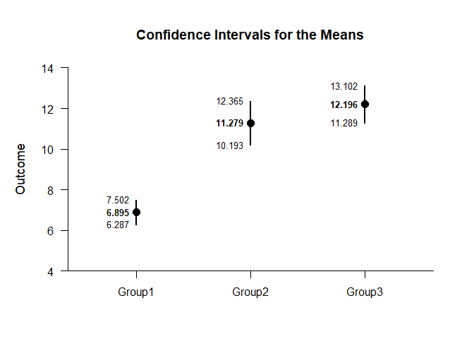
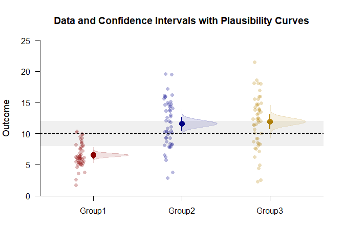
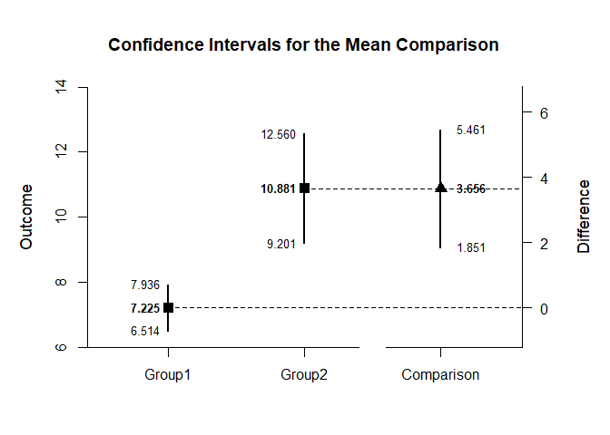
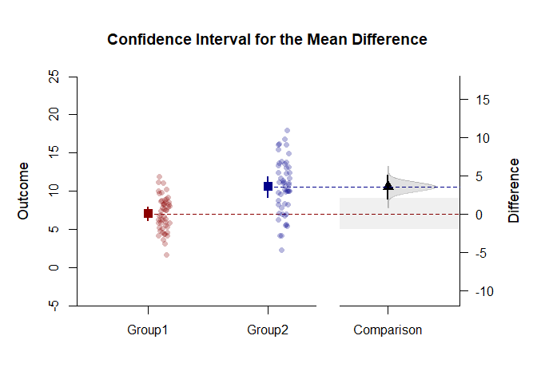

## Enhanced Plots OneWay Data Applications

### Data Management

Enter the data.

```r
Factor <- c(rep(1,50),rep(2,50),rep(3,50))
Factor <- factor(Factor,levels=c(1,2,3),labels=c("Group1","Group2","Group3"))
Outcome <- c(rnorm(50,mean=7,sd=2),rnorm(50,mean=11,sd=4),rnorm(50,mean=12,sd=4))
```

### Analyses of the Means

Get a simple plot of the confidence intervals.

```r
(Outcome~Factor) |> plotIntervals()
```

<!-- -->

Get an enhanced plot of data and confidence intervals.

```r
colorTheme <- c("darkred","darkblue","darkgoldenrod")
(Outcome~Factor) |> plotData(main="Data and Confidence Intervals",method="jitter",col=colorTheme)
(Outcome~Factor) |> plotIntervals(add=TRUE,values=FALSE,line=10,col=colorTheme)
```

<!-- -->

### Analyses of a Comparison

Create a comparison and get a simple plot of the confidence intervals.

```r
Comparison <- factor(Factor,c("Group1","Group2"))
(Outcome~Comparison) |> plotIntervals(conf.level=.99)
```

<!-- -->

Get an enhanced plot of data and confidence intervals with a plausibility curve.

```r
comparisonTheme <- c("darkred","darkblue","black")
(Outcome~Comparison) |> plotIntervals(main="Data, Confidence Intervals, and a Plausibility Curve",conf.level=.99,ylim=c(0,20),values=FALSE,col=comparisonTheme)
(Outcome~Comparison) |> plotPlausible(add=TRUE,conf.level=.99,type=c("none","none","right"),col=comparisonTheme)
(Outcome~Comparison) |> plotData(add=TRUE,method="jitter",col=comparisonTheme)
```

<!-- -->
